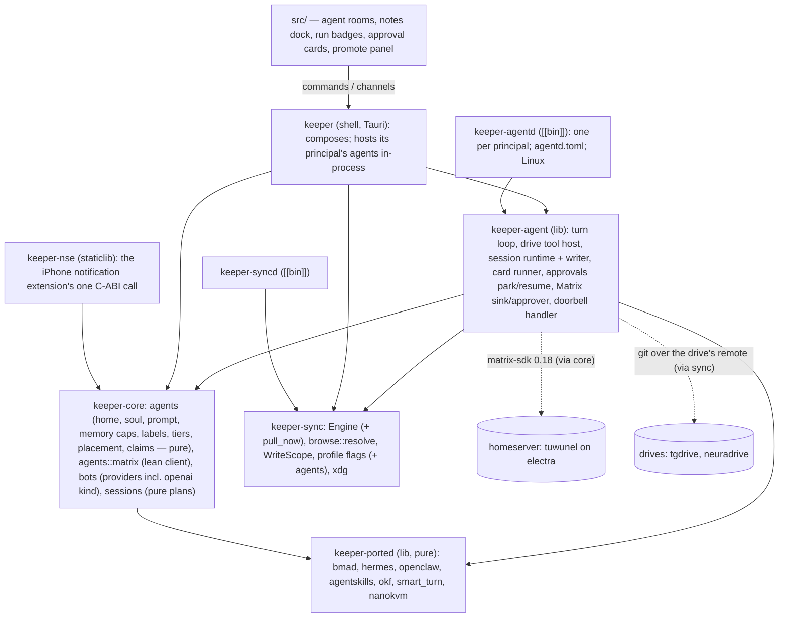

# Architecture Companion — Agents

Extends the frozen spine with **AD-360..AD-416** for epics 89–99. The spine is not renegotiated:
every decision lives in `keeper-core` and the `keeper` shell is a call site (AD-6, AD-55/AD-56);
`keeper-core` reaches the OS only through the `Platform` port (AD-24); `keeper-core` never depends
on `keeper-sync` and `keeper-syncd` never on `keeper-core` (AD-40, `package.json:25-27`);
`keeper-syncd` stays the sync daemon (AD-52); egress is computed, never hand-listed (AD-53,
AD-148); bytes never cross IPC (AD-58); `browse::resolve` is the one containment rule (AD-65); one
clock per host process (AD-62, AD-136); a grant is re-checked at every tool call and the audit row
precedes the effect (AD-158); file content is data and every bound is disclosed (AD-159); the
endpoint is the person's (D-4); voice is on the device and keeper ships no weights (D-5). Where
this document changes an earlier decision it says so in a `> Coordinator note` under the AD that
does it, and *Earlier decisions this document amends* lists them all in one place.

The decisions themselves were pinned by the coordinator from three owner rounds (P1–P15, rulings
R1–R29; R24–R29 were applied after the first draft, each change under a coordinator note naming its ruling). This document states them in the house form, adds the rules a builder needs to make them
checkable, and marks every place where it had to choose something the pins did not say
(*Ambiguities for the coordinator*, at the end).

**Evidence grades.** `[SOURCE]` = an external primary source read by the research lanes on
2026-10-01/02, cited through `research-agents-2026-10-02.md` §n.m or its digest. `[REPO]` = read
in this worktree (`agents-plan`); a bare `path:line` is `[REPO]`. `[INFERENCE]` = reasoning over
cited facts. `[UNVERIFIED]` = looked for and not established; never to be repeated as fact.

---

## The one-sentence shape

An **agent** is a soul and a home drive — a folder under `80-agents/` in a drive that names its
readers — running on a provider bot; its **session** is a folder in the same drive whose
append-only log is the truth; a **host** is the Mac app or one `keeper-agentd` per principal, and
only the host holding a session's Matrix **claim** writes that session; every live exchange is a
Matrix event in the session's own room; and a **label** — who may read it, how far it can be
trusted — travels with every byte, so nothing reaches a room, a drive, a process or a model whose
audience is wider than the people allowed to read it.

**Two decisions that shape everything below.** *Files are the truth and Matrix is the wire*: a
session can be continued on any host from its folder alone, and nothing live travels except as a
Matrix event — keeper still opens no listening socket (AD-365, AD-370). *Privacy is a process
first, a grant second and a label third*: a principal's data never enters another principal's
process, a tool reaches nothing without a grant, and inside one process a label decides each send
(AD-377, AD-390, AD-391).

## Glossary

| term | means | where it lives | not to be confused with |
| --- | --- | --- | --- |
| **agent** | a named worker identified by (home drive id, agent id): a soul, a machine config, core memory and a journal. `amelia` in tgdrive and `amelia` in neuradrive are two agents | `<drive>/80-agents/<agent>/` | a **bot** (keeper's word for a provider model or Hermes profile, AD-146 — an agent *runs on* a bot); a Hermes profile; the file-facing "agent" of epic 38 (anything that writes the drive) |
| **soul** | the agent's character: BMAD fields (name, title, icon, role, identity, communication_style, principles, persistent_facts) plus prose; slot 1 of the system prompt; written by people only | `<agent>/SOUL.md` | "persona" — a word code never uses (C1 §4) |
| **home drive** | the drive whose agents zone holds the agent; its readers are the agent's **audience** | `_drive.toml` of that zone | a drive in scope (a session may read several) |
| **principal** | the person or group a host process works for; one OS user and one `keeper-agentd` each (`tgorka`, `marta`, `neuraffica`) | `_drive.toml` `principal`; `agentd.toml` | a Matrix user |
| **host** | a process that runs agents: the keeper desktop app (in-process) or a `keeper-agentd`. Named by a slug (`electra`, `hesperia`) | `dev.keeper.agent.host` state, `agentd.toml` `host` | a phone or tablet (clients only) |
| **copy** | one agent on one host = one Matrix device of the agent's user; written `agent@host` (`nixi@electra`, `nixi@hesperia`) | the host's secret store (device id, session) | a fork of the agent's data (there is one home) |
| **session** | a unit of work owned by one agent: a flat session folder plus `agent.toml`, `log/`, `approvals/`, and one Matrix room | `<drive>/60-sessions/active/YYYY-MM-DD-<slug>/` | a ⌘9 conversation (`keeper.db`, AD-154 unchanged) |
| **claim** | the right to write a session, held by one host: a state event with an epoch and an expiry | `dev.keeper.agent.claim` in the session room | a task lease in `sync.db` |
| **epoch** | the claim's generation number; every log line carries it with the claim event it was written under (`claim`), so a superseded writer's lines are dropped and two writers at one epoch are caught | claim content; `epoch` and `claim` on every log line | a schema version |
| **label** | (readers, integrity, `local_only`) attached to every byte an agent reads and to the session as the join of all of them | session `agent.toml` (opening), `label` log lines, `scope` events | a tag, a Matrix room label |
| **readers** | the set of human Matrix user ids allowed to read a byte; join = intersection | `_drive.toml` `readers`; labels | room members |
| **integrity** | how far a byte can be trusted: `owner` ⊐ `peer` ⊐ `agent` ⊐ `untrusted`; join = minimum | labels | a checksum |
| **proxy** | the one agent that talks with a person, freely, with no workflow; the person's only door (Nixi for tgorka, Dixi for Marta) | `agent.toml` `kind = "proxy"`, `human = …` | an HTTP proxy (CLIProxyAPI is a provider endpoint) |
| **steward** | the agent that plans, decides, dispatches and harvests for one drive (Dr Tola Grey: tgdrive; Dr Lucyna Novak: neuradrive) | `kind = "steward"` | an owner (a person) |
| **specialist** | a BMAD agent (Mary, John, Winston, Amelia, Sally, Murat, Paige) or a BMB-built one (marketing, HR, psychologist); one instance per home drive | `kind = "specialist"` | an in-turn helper (owns nothing, AD-399) |
| **gate** | the agent that is the door for an outside system or service, sync with a deadline or async through a ticket | `kind = "gate"` | a bridge appservice |
| **surface tool** | a tool that acts on the person's screen in keeper — open a note at a heading, highlight, point, scroll, propose an edit — executed by the person's own device | `dev.keeper.agent.surface.*` events | computer use (Peekaboo, KVM) |
| **doorbell** | a Matrix event asking a host to pull one drive now; the host calls `Engine::pull_now(profile_id)` (one fetch, no walk) | `dev.keeper.agent.doorbell` | `Engine::wake_now` (walks the whole index, digest D2 §5) |
| **card run state** | the agent's run on a board card, `run: queued \| running \| waiting \| blocked \| review \| failed`, shown as a badge beside the unchanged four columns | the card's frontmatter `run:` | the card's column `status:` |
| **control room** | one Matrix room per principal holding the host manifests and the people's presence | room type `dev.keeper.agent.control` | a session room |

---

## Crate topology



**`keeper-core` holds every decision.** `keeper_core::agents` is new, and pure but for the session
log's file-level writer and the `.keeper/` index: the `_drive.toml`,
`agent.toml`, `SOUL.md` and session `agent.toml` grammars; prompt composition; the core-memory
caps; the label lattice and the sink rule; the tier classifier; the approval record and its digest;
the placement function; the claim arithmetic; the log line schema, its writer (`ChunkWriter`, which
redacts secret-shaped text; rulings R27, R28 S-17) and its reader (merge, epoch and claim fence,
replay into an OpenAI messages array); the card fields; every `*Vm`. The lean Matrix
client for agents is `keeper_core::agents::matrix` (AD-371) — AD-6 puts new Rust in `keeper-core`,
and the client needs nothing from `keeper-sync`. The third provider kind is a `keeper_core::bots`
change (AD-369).

**`keeper-agent` is the core×sync seam and nothing else** (ruling R6). It is the only crate that
knows both: the turn loop and `DriveToolHost` move out of the shell (`bots_ipc.rs`,
`bots_tools.rs`, `bots_drive_ipc.rs`, `bot_task.rs`; digest D1 §4), the sessions runtime moves out
of `sessions_ipc.rs`/`sessions_exec.rs` (digest D2 §1), and the agent runtime is added on top:
the session writer (over core's `ChunkWriter`, ruling R27), the card runner, approvals park/resume,
the Matrix sink and approver, the doorbell handler. Its ports — `TurnSink`, `ApprovalPort`,
`VaultWriter`, `ProfileSource`, and from 90.5 `GrantSource` (ruling R27) — are
implemented by both hosts. AD-40 forbids `keeper-core → keeper-sync`; it does not forbid a third
crate depending on both, and today that knowledge sits in the shell, which does not build on Linux
(digest D1 *Pushback*).

**`keeper-agentd` is a binary and decides nothing.** It implements `Platform` and `SyncPlatform`
over `keeper_sync::xdg` (XDG directories and env-or-`0600` secrets, moved out of
`keeper-syncd/src/platform.rs:168-175,326-398`; ruling R7), parses `agentd.toml`, owns its own
`Engine` and `sync.db`, and runs `keeper-agent`'s host runtime on a multi-threaded tokio runtime
(`block_in_place` in the approver panics on a current-thread one, `bots_drive_ipc.rs:196`).

**`keeper-ported` is upstream code, isolated** (P14, AD-396). It depends on nothing of keeper's,
opens no socket and links no tauri; each module carries an `UPSTREAM.md`. `keeper-core` and
`keeper-agent` depend on it; nothing it contains decides policy.

**`keeper-nse` is the iPhone notification extension's Rust** (ruling R24(14); story 98.1): a
`staticlib` that depends on `keeper-core` only and exposes one C-ABI call — decrypt and classify
one event — to the Swift `KeeperNotify` extension, which cannot link the app's Tauri library under
its memory ceiling. It is a workspace member the iOS check compiles, guarded by `check:nse-lean`.

**The shell composes.** It hosts the signed-in principal's agents in-process (no launchd agent:
D-3's asymmetry is kept, and the owner said "no sidecar"), renders agent rooms, docks the proxy
beside the notes, executes surface tools, and shows approval cards. No rule lives there: the shell
does not build on this Linux host, so every shell change is named in its PR as awaiting CI's macOS
job / `check:rust:macos` (coordinator scope guard). Its observability export never reads an agent
host's spans or events (NFR-121; ruling R28 S-19).

### Guards

| guard | asserts | status |
| --- | --- | --- |
| `check:core-tauri-free` | `cargo tree -p keeper-core` names no `tauri*` | existing, `package.json:25`, unchanged |
| `check:core-sync-free` | `cargo tree -p keeper-core` names neither `gix*` nor `keeper-sync` | existing, `package.json:26`, unchanged (cargo also forbids the reverse cycle) |
| `check:syncd-lean` | `keeper-syncd` links no `tauri*`, `matrix-sdk*`, `keeper-core` — so it can never gain `keeper-agent` | existing, `package.json:27`, unchanged |
| `check:agent-tauri-free` | `cargo tree -p keeper-agent -e normal,build` matches none of `(tauri(-[a-z]+)*\|wry\|tao\|gtk\|glib-sys\|webkit2gtk[a-z0-9-]*) v` | new (ruling R10), story 90.1 |
| `check:agentd-lean` | the same set plus `(^\|\s)keeper v` for `keeper-agentd`, so the daemon never links the shell, plus `(opentelemetry[a-z_-]*\|posthog[a-z_-]*) v`, so it never links an observability exporter (ruling R28 S-19) | new (ruling R10), story 90.5 |
| `check:nse-lean` | `cargo tree -p keeper-nse` names no `tauri*`, `keeper-agent` or `keeper-sync` | new (ruling R24(14)), story 98.1 |
| agent spans stay home | `keeper-agent` and `keeper-agentd` register no tracing subscriber or exporter, and a test pins that the desktop's export reads no span or event under the targets `keeper_agent` and `keeper_core::agents` | new (ruling R28 S-19), stories 90.5 (agentd) and 90.6 (the desktop host) |
| `check:ported-pure` | `cargo tree -p keeper-ported` matches none of `(keeper-core\|keeper-sync\|keeper-agent\|tauri(-[a-z]+)*\|reqwest\|hyper\|tokio\|matrix-sdk\|gix) v`; and a unit test in the crate that every module directory has an `UPSTREAM.md` whose `licence:` line is on `deny.toml`'s allow-list | new, story 89.1 — see the coordinator note under AD-396 |
| `cargo deny check` | the permissive-only licence firewall (`src-tauri/deny.toml`) | existing; applies to every new dependency (`rmcp`, `landlock`, `seccompiler`, `ort`, `tokio-tungstenite`, …), each story naming its check; what cargo cannot see is covered elsewhere (NFR-119): `ort`'s prebuilt library by hand in 97.1, Android's Gradle dependencies by 98.3's test `android_gradle_dependencies_are_licensed` |

The new `check:*` guards join `check` (`package.json:31`); the lefthook clippy fallback gains
`-p keeper-agent -p keeper-agentd -p keeper-ported` (digest D1 §5).

### Which crate compiles where

| crate | macOS | Linux (dev host, electra) | iOS | Android | gated by |
| --- | --- | --- | --- | --- | --- |
| `keeper-ported` | yes | yes | yes | yes | every gate; pure |
| `keeper-core` (+ `agents`) | yes | yes | yes | yes | existing gates |
| `keeper-sync` (+ `xdg`, `pull_now`, agents flag) | yes | yes | yes (D-15, digest D1) | yes (story 98.3) | existing gates; the Android CI job from 98.3 |
| `keeper-agent` | yes | yes | yes — the shell already depends on `keeper-sync` there (ruling R10); the iOS app hosts no agent, it links the crate for the shared types | yes (same) | `check:agent-tauri-free`; the iOS `cargo check` (`ci.yml:90`); the Android CI job from 98.3 |
| `keeper-agentd` | compiles (CI's workspace check on `macos-latest`); not shipped | built, shipped by a release job modelled on syncd's (`release.yml:229-322`), minisign-signed (ruling R28 S-30) | **excluded**: the iOS check is `cargo check --workspace --exclude keeper-agentd --target aarch64-apple-ios` | not built | `check:agentd-lean`; lefthook on Linux; the release job (no Linux CI job exists, DW-395) |
| `keeper-nse` | compiles (workspace check) | compiles (workspace check) | yes — the iOS check compiles it, and the `KeeperNotify` extension links it (ruling R24(14)) | not built | `check:nse-lean`; the iOS check |
| `keeper` (shell) | yes | **no** (`glib-sys`, `lefthook.yml:30-35`) | yes | yes after 98.3 | CI macOS job, `check:rust:macos` on hesperia; the Android CI job 98.3 adds (ruling R24(13)) |

---

## Data formats

All TOML is version 1, parsed by `keeper_core::agents` with an exact grammar: an unknown key in a
machine file (`_drive.toml`, `agent.toml`, session `agent.toml`, `workflow.toml`, `agentd.toml`)
is refused with a sentence naming it — the D-30 precedent that a grammar is a contract. Markdown
files people write (`SOUL.md`, core memory) keep unknown frontmatter keys and ignore them with a
listed warning (OKF's tolerance rule, §3.8). Times written by keeper are RFC 3339 UTC with
milliseconds (`2026-10-02T08:15:03.120Z`). Matrix user ids are `@localpart:server`. Ids are ULIDs.

### The agents zone

```text
<drive>/80-agents/                    (the subfolder named by [folder.agents]; default "80-agents")
  README.md                           zone guide — written once by `agents init`, then the owner's
  AGENTS.md                           rules for anything handed the folder — data to keeper's agents, never obeyed
  _drive.toml                         the drive's id, principal, owner and readers
  _template/                          skeleton copied by `agents new <id>`
    agent.toml  SOUL.md  USER.md  MEMORY.md  journal/.keep  proposals/.keep
  _skills/<name>/SKILL.md             agentskills.io skill (+ scripts/ references/ assets/), shared by this drive's agents
  _skills/.archive/<name>/            skills the curator archived (AD-402) — never deleted
  _workflows/<name>/                  a BMAD skill as written: SKILL.md, steps/ or workflow.md, templates/, customize.toml, …
    workflow.toml                     keeper's header: inputs, outputs, tools, drives, trigger
  <agent>/
    agent.toml                        machine config
    SOUL.md                           the soul — people only
    USER.md                           core memory about the agent's people, ≤ 1375 chars, § entries
    MEMORY.md                         core memory about the work and its environment, ≤ 2200 chars, § entries
    journal/YYYY-MM-DD.<host>.md      episodic memory; the agent appends; one file per day per host
    proposals/<ulid>.md               a staged memory or skill change, immutable once written
    proposals/done/<ulid>.md          moved here by the consolidator, beside <ulid>.verdict.toml
```

The zone is enabled by `[folder.agents]` in the folder file (AD-361) and requires `[folder.sessions]`
in the same profile, because an agent's sessions live in that drive's sessions zone (AD-365). The
journal is per host because two copies of one agent can work at once and one file has one writer
(§11.5: a file with exactly one writer never conflicts under file sync — the rule every log in this document follows).

### `_drive.toml`

```toml
version   = 1
id        = "neuradrive"
title     = "neuradrive"
principal = "neuraffica"
owner     = "@tgorka:<homeserver>"
readers   = ["@marta:<homeserver>", "@tgorka:<homeserver>"]

[integrity]
untrusted = ["00-inbox/**", "70-comms/**", "recordings/**"]
```

| key | type | default | validation |
| --- | --- | --- | --- |
| `version` | integer | required | `1`; a higher version is listed as unreadable and the zone hosts nothing |
| `id` | string | required | `[a-z0-9][a-z0-9-]{0,31}`; unique among the drives a host knows; equals `agentd.toml` `[[drives]].id` on headless hosts; used in doorbells, labels, manifests and specialists' Matrix user ids |
| `title` | string | `id` | ≤ 64 chars |
| `principal` | string | required | `[a-z0-9-]{1,32}`; names the process that homes this drive's agents (`tgorka`, `neuraffica`) — AD-377 |
| `owner` | string | required | a Matrix user id that is in `readers`; reviews memory and skill changes on a shared drive (AD-401); must equal the host's pin (below) |
| `readers` | array of strings | required | ≥ 1 Matrix user ids, no duplicates; written sorted; the humans who may read this drive — the drive's label readers and the audience of every agent homed here; must equal the host's pin (below) |
| `local_only` | boolean | `false` | when `true`, every agent homed here must pin a `local_only` model (AD-377), and every read from this drive makes the session's label `local_only` (AD-390) |
| `[integrity].untrusted` | array of strings | `["00-inbox/**", "70-comms/**", "recordings/**"]` (`keeper_core::agents::drive::DEFAULT_UNTRUSTED`) | drive-relative glob patterns (`/` separates folders; `**` crosses them), read into `DriveDecl.untrusted`: a file under one reads `untrusted` whoever committed it (AD-390; ruling R28 S-02). A present `[integrity]` table replaces the default entirely, so `[integrity]` without the key declares no untrusted zone; a pattern that does not compile is refused, naming it |

The file is every reader's to edit, so it is not where a host learns who may read the drive (ruling
R28 S-15): `agentd.toml` `[[drives]]` — and, on the desktop, the device-local drive profile — pins
`readers` and `owner`, and a `_drive.toml` that differs from the pin makes the zone host nothing and
names each difference (AD-377).

### `<agent>/agent.toml`

```toml
version     = 1
id          = "nixi"
name        = "Nixi"
kind        = "proxy"
matrix_user = "@nixi:<homeserver>"
human       = "@tgorka:<homeserver>"

[model]
bot        = "bot:openai:https://<cliproxyapi-host>:8452#<model>"
local_only = false

[tools]
allow  = ["drive_list", "drive_read", "drive_glob", "drive_grep", "drive_stat", "drive_search",
          "delegate", "reply", "surface_open", "surface_highlight", "surface_point",
          "surface_scroll", "surface_propose_edit", "journal_append", "memory_propose",
          "skills_list", "skill_view"]
drives = ["tgdrive", "neuradrive"]
mcp    = []
skills = ["*"]

[[menu]]
code        = "TR"
description = "Triage what came in today"
workflow    = "triage"

[host]
needs            = []
pin              = ""
prefer_always_on = true

[limits]
rounds_per_turn        = 8
tokens_per_turn        = 0
tokens_per_delegation  = 200000
hop_limit              = 3
rounds_per_exchange    = 3
max_concurrent_sessions = 4

[memory]
nudge_user_turns      = 10
nudge_tool_iterations = 15
promote               = true
```

89.3's fixture parses this example with its placeholders filled; the `openai` kind it names lands in
89.6, in the same epic (ruling R29 F17). No fixture holds the owner's endpoint by name (ruling R28
S-20).

| key | type | default | validation |
| --- | --- | --- | --- |
| `version` | integer | required | `1` |
| `id` | string | required | equals the folder name; `[a-z][a-z0-9-]{0,31}`; names starting `_` are reserved for the zone |
| `name` | string | required | ≤ 64 chars; equals `SOUL.md` `name` |
| `kind` | enum | required | `proxy \| steward \| specialist \| gate` (AD-360); `kind` chooses defaults, never powers |
| `matrix_user` | string | required | a Matrix user id on the homeserver the host uses; unique across every agent the host knows; one user per agent (AD-374) |
| `human` | string | required for `proxy`, refused otherwise | a Matrix user id in the home drive's `readers`; the person this proxy is the door for |
| `[model].bot` | string | required | the host-independent reference `bot:{kind}:{base}#{target}` already used by settings sync (`org_account/settings_sync.rs:572-583`); `{base}` follows AD-146's base-URL grammar (no userinfo); each host resolves it to its own provider row or `[[providers]]` entry, and a host without it is not a placement candidate (AD-379) |
| `[model].local_only` | boolean | `false` | `true` requires `{kind}` = `ollama` (AD-377); forced `true` when the drive is `local_only` |
| `[tools].allow` | array of strings | the `kind`'s default set (AD-397) | each name from the closed vocabulary in AD-397; `mcp:<server>/<tool>` names are refused here (MCP tools are named by `[tools].mcp`) |
| `[tools].drives` | array of strings | `[<home id>]` | drive ids; the home drive is always included; a drive outside the host's mount rule (AD-377) makes the agent unplaceable on that host, named |
| `[tools].mcp` | array of strings | `[]` | MCP server names from the host's configuration (AD-406) |
| `[tools].skills` | array of strings | `["*"]` | skill names under `_skills/`, or `"*"` for all of them |
| `[[menu]]` | array of tables | `[]` | `code` 2–4 uppercase letters, unique; `description` ≤ 120 chars; exactly one of `workflow` (a folder under `_workflows/`) or `prompt` (≤ 2 KiB) — BMAD's `[[agent.menu]]` shape (§10.1) |
| `[host].needs` | array of strings | derived from `allow` and `mcp` | capability names a host must offer: `sandbox`, `mcp:<name>`, `screen:mac`, `kvm:<id>`, `voice` |
| `[host].pin` | string | `""` | a host slug; when set, sessions of this agent are placed only there (AD-379) |
| `[host].prefer_always_on` | boolean | `true` | placement prefers an always-on host (P6) |
| `[limits].rounds_per_turn` | integer | `8` | 1–8 (the existing cap, `bots/tools.rs:73-145`) |
| `[limits].tokens_per_turn` | integer | `0` (no budget beyond the model's) | ≥ 0 |
| `[limits].tokens_per_delegation` | integer | `200000` | ≥ 1000 (P7) |
| `[limits].hop_limit` | integer | `3` | 0–3 (P7); a lower value is allowed, a higher one refused |
| `[limits].rounds_per_exchange` | integer | `3` | 1–3 (P7) |
| `[limits].max_concurrent_sessions` | integer | `4` | 1–16 |
| `[memory].nudge_user_turns` | integer | `10` | 0 (off) or 5–50 (P12) |
| `[memory].nudge_tool_iterations` | integer | `15` | 0 (off) or 5–100 (P12) |
| `[memory].promote` | boolean | `true` | `false` keeps every proposal for a person's review |
| `[[gate]]` | array of tables | `[]` | `kind = "gate"` only, refused on any other kind (AD-415; ruling R24(4)): `system` (`[a-z0-9-]{1,32}`, unique in the agent), `peer` (the outside system's Matrix user id), `audience` (Matrix user ids, or `["*"]`), `delegates` (agent ids of this drive the gate may hand work to), `deadline_ms_max` (1 000–120 000, default 30 000), `modes` (a non-empty subset of `["sync", "async"]`), `max_tickets_per_hour` (1–1 000, default 10; ruling R28 S-23) |

### `<agent>/SOUL.md`

```markdown
---
name: Dr Tola Grey
title: Steward of tgdrive
icon: "🜂"
role: Plans, decides and dispatches the work that lands in tgdrive, and keeps its knowledge.
identity: …
communication_style: …
principles:
  - …
persistent_facts:
  - "file:notes/standing-orders.md"
  - "tgorka works in Polish and English; answer in the language you were asked in."
---

Prose about the agent, in the owner's words.
```

| key | type | default | validation |
| --- | --- | --- | --- |
| `name` | string | required | ≤ 64 chars; equals `agent.toml` `name` |
| `title` | string | required | ≤ 64 chars (BMAD `title`) |
| `icon` | string | `""` | ≤ 4 chars; rendered through the existing identity mark (AD-155's literal mark) |
| `role` | string | required | one sentence ≤ 280 chars (BMAD `role` — not `agent.toml`'s `kind`) |
| `identity` | string | required | ≤ 1 KiB |
| `communication_style` | string | required | ≤ 1 KiB |
| `principles` | array of strings | `[]` | ≤ 16 items, each ≤ 280 chars |
| `persistent_facts` | array of strings | `[]` | ≤ 32 items; each literal text or `file:<glob>` resolved through `browse::resolve` **inside the agent's own home folder** only; rendered total ≤ 4 KiB |

The body is markdown, rendered verbatim after the fields. The whole file is capped at 16 KiB; a
larger soul is refused with its size, never truncated silently (AD-159's disclosure rule). These
are BMAD's persona fields as `customize.toml [agent]` carries them (§10.1), so a BMAD agent is
imported by merging its layers with `keeper-ported::bmad` (AD-396) and writing the result as
frontmatter — a person's act, through `agents new --from-bmad <code>`.

### Core memory: `USER.md` and `MEMORY.md`

Both are plain markdown whose body is a list of **entries separated by a line holding only `§`**
(Hermes' format, digest R6 A1). Optional frontmatter is ignored and not counted. The cap counts, as
Hermes does, the Unicode scalar values of the entries plus the `\n§\n` delimiter between each two
(ruling R26; `keeper_core::agents::memory::count`): **`USER.md` ≤ 1375 chars, `MEMORY.md` ≤ 2200 chars**. A
change that would exceed a cap is an error that lists the current entries (no auto-compaction);
an exact duplicate entry is refused; an entry holding bidirectional controls, zero-width
characters or other invisible format characters is refused. `USER.md` holds facts about the
agent's people; `MEMORY.md` holds facts about the work and its environment. Writers: the
consolidator (AD-401) and people, nobody else (AD-364).

### `journal/` and `proposals/`

- `journal/YYYY-MM-DD.<host>.md` — frontmatter `type: journal`, `agent`, `date`, `host`; body
  entries `## HH:MM · <session-slug>` followed by text. Appended by `journal_append` through the
  session runtime's writer (AD-368), one writer per file. Read by the agent's own later sessions
  through `drive_read`/`drive_search`, never injected wholesale.
- `proposals/<ulid>.md` — frontmatter:

| key | type | validation |
| --- | --- | --- |
| `type` | `proposal` | required |
| `id` | ULID | equals the file stem |
| `agent` | string | the agent id |
| `target` | `user \| memory \| skill:<name>` | required |
| `op` | `add \| replace \| remove` (memory) or `create \| patch \| archive` (skill) | required |
| `match` | string | required for `replace`/`remove`: the exact entry text the change is pinned to (digest R6 A1) |
| `session` | string | drive-relative path of the session it came from |
| `host` | string | host slug |
| `origin` | `foreground \| review \| scheduled \| delegated \| gate` | how the session was started (AD-401's gates read it) |
| `label` | `{readers = [...], integrity = "…"}` | the session's label when it was written |
| `created_at` | RFC 3339 | required |

  The body is the proposed entry text (memory) or the proposed `SKILL.md` / patch (skill). A
  proposal is never edited; the consolidator moves it to `proposals/done/` beside
  `<ulid>.verdict.toml` (`verdict = "promoted" | "rejected" | "expired"`, `reason`, `commit`,
  `decided_at`, `decided_by` — the consolidator host or a person's Matrix id).

### `_skills/`, `_workflows/` and `_template/`

- `_skills/<name>/SKILL.md` follows agentskills.io: `name` (≤ 64 chars, equals the directory),
  `description` (≤ 1024), optional `license`, `compatibility`, `metadata` (string → string),
  experimental `allowed-tools`; body under 500 lines (warned above). `keeper-ported::agentskills`
  validates; a refused skill is listed with its reason and never offered (AD-396). Loading is
  progressive: the prompt carries name + description; `skill_view` loads the body (§9.1).
  A skill carrying `metadata.keeper_proposal` came from an agent's `skill_propose`; it is listed but
  not offered until a person adopts it by removing that key (AD-402; ruling R28 S-12).
- `_workflows/<name>/` is a BMAD skill copied as written (§10.2; formats A–D all accepted) plus
  `workflow.toml`:

| key | type | default | validation |
| --- | --- | --- | --- |
| `version` | integer | required | `1` |
| `name` | string | required | equals the folder |
| `description` | string | required | ≤ 280 chars |
| `entry` | string | `"SKILL.md"` | a file inside the folder |
| `[[inputs]]` | tables | `[]` | `name`, `type` (`text \| path \| drive \| session`), `required` (bool) |
| `[[outputs]]` | tables | `[]` | `name`, `path` (relative to the session's `artifacts/`; `{{date}}`, `{{slug}}` tokens only) |
| `tools` | array of strings | `[]` | names from AD-397's vocabulary; each must be in the running agent's `allow`, else the workflow is refused for that agent, named |
| `drives` | array of strings | `["home"]` | drive ids or `"home"` |
| `[trigger]` | table | `{ manual = true }` | `manual` (bool), `schedule` (keeper's schedule dialect, AD-387), `card` (bool: may be started by a workflow card) |
| `checkpoints` | enum | `"proxy"` | `"proxy"` (BMAD's halts reach the person through the proxy, AD-398) or `"unattended"` (every halt resolves to its default and the run is raised one tier, AD-392) |

- `_template/` holds the files `agents new <id>` copies, with the closed token set `{{id}}`,
  `{{name}}`, `{{date}}` (the sessions templates precedent, `docs/sessions.md:289-500`).

### The session: `agent.toml`

A session of an agent is the flat session contract (AD-116…AD-121; `docs/sessions.md:55-87`) in
the home drive's sessions zone, plus:

```text
60-sessions/active/2026-10-02-<slug>/
  README.md  AGENTS.md                existing flat contract (AGENTS.md gains the agent-files paragraph)
  agent.toml                          the opening record, written once at creation
  log/2026-10-02.electra.1.jsonl      append-only chunks, one writer each
  log/blobs/<sha256>.json             immutable bodies over 16 KiB
  approvals/<ulid>.json               pending actions, immutable
  approvals/<ulid>.decision.json      decisions, written once by the owning host
  <card>.md (tags: [task])            board cards, existing + agent fields
  artifacts/  workspace/              existing
  artifacts/answer-<ulid>.md         a final answer over 60 KiB, in full (AD-373, ruling R23)
```

| key | type | default | validation |
| --- | --- | --- | --- |
| `version` | integer | required | `1` |
| `id` | ULID | required | caller-supplied, so create is idempotent (AD-368); equals the README record id |
| `agent` | string | required | the owning agent's id in this drive |
| `drive` | string | required | the home drive id |
| `kind` | enum | required | `main` (a proxy's DM) \| `conversation` (another proxy session a person started, ruling R25) \| `delegated` \| `scheduled` \| `workflow` \| `gate` |
| `title` | string | required | ≤ 120 chars |
| `requested_by` | string | required | a Matrix user id — a person or an agent user |
| `parent` | table | absent | `{ drive, session, room }` — the delegating session (AD-385) |
| `room` | string | required | the session's Matrix room id (AD-372) |
| `drives` | array of strings | `[<home>]` | drives in scope at opening; later changes are `scope` log lines |
| `label` | table | required | `{ readers = [...], integrity = "owner \| peer \| agent \| untrusted", local_only = true }` at opening (AD-390); `local_only` is written only when true (ruling R28 S-04) |
| `needs` | array of strings | the agent's `[host].needs` | capabilities for placement |
| `pin` | string | the agent's `[host].pin` | a host slug or `""` |
| `hop` | integer | `0` | 0–3 |
| `limits` | table | the agent's | `{ rounds_per_exchange, tokens }` for a delegated session |
| `workflow` | string | absent | a folder under `_workflows/` |
| `delegates` | array of strings | absent | gate sessions only: the `[[gate]].delegates` copied in at opening — the agents the gate may hand work to, its trusted set (AD-416; ruling R24(4)) |
| `created_at` | RFC 3339 | required | |

`agent.toml` is never rewritten. Everything that changes afterwards — scope, label, run state,
claims — is a log line, and the `.keeper/` index projects the current value (AD-365).

### The session log (ruling R3)

- **Naming.** `log/YYYY-MM-DD.<host>.<n>.jsonl`: the UTC date of the chunk's first line, the
  writing host's slug (`[a-z0-9-]{1,32}`), and `<n>` counting from `1` per (date, host), unpadded,
  compared as a number.
- **One writer per file.** Only the host holding the session's claim writes, and only its own
  chunks; every other host reads them. The file-level writer is
  `keeper_core::agents::log::ChunkWriter`, which `keeper-agent`'s `SessionWriter` wraps for a served
  session (ruling R27): the file is opened `O_APPEND | O_CREAT`, each line is serialized whole and
  written with one `write` ending in `\n`, and the file is `fsync`ed at the end of every turn and
  before any approval is consumed (AD-394). Logs are never written through `drive_write`, whose
  create path refuses `.jsonl` anyway (`check_rel`, `keeper-core/src/sessions/files.rs:209-212`,
  which `compile_new` at `:671` runs; digest D2 §4).
- **Rotation.** Before a write would make the current chunk reach
  `min(192 KiB, 3/4 × the profile's lfs_threshold_bytes)` — 192 KiB at the default 4 MiB threshold
  (`keeper-sync/src/profile/mod.rs:142`) — the writer opens `<n>+1`; it also starts a new chunk at a
  UTC date change. A chunk therefore never becomes an LFS object, and an append never rewrites one.
- **Blobs.** A line whose `body` serializes to more than 16 KiB stores the body as
  `log/blobs/<sha256>.json` (the hash of the stored bytes), written and `fsync`ed before the line
  that references it; the line's body becomes `{"blob": "<sha256>", "bytes": <n>}`. Blobs are
  immutable and may be LFS objects; replay hydrates them through the materialization-aware read
  path (never on the hot path). A line is at most 64 KiB after blobbing.
- **Secrets** (ruling R28 S-17). `ChunkWriter::append` passes the text of every `user`, `peer`,
  `assistant` and `tool_result` body through `keeper_core::agents::redact::redact_secrets` before
  the line is serialized; each match of its closed pattern set becomes
  `[REDACTED secret-like: sha256:<first 12 hex of the secret's SHA-256>]`, so the same secret seen
  twice is recognisably the same and the secret itself never reaches a file that syncs. Text of
  another shape is logged as written (DW-430): a session folder is as sensitive as the drives it
  reads (D-31).
- **Torn tail.** On opening its own current chunk, a host truncates it back to the last `\n`; it
  never touches another host's chunk.
- **Reading.** The reader merges every chunk of every host by (`ts`, `host`, `id`), drops lines
  of a superseded epoch written after the takeover (AD-378), and resolves `parent` links into a
  tree. Two `claim` `acquired` lines for one epoch with different claim events mark the log
  **conflicted**, and replay refuses it (ruling R28 S-05; DW-432). Replay yields the messages array
  the model saw, tool calls and results included, with secret-shaped text as the writer redacted it
  — the invariant "anything the model sees is in the log" (§4.4, dsh). It is the cold path: a
  served session loads it once into its `SessionContext` (AD-366).

**Line schema.** One JSON object per line, keys in this order:

| key | type | meaning |
| --- | --- | --- |
| `v` | integer | `1` |
| `id` | ULID | the line's id; unique in the session |
| `parent` | ULID or `null` | the line this one answers or continues (pi's tree, §4.4) |
| `ts` | RFC 3339 | the writing host's clock |
| `host` | string | the writing host's slug |
| `epoch` | integer | the claim epoch the host held when writing |
| `claim` | string or `null` | the claim event id the host held when writing; with `epoch`, the fence key (AD-378; ruling R28 S-05); `null` when the host held none |
| `kind` | enum | below |
| `matrix_event` | string or `null` | the Matrix event id this line received or sent; an incoming event already logged is never processed twice |
| `body` | object | kind-specific, or a blob reference |

| `kind` | `body` |
| --- | --- |
| `open` | `{agent, drive, kind, title, requested_by, label, drives, model: "bot:…", prompt_sha256, memory_sha256}` — the composed prompt's and the frozen memory snapshot's digests (AD-363, AD-364) |
| `claim` | `{epoch, action: "acquired" \| "renewed" \| "released" \| "lost", from_host, claim_event, server_ts}` (renewals are not logged; only transitions) |
| `user` | `{sender, text, attachments: [{drive, path}]}` — a person's message (proxy sessions only) |
| `peer` | `{sender, text, ask?: {id, question}, artifacts?: [...]}` — a message from another agent (brief, reply, relayed answer) |
| `assistant` | `{text, model, finish, usage: {prompt, completion}, ttft_ms, duration_ms, anchor_event}` — one model step's final text; streaming deltas are not logged |
| `tool_call` | `{call_id, tool, args, tier, grant_id?}` |
| `tool_result` | `{call_id, outcome: "ok" \| "refused" \| "failed", content, truncated: {shown, total}?, label}` — the result as the model received it, with its label |
| `approval` | `{id, state: "requested" \| "decided" \| "consumed" \| "expired", decision?, by?, result?}` — a `consumed` line's `matrix_event` is the `dev.keeper.agent.approval.consumed` event it mirrors (AD-394) |
| `delegate` | `{id, to, room, child: {drive, session}?, state: "opened" \| "accepted" \| "replied" \| "refused", reason?}` |
| `label` | `{readers, integrity, local_only?, cause: {kind, ref}}` — the session label after a join (AD-390); `local_only` written only when true |
| `scope` | `{drives, set_by}` — drives in scope changed by the person (AD-382) |
| `run` | `{state: "queued" \| "running" \| "waiting" \| "blocked" \| "review" \| "failed" \| "idle", detail?}` — `waiting`'s detail names the host and the need (ruling R25) |
| `surface` | `{id, tool, device, outcome?}` |
| `heard` | `{assistant: <line id>, heard_until: <char offset>, sentence: <n>, reason: "barge_in" \| "stop"}` (AD-411) |
| `memory` | `{op: "journal" \| "proposal", ref: <path>}` |
| `compact` | `{summary, replaces_through: <line id>}` — a context compaction; replay substitutes it for the lines it replaces |
| `error` | `{sentence, code}` |
| `close` | `{reason: "done" \| "archived" \| "failed", by}` |

### Approval records (P9; shape adapted from digest R3 §B)

`approvals/<ulid>.json` — written once by the owning host when a call needs a person; never edited:

```json
{
  "v": 1,
  "id": "01JABCDEF…",
  "created_at": "2026-10-02T08:15:03.120Z",
  "expires_at": "2026-10-03T08:15:03.120Z",
  "session": "60-sessions/active/2026-10-02-release-notes",
  "agent": "amelia", "drive": "tgdrive",
  "host": "electra", "epoch": 4,
  "call": { "line": "01JABC…", "call_id": "call_7" },
  "dispatch_chain": ["@tgorka:<hs>", "@nixi:<hs>", "@tola-grey:<hs>", "@amelia-tgdrive:<hs>"],
  "checkpoint": { "chunk": "log/2026-10-02.electra.3.jsonl", "through": "01JABC…", "sha256": "…" },
  "action": {
    "tool": "run",
    "args": { "argv": ["git", "push", "origin", "main"] },
    "exec_binding": { "argv": ["git", "push", "origin", "main"], "cwd": "workspace/repo",
                      "env": { "GIT_TERMINAL_PROMPT": "0" }, "exe": "/usr/bin/git",
                      "exe_sha256": "…", "operands": [] },
    "summary": "Run git push origin main in workspace/repo, with network.",
    "preview": null
  },
  "risk": { "tier": 4, "base_tier": 3, "raised_by": ["delegated"], "categories": ["transmit"],
            "reversible": false, "taint": [], "rules": ["run.network", "git.push"] },
  "label": { "readers": ["@tgorka:<hs>"], "integrity": "agent" },
  "preconditions": { "files": [{ "path": "workspace/repo/.git/HEAD", "sha256": "…" }],
                     "workspace": { "sha256": "…", "files": 412 }, "screen": null,
                     "max_staleness_s": 900 },
  "scopes": ["once"],
  "binding_digest": "sha256:…",
  "matrix_event": "$…"
}
```

`binding_digest` = `sha256:` and the hex SHA-256 of the canonical JSON of `{id, session, agent,
tool, args, exec_binding, checkpoint.sha256, preconditions}` — the record's own id, session and
agent included, so a decision can never be paired with another record of identical action bytes
(ruling R28 S-24). **Canonical JSON** (ruling R25, as R29 F11 fixes it; one implementation in
`keeper_core::agents`, no crate) is the RFC 8785 subset these records need: object keys sorted by
their UTF-16 code units; no whitespace between tokens; strings escaped as RFC 8785 §3.2.2.2 says
(`\"` and `\\`; `\b`, `\f`, `\n`, `\r`, `\t`; every other character below U+0020 as `\u00xx` in
lower-case hex; everything else as literal UTF-8); and **integers only** in the digested fields,
written as serde_json writes an `i64` or `u64` — a float anywhere in `{tool, args, exec_binding,
preconditions}` refuses the record when it is created, naming the value's JSON path, so the desktop
and agentd never compute two digests for one record.

Holding the session's current claim is checked when the approval is consumed and is not a
precondition, so a takeover does not void an approval (ruling R25). `preconditions.workspace` is a
networked `run`'s workspace — the SHA-256 of the sorted list of `[path, sha256]` pairs of every file
under `workspace/`, and their count: the object the approval declassifies (AD-405; ruling R28 S-03).
`preconditions.screen` pins a screen or KVM action: an element `{ax_path, role, title, frame}` or a
region `{rect, dhash}` (AD-408, AD-409). `scopes` is `["once"]` from T3 up and in every `main`
session (ruling R28 S-11), and `["once", "session"]` at T2 elsewhere, where a `session` allowance
ends at the earlier of 24 h after the decision and the session's close; there is never `"always"`
(a durable rule is a grant edit in Settings, AD-158). `expires_at` is 24 h after creation at T2–T3
and 1 h at T4. `summary` is composed by keeper from a per-tool template over `args`, never from text
the model wrote (ruling R28 S-10). `preview` is the `{sha256}` of a screenshot, a KVM frame or a
diff when the tool has one: the bytes live under `<zone>/.keeper/previews/<sha256>` — Tier-0, never
committed — and travel only as the encrypted attachment of the Matrix request; a host that resumes
without the file re-checks against a fresh capture or refuses (ruling R28 S-18).

`approvals/<ulid>.decision.json` — written once by the owning host on receipt of a person's Matrix
decision, after verifying it (AD-395):

```json
{
  "v": 1,
  "id": "01JABCDEF…",
  "decision": "approve",
  "scope": "once",
  "note": null,
  "binding_digest": "sha256:…",
  "decided_by": { "user": "@tgorka:<hs>", "device": "KALYPSOABC", "verified": true },
  "decided_at": "2026-10-02T08:16:41.002Z",
  "matrix_event": "$…",
  "written_by": { "host": "electra", "epoch": 4 }
}
```

`decision` is `approve | deny`. An edit is a `deny` with a `note`, which the agent receives as a
`peer` line and may turn into a new proposal — the alternative (a decision that rewrites the
arguments it approves) was rejected because it lets the approval mint its own action.
Consumption is not a field (ruling R28 S-01): before the effect, the owning host sends
`dev.keeper.agent.approval.consumed {id, epoch, host}` into the session room and waits for the
homeserver's event id; the first such event for an `id` in room order is the consumption, and the
`approval` `consumed` log line, `fsync`ed before the effect, mirrors it (AD-394).

### Card fields (ruling R2)

A card is an existing flat-session file tagged `task` (`sessions/pool.rs:285-342`). Its column is
still `status:` and its place `order:` (`sessions/shape.rs:356-416`; the four `STATUSES`,
`shape.rs:370`). The agent fields are additional frontmatter keys, already carried in
`PoolEntry.fields` and added to `SessionTaskVm` (`keeper-core/src/sessions/vm.rs:388`):

| key | type | written by | meaning |
| --- | --- | --- | --- |
| `run` | `queued \| running \| waiting \| blocked \| review \| failed` | the owning host only, on transitions | the agent's run on this card, shown as a badge; absent = no agent work; `waiting` (ruling R25) has its host and need in the `run` log line's detail, which the index projects — no other card key carries it |
| `assignee` | agent id | a person or a steward | the agent that works the card (an agent of this drive) |
| `host` | host slug | a person or a steward | a **pin**: the card runs only there (AD-379); the host actually running is shown from the claim |
| `requested_by` | Matrix user id | the creator | who asked for the work |
| `schedule` | keeper's schedule dialect | a person; an agent only as a T3 action (ruling R28 S-21), keeper's seeded steward cards aside (AD-389) | 5-field cron, `@hourly`/`@daily`/`@weekly`, or `every <n><unit>`; validated at write with `keeper-sync`'s `TaskSchedule::parse` (`keeper-sync/src/tasks.rs:695`; floor `MIN_SCHEDULE_INTERVAL_MS`, `:31`) |
| `scheduled_by` | an agent's Matrix user id | the host, whenever an agent's write sets or changes `schedule:` or `workflow:` | the card is never due while it is present; only a person's tick (*Allow*) removes it, and an agent's write that drops it is stamped again (AD-387; ruling R28 S-21) |
| `last_run` | RFC 3339 | the owning host | when the last run started |
| `workflow` | workflow name | a person; an agent only as a T3 action | the card runs this workflow (AD-398) |
| `integrity` | `untrusted` | the host, when a session at `untrusted` integrity writes the card | the card was made from outside content: a session that reads it, or is delegated from it, is `untrusted`; an agent's write never removes it, a person's edit may (AD-390; ruling R28 S-02) |

### `agentd.toml` (ruling R8)

```toml
version   = 1
principal = "tgorka"
host      = "electra"
always_on = true

[homeserver]
url          = "https://<homeserver>"
control_room = "!…:<homeserver>"        # written by `init`

[[drives]]
id         = "tgdrive"
remote     = "https://<forge>/tgorka/tgdrive.git"
credential = "secret:tgdrive"
owner      = "@tgorka:<homeserver>"     # the pin, copied by the operator from the forge's collaborators
readers    = ["@tgorka:<homeserver>"]

[[providers]]
kind       = "openai"
base_url   = "https://<cliproxyapi-host>:8452"
credential = "secret:cliproxy"

[[agents]]
drive = "tgdrive"
ids   = ["nixi", "tola-grey", "amelia"]

[[trust]]
user       = "@tgorka:<homeserver>"
master_key = "ed25519:…"                # written by a person after comparing fingerprints
proxy      = "@nixi:<homeserver>"

[sandbox]
read_exec = ["/opt/toolchains/bin"]

[[mcp]]
name       = "paseo"
url        = "https://…/mcp"
credential = "secret:paseo"
role       = "paseo"
readers    = ["*"]

[[mcp]]
name              = "notes-tools"
command           = ["/usr/local/bin/notes-mcp", "--stdio"]
readers           = ["@tgorka:<homeserver>"]
trust_annotations = false

[[mcp.tier]]
tool = "search"
tier = "T0"

[[kvm]]
id          = "desk"
kind        = "nanokvm"
url         = "https://<kvm-address>"
credential  = "secret:desk-kvm"
fingerprint = "sha256:…"
readers     = ["@tgorka:<homeserver>"]
```

| table | keys | rules |
| --- | --- | --- |
| `[[drives]]` | `id`, `remote`, `credential`, `owner`, `readers` | `owner` and `readers` are required and are the pin of the drive's audience (ruling R28 S-15): the operator copies them from the forge's collaborator list, keeper never rewrites them from the drive, the mount rule runs on them before any checkout, and a `_drive.toml` that differs hosts nothing; `owner` must be among `readers` |
| `[[trust]]` | `user`, `master_key`?, `proxy`? | `user` is required; `master_key` (`ed25519:<unpadded base64>`) is optional — absent means not pinned, and the host accepts no decision from that person; a person writes it after comparing the fingerprint 93.3 shows with their own device, never keeper (ruling R25 as R28 S-06 and R29 F3 correct it); `proxy` names that person's proxy agent user, whose hand-off invites this host joins (AD-385) |
| `[sandbox]` | `read_exec` | extra read-and-execute paths for `run` beyond the system's; nothing inside a drive and nothing holding the host's secrets (AD-405) |
| `[[mcp]]` | `name`; exactly one of `url` and `command` (an argv); `credential`?; `readers` (default `["*"]`); `role`? (`"paseo"` \| `"screen"` \| `"kvm:<id>"`); `fingerprint`? (`sha256:` and 64 hex digits); `trust_annotations` (default `false`); `[[mcp.tier]]` rows (`tool`, `tier` `"T0"`…`"T5"`) | ruling R24(4); `command` is refused where the host may not spawn; tiers as AD-406 orders them (ruling R28 S-14); a Paseo broker's `readers` stay `["*"]` (ruling R28 S-29); a `role = "kvm:<id>"` entry names a `[[kvm]]` and carries no `readers`, `fingerprint` or `credential` of its own (ruling R29 F15) |
| `[[kvm]]` | `id`, `kind` (`"nanokvm"` \| `"nanokvm-go"`), `url`, `credential`, `fingerprint`, `readers` | the one table that owns a KVM's audience, pinned certificate and credential (AD-409) |

A `secret:<name>` is resolved, in order (ruling R28 S-07), from `$CREDENTIALS_DIRECTORY/<name>`
(systemd `LoadCredential=`, the recommended way), from the environment
`KEEPER_AGENTD_SECRET_<NAME>`, then from `$XDG_STATE_HOME/keeper-agentd/secrets/<name>` — agentd's
own directory (ruling R27), which must be mode `0700`, owned by agentd's user and not a symlink,
holding files of mode `0600` that are not symlinks (ruling R28 S-34); otherwise syncd's pattern
(`keeper-syncd/src/platform.rs:326-398`). Once it has read its secrets, before any thread or child
starts, agentd removes every `KEEPER_AGENTD_SECRET_*` variable from its own environment and makes
itself non-dumpable (`PR_SET_DUMPABLE` 0), so no child and no other process of its user reads them
(ruling R28 S-07). Nothing secret is ever in the file. Agent users' Matrix sessions and store
passphrases live in the same secret store, written by `login`; a store passphrase protects a stolen
data directory only when the secrets are not stolen with it, which `LoadCredential=` keeps outside
agentd's own directories — `docs/agents.md` says so (ruling R28 S-26).

---

## Matrix events

**Rooms.** Three kinds, each created encrypted, each typed in its creation content so keeper can
recognise it without reading its timeline (`m.room.create` `type`, the mechanism spaces use;
`[INFERENCE]` that tuwunel stores an arbitrary room type — story 90.4 verifies it):

| room | type | members | created by |
| --- | --- | --- | --- |
| a proxy's DM — the proxy's main session (`kind = main`) | `dev.keeper.agent.session` | the person and the proxy's agent user | the proxy's host at `agents init` |
| another session a person starts with their proxy (`kind = conversation`, ruling R25) | `dev.keeper.agent.session` | the person and the proxy's agent user | the proxy's host, when the person starts it from keeper |
| a session room — one per other session | `dev.keeper.agent.session` | the owning agent, the requesting agent (if any), a proxy invited for `ask_human` until it has relayed (AD-380), and the people of the session's label who may decide its approvals, as observers | the requester's host (AD-385) or the owning host for a scheduled card |
| a gate room — one per `[[gate]]`, a session of kind `gate` | `dev.keeper.agent.session` | the gate agent, the outside system's user (`peer`), and the label's people as observers | `keeper-agentd agents gate` (AD-415) |
| a control room — one per principal | `dev.keeper.agent.control` | the principal's people and every agent user of the principal; for a drive several principals mount, that drive's steward as a visitor that may send only doorbells (AD-388) | `keeper-agentd init` |

Power levels make the proxy rule enforceable (AD-380): in a session room the creating agent has
100, other agents 50, people 0; `events_default` is 50; `dev.keeper.agent.approval.decision`,
`dev.keeper.agent.heard`, `dev.keeper.agent.surface.result` and receipts are allowed at 0. In the
proxy's own rooms — session kind `main` or `conversation` — the person must also talk and set the
scope, so their per-type `events` add `m.room.message: 0` and `dev.keeper.agent.scope: 0` (ruling
R29 F1); everywhere else people stay at 0 for decisions, `heard` and surface results only. A gate
room gives the peer 50 and sets `state_default` and `dev.keeper.agent.claim` to 100, so the peer
can post and can write no state (AD-415). In a control room a visiting steward has 0 and
`dev.keeper.agent.doorbell` is allowed at 0 (AD-388). A person reads every session room of their
label and decides its approvals, and talks only to their proxy. **Joining** (ruling R29 F5): a host
joins a `dev.keeper.agent.session` room on invite only when the inviter is an agent user of a drive
it knows or the proxy of a person pinned in its `[[trust]]`, and `check_sink(Room)` allows the room —
or, for a proxy's own rooms, when the inviter is that proxy's `human`; any other invite stays
pending, never joined.
Room names are `<agent-id> <YYYY-MM-DD>` and carry no title: room names and state events are not
encrypted (encrypted state is experimental in matrix-sdk, digest R7 §1), so **no state event and
no room name carries content** — titles, paths and text travel only in encrypted timeline events.

**Timeline events** (encrypted; all carry `"v": 1`):

| type | sent by | content | rendered (AD-381) |
| --- | --- | --- | --- |
| `dev.keeper.agent.status` | the owning host | `{session: <drive-relative path>, kind: <session kind>, title, agent, host, epoch, run, detail?, waiting?: <host>, anchor?: <event id>}` — `kind` names the DM (`main`) and the person's other proxy sessions (`conversation`) (ruling R25); `detail` carries counts, never paths or titles, and every status event and edit passes `check_sink(Room)` first (ruling R28 S-16). The first is the session's **status anchor**; every later one is an `m.replace` edit of it (`m.relates_to` stays in clear in an encrypted event, so the server's `.m.rule.suppress_edits` keeps edits from pushing) | the room's header: the status line and run badge |
| `dev.keeper.agent.scope` | the person's device (proxy rooms only) or the owning host | `{drives: [{id, title}], label: {readers, integrity, local_only?}, focus?: {drive, path, heading?}, set_by}` — drives in scope, the label after a join, and — from a docked notes view — what the person is looking at (AD-382, AD-383); the owning host's scope events pass `check_sink(Room)` (ruling R28 S-16) | the scope chip and the label chip |
| `dev.keeper.agent.surface.request` | the owning host | `{id, device: <target device id>, tool: "open" \| "highlight" \| "point" \| "scroll" \| "propose_edit", args: {drive, path, heading?, range?: {from, to}, text?}, expires_at}` | executed by the target device only; others ignore |
| `dev.keeper.agent.surface.result` | the person's device | `{request: <id>, device, outcome: "done" \| "declined" \| "expired" \| "unavailable", applied?: bool, detail?}` | — |
| `dev.keeper.agent.approval.request` | the owning host | one record: `{id, session, tier, summary, action: {tool, args, exec_binding}, preview?: {mxc, sha256}, binding_digest, scopes, expires_at, approvers: [user ids]}` — the exact payload (R3: T3 shows it), `summary` from keeper's template, never the model's words (ruling R28 S-10); an action over 32 KiB is attached as an encrypted file and named. A gate's coalesced card (AD-415; ruling R28 S-23) is `{records: [<record>, …]}`, each entry with the single-record fields, and the window's later tickets are `m.replace` edits carrying the whole list | the approval card (AD-395) |
| `dev.keeper.agent.approval.decision` | a person's verified device | `{id, binding_digest, decision: "approve" \| "deny", scope: "once" \| "session", note?}` — names exactly one record; `session` only at T2 outside a `main` session (ruling R28 S-11) | the card's verdict |
| `dev.keeper.agent.approval.consumed` | the owning host | `{id, epoch, host}` — sent, and accepted by the homeserver, before the approved call runs; the first for an `id` in room order is the consumption, and a host resuming a session reads these before its log (AD-394; ruling R28 S-01) | the card shows the action as used |
| `dev.keeper.agent.doorbell` | any host that pushed | `{drive: <drive id>, commit: <sha>, reason: "session" \| "artifact" \| "card" \| "memory"}` | not rendered |
| `dev.keeper.agent.delegate` | the delegating host | `{id, from: {agent: <user id>, drive, session, room}, to: <user id>, brief, drives: [ids], label: {readers, integrity, local_only?}, hop, limits: {rounds_per_exchange, tokens}, card: {title, schedule?, workflow?}}` — sent only after the target agent user has joined the room (AD-385; ruling R29 F5) | the brief, as the session's first message |
| `dev.keeper.agent.heard` | the person's speaking device | `{anchor: <event id>, heard_until: <char offset>, sentence: <n>, reason: "barge_in" \| "stop"}` (AD-411) | a mark where the spoken answer stopped |

Conversation itself is `m.room.message` (`m.text`): a person's message to the proxy, an agent's
message to another agent (with an optional `dev.keeper.agent.ask: {id, question}` or
`dev.keeper.agent.artifacts: [{drive, path}]` inside the encrypted content), and every streamed
answer (below).

**State events** (unencrypted, metadata only):

| type | room | `state_key` | content |
| --- | --- | --- | --- |
| `dev.keeper.agent.claim` | session room | `""` | `{v, host, device, agent, epoch, acquired_at, renewed_at, expires_at, released: bool, window?}` (AD-378; `window` by ruling R28 S-25) |
| `dev.keeper.agent.host` | control room | the host slug | `{v, host, principal, version, always_on, tools: [capability names], drives: [{id, present, materialized: "full" \| "partial" \| "virtual"}], bots: [<bot id>], agents: [ids], renewed_at, expires_at}` — a bot id is the first 16 hex digits of the SHA-256 of a bot reference, never its base URL (AD-374; ruling R28 S-33) |
| `dev.keeper.agent.presence` | control room | the person's Matrix device id | `{v, user, device, platform: "macos" \| "ios" \| "android", focused: bool, view: <primary view id>, renewed_at, expires_at}` — no path, no title (AD-383) |

**Streaming (P4, ruling R18, AD-373).** An answer is an anchor `m.room.message` sent when the
request reaches the owning host, with body `…` and `dev.keeper.agent.turn: {session, line}` inside
its content; then `m.replace` edits **no closer than 400 ms apart**, each carrying the whole text so
far in `m.new_content` (the fallback `body` is at most 1 KiB, so an edit does not carry its text
twice); edits are adaptive: deltas are coalesced, and a `429` is honoured by waiting its
`retry_after_ms` and sending the whole text once; then **one final edit**, retried until the
homeserver accepts it, carrying the whole answer. A final answer over **60 KiB** is sent as its
first 60 KiB plus a link to `artifacts/answer-<ulid>.md` (the `assistant` line's id); the full
text is in the session log and that artifact (ruling R23). The homeserver caps an event at
**64 KiB** (digest R7 §2) and Megolm's base64 ciphertext is larger than its plaintext, so in an
encrypted room the cut is lowered until the encrypted event fits — story 90.5 measures the
effective cut on the Synapse test homeserver (ruling R27). A stream longer than the cut shows its last part
behind a leading `…`.

**What wakes a phone.** In an encrypted room the server sees only `m.room.encrypted` and the
relation, so it cannot tell an approval from a status. Edits never push (`.m.rule.suppress_edits`,
which tuwunel's support of is `[UNVERIFIED]` — story 98.1 measures it on tuwunel and on the
Synapse test homeserver); status anchors and surface events are dropped on the device after
decryption; the device shows approval requests — *Approve once* only when the whole payload fits
and never at T4 (ruling R28 S-10) — and the proxy's answers, waiting up to its
notification-extension budget for the anchor's latest edit before showing the text (AD-412).

---

## Architecture decisions AD-360 … AD-416

### AD-360 — An agent is a soul and a home drive running on a provider bot, and "bot" stays the provider's word
- **Binds:** FR-770, FR-788, FR-794; Epic 89 (89.3), Epic 91 (91.5), Epic 92 (92.5)
- **Prevents:** a second meaning of `bots` in a tree where `keeper-core/src/bots` and `[[provider.bot]]` already mean provider models (digest D2 §7); one agent object shared across drives, so tgdrive's memory reaches neuradrive's audience; an agent that is a Hermes profile; a kind that grants power; "persona" in code beside the telemetry cohorts of the same name (C1 §4)
- **Rule:** An agent is identified by (home drive id, agent id) — `amelia` in tgdrive and `amelia` in neuradrive are two agents with two Matrix users, two memories and two audiences (P1). It *runs on* a provider bot named by the host-independent reference `bot:{kind}:{base}#{target}` (settings sync's own grammar, `org_account/settings_sync.rs:572-583`); a host resolves that reference to its own provider row and keychain secret (AD-147) and is not a placement candidate without it (AD-379). `kind` is the closed set `proxy | steward | specialist | gate`; it chooses default tools and the session kinds the agent may open, never a power — what an agent may do is its tools, its drives and its label. The seeded roster is P1's: Nixi (tgorka's proxy, tgdrive), Dr Tola Grey (tgdrive's steward), Dr Lucyna Novak (neuradrive's steward, readers tgorka and Marta), the seven BMAD specialists and BMB-built ones per home drive; Dixi is Marta's and configured only; Naia is not seeded (owner, round 3). Names (ruling R19): `@nixi:<server>`, home `80-agents/nixi/`, display name "Nixi"; `@tola-grey:<server>`, `80-agents/tola-grey/`, "Dr Tola Grey"; `@lucyna-novak:<server>`, `80-agents/lucyna-novak/`, "Dr Lucyna Novak". A specialist, of which each home drive has its own, is `@<agent>-<drive>:<server>` (`@amelia-tgdrive`) — this document's convention, because one homeserver holds both drives' Amelias. The voice wake phrase stays the person's own setting (D-5's default unchanged) and the Hermes profile `nixie` is untouched. Heavy vs light is the tools a piece of work needs (`[host].needs`), not a kind. Code says `agent`, `soul`, `identity`, never `persona`; the UI word is **Agents**; keeper never reads or writes a Hermes profile (ruling R1).

> Coordinator note (brand stance, ruling R1): the visual-identity brainstorm decided "the bots are
> a colony of kept workers … Never an avatar, never a face, never a persona portrait", and "every
> bot in the product is rendered as an instrument with a state, not a character with a
> personality" (`brainstorming/brainstorm-keeper-visual-identity-2026-08-11/.memlog.md:149-150`).
> The owner's explicit ask — "bmad style personalities and different purposes (coding, exploring,
> designing, marketing, hr, psychologist etc)" (round 1) — overrides the *personality* half: an
> agent has a name, a title, a voice and principles. This document keeps the *visual* half, which
> the ask does not touch: an agent is drawn with the existing identity (shape, bounded colour, a
> mark of at most four characters, AD-155) and the soul's `icon` is that mark; there is no avatar,
> face or portrait. If the owner wants faces, that is a new decision.

### AD-361 — Agents live in a zone of their own, `80-agents/`, behind `[folder.agents]`, and the zone names its readers
- **Binds:** FR-769, FR-788; Epic 89 (89.2), Epic 91 (91.5)
- **Prevents:** agent homes inside `60-sessions` (a persistent identity with its own review rules is not a session); a zone found by guessing a folder name; a drive whose audience is inferred from forge permissions; an agent hosted from a drive nobody declared the readers of; a flag that the headless host never arms
- **Rule:** The flag mirrors the voices recipe exactly (AD-342; digest D2 §3): `DEFAULT_AGENTS_SUBFOLDER = "80-agents"` beside `DEFAULT_SESSIONS_SUBFOLDER` and `DEFAULT_VOICES_SUBFOLDER` (`keeper-sync/src/profile/mod.rs:224`, `:247`), `AgentsConfig { subfolder }` validated against notes, recordings, sessions, tasks and voices in both directions (the `mod.rs:687-757` pattern), `#[serde(default)] pub agents` with `agents_root()`, `("agents", Allowed)` in `FOLDER_FIELD_RULES` (`profile/folder.rs:215`; its coverage test `folder.rs:1061-1079` fails until it is there), the `SyncProfileVm`/`SyncProfileReq` fields and apply arm in `sync_ipc.rs`, the add-folder form, and the account round-trip (`DriveRecord.agents`; D-27's device file carries the whole profile, so it travels with no code change). An empty `[folder.agents]` means on, default subfolder. The flag is refused at save unless the same profile has `[folder.sessions]`, naming the missing table. Zone 80 is free: tgdrive's layout is ten zones, 10–70 content and 00/90/99 service (`/workspace/tgdrive/README.md:9-24`); neuradrive is not checked out on this host and P2 states it shares the layout `[UNVERIFIED here]`. `_drive.toml` (schema in *Data formats*) is the zone's declaration; a zone without a valid one is listed with its reason and hosts nothing, and so is a zone whose `_drive.toml` names other readers or another owner than the host's pin of that drive (`agentd.toml` `[[drives]]`, the desktop's device-local drive profile), naming the difference (AD-377; ruling R28 S-15). Only the app arms the folder tier today (`install_folder_tier`, `keeper/src/lib.rs:423`); `keeper-agentd` arms it itself at start (AD-375). `[folder.agents]` is switched on for a drive only after every machine that syncs it runs a keeper that knows the flag — an operator action named in 89.2 (ruling R25). The zone's `README.md` and `AGENTS.md` are written once by `keeper-agentd agents init` (or the desktop's *Set up agents*) and are the owner's afterwards: init never overwrites an existing file and says which it left.

> Coordinator note: P2 named the zone `80-bots/`, the flag `[folder.bots]` and the machine file
> `bot.toml`; ruling R1 renamed all three (`80-agents/`, `[folder.agents]`, `agent.toml`) because
> `bots` is taken. This document uses the ruling's names only.

> Coordinator note (rulings R25, R28 S-15): `_drive.toml` is a file every reader of the drive can
> edit, so the readers and owner a host trusts are its own pin, written from the forge's
> collaborator list; and the flag waits until every syncing machine knows it.

### AD-362 — An agent's home is `agent.toml` and `SOUL.md`; keeper validates the machine file and never writes the soul
- **Binds:** FR-768, FR-770, FR-788; Epic 89 (89.1, 89.3), Epic 91 (91.5)
- **Prevents:** machine configuration hidden in prose; an agent that rewrites its own soul, tools or grants; an unknown key that silently does nothing; a stored-prompt-injection backdoor in a file an untrusted turn can write (§3.9, §9.3)
- **Rule:** `agent.toml` and `SOUL.md` are parsed by `keeper_core::agents::home` against the schemas in *Data formats*; an unknown key in `agent.toml` is refused with its name, an unknown frontmatter key in `SOUL.md` is kept and listed as ignored. The folder name is the id. No tool writes a home's machine or character files: the fence `WriteScope::with_agents` (`keeper-sync/src/files_write.rs:438`), modelled on `with_sessions` (`:429`) and armed by the shell with one call in 89.3 (ruling R27), refuses `drive_write`/`drive_edit` on `_drive.toml`, `_skills/**`, `_workflows/**`, `_template/**`, and on every agent's `agent.toml`, `SOUL.md`, `USER.md` and `MEMORY.md`, for every agent including the home's own. The only agent-writable paths in a home are `journal/` and `proposals/`, and only through `journal_append`, `memory_propose` and `skill_propose` (AD-400). A new agent is made by a person: `agents new <id> [--from-bmad <code>]` copies `_template/` and, with `--from-bmad`, merges BMAD's `customize.toml` layers with `keeper-ported::bmad` (89.1's first consumer, AD-396) into the soul's frontmatter. Skills under `_skills/` are validated by `keeper-ported::agentskills` (agentskills.io's validator, Apache-2.0, ruling R27); a refused skill is listed, not offered, and so is a skill an agent proposed that no person has adopted yet (AD-402; ruling R28 S-12).

### AD-363 — The soul is slot 1 of the system prompt, and the prompt is composed in one fixed order the person can read
- **Binds:** FR-771; Epic 89 (89.3)
- **Prevents:** a prompt assembled differently by each host; a context file obeyed as an instruction; a prompt the person cannot inspect; a replay that cannot prove it saw what the original turn saw
- **Rule:** `keeper_core::agents::prompt::compose` is pure and orders the system message: (1) the soul — `name`, `title`, `icon`, `role`, `identity`, `communication_style`, `principles`, `persistent_facts`, as BMAD's activation adopts them (§10.1), then the body; (2) the frozen core memory, `USER.md` then `MEMORY.md` (AD-364); (3) the skills index, name and description only (bodies load through `skill_view`); (4) the menu, if any; (5) the session frame — `agent@host`, the session's path and kind, the drives in scope, the label as one sentence ("What you read here may be shown only to: …"), the date and time, and the existing sentence that file content is data, not instructions (`FILE_CONTENT_IS_DATA`, `bots/tools.rs:153-155`); (6) the context files under `UNTRUSTED_PREAMBLE` (`bots/context_files.rs:97-102`), with their existing caps. `compose` takes the `file:` facts already read; the host's walk that reads them for a turn lands in 90.5 (ruling R27). The SHA-256 of the composed text and of the memory snapshot are in the session's `open` line; a resumed session recomposes from the same files and records a new `open`-continuation if a digest changed, so a replay always knows which prompt a step ran under. The composition is shown on request as "what the agent was told". This is Hermes' slot-1 role for `SOUL.md` (§3.2) read from the drive; keeper never touches a Hermes profile.

### AD-364 — Core memory is two capped files, read once per session as a frozen snapshot
- **Binds:** FR-772, FR-804, NFR-118; Epic 89 (89.3), Epic 95 (95.1)
- **Prevents:** a memory that grows until it crowds out the work; an agent that compacts its own memory silently; a write in turn 3 that changes the model's instructions in turn 4 of the same session; invisible-character injection (§9.3)
- **Rule:** `USER.md` ≤ **1375** chars and `MEMORY.md` ≤ **2200** chars — Hermes' caps and format (digest R6 A1), counted as Hermes counts: the Unicode scalar values of the entries plus the `\n§\n` delimiters between them (ruling R26; `keeper_core::agents::memory::count`). 89.3 checks the caps where a session reads the files, in `keeper_core::agents::memory`; 95.1, the first writer, moves the cap primitives behind `keeper-ported::hermes`'s pure functions, that module's first consumer (rulings R26, R27; AD-396). An over-cap change is an error listing the current entries; a duplicate entry and an entry with invisible format characters are refused. A session reads both files once, at `open`, and uses that snapshot to its end; a change lands on disk and takes effect in the next session. Only the consolidator (AD-401) and people write these files; an agent proposes (AD-400). On a shared drive, a `USER.md` change needs the approval of the source session's requester, and every other change the drive owner's (AD-401; ruling R26).

> Coordinator note (rulings R26, R27; R29 F7): the first draft had 89.3 enforce the caps through
> `keeper-ported::hermes`, which broke AD-396's first-consumer rule; 89.3 checks on read in core,
> and the module arrives with its first writer, 95.1.

### AD-365 — An agent's session is a flat session plus agent files, and its log is the truth (amends AD-154 for agent sessions only)
- **Binds:** FR-774, FR-775; Epic 89 (89.5)
- **Prevents:** agent work held in a per-device `keeper.db` that never syncs (digest G1 §2), so a session cannot continue on another host; a resume that loses the tool trace (today a turn stores only a user and an assistant row, `bots_ipc.rs:1275-1284`); a board that re-reads logs on every paint; a phone that writes a log it cannot merge
- **Rule:** An agent's session is the flat session contract (AD-116…AD-121) in the home drive's sessions zone, `60-sessions/active/YYYY-MM-DD-<slug>/`, owned by its agent, plus `agent.toml`, `log/` and `approvals/` (*Data formats*). Status is still the folder's location (`active/` or `archive/<year>/`, `docs/sessions.md:243-246`). The log is the truth: any host with the folder can rebuild the model's context, tool calls and results included (AD-366), so the owner's "data is all he needs" holds by construction. Because it holds what the agent read and said, with secrets redacted by pattern only (AD-366), a session folder is as sensitive as the drives it reads (D-31; ruling R28 S-17). `<zone>/.keeper/agents.db` is a derived, disposable index (D-21's rule; Tier-0, never committed): per session the chunks and their last offsets, the current label, scope, run state, claim epoch and host, title, counts and last activity; per card its agent fields. It is rebuilt from the logs at start and kept current by the writer and the watcher; a turn reads its session's in-memory `SessionContext` (AD-366) and the board reads the index, and neither re-reads a log on the hot path. The flat session's `AGENTS.md` template gains one paragraph — `log/` and `approvals/` are keeper's, never edited by hand — with its pinning tests (`sessions/template.rs:1182`). Phones and tablets never write a log; they send Matrix events and the owning host writes (P4; `docs/ios.md:737`, "Nothing is merged on a phone"). ⌘9 conversations keep `keeper.db` as their truth.

> Coordinator note (AD-154): AD-154 makes `bot_sessions`/`bot_messages` in `keeper.db` the truth
> of a conversation. That stays true for ⌘9 direct-provider chats, whose storage this program does
> not change (scope guard). For **agent sessions only**, the truth moves to the session folder's
> log (P3). Nothing migrates: an agent session never had rows, and a ⌘9 conversation never becomes
> an agent session.

### AD-366 — The log is dated, per-host, size-bounded JSONL chunks written by one writer, and large bodies are immutable blobs
- **Binds:** FR-775, NFR-116, NFR-117; Epic 89 (89.5)
- **Prevents:** a log file that crosses the LFS threshold and turns every append into an LFS upload; two hosts appending to one file and leaving conflict copies (`sessions_root.rs:601`, digest D2 §7); a whole-file rewrite per line through `drive_write` (there is no append primitive, `files_write.rs:880-900`); a torn last line that breaks every later reader; a 5 MB tool result inside a line
- **Rule:** Ruling R3, as specified in *The session log*: `log/YYYY-MM-DD.<host>.<n>.jsonl`, rotated before `min(192 KiB, 3/4 × lfs_threshold_bytes)`; a body over 16 KiB becomes `log/blobs/<sha256>.json`, written before its line. The file-level writer is `keeper_core::agents::log::ChunkWriter` (89.5); `keeper-agent`'s `SessionWriter` wraps it in 90.5 and is the only writer of a served session (ruling R27): `O_APPEND`, one `write` per line, `fsync` at turn end and before an approval is consumed. Every line carries `epoch` and `claim`, the fence key (AD-378). **Secrets** (ruling R28 S-17): `ChunkWriter::append` passes the text of every `user`, `peer`, `assistant` and `tool_result` body through `keeper_core::agents::redact::redact_secrets` before the line is written — a closed, tested pattern set (PEM private keys; Matrix, Anthropic, OpenAI-style, GitHub, AWS, Slack and PostHog tokens; JWTs — `redact.rs:78-97`) whose every match becomes `[REDACTED secret-like: sha256:<first 12 hex>]`; text of a shape outside the set is logged as written (DW-430). The host truncates the torn tail of its own current chunk on open; the reader drops a superseded epoch's late lines and refuses a conflicted log (AD-378). **The hot path reads no log** (ruling R29 F2): a served session keeps `keeper_agent::agent::SessionContext { messages, memory_snapshot, label, … }` per (session, claim), loaded once by `replay` when the host opens the session, takes it over or restarts, and appended to by the writer; a turn reads that context and the `.keeper/` index, so the second turn of a served session opens no file under `log/`. The engine commits a chunk on its ordinary settle (5 s; `docs/sync.md` cadence table), never per line. Git stores each committed version of a growing chunk; the 192 KiB bound and pack deltas keep that cost proportional to the log, not to its square `[INFERENCE]` — story 89.5 measures a 10 000-line session's repository growth with a test kept as `#[ignore]`, so the figure it records in `docs/agents.md` can be measured again (ruling R29 F23). The JSON keys are written in the documented order so a log reads in a text editor.

> Coordinator note: P3 named the chunks `log/YYYY-MM.<host>.jsonl`; ruling R3 replaced that with
> dated, numbered, size-bounded chunks plus blobs. The ruling is used. Digest D2 §7 recommended
> markdown per sitting instead of JSONL because the drive tools cannot append; ruling R3 answers
> that by giving the log its own writer, outside the drive tools.

> Coordinator note (rulings R27, R28 S-17, R29 F2, F23): the file-level writer is core's
> `ChunkWriter`, which `keeper-agent` wraps; the writer redacts secret-shaped text before a line
> exists; a served session's context lives in memory, so the hot path opens no chunk; and the
> growth measurement is a kept `#[ignore]` test rather than a throwaway script.

### AD-367 — `keeper-agent` is the core×sync seam, extracted first with the shell as its only consumer and no behaviour change
- **Binds:** FR-777; Epic 90 (90.1)
- **Prevents:** a second turn loop written for the daemon; a tool host that cannot be tested on Linux because it lives in the shell (`bots_tools.rs:6-8`); a task runner that duplicates `arm_turn` (it does today, `bot_task.rs:109`; digest D1 §1); an extraction that changes behaviour and ships two risks in one rung
- **Rule:** New lib crate `src-tauri/crates/keeper-agent` (deps `keeper-core`, `keeper-sync`, `keeper-ported`, `tokio`, `tracing`, `ulid`, `reqwest`; no tauri). It receives digest D1 §4's moves: `turn.rs` (`Turn`, `Armed`, `arm_turn`, the bodies of `open_turn` and retry, their helpers), `drive.rs` (`drive`, `close`, `spawn_turn` over a tokio `JoinHandle`, `stop`), `host.rs` (all of `bots_tools.rs`, `ArmedDrive`/`TurnHost`, `DriveTurnHost`), `task.rs` (all of `bot_task.rs`, with `prepare` rebuilt over `arm_turn(origin: Task)`). Ports, implemented by each host: `TurnSink` (`event`, `request_sent`, `ended`), `ApprovalPort` (`ask(req, signal) -> bool`), `VaultWriter` (`None` ⇒ plain writer), `ProfileSource`; a fifth, `GrantSource` (an agent's grants), lands with its first caller in 90.5 (ruling R27). `TurnOrigin { Typed, Spoken { language }, Task }` replaces the read of `voice_ipc::spoken_turn` and finally implements AD-224's origin, which has no code today (digest D1 §1); `Agent { session }` joins it with its first caller in 90.5, and the shell computes a ⌘9 turn's origin exactly as today (ruling R27). `host.rs` defines `pub const UNATTENDED_REFUSAL: &str` — "This needs a person's approval, and there is no one here to ask, so keeper did not do it. Nothing was changed." — returned to the model as the tool result wherever an ask cannot reach a person; today's `fn ask` returns a bare `false` (`keeper/src/bots_tools.rs:110`), and every later story cites the constant (ruling R29 F12). The crate registers no tracing subscriber or exporter; its spans and events sit under the target prefix `keeper_agent` (NFR-121; ruling R28 S-19). The shell implements `ChannelSink`, `SpokenSink`, `EventSink`, `ChannelApprover`, `NotesVaultWriter`, `EngineProfiles`; its `#[tauri::command]` names do not change. The rung changes no behaviour: a typed turn, a spoken turn and a `TaskKind::Bot` run produce the same rows, audit lines and stream events before and after, proved on hesperia. `keeper-sync/src/platform.rs:395`'s sentence ("over its own `open_turn`") is made true.

> Coordinator note (AD-6 placement): AD-6 says new Rust defaults into `keeper-core` and only glue
> lives in the shell. `keeper-agent` is a third crate because the code it holds needs both
> `keeper-core` and `keeper-sync`, which AD-40 keeps apart; today that code is in the shell, so the
> move goes *toward* AD-6's intent. The agents' Matrix client is not in `keeper-agent` — it needs
> nothing from sync and goes to `keeper_core::agents::matrix` per AD-6 (ruling R6, AD-371).
> `keeper-ported` is a fourth crate on purpose (AD-396).

> Coordinator note (rulings R27, R28 S-19, R29 F12): the first draft put four ports and an `Agent`
> origin in 90.1; `GrantSource` and `TurnOrigin::Agent` land with their first caller in 90.5. The
> "unattended sentence" the stories assert did not exist in the code; it is now a constant with its
> text.

### AD-368 — The sessions runtime moves into `keeper-agent` and is made safe before any agent calls it
- **Binds:** FR-778, NFR-117; Epic 90 (90.2)
- **Prevents:** two plans on one zone sharing one journal and replaying each other's steps (no mutex exists, `sessions_exec.rs:4-10` claims one; digest D2 §1); a crash mid-create never resumed (nothing calls `resume`); a retried create that makes a second session; a verb that fails with "no such session" because the registry has not rescanned yet
- **Rule:** Ruling R4. `sessions_exec.rs` and the std-only parts of `sessions_ipc.rs`/`sessions_root.rs` (digest D2 §1's list) move into `keeper_agent::sessions`; the tauri-bound scanner and tap stay in the shell behind a port. Three guarantees: (1) **one plan at a time per zone** — a process-wide `Mutex` keyed by the canonical zone root, plus an advisory lock file `<zone>/.keeper/sessions.lock` so a second process on the same machine waits rather than interleaves; (2) **resume at start** — every host calls `resume` for every zone before serving a verb; (3) **caller-supplied id** — `create(id: Ulid, …)` returns the existing session when one with that id exists, so a retried delegation or a replayed Matrix event makes one session. Verbs resolve a just-created session by id from the plan's result, not from the 400 ms-coalesced scan snapshot (`sessions_root.rs:47`). `session_write` — create or replace a file under the session's `artifacts/` (extensions `md`, `markdown`, `csv`, `json`, as `files::compile_new` allows) or `workspace/` (any extension; the workspace fence keeps keeper's *other* writers out, `files_write.rs:599-633`) or a card — runs through the same journaled executor. The two false claims in `sessions_exec.rs:4-10` become true.

### AD-369 — A third provider kind, `openai`, speaks to any OpenAI-compatible endpoint (amends AD-146's closed set)
- **Binds:** FR-776, NFR-121; Epic 89 (89.6)
- **Prevents:** CLIProxyAPI saved as kind `ollama` (discovery calls `/api/tags` and `/api/version`, images go out in Ollama's bare-string shape, `tool_choice` is dropped) or `hermes` (every path gains `/p/{target}`) (digest G1 §1); a silent `==` site that picks the wrong branch for the new kind
- **Rule:** `ProviderKind::OpenAi`, wire string `"openai"` (`keeper-core/src/bots/mod.rs:68-76`). Compile-forced arms (digest D3): `as_registry_str`/`from_registry_str`; `quirks` — `tool_choice` Yes, `image_part` Object, `remote_image_url` Unknown, embeddings Unknown (CLIProxyAPI's route list has no `/v1/embeddings`, §11.1), server sessions No; `health_route` = `GET /v1/models`; `models` parses OpenAI's `data[]`; `probe_bot` = membership in `/v1/models`; `enumerate_bots` = listable; `grant_offer` = keeper runs the tools (Ollama's semantics: `Some(true)` offered, `None` offered with the warning); `provider_default` = `None`; `status_sentence` gains its 401/403 sentence. Silent sites get explicit decisions: `bot_task.rs:134` and `bots_ipc.rs:1150` (both move to `keeper-agent` in 90.1), `bot-grant-bar.tsx:149`, `dev/mock-shell.ts:5520`; fail-closed decodes learn the word: `account_ipc.rs:3559`, `account_restore.rs:721`; `bots-section.tsx:201`'s `KINDS` gains `"openai"`. Egress needs nothing (kind-agnostic, `egress.rs:163-251`). D-4 is unchanged: there is no default base URL; CLIProxyAPI is the owner's endpoint (ruling R13). Tests read its address from `KEEPER_OPENAI_SMOKE_BASE_URL` and its token from the file `KEEPER_OPENAI_SMOKE_TOKEN_FILE` names (`keeper-core/tests/bots_openai_live.rs:10-11`), never from a literal, and the token is never logged (ruling R28 S-20). Whether an upstream's terms allow a subscription to be used through a proxy is the endpoint owner's question, not keeper's (§11.2); keeper ships no proxy. Because every seeded agent would otherwise lean on that one endpoint, an operator action precedes 91.5: the owner records in `docs/agents.md` which upstreams sit behind it, whether its Claude cloak mode is on (`disable-claude-cloak-mode`), and that they accept the terms risk; and `agents init` seeds no agent without a bot the person names (AD-375; ruling R28 S-20).

> Coordinator note (AD-146): AD-146 closes `ProviderKind` at two and names its own revisit
> trigger — "a third kind designed against no endpoint" is what it prevents; D-4 and DW-214 repeat
> "until a third provider kind has a real endpoint to read against". CLIProxyAPI is that endpoint
> (P10). The set is now closed at three; `omp` as a kind stays closed (DW-214).

> Coordinator note (ruling R28 S-20): the terms risk was named in the research and then owned by
> nobody; it is now the owner's recorded acceptance before 91.5, and no test or fixture holds the
> endpoint's host name.

### AD-370 — Matrix is the agents' only live channel; keeper opens no listening socket and runs no hub
- **Binds:** FR-780, FR-781, NFR-112; Epic 90 (90.4, 90.5)
- **Prevents:** the first listening socket keeper would ship, with DW-215's unwritten threat model; a second log, queue, push path and E2EE scheme next to Matrix's; a phone that must hold a socket to receive an approval
- **Rule:** Every live exchange between people, agents and hosts — messages, streamed answers, status, scope, surface calls, approvals, doorbells, delegation, claims, host manifests, presence — is a Matrix event on the configured homeserver (tuwunel on electra, tailnet-only, federation off; digest G5 §6). Files travel only by drive sync. No keeper process binds a port: `keeper-agentd` listens on nothing, the desktop app adds no listener. Addressed, queued, end-to-end-encrypted, pushable delivery is Matrix's (§6.6, §6.7); the owner's private voice option sends only text, so no media plane is needed (AD-410). No to-device dependency (ruling R11). Rejected, one line each: a custom WebSocket/SSE hub (round 2's recommendation, reversed by P4 — first listening socket, rebuilds queueing, push and E2EE); MatrixRTC with LiveKit (Element Call is AGPL; voice stays on the device); MSC4471 event streams (open, needs-implementation; the matrix-rust-sdk PR was closed unmerged, digest R7 §2). **Revisit trigger:** measured p95 Matrix delivery above 1 s on tuwunel (NFR-112's measurement), or a decision to run voice on a server.

### AD-371 — The agents' Matrix client is a lean module in `keeper-core`, beside the messenger and not inside it
- **Binds:** FR-780; Epic 90 (90.4)
- **Prevents:** agents driven through `AccountManager`, which would archive every message, post every event as a notification and need a UI timeline subscription to send (digest D1 §3); a private `client_for` (`keeper-core/src/account.rs:1942`) made public as a shortcut; the MSC4186 login gate on a headless bot account; a matrix-sdk upgrade bundled into this program
- **Rule:** `keeper_core::agents::matrix` holds one `matrix_sdk::Client` per copy: homeserver from config, `sqlite_store` under the host's data dir (`agents/<user>/sdk`) with its passphrase in the host's secret store, password login once (`matrix_auth().login_username`) with the session JSON stored beside it, device id reused on re-login (AD-374). It syncs with a plain `Client::sync` loop and registers its own handlers; it shares `StoredSession` and the store layout with the messenger but none of its handlers. matrix-sdk stays at **0.18** (ruling R11; `src-tauri/Cargo.toml:61-62`): custom timeline events through `Room::send_raw`, state through `Room::send_state_event_raw`, reads through `Room::get_state_event_static` — except a claim's read-back and settle re-read, which come from the server (AD-378) — incoming through `Client::add_event_handler`, edits as `send_raw` with an `m.replace` relation, rooms through `Client::create_room` and `Room::invite_user_by_id`. `send_raw` and `Client::send` return request builders that are awaited, not `async fn`s (`room/mod.rs:2621`, `client/mod.rs:1960`); a send keeper retries itself carries `RequestConfig::disable_retry()` through `.with_request_config(..)` (`matrix-sdk-0.18.0/src/config/request.rs:117`, `room/futures.rs:169`). E2EE is on; an event already present in the log (`matrix_event`) is never processed twice after a restart. Invites are joined only as *Matrix events* says (AD-385). The person's own keeper account sees agent rooms as rooms (AD-381).

> Coordinator note (ruling R29 F25): the claim's read-back is the one state read that bypasses the
> local store; `RequestConfig::disable_retry` settles 90.4's open question about SDK retries.

### AD-372 — One room per session; a person's DM with their proxy is the proxy's main session; one control room per principal
- **Binds:** FR-781, FR-784, FR-789; Epic 90 (90.5), Epic 91 (91.1), Epic 92 (92.1)
- **Prevents:** many sessions multiplexed in one room so a label check cannot tell which session a message belongs to; a room membership that widens a session's audience; a person who must find their own agents' rooms by name; a title or a path written into a state event the server can read
- **Rule:** The room kinds, their types, members and power levels are in *Matrix events*. Room ↔ session is one-to-one and recorded both ways (session `agent.toml` `room`; the room's status anchor names the session). A proxy's DM is that proxy's `main` session, created by `agents init`; a person may start further proxy sessions from keeper, each its own room, of kind `conversation` (ruling R25); in both the person may post and set the scope (ruling R29 F1). A session room is created by the requester's host when it delegates (AD-385) or by the owning host for a scheduled card; it invites exactly: the owning agent, the requesting agent, the session label's readers who may approve (as power-level-0 observers), and — only when `ask_human` needs it — the requesting person's proxy, which leaves once it has relayed the answer (AD-380; ruling R28 S-27). A host joins a session room on invite only from an agent user of a drive it knows or a pinned person's proxy, when `check_sink(Room)` allows the room, or from a proxy's `human` (*Matrix events*; ruling R29 F5); any other invite stays pending. Every invite and every send is a sink checked against the session's label (AD-391): a room may not gain a member whose audience is not within the label's readers. No content in names or state (*Matrix events*). Archiving a session leaves its room readable and posts a final status; a deleted session's room is left by its agents.

### AD-373 — A streamed answer is one anchor and its edits, at least 400 ms apart, closed by one final edit
- **Binds:** FR-781, FR-784, NFR-113; Epic 90 (90.5), Epic 91 (91.1)
- **Prevents:** an edit per token (Synapse's default `rc_message` is 0.2/s with a burst of 10; digest R7 §2); a final answer lost because its last edit was dropped; an event over the 64 KiB cap rejected by the server; a push per edit
- **Rule:** The anchor-edits-final lifecycle in *Matrix events*, implemented as `keeper-agent`'s `MatrixSink` over `TurnSink` and **adaptive** (ruling R18): `Opened` sends the anchor; `Delta`s accumulate in a buffer coalesced into one edit no sooner than 400 ms after the previous one, and later when the homeserver answers `429` — the sink waits the response's `retry_after_ms` and then sends the whole text so far, never a backlog of edits; tool progress — counts, never paths or titles — and status go out as edits of the session's status anchor, each checked against the session's current label first (AD-391; ruling R28 S-16); `Closed` sends the final edit, retried until the homeserver accepts it, and logs the `assistant` line with the anchor's id, so a reader who missed every intermediate edit still sees the whole answer. Edits carry the text in `m.new_content` with a fallback `body` of at most 1 KiB. A final answer over 60 KiB is sent as its first 60 KiB plus a link to `artifacts/answer-<ulid>.md`, and the full text is in the log and that artifact (ruling R23); in an encrypted room the cut is lowered until the encrypted event fits the homeserver's 64 KiB cap, measured on the Synapse test homeserver in 90.5 (ruling R27). 90.5's harness asserts NFR-113's anchor and final-edit bounds there, p95 over at least 50 turns, and the tuwunel figure is published (ruling R29 F10). tuwunel rate-limits only login (`tuwunel-example.toml`, digest R7 §2; §6.2); for the Synapse test homeserver (`keeper-test-synapse` on delectra, ruling R13) the smoke setup gives the agent users an `rc_message` override through the admin API (ruling R18), recorded in the smoke script.

### AD-374 — A host is a process that runs agents, and a copy is an agent's own Matrix device on one host
- **Binds:** FR-782; Epic 90 (90.6)
- **Prevents:** one device shared by two hosts, so a message cannot say which materialisation answered (the owner's "nixi with electra or hesperia tag"); a phone counted as a host; a host whose capabilities are guessed
- **Rule:** Hosts are the keeper desktop app (in-process, D-3's asymmetry kept — no launchd agent) and one `keeper-agentd` per principal (AD-375); phones and tablets are clients only (P5). A host has a slug: `agentd.toml` `host` on Linux, the account's device slug on the desktop (`org_account/layout.rs:484-491`). One Matrix user per agent; one Matrix device per (agent, host) — a **copy**, display name `<agent>@<host>`, device id kept in the host's secret store and reused on every login. Each host publishes `dev.keeper.agent.host` in its principal's control room (`state_key` = slug): its capabilities (`sandbox`, `mcp:<name>`, `screen:mac`, `kvm:<id>`, `voice`), its drives with presence and materialisation, the bot ids it resolves — the first 16 hex digits of the SHA-256 of each `bot:{kind}:{base}#{target}` reference, never the reference or a base URL, because state is cleartext (ruling R28 S-33) — the agents it hosts, `always_on`, its version; renewed every 60 s with `expires_at` 180 s ahead; a host is **live** while `expires_at` is in the future by the homeserver's clock. Any of the principal's agent users may write it (power level 50); readers check that `content.host` equals the `state_key` and that the sender is one of the principal's agent users.

### AD-375 — `keeper-agentd` is one process per principal, under its own OS user, configured by `agentd.toml`
- **Binds:** FR-779, FR-781; Epic 90 (90.3, 90.5)
- **Prevents:** one daemon holding two people's drives (a shared process is not a boundary, §9.6); an agent host as a `keeper-syncd` subcommand (AD-52); secrets in a config file; a current-thread runtime that panics at the first approval
- **Rule:** `src-tauri/crates/keeper-agentd` (`[[bin]]`) depends on `keeper-agent` only through its public API and never links the shell (`check:agentd-lean`). It runs as `keeper-agentd@<principal>.service`, a system template unit with `User=agentd-%i` (`agentd-tgorka`, `agentd-marta`, `agentd-neuraffica`), `LoadCredential=` for secrets and these directives, stated rather than borrowed from syncd's user unit (ruling R29 F21): `ProtectSystem=strict`, `ReadWritePaths=` its XDG data and state directories, `PrivateTmp=yes`, `NoNewPrivileges=yes`; `ProtectHome` is not set, because the service's data lives under its own user's home. Before it builds its runtime it reads its secrets, scrubs them from its environment and makes itself non-dumpable (*Data formats*; ruling R28 S-07). Verbs (ruling R8): `init` (writes `agentd.toml` skeleton, creates the control room), `login <agent>` (one copy's device, password from a prompt or a credential), `agents list`, `run` (the host runtime) and `status` are 90.5's; `agents init <drive> --bot <reference>` (seeds a zone, AD-361) is 91.5's (rulings R25, R27) and refuses to run without `--bot`, so no agent is seeded against an endpoint the person did not name (ruling R28 S-20). `agentd.toml` is in *Data formats*. The runtime is multi-threaded tokio and registers no observability sink (NFR-121; ruling R28 S-19). Release builds come from a job modelled on syncd's (`release.yml:229-322`) and are signed with the app's minisign key; whatever installs one checks that signature, not only a `.sha256` sidecar (ruling R28 S-30). It implements `Platform` and `SyncPlatform` over `keeper_sync::xdg` (AD-376); `bot_task_runner()` stays `None`, so `TaskKind::Bot` is still refused there with its existing sentence (AD-224 and AD-226 unchanged, ruling R9 — agent work comes from cards, AD-387). Its tick is its own 1 Hz host tick (AD-62: one clock per host process), which drives the engine, claims, manifests and due cards.

> Coordinator note (rulings R25, R27, R28 S-07, S-19, S-20, S-30; R29 F21): `agents init` is 91.5's
> and needs a named bot; the unit says which hardening it has instead of "syncd's", which is a user
> unit with two directives; secrets leave the environment at start; releases are signed, not only
> hashed.

### AD-376 — agentd owns its own Engine and `sync.db`, and its checkouts live under its own data directory
- **Binds:** FR-779; Epic 90 (90.3)
- **Prevents:** a second `Engine` opened over `keeper-syncd`'s database, whose `db::recover_running` (`engine.rs:1925`, `db.rs:2393`) would requeue syncd's in-flight work (digest D1 §6); XDG and secret helpers copied a second time; an agents zone left as LFS pointers on the host that must read it
- **Rule:** Ruling R7. `keeper_sync::xdg` takes syncd's XDG directories and env-or-`0600` secret helpers (`keeper-syncd/src/platform.rs:168-175,326-398`) and both binaries use it. agentd's data is `$XDG_DATA_HOME/keeper-agentd/` (its own `sync.db`, `keeper.db`, `agents/<user>/sdk`), its checkouts `…/drives/<drive-id>/`, its state `$XDG_STATE_HOME/keeper-agentd/`, and its secrets directory is its own, never syncd's (ruling R27), held to the stricter checks in *Data formats*. Each `[[drives]]` entry becomes a profile in agentd's own engine with `[folder.agents]` and `[folder.sessions]` armed by agentd (AD-361) and the agents and sessions zones excluded from virtualisation, so their files are always materialised (blobs may be pointers until replay needs them, AD-366). agentd never opens a `sync.db` it did not create. Its checkouts are bidirectional by construction: what an agent writes on the server is pushed from agentd's own checkout (ruling R17).

> Coordinator note (ruling R17): the server's existing neuradrive checkout (keeper-syncd, LFS
> pointers only) has been pull-only since 2026-09-09 (digest G5 §6). Dr Lucyna Novak's sessions push
> from `agentd-neuraffica`'s own checkout; switching the server's neuradrive from pull-only is an
> operator action owed outside this repository, named in story 90.3.

### AD-377 — A principal's data stays in that principal's process, and a process mounts a drive only if every reader of its homes may read it
- **Binds:** FR-779, FR-795, NFR-115; Epic 90 (90.3), Epic 92 (92.6)
- **Prevents:** tgdrive bytes in the process that serves Marta; a label check as the only wall between two people; a sensitive conversation sent to a cloud model; a session whose own log write would leak, because the process mounted a drive narrower than its homes
- **Rule:** Three layers (P8). **Layer 1 — process:** each principal's agents run in that principal's process (its `keeper-agentd`, or the keeper desktop app of a person, which hosts only agents whose home drive's `principal` is that person — the signed-in account's login, ruling R27); the desktop never hosts a shared principal's agents. **Mount rule:** a process mounts a drive only if the drive's readers include every reader of every drive it homes agents in — so `agentd-neuraffica` (homes neuradrive, readers {tgorka, Marta}) mounts neuradrive and never tgdrive (readers {tgorka}), while `agentd-tgorka` may mount both; it follows that every session's label readers include its home's readers, so writing the session's own log is never a leak `[INFERENCE from P5 and P8; see Ambiguities]`. **The readers are pinned outside the drive** (ruling R28 S-15): `agentd.toml` `[[drives]]` — and, on the desktop, the device-local drive profile — pins each drive's `readers` and `owner`, written by the operator from the forge's collaborator list (the real access list); the mount rule runs on the pins, and a `_drive.toml` that differs makes its zone host nothing and names the difference, so a reader with push cannot widen an audience by editing a file. **Layer 2 — grants:** a tool reaches a drive only through a grant (AD-158), re-checked per call; agents get their grants from `[tools].drives` through the host's `GrantSource` (90.5, ruling R27), never from a tool. **Layer 3 — labels** (AD-390, AD-391). Sensitive agents pin a local model: `[model].local_only = true` requires an `ollama`-kind bot, and a drive with `local_only = true` forces it for every agent it homes. The rule also holds per call (ruling R28 S-04): reading any `local_only` drive or agent home makes the session's label `local_only`, and from then on a call to a model that is not local — a turn, an embedding, a review layer's helper — is refused (`Sink::Model`, AD-391). Secrets are per principal: agentd's secret store is readable only by its OS user.

> Coordinator note (ruling R16): makistack's epic 22 withdrew drive access from the operator's
> bots ("nie podpinaj dysku"), answered no to read-write notes (Q2) and to Paseo as an autonomous
> tool (Q1) — decisions taken for a Python gateway with a CVE stream and chat ingress (digest
> G3 §1, §3; research §3.10). They stay makistack's record for Hermes. keeper agents get drives
> only through grants, labels, a process per principal and approval tiers, and a first write still
> asks (AD-158); Q1 survives here as AD-407's approval on every call.

### AD-378 — A claim is a state event with an epoch; one host writes a session, and a stale writer is fenced
- **Binds:** FR-782, FR-783, NFR-120; Epic 90 (90.6)
- **Prevents:** two hosts writing one session after a partition; a host that lost its claim still appending; a takeover that waits forever for a host that will not come back; a lock built on file sync, which has no compare-and-set (§11.5)
- **Rule:** P6. `dev.keeper.agent.claim` (`state_key` `""`) holds `{host, device, agent, epoch, acquired_at, renewed_at, expires_at, released, window?}` — `window` is the start of the scheduled window the holder is running (AD-387). The holder renews every **60 s** with `expires_at` **180 s** ahead. **Acquire/take over:** allowed when there is no claim, the claim is `released`, or `expires_at` has passed by the homeserver's clock (`origin_server_ts` of the claim event + 180 s); the taker writes `epoch + 1`, reads the claim back from the server and proceeds only if the event it reads is its own; the loser of a race yields. A state event is not a compare-and-set, and two takers inside one round trip can each read back their own write, so the taker then **settles** (ruling R28 S-05): it waits at least twice the round trip it measured, or one `/sync` round, whichever is longer, reads the server's claim again, and yields if the current claim is not its own. Its first line in the log is `claim` `acquired` with the claim event and its server timestamp. **Stop before the TTL:** a holder that has not confirmed a renewal for **120 s** stops writing, parks the session as `blocked` (if it can still say so) and treats the claim as lost — so with clock skew under 60 s no two hosts write at once. **Fence:** every line carries `epoch` and `claim`, the claim event it was written under; the reader drops any line whose epoch is below the newest epoch and whose `ts` is after that epoch's `acquired` line — the backstop when skew exceeds the margin — and two `acquired` lines for one epoch with different claim events mark the session **conflicted**: replay refuses it, and nothing resumes it until a person sets one host's lines aside by hand; keeper has no resolve action yet (DW-432; ruling R28 S-05). **Clean shutdown** flushes, pushes, and writes `released: true` for every claim; sudden loss is expiry, then takeover or `waiting` (AD-379). Nixi's main session is owned by the always-on host (electra), and hesperia takes it over only after expiry (P6).

> Coordinator note (ruling R28 S-05): read-back alone was not a compare-and-set; the settle and the
> `(epoch, claim)` fence key make two takers in one round trip visible, and a conflicted session
> stops rather than guesses which host's lines are true.

### AD-379 — Placement is a pure function of needs, data, live hosts and principal; what cannot be placed waits, named
- **Binds:** FR-782, FR-792; Epic 90 (90.6), Epic 92 (92.3)
- **Prevents:** a session started on a host that lacks the tool, the drive or the model it needs; two hosts deciding differently from the same facts; a session silently stuck; the always-on server unable to arrange work for the Mac ("electra … can configure work of hesperia once this one goes off")
- **Rule:** `keeper_core::agents::placement::place(needs, pin, drives, bot, principal, hosts, now) -> Placement { Host(slug) | Waiting { host: Option<slug>, missing: Vec<Need> } }`, pure and deterministic. Candidates are live hosts (AD-374) of the session's principal whose manifest offers every need, has every drive in scope present and the agents zone materialised, and resolves the agent's bot (by its bot id, AD-374). A `pin` restricts candidates to that host. Among candidates: an always-on host first when `prefer_always_on`, then the host that already holds the session's most recent claim, then the lowest slug. No candidate gives `Waiting`, naming the pinned host or the first missing need ("waiting: hesperia — screen:mac"), shown on the card as `run: waiting` (ruling R25) and in the status. Each host evaluates placement for the sessions and due cards it can see and claims only those it wins; the claim settles a tie (AD-378).

### AD-380 — A person's proxy is their one door; every other agent reaches them through it
- **Binds:** FR-785, FR-802; Epic 91 (91.2), Epic 94 (94.3)
- **Prevents:** a person addressed by seven agents in seven rooms ("make one point of true"); a steward asking a question nobody sees; a workflow halt that waits forever in an unattended run
- **Rule:** A person talks with their proxy, in its DM and its other sessions (kinds `main` and `conversation`, whose power levels let the person post and set the scope, ruling R29 F1), and with no other agent: in every other session room they are a power-level-0 observer who can decide approvals and nothing else (*Matrix events*), and an agent host ignores free text from a person anywhere but a proxy session it owns. `ask_human(question, choices?)` from any agent posts the question in its session room addressed to the requesting person's proxy (invited if absent, AD-372); the proxy asks in its DM in its own voice, relays the answer back as a `peer` message, and then leaves the room, so it does not go on decrypting a session it joined for one question (ruling R28 S-27). What the relay brings into the DM is joined into its label, and the DM's integrity resets at the person's next message (AD-390). BMAD's "ask and wait" maps to `ask_human` (P11). In a session with `checkpoints = "unattended"` or with no person in the chain, `ask_human` returns the question's stated default and raises the run one tier (AD-392). Approvals are not questions: they go straight to the people in the label (AD-395). Nixi's free conversation has no workflow; a workflow is started by delegation or a card, never inside the DM (P1, P11).

> Coordinator note (rulings R25, R28 S-09, S-27, R29 F1): every session room had people at 0
> under an `events_default` of 50, which locked the person out of their own DM; the proxy's rooms
> now let the person post. A proxy invited for one question no longer stays a member.

### AD-381 — keeper renders agent rooms in its own timeline: status, scope chip, label chip, approvals, streamed answers
- **Binds:** FR-784; Epic 91 (91.1)
- **Prevents:** custom events shown as "unsupported event"; a streamed answer that flickers per edit; a label the person cannot see until something is refused; a second surface for agents separate from the person's rooms
- **Rule:** The messenger's timeline (`keeper-core` `timeline.rs`) recognises rooms of type `dev.keeper.agent.session`. matrix-sdk-ui 0.18's timeline filters out custom event types, so the status anchor and the latest scope are read beside the item stream and drawn as the room's header (ruling R25): one status line with the `run:` badge, `agent@host` and `waiting:`, the scope chip (drives in scope) and the label chip (readers as names, integrity as a word). Approval requests become approval cards (AD-395) once 93.3 lands, and 91.1 draws them then (ruling R25); an anchor and its edits show as one message that grows in place (edits replace, never append rows); `heard` as a mark in the spoken answer. Agent rooms are grouped under **Agents** in the room list. Agents are drawn with the existing identity — shape, colour, mark (AD-155), the soul's `icon` as the mark — and no avatar (AD-360's note). The VMs are `keeper-core`'s, ts-rs exported; the shell only forwards them. UX-DR129 (the chips and the status line).

### AD-382 — The proxy is docked beside the notes view, and the person chooses the drives in scope for each session
- **Binds:** FR-785; Epic 91 (91.2)
- **Prevents:** an assistant that sees every drive the host mounts; a scope chosen by the model; a docked chat that sends paths in cleartext state
- **Rule:** The notes view gains a dock holding the person's proxy room (its DM by default, or the session picked from the dock's list). The dock's scope chip edits the session's drives in scope from the drives the proxy's `[tools].drives` allows; a change sends `dev.keeper.agent.scope` with `set_by` and the owning host appends a `scope` line; the proxy's next turn sees only those drives (grants are evaluated against the scope, AD-377). When the dock is open, the note in focus (drive, path, heading) is sent as the scope event's `focus`, debounced to one event per second of stillness, encrypted — never in presence (AD-383). The person's device sends scope only in the proxy's own rooms, where power levels allow it (ruling R29 F1), and every scope event the owning host sends is checked against the session's label like any send (AD-391; ruling R28 S-16). The agent reads the note through its drive tools, as data. UX-DR130 (the dock).

### AD-383 — Surface tools run on the device the person is using, and an edit is proposed by the agent and applied only by the person
- **Binds:** FR-786; Epic 91 (91.3)
- **Prevents:** an agent typing into the person's open note; a surface call executed on a device in a drawer; a path in a cleartext state event; a surface tool reachable by an agent outside the person's principal
- **Rule:** Presence: each of the person's keeper clients publishes `dev.keeper.agent.presence` in their principal's control room (`state_key` = its device id) on focus change (debounced 1 s) and every 60 s, `expires_at` 180 s ahead — metadata only. The tools `surface_open(drive, path, heading?)`, `surface_highlight(drive, path, range)`, `surface_point(drive, path, range)`, `surface_scroll(drive, path, heading | range)`, `surface_propose_edit(drive, path, range, text)` are offered only to agents of the person's own principal whose audience is exactly that person. The host targets the live, focused device with the newest `renewed_at` (none ⇒ `unavailable`, returned to the model as such) and sends `surface.request`; only the named device acts and answers `surface.result`. Open, highlight, point and scroll act at once and are T1 (AD-392). `propose_edit` shows a diff bar in the note (the external-change diff bar the notes editor already has, `docs/notes.md:403-414`); the person applies or declines it; on apply, the person's editor writes the file as the person — the agent never writes the note through this tool. A request expires after 60 s. UX-DR131 (the highlight and the proposal bar).

### AD-384 — A spoken turn is an ordinary message to the main agent's room, and speech still becomes text on the device (D-5)
- **Binds:** FR-787; Epic 91 (91.4)
- **Prevents:** a second voice path to agents beside the ⌘9 one; audio sent anywhere; an answer spoken from partial edits
- **Rule:** The voice turn machine is unchanged in shape (`keeper-core/src/voice/turn.rs`): speech becomes text on the device (D-5). `voice_target` gains a target kind *agent*: the person's proxy room (Settings → Voice → *Talk to*: a provider bot as today, or the proxy). A finished utterance is sent as an `m.room.message` into the proxy's DM by the person's own Matrix account; the answer is spoken sentence by sentence from the anchor's edits as they arrive (the existing segmenter, `Segmenter` in `SpokenSink`), and the final edit settles the text. Nothing about voice crosses to a host beyond that text. The wake phrase stays the person's own setting: D-5's default is unchanged, and naming the proxy "Nixi" renames nothing (ruling R19). Where the person stopped hearing is recorded by AD-411.

### AD-385 — Delegation opens a session owned by the target agent in its home drive, bounded by hops, rounds and tokens
- **Binds:** FR-789, FR-790; Epic 92 (92.1)
- **Prevents:** sub-agents that leave no record and no owner (the owner chose "communicate and cooperate and delegate work for different bots instead of sub-agents … one point of true"); a delegation loop; an unbounded bill; harmful intent hidden by splitting it across agents (OS-Blind, digest R3 §6)
- **Rule:** `delegate(agent, brief, drives, card?)` (P7): the delegating host checks the label (the target's audience and every room member must be within the session label's readers, AD-391 — and a hand-off from a proxy session to a wider audience is a declassification the person releases, ruling R25) and the limits, creates the room (AD-372), invites the target agent user, waits for its `m.room.member` join, and only then sends `dev.keeper.agent.delegate` carrying the brief, the drives, the sender's label, `hop + 1` and the limits (ruling R29 F5). The target's principal's hosts, in order: **join** — a host joins on invite only when the inviter is an agent user of a drive it knows or a pinned person's proxy (`[[trust]].proxy`), and `check_sink(Room)` allows the room; an invite from anyone else stays pending — then **read** the delegate event, **place** the session (AD-379), and the winner **creates** the session folder in the **target's** home drive, idempotently on the delegate event's id (AD-368's caller-supplied id), recording `requested_by`, `parent`, the incoming label as its opening label, and a card. A card made from `untrusted` content opens its session `untrusted` (ruling R28 S-02), and a card carrying `schedule:` or `workflow:` is a T3 action that waits for a person's tick before it runs (AD-387). The winner rings the doorbell (AD-388) and posts its status anchor naming the session path. The reply is a final `m.room.message` with `dev.keeper.agent.artifacts`, the card's `run: review` (or `failed`), and the parent logs a `delegate` `replied` line. **Limits:** `hop ≤ 3` (refused at the fourth); `≤ 3` rounds per exchange (a round is one message each way; the fourth is refused and the session parks `blocked` for the requester); a token budget per delegation (`tokens_per_delegation`, counted from usage; on exhaustion the run stops and reports what it spent). Every action inside a delegated session is classified one tier higher (AD-392). Until Epic 93 lands, an action that needs approval in a delegated session is refused, and the model receives `keeper_agent::host::UNATTENDED_REFUSAL` (AD-367; ruling R29 F12).

> Coordinator note (ruling R29 F5): an invited client sees only stripped state, so a target that
> had to place and create the session before joining could never read the brief; the join now comes
> first and the brief follows it.

### AD-386 — Run state is its own key on a card, and the board keeps its four columns
- **Binds:** FR-791; Epic 92 (92.2)
- **Prevents:** `running`, `blocked` and `review` rendered as strays with "Fix the key in the file" (`task-board.tsx:128-129`, `:373-374`); four pinned tests and the agents' own `AGENTS.md` text broken by a fifth status (digest D2 §2); a board that cannot say who works and where
- **Rule:** Ruling R2. `TaskStatus` and its four `STATUSES` stay (`sessions/shape.rs:356-416`). The card fields `run`, `assignee`, `host`, `requested_by`, `schedule`, `scheduled_by`, `last_run`, `workflow` and `integrity` (*Data formats*) are added to `SessionTaskVm` (`keeper-core/src/sessions/vm.rs:388`) and drawn as a badge (`run:`, `waiting` included, ruling R25), the assignee's identity, the pin and the running host taken from the claim (`running on electra`), `requested_by`, the mark of a schedule an agent wrote with its *Allow* action, and the mark of a card made from outside content. `run:` is written only by the owning host and only on transitions, through the session runtime (AD-368), one key at a time and byte-preserving (`tasks.rs:123-131`'s rule); `scheduled_by:` and `integrity:` are stamped by the host and never removed by an agent's write; people and stewards write the others, and an agent's `schedule:`/`workflow:` is a T3 action (AD-392). A person moving a card while its host writes `run:` can still meet that write in one commit window; transitions are few per run, so the window is small, and its rate is measured before anything moves out of the card (DW-374). An unreadable `run:` value is shown as unreadable, like `status:`. `field:assignee=nixi` already works in spaces (`pool.rs:1088-1110`). UX-DR134 (the badge).

### AD-387 — Scheduled agent work is a card with `schedule:`, evaluated on each host's own tick and guarded by the claim
- **Binds:** FR-792; Epic 92 (92.3)
- **Prevents:** a second scheduler (AD-62, AD-136); scheduled agent runs stored per machine in `sync.db`, invisible to the other host and runnable twice (digest D1 *Pushback*); a new `TaskKind` that widens the closed vocabulary
- **Rule:** Ruling R9. A card with `schedule:` (keeper's dialect, parsed by `keeper-sync`'s pure `TaskSchedule::parse`, `keeper-sync/src/tasks.rs:695`; floor `MIN_SCHEDULE_INTERVAL_MS`, 60 s, `:31`) and an `assignee` is due when the dialect says so after `last_run`. A card whose `schedule:` or `workflow:` an agent wrote carries `scheduled_by: <agent user>`, stamped by the host, and is never due until a person's tick removes it (ruling R28 S-21). Each agent host evaluates due cards in the drives it homes on its own tick; a scheduled card runs only in a session of its assignee, owned by that session's host (ruling R25), which places it (AD-379, honouring `host:`); the winner claims the card's session (AD-378), writing the window it is about to run into the claim's `window`, before setting `run: running` and `last_run`. The claim prevents a double run within a window, and a host that takes the session over and finds the current window already in the claim treats it as ran, effect unknown, and does not run it again — even when the first host's `last_run` never pushed (ruling R28 S-25). A run appends a turn to the card's own session (a workflow card opens a new session for each window, AD-398). A window nobody could serve is recorded on the card as `run: waiting`, with the host and need in the `run` line's detail (ruling R25), never silently skipped (the missed-window lesson, `ARCHITECTURE-SCHEDULED-TASKS.md:279-286`). `TaskKind::Bot`, AD-224 and AD-226 stay as they are — the Mac's housekeeping turns; agent work never becomes a `TaskKind`.

> Coordinator note: P11 said "Scheduled workflows = new `TaskKind::Workflow` run on agent hosts".
> Ruling R9 supersedes it: scheduled workflows are workflow cards with `schedule:` (AD-398), and no
> `TaskKind` is added. AD-224's sentence that `keeper-syncd` and the phone cannot run a bot task
> stays true; agentd is neither, and it does not run `TaskKind::Bot` either (AD-375).

> Coordinator note (rulings R25, R28 S-21, S-25): an agent could give itself a nightly run with one
> approval; an agent's schedule now waits for a person's tick, and a takeover in the middle of a
> window never runs that window twice.

### AD-388 — The doorbell makes a host pull one drive now, and a quiet watched folder still asks the remote every remote poll
- **Binds:** FR-793, NFR-122; Epic 92 (92.4)
- **Prevents:** a delegated session invisible on the other host for up to an hour (the quiet-folder gap observed on hesperia, `docs/sync.md:3490-3495`); a doorbell that walks the whole index (`wake_now` widens the walk, `engine.rs:13966-13985`); a control socket on syncd
- **Rule:** Ruling R5. `Engine::pull_now(profile_id)` removes the profile's `next_remote_poll_ms` and enqueues one `Pull` with `db::enqueue_unique` (`db.rs:2144`); `do_pull` skips its pre-fetch commit when no local work is pending (`engine.rs:9128-9139`), so a doorbell costs one fetch and no walk. A host that pushes a commit another host must see — a new session, an artifact, a card change, a consolidation — sends `dev.keeper.agent.doorbell {drive, commit, reason}` in the room where the other copy is (the session room, or the control room for zone-wide changes) after the push completes; a receiving host maps the drive id to its profile through `_drive.toml` and calls `pull_now`, unless it already has that commit. **A drive several principals mount** (neuradrive) rings every control room whose principal's `agentd.toml` lists it (ruling R29 F19): a person who reads the drive's steward's home invites that steward user into each other mounting principal's control room, where it sits at power level 0 and may send only doorbells; a host joins such an invite only from a reader of the invited agent's home drive, and accepts a doorbell naming drive D only from its own principal's agents or from an agent homed in D (*Ambiguities* 11). The quiet-folder fix lands in the same story: the remote-poll block at `engine.rs:16815-16828` is extracted into `queue_remote_poll(profile, now, reason)` and `tick_profile` also queues a `"paced"` pull when no scan is due and the remote poll is (digest D2 §5), pinned by `a_quiet_live_watcher_folder_asks_the_remote_every_remote_poll` (bidirectional fixture, `tick_profile` every 15 s for 11 minutes, ≥ 2 pulls after first sight, zero status walks), which must fail before the fix; `docs/sync.md:3478` and `:3490-3495` are corrected.

### AD-389 — A steward plans, dispatches and harvests with the same tools as any agent, and no more
- **Binds:** FR-794; Epic 92 (92.5)
- **Prevents:** a "master" agent with powers the others lack, which makes it the single prize for an injection; a steward that decides for a person; a shared drive's steward that reads the private drive
- **Rule:** Dr Tola Grey (tgdrive) and Dr Lucyna Novak (neuradrive) are `kind = "steward"` agents whose difference is their soul and their workflows: `_workflows/triage` (read what came in, make cards with `assignee` and `requested_by`), `_workflows/dispatch` (delegate a card's work to a specialist, AD-385), and harvest hooks (after a session closes, a turn in the steward's own harvest session proposes knowledge notes, AD-404; ruling R25). Their default tools are a specialist's plus `delegate` — a specialist's set already holds `card_update`, `session_write` and `workflow_start` — and nothing else (rulings R27, R29 F18). What triage reads from the inbox is `untrusted` (the inbox is an `[integrity] untrusted` zone), so the cards it writes carry `integrity: untrusted` and a dispatched card opens its specialist's session `untrusted` (ruling R28 S-02). A steward may schedule a card pinned to a host that is off (`host: hesperia`), which waits named (AD-379); a schedule an agent writes is a T3 action and runs only after a person's tick (AD-387), while the stewards' own triage and harvest cards, which keeper's host writes from the seeded configuration, need none. Dr Lucyna Novak runs only in `agentd-neuraffica` and never sees tgdrive (AD-377); her decisions about shared work that need a person go to the requesting person's proxy (AD-380).

### AD-390 — A label is (readers, integrity); a session's label is the join of everything it has read
- **Binds:** FR-773, NFR-115; Epic 89 (89.4)
- **Prevents:** a label kept as a prompt sentence only; private content carried into a wider audience by a summary; a web page treated with the trust of the person's own words
- **Rule:** `keeper_core::agents::label`: `Label { readers, integrity, local_only }` with `Integrity` ordered `Owner > Peer > Agent > Untrusted`; `join(a, b) = { readers: a ∩ b, integrity: min, local_only: a ∨ b }` (FIDES' product lattice, §9.5; digest R6 B4; `local_only` by ruling R28 S-04), and `may_use_model(local) = !local_only || local`. Trusted wrappers label every input. **A drive read** — `label_drive_read(drive, ReadFacts { path, last_author, okf_human_reviewed, okf_external_source })` — gets the drive's readers and `local_only`, and an integrity (ruling R28 S-02): `untrusted` for a file under one of the drive's `[integrity] untrusted` globs (`_drive.toml`; by default `00-inbox/**`, `70-comms/**`, `recordings/**`) or whose OKF `sources` cite an `http(s)` URL, whoever committed it; otherwise `owner` when its last author is a reader, `untrusted` when the author is outside the readers, and `agent` when an agent wrote it (OKF's actor, or the commit's `Keeper-Device` trailer) or the author cannot be named; an OKF `human_reviewed: false` lowers it to `agent`. Until a host can map a commit's `Keeper-Device` trailer to a reader, it passes the author as unknown, so a drive read is at most `agent` (DW-431). `owner` therefore means "committed by a reader's keeper", not "typed by that person" — accepted within the readers (ruling R28 S-31). A card carrying the host-stamped `integrity: untrusted` reads `untrusted` (AD-386). A person's message gets `{that person ∪ the room's readers}` and `owner` from the session's own person, `peer` from another reader, `untrusted` from anyone else; an agent's message carries its session's label; MCP results, KVM frames, screens, gate ingress and anything fetched from outside get `untrusted` (AD-406, AD-416). The session label starts at its opening label (the home drive's readers and `local_only` and the requester's integrity, or the delegation's label) and narrows: every tool result and incoming message is joined in, and each change is a `label` log line and a `scope` event. **One exception** (ruling R28 S-09): a `main` session's integrity is per turn — each `user` line of its person resets it to that line's integrity — while its readers and `local_only` stay cumulative, so one relayed question or one child's reply does not leave the person's door `untrusted` for good. Model output inherits the session label. Claims, presence, manifests and host names are not labelled: they carry no content, and their one bit of signal is accepted (*Ambiguities* 7); status and scope events are sinks (AD-391).

> Coordinator note (ruling R28 S-02, S-04, S-09, S-31): a file's last author no longer decides
> alone — a zone the drive declares untrusted, or a note that cites the web, reads `untrusted`
> whoever committed it; `local_only` joins the label; and a `main` session's integrity is per turn,
> because a permanent DM whose label only narrows would end `untrusted` for good.

### AD-391 — Every send, write, delegation and memory write is checked against its sink's audience; only the owning person declassifies, through the proxy
- **Binds:** FR-795, NFR-115; Epic 92 (92.6)
- **Prevents:** tgdrive content posted into a room Marta reads; a private finding promoted into a shared drive's memory; a delegation that carries the private context to a shared steward; a consequential call decided on the strength of a web page
- **Rule:** `keeper_core::agents::label::check_sink(label, sink) -> Allow | Block { reason } | NeedsApproval` over a closed set of sinks, each with its audience: `Room` — the union of every human member and every agent member's audience; `Delegation` — the target's audience and the new room's members; `DriveWrite` — the drive's readers; `MemoryWrite` — the home drive's readers (memory and skills); `External { readers }` — an MCP server's or a KVM's configured `readers` (default `*`, ruling R24(1)), and `*` for a networked `run`; `Model { local }` — a model call (ruling R28 S-04). **Block** when the sink's audience is not within `label.readers` (P8); the call returns the reason to the model, and nothing is sent. **A model is not an audience:** the provider is a processor the person chose for the agent, at an endpoint that is theirs (D-4), so `Model` is decided by `local_only` alone — while the label is `local_only`, a call to a model that is not local is blocked, whether it is a turn, an embedding (AD-403) or a review layer's helper (AD-399). **Status and scope are sinks** (ruling R28 S-16): every status or scope event and edit passes `check_sink(Room)` with the session's current label; tool progress carries counts, never paths or titles; when the label is narrower than the room's membership, the host posts one fixed sentence in the room and sends the details to the requester's proxy DM. **Declassify:** only a person whose label it is may lift a block, by approving a T3 *declassify* approval naming the content (the exact bytes, the artifact, or a networked `run`'s workspace set) and the sink; 92.6 routes it through their proxy's DM and 93.3 decides it (ruling R25); the decision is an audit line and an `approval` record, and it allows that one flow, never a label change for the session. A proxy's context holds its person's core memory, so **every hand-off from a proxy session to an agent with a wider audience is a declassification**: the brief is shown to the person and released with one tap, and the release is the recorded declassification (ruling R25). **Integrity:** a consequential call (T3+, or any send, spend, delete, `run`, write to a shared drive) decided while the session's integrity is `untrusted` needs an approval, and a recipient, path or target argument derived from `untrusted` data is blocked (FIDES P-T, §9.7; digest R6 b). Until Epic 93, "needs approval" means refused with `keeper_agent::host::UNATTENDED_REFUSAL` (AD-367).

> Coordinator note (rulings R24(1), R25, R28 S-04, S-16): MCP and KVM sinks carry their configured
> readers instead of a fixed `*`; the model provider is a sink of its own, checked for `local_only`
> only, because it is a processor the person chose and not an audience (D-34); status and scope
> are sinks; and every hand-off from a proxy is a declassification.

### AD-392 — Every tool call is classified into a tier by a pure rule, one tier higher when delegated, unattended or tainted
- **Binds:** FR-796, FR-799; Epic 93 (93.1, 93.4)
- **Prevents:** a danger decided by a model; an approval prompt for every read (fatigue, §3.9); a scheduled run that does at night what a person would be asked about by day; "always allow" for an irreversible action
- **Rule:** `keeper_core::agents::tier::classify(call, context) -> Tier`, pure, over a closed table keyed by tool and argument facts (§7.6; digest R3 §A): **T0 observe** (reads, search, screenshots, `kvm_snapshot`) — automatic, logged; **T1 reversible-local** (navigate, open, scroll, highlight, write in the session's `workspace/`, journal, proposals) — automatic within grants; **T2 recoverable mutation** (`drive_write`/`drive_edit` outside the session — the first write still asks, AD-158 — card changes in another session, `run` without network in the sandbox) — approval, scope `once`, or `session` outside a `main` session (AD-395); **T3 external/transmit** (a message to a room with a person outside the requester's chain, an MCP tool without a trusted tier (AD-406), `run` with network, a Paseo `create_agent` or `send_agent_prompt`, a declassification, and a `card_update` or `delegate` that sets or changes `schedule:` or `workflow:` — at every kind, scope `once`, ruling R28 S-21) — approval per action, showing the exact payload; **T4 irreversible/privileged** (deletes, credentials, OS security dialogs, `sudo`, running downloaded code or code the session holds — workspace dotfiles and git hooks, AD-405 — a KVM's power, virtual-media and firmware actions) — approval per action from a verified device, never `session`, never from a notification, decided by the requester (AD-395); **T5 forbidden** (the last step of a password change, bypassing an HTTPS warning or a CAPTCHA, disk wipes, editing grants or the approval system, writing its own home's machine files) — refused, handed to the person. `delegate`, `reply` and `card_update` have rows of their own (ruling R25; 93.1). **Raise** by one tier when any of these hold: the session is delegated (`hop ≥ 1`), unattended (scheduled card, unattended workflow, gate), its integrity is `untrusted`, or the target is reached through a KVM (ruling R22, the fourth condition). The raise is applied once however many hold (digest R3 §A); actions that exist only through a KVM carry it in their base tier; every KVM input is at least T4 (AD-409); T5 is the ceiling. An existing grant's `Ask` (AD-158) maps to at least T2; the higher of grant and tier wins. Every classification, raise and outcome is an audit row (the existing `audit::append_intent` precedes the effect) and a `tool_call` line with its tier.

### AD-393 — A pending action is an immutable record bound by a digest
- **Binds:** FR-796; Epic 93 (93.1)
- **Prevents:** an approval that authorises something other than what was shown; an approved argv that runs against a different binary; a pending approval lost on restart (every surveyed harness but LangGraph loses it, §7.5); a decision file that two devices write
- **Rule:** When a call needs a person, the owning host writes `approvals/<ulid>.json` (schema in *Data formats*; R3's shape, §7.7) — its id, session and agent, the tool, canonical args, the execution binding (argv, cwd, env subset, executable path and hash, operand hashes), the checkpoint (chunk, last line, SHA-256 of the log through it), preconditions, label, risk, scopes, a summary keeper composed from the tool's template (never the model's words, ruling R28 S-10), and `binding_digest` over *Data formats*' canonical JSON, which takes integers only: a float anywhere in the digested fields refuses the record, naming its path (ruling R29 F11) — `fsync`s it, logs an `approval requested` line, sends `dev.keeper.agent.approval.request` and parks the run (AD-394). The record is never edited. The decision file `<ulid>.decision.json` is written once, by the owning host only, after it verified the decision (AD-395) — never by a phone, which only sends the Matrix event (P4). A decision whose `binding_digest` differs from the record's is ignored and logged.

### AD-394 — A parked run resumes on the owning host, consuming its approval exactly once
- **Binds:** FR-797, NFR-117; Epic 93 (93.2)
- **Prevents:** a run that blocks a thread for hours waiting (today's approver polls every 250 ms inside the call, `bots_drive_ipc.rs:162-208`); an approval executed twice after a crash; an approval executed against a changed world; a run that cannot resume on the host that took the session over
- **Rule:** A run that needs approval parks: the turn ends with `run: blocked`, the card says so, the thread is released. On a valid decision the owning host — whichever host holds the claim now — first reads the session room for a `dev.keeper.agent.approval.consumed` event for that approval from any host; then it re-reads the record, recomputes the digest, and re-checks every precondition (file hashes, a networked `run`'s workspace set, a screen action's element or region, the label still allowing the sink, `max_staleness_s`) and that it holds the session's current claim — checked, never digested: a claim epoch is not a precondition, so a takeover does not void an approval (ruling R25). Then it **consumes** (ruling R28 S-01): it sends `dev.keeper.agent.approval.consumed {id, epoch, host}` into the session room, waits for the homeserver's event id, and proceeds only if that event is the first `consumed` for the approval in the room's order; it mirrors it as an `approval` `consumed` log line carrying that event id, `fsync`ed; only then runs the call; then logs the result and resumes the turn from the checkpoint, the tool result appended as the model's next input. If anything drifted, it logs `approval` with the drift, returns a refusal to the model, and asks again if the agent re-proposes. A crash after the `consumed` event and before the effect leaves the approval consumed and the effect unknown: whichever host resumes the session finds the event in the room — even when the crashed host pushed nothing — reports that, and asks again; never a second execution (the audit-before-effect rule of NFR-47, applied to approvals). Expired records (`expires_at`) are denied. Executors are idempotent where they can be, because a resumed step re-runs from its start (§7.5).

> Coordinator note (rulings R25, R28 S-01): the first draft consumed by a local log line, which a
> crash before the push could hide from the next host; the homeserver is the one shared, ordered
> store, so the consume is written there first. The claim epoch left the preconditions, so a
> takeover no longer voids an approval.

### AD-395 — A decision counts only as a Matrix event from a verified device of a reader of the session's label
- **Binds:** FR-798; Epic 93 (93.3)
- **Prevents:** an approval typed by an agent; an approval from a device an attacker added to the person's account; an approval for a shared session decided by someone outside its label; an "always" at T4
- **Rule:** Ruling R12. The owning host accepts `dev.keeper.agent.approval.decision` only when the sender is in the session label's readers and listed in the record's `approvers`, and the sending device is verified: matrix-sdk reports the device as cross-signed by its owner and the owner's identity as trusted by the agent's user, which trusts exactly the identities pinned for it — `agentd.toml` `[[trust]]` on a headless host, the signed-in person's own verified identity on the desktop. **A pin is a person's act** (ruling R25 as R28 S-06 and R29 F3 correct it): 93.3 shows each person's master-key fingerprint, the person compares it with their own device, and a person writes it into `[[trust]]`; keeper never pins by itself, and a host accepts no decision from a person it has not pinned. **T4** (ruling R28 S-22, S-28): a T4 decision counts only from the requester at the head of the record's `dispatch_chain`, and only from a device that is not the owning host's own process — when the desktop app hosts the run, from the phone or another of the person's clients — and the card says why; a quorum of readers stays deferred (DW-379). Then it writes the decision file (AD-393). The approval card shows the tier, the summary keeper composed from the tool's template (never the model's words, ruling R28 S-10), the exact payload (argv, recipients, the diff, the screenshot), the label, who asked through which chain, and offers *Approve once*, *Approve for this session* (T2 only, never in a `main` session, ruling R28 S-11) and *Deny*; it appears in the session room on every keeper client of every reader and, within AD-412's limits, on the phone's lock screen. UX-DR136 (the card).

> Coordinator note (rulings R25, R28 S-06, S-10, S-11, S-22, S-28; R29 F3): R25's "trust on first
> verified decision" was withdrawn — a person pins after comparing fingerprints. On the desktop the
> approving device and the agent host are one process, so a T4 is decided elsewhere, and D-33
> records what remains.

### AD-396 — Ported upstream code lives in `keeper-ported`: pure, one module per upstream, each with `UPSTREAM.md`, each landing with its first consumer
- **Binds:** FR-767, FR-768, FR-800, NFR-119; Epic 89 (89.1), Epic 94 (94.1); consumers in 95.1, 95.2, 95.4, 96.5, 97.2
- **Prevents:** ported code scattered through `keeper-core` with its provenance lost; a licence nobody checked compiled into the bundle; a Python helper required at run time ("rewriting to rust recommended parts (add separate source module)", owner, round 3); a module ported for no caller
- **Rule:** P14. `src-tauri/crates/keeper-ported`, a lib with no keeper dependency, no network, no async runtime and no tauri (`check:ported-pure`). One module per upstream: `bmad` (config `structural_merge`, customization overlays, render tokens, memlog line grammar, the phase graph from `bmad-help.csv`, the party roster — §10.6; BMAD-METHOD tag v6.12.0 at `05bfbd46`, MIT, its four config layers, rulings R26, R27; consumer 89.3, then 94.1), `hermes` (memory caps counting the `\n§\n` delimiters as Hermes does, `§` entries, substring add/replace/remove, the staged-approval pinning — consumer 95.1, which moves 89.3's read-side cap checks behind it, rulings R26, R27), `openclaw` (dreaming gates, scoring with OpenClaw's defaults 0.75 / 3 / 3, the 25 % loss cap, re-implemented from OpenClaw's documentation rather than ported from its source — consumer 95.2), `agentskills` (the `SKILL.md` validator, Apache-2.0 — consumer 89.3), `okf` (bundle configuration, the index and link grammar — consumer 95.4; it reproduces the drive's own workspace exclusion as the drive's tools apply it, and keeper excludes session workspaces by its own rule, ruling R26), `smart_turn` (Whisper-style feature extraction only — consumer 97.2), `nanokvm` (the HID/WebSocket protocol encoding only, from the MIT community reference `scgreenhalgh/nanokvm-mcp`, never the GPL firmware — consumer 96.5). **Upstream licences decide what is ported as code** (ruling R21): a module whose upstream licence is not on the allow-list, or is not established, is written from documentation or a permissive reference, and its `UPSTREAM.md` says which. Each module directory has `UPSTREAM.md`: repository URL, commit, licence (an SPDX id on `deny.toml`'s allow-list, or the sentence saying the module is written from documentation), the upstream files read, what was ported, what was changed and why. A module lands in the story of its first consumer, never before. Behaviour is pinned by tests that run the upstream's own examples or fixtures where they exist (BMAD's resolver output, Hermes' cap errors).

> Coordinator note: AD-6 would put this code in `keeper-core`. P14 isolates it so provenance and
> licence are reviewable per module and so `keeper-core`'s tree never carries a port nobody uses.
> `check:ported-pure` and the `UPSTREAM.md` test are this document's addition to make P14's
> "pure" checkable; they are not in the pins.

> Coordinator note (licences, rulings R21, R27, NFR-119): **BMAD-METHOD** is MIT, pinned at tag
> v6.12.0 (`05bfbd46`), with its trademark notice recorded (ruling R27). R21 named 94.1 for the
> check; 89.1 records it in `bmad/UPSTREAM.md` because 89.1 is the earlier rung that ports BMAD
> code (`structural_merge` for 89.3's import). The agentskills validator is Apache-2.0 (ruling
> R27). **OpenClaw**'s licence is reported both MIT
> (README) and "Other" (GitHub's API; digest R1), so `openclaw` is re-implemented from its
> documentation and its `UPSTREAM.md` says so. **NanoKVM**'s firmware and the NanoKVM-Go repository
> are GPL-3.0 (digest R3 §3), so `nanokvm` encodes the protocol from the MIT community reference.
> **OKF**: epic 61 recorded that keeper's OKF is "keeper's own" and that calling it Google's Open
> Knowledge Format was wrong (`epic-61-…:273-276`), while the drive's own digest names the format's
> specification as Google Cloud's (`/workspace/tgdrive/.okf/OKF-0.2-digest.md:6-15`). Both hold:
> the *format* is Google Cloud's OKF v0.2 (Apache-2.0, §3.8) and the *reader*
> `keeper_core::notes::okf` is keeper's own; `keeper-ported::okf` follows the drive's `.okf/bin`
> tools (`okf_index.py`, `okf_links.py`), whose licence is the owner's to state in `UPSTREAM.md`
> `[UNVERIFIED]`.

### AD-397 — A BMAD skill runs as written: the runtime offers natively what BMAD assumes, and "ask and wait" goes to the proxy
- **Binds:** FR-800, FR-801; Epic 94 (94.1, 94.2)
- **Prevents:** BMAD skills rewritten for keeper; `uv run python` required on every host; a workflow that silently lacks a capability it assumes and improvises; the `implementation_artifacts` duplicate-key defect halting a run with no sentence (digest G4 §2)
- **Rule:** BMAD has no runtime; the model interprets the steps (§10.3). keeper supplies what §10.5 lists, as tools. The **closed tool vocabulary** for agents: `drive_list`, `drive_read`, `drive_glob`, `drive_grep`, `drive_stat`, `drive_write`, `drive_edit` (existing; AD-159's caps); `drive_search` (AD-403); `session_write` (create/replace in the session, AD-368); `card_update`; `journal_append`, `memory_propose`, `skill_propose`, `skills_list`, `skill_view` (AD-400); `delegate`, `reply`, `ask_human` (AD-380, AD-385); `workflow_start`, `bmad_config`, `bmad_render`, `bmad_memlog`, `bmad_party` (Rust ports, `keeper-ported::bmad`, so `resolve_customization.py`, `render_skill.py`, `memlog.py` and `resolve_party.py` are never executed); `helper` (AD-399); `run` (AD-405); `surface_open`, `surface_highlight`, `surface_point`, `surface_scroll`, `surface_propose_edit` (AD-383); `kvm_snapshot`, `kvm_act` (the classic NanoKVM path, AD-409; ruling R24(3)); and MCP tools, named `mcp:<server>/<tool>` in logs, configuration and cards and sent to the model as `mcp__<server>__<tool>` (AD-406; ruling R24(7)). Mapping of BMAD's assumptions: read/write/edit frontmatter → drive and session tools; list/glob/grep → drive tools; `git log` and tests/linters → `run` in the sandbox over `workspace/`; ask and wait → `ask_human`; invoke a skill → `workflow_start`; spawn a context-free subagent → `helper`; re-address a live subagent or team → `reply` into a delegated session; per-agent model → the delegated agent's bot; web search → only an MCP server the person configured, `untrusted` (DW-381); headless detection → the session's `checkpoints`; open an editor or report → `surface_open` (proxy only); token count and date → the session frame (AD-363). A render error is a refusal with its sentence, never a guess; a duplicated config key is refused with the same bytes `render_skill.py` writes (ruling R26; DW-383). Kind defaults (89.3's sets): `proxy` gets reads, search, `delegate`, `reply`, the surface tools and the memory and skill tools; `specialist` gets reads, search, `session_write`, `card_update`, `workflow_start` and the BMAD tools, `helper`, and the memory and skill tools; `steward` gets the specialist's set plus `delegate`, and nothing else (AD-389; rulings R27, R29 F18); `gate` gets `reply`, `delegate`, `journal_append`.

> Coordinator note (rulings R24(3), R24(7), R26, R27; R29 F18): the vocabulary gained the KVM
> tools and the MCP wire name; the steward set was stated three ways and is now one — a
> specialist's set plus `delegate`.

### AD-398 — A workflow is a BMAD skill plus `workflow.toml`; a workflow card runs it, and its checkpoints reach the person through the proxy
- **Binds:** FR-802; Epic 94 (94.3)
- **Prevents:** a workflow format of keeper's own; a scheduled workflow stored in `TaskKind`; a checkpoint ("[C] Continue", "Approve and continue") that nobody sees; progress lost across hosts
- **Rule:** `_workflows/<name>/` holds the BMAD skill unchanged and a `workflow.toml` header (*Data formats*). A **workflow card** is a card with `workflow:` and an `assignee`; it may carry `schedule:` (AD-387). `workflow_start(name, inputs)` (or a due card) opens a session of kind `workflow`, checks `tools` ⊆ the agent's `allow` and `drives` against the scope, and runs the skill's entry with the BMAD tools (AD-397). BMAD's own progress keeping is the progress record: `stepsCompleted` in an output's frontmatter, a spec's `status`, an append-only memlog — all files in the session, so another host resumes from them (§10.3). BMAD's `.memlog.md` is the one named exception to the drive tools' refusal of hidden files (ruling R26). A checkpoint menu or halt is `ask_human` to the requesting person's proxy (`checkpoints = "proxy"`), or resolves to its default with the run raised a tier (`"unattended"`). Paths in `workflow.toml` are drive-relative and outputs are written under the session's `artifacts/` at the declared paths (ruling R26). A due workflow card opens a new session for each window (ruling R26); a `schedule:` or `workflow:` an agent set waits for a person's tick (AD-387).

> Coordinator note: P11's `TaskKind::Workflow` is superseded by ruling R9 (see AD-387).

### AD-399 — A helper owns nothing: review layers are in-turn calls, and work that must be owned is a delegated session
- **Binds:** FR-803; Epic 94 (94.4)
- **Prevents:** sub-agents back by another name; a helper that writes files nobody owns; a review pass that shares the author's context and returns a clean report on a broken diff
- **Rule:** `helper(brief, lens?, inputs)` runs a context-free model call inside the current turn, on the agent's own bot (or the bot a review layer's overlay names with its `bot` key, ruling R26), with read-only tools over the session and the drives in scope, no write, no send, no delegate; its result returns as a tool result labelled with the session's label. A helper's model call is checked like any other (`Sink::Model`, AD-391): a `local_only` session's helper runs only on a local bot (ruling R28 S-04). BMAD's `[[workflow.review_layers]]` and "spawn a subagent synchronously" map to `helper`, launched in parallel and awaited (§10.3). "Patch the same implementation subagent" maps to the current agent continuing its own session. Anything that must write, last beyond the turn or be re-addressed is a `delegate` (AD-385). Helper calls count against the turn's token budget and are logged as `tool_call`/`tool_result` lines like any tool.

### AD-400 — An agent writes its journal and its proposals; core memory changes only by consolidation or a person
- **Binds:** FR-804; Epic 95 (95.1)
- **Prevents:** stored prompt injection through memory (MINJA, Zombie Agents, §9.3); two hosts appending to one journal file; a review pass that writes memory directly
- **Rule:** Tools (`keeper-ported::hermes` under `keeper_core::agents::memory`): `journal_append(text)` appends a dated entry to `journal/YYYY-MM-DD.<host>.md`; `memory_propose(target: user | memory, op: add | replace | remove, text, match?)` and `skill_propose(name, op, body)` write an immutable `proposals/<ulid>.md` with the session's label and `origin`. **Nudges** (P12): after `nudge_user_turns` (10) person turns or `nudge_tool_iterations` (15) tool iterations — the latter reset by `skill_propose` — the host runs a review pass as a `helper` with Hermes' review prompts (borrowed with attribution, MIT, digest R6 c) that may only call `memory_propose`/`skill_propose`; in a `gate` session the pass is offered neither, since nothing a gate session learns may become memory (AD-416; ruling R29 F4). Proposals respect the sink rule: a proposal's label readers must include the home drive's readers, else it is blocked (AD-391). A skill an agent proposed is not offered to any agent until a person adopts it (AD-402; ruling R28 S-12). The agent's own home files stay unwritable to it (AD-362).

### AD-401 — Consolidation runs nightly on the always-on host under a lease, through deterministic gates, as git commits with trailers
- **Binds:** FR-805, NFR-118; Epic 95 (95.2)
- **Prevents:** a memory promoted from a web page, a cron run or a delegated session; a rewrite that drops a third of what the agent knew; two hosts consolidating one home; a shared drive's memory changed without its owner
- **Rule:** P12. Nightly (03:00 at the consolidating host's local offset, ruling R26) on an always-on host, the consolidator takes a lease — the claim mechanism of AD-378 on the control room with `state_key` `consolidate:<drive>` — and for each agent of the drive evaluates pending proposals through `keeper-ported::openclaw`'s gates: **structural exclusions** — no promotion from `untrusted` integrity or from `scheduled`, `delegated` or `gate` sessions (OpenClaw dreaming, digest R6 A2); a `gate`-origin proposal is skipped and left pending, for the curator to expire at 30 days (AD-402; ruling R29 F4); **scores** — minimum score, recall count and distinct-query thresholds, OpenClaw's defaults 0.75 / 3 / 3 (ruling R26; DW-392); **evidence** (ruling R28 S-13) — on a private drive a change is promoted only when at least one contributing proposal was written at `owner` or `peer` integrity (the person said it, or a person-authored file), so an agent cannot promote its own words by repeating them; otherwise it goes to the review card; **loss cap** — a resulting `USER.md`/`MEMORY.md` that drops more than 25 % of the previous entries is rejected; **caps** — AD-364. Promoted changes are written by the consolidator, committed one commit per agent with trailers `Memory-Origin: consolidator@<host>` and `Source-Session: <path>` (one per contributing session), and the proposals moved to `done/` with verdicts. A person's edit is never clobbered: before it rewrites a file, the consolidator compares that file's git blob id with the one it read, not bytes read through a possibly stale checkout (ruling R28 S-35). On a **shared** drive (more than one reader), nothing is applied: the consolidator writes a review card for the drive's `owner` — for a `USER.md` change, for the source session's requester (ruling R26) — and applies only after their approval (T2). The lease's holder rings the doorbell after pushing (AD-388).

> Coordinator note (rulings R26, R28 S-13, S-35; R29 F4): the hour is the host's local offset; a
> shared drive's `USER.md` change is approved by the source session's requester; a private-drive
> promotion needs a person's input; the clobber guard compares blob ids; and gate proposals are
> left for the curator to expire rather than rejected on the first night.

### AD-402 — The curator marks skills stale at 14 days and archives them at 30, and never deletes
- **Binds:** FR-806; Epic 95 (95.3)
- **Prevents:** a skill library that only grows; a deleted skill nobody can restore; a curator that edits skills a person wrote
- **Rule:** Weekly, under the same lease pattern (`state_key` `curate:<drive>`), the curator reads skill use from the logs' `tool_call` lines (`skill_view`, workflow references) and from git history: a skill unused for **14 days** gets `metadata.keeper_stale: "<date>"`; unused for **30 days** it moves to `_skills/.archive/<name>/`; nothing is deleted (Hermes' curator, digest R6 A1). It manages only skills that still carry `metadata.keeper_proposal` — applied through `skill_propose` and not yet adopted, aged from their last change; such a skill is listed but **not offered** to any agent until a person adopts it by removing that key, and every applied create or patch stamps it again (ruling R28 S-12). Skills a person wrote or adopted, and skills a workflow names, are never touched. The same sweep expires the proposals the consolidator leaves pending — a `gate`-origin proposal at 30 days, `verdict = "expired"`, unread (ruling R29 F4). Each sweep is one commit with `Memory-Origin: curator@<host>`. LLM consolidation of skills is not done (DW-386).

> Coordinator note (ruling R28 S-12): a skill an agent proposed could become every agent's
> instructions on a private drive without a person; it now waits for adoption.

### AD-403 — `drive_search` searches the drives in scope through their OKF bundles and keeper's derived indexes (amends DW-212)
- **Binds:** FR-807; Epic 95 (95.4)
- **Prevents:** an agent that greps a 429 GB drive file by file; a second source of truth about the person's files; an index that enumerates confidential folder names the bundle contract excludes (digest G3 §8); a search that mass-hydrates LFS pointers
- **Rule:** `drive_search(query, drives?, k?)` reads each drive's `.okf/config.yaml` through `keeper-ported::okf`: bundles, their entries and their exclusions (tgdrive excludes `00-inbox/**`, `99-temp/**`, `recordings/**`, client work and the library's media; digest G3 §8). Within the included bundles it ranks with the notes vault's existing hybrid index where the drive has one (`<vault>/.keeper/search.db`, FTS5 plus vectors from the configured provider, AD-264/AD-265) and with the bundles' generated `index.md` listings and a bounded lexical scan elsewhere; LFS pointers are never read as text. keeper leaves every session's `workspace/` out by its own rule, whatever a bundle says (ruling R26; DW-389). Embedding the query at the configured provider is a model call and passes the same `local_only` check as a turn (`Sink::Model`, AD-391; ruling R28 S-04): a `local_only` session searches lexically unless its embedding provider is local. Indexes stay derived and disposable (D-21). Results are paths, titles, OKF `type` and the matching lines, each labelled with its drive's readers, bounded and disclosed (AD-159). A drive without `.okf/config.yaml` is searched over its notes vault only and says so.

> Coordinator note (DW-212): epic 61 refused "embeddings, RAG, or any index over the drive" for
> bots because it was "not asked for, and it would make a second source of truth about the user's
> files" (`epic-61-…:327-328`). The owner has now asked for drive context and knowledge from
> sessions (round 2). The second ground is met by D-21: every index here is derived and
> disposable, and the files stay the model. DW-212 is taken for agents by this AD; ⌘9 bots are
> unchanged.

### AD-404 — Knowledge from a session lands as OKF notes nobody has reviewed yet, and a person promotes them
- **Binds:** FR-808; Epic 95 (95.5)
- **Prevents:** an agent writing conclusions straight into the person's notes; a harvested note that pretends a person wrote it (OKF: never sign as `human:` when you are an agent); the specified-but-unbuilt promote panel staying unbuilt (`docs/sessions.md:1084-1089`)
- **Rule:** After a session closes, its steward's harvest hook (AD-389) appends a turn to the steward's own harvest session — one owner, one writer (AD-365, AD-378; ruling R25) — which may write candidate notes into that session's `artifacts/knowledge/<source-slug>/`, each at most 64 KiB (ruling R28 S-32), with OKF frontmatter `type`, `title`, `sources` (the closed session's log lines and artifacts), `generated: {by: "agent:<agent>@<host>", at}` — the vault's `agent:` actor, never `human:` — and `human_reviewed: false` (ruling R26). The **promote panel** is phase 7's FR-243/FR-244, specified as UX-DR90 and not built; FR-229, FR-235, FR-236 and FR-241 stay unbuilt beside it (DW-391; ruling R26). It lists a session's artifacts beside their targets with staleness badges and shows a knowledge note whole, never truncated; promoting a knowledge note is a person's copy into the drive's notes vault (DW-390) through the existing promote verb, recorded in the session's `## Promote` table, and a person's tick writes both the note's `verified[]` (that person) and `human_reviewed: true` (ruling R26). The label rule applies: a note may be promoted only into a drive whose readers are within its label (AD-391). UX-DR137 is what this panel adds to UX-DR90: the knowledge notes and their staleness badge (ruling R29 F20).

> Coordinator note (rulings R25, R26; R29 F7, F20): the first draft cited FR-229/235/236/241 for
> the panel, wrote into the closed session and signed `<agent>@<host>`; the panel is FR-243/FR-244,
> the harvest runs in the steward's own session, and the signature is OKF's `agent:` actor.

### AD-405 — `run` executes an argv inside an OS sandbox behind an approval tier — for agents only, never a shell string, never a task kind (D-33)
- **Binds:** FR-809; Epic 96 (96.1)
- **Prevents:** a shell string; a command that reaches the drives' `.git` or the person's home; network by default; an approval for one binary used to run another; a `TaskKind` that executes commands
- **Rule:** `run(argv, cwd?, network?: bool, timeout_s?)` — an argv, never a shell string; `cwd` inside the session's `workspace/`. The child runs under an OS sandbox applied before `exec`. **Linux:** landlock (`landlock` crate, MIT OR Apache-2.0) and a seccomp filter (`seccompiler`, Apache-2.0) together (ruling R24(5)): landlock grants read-write on `workspace/` and on two per-run scratch directories outside the workspace and the drives (`HOME` and `TMPDIR`, deleted when the run ends), read-only on the drives in scope when the run has no network, read-and-execute on the system's paths and the host's `[sandbox] read_exec` list, and nothing else — `/proc` included; seccomp refuses `ptrace`, `process_vm_readv`/`process_vm_writev`, `kcmp`, `pidfd_getfd` and `perf_event_open` always, and every `socket(2)` family but `AF_UNIX` when the run has no network, since landlock's network rights cover TCP only (ruling R28 S-07). **macOS:** `sandbox-exec` with a generated SBPL profile of the same shape plus `(deny process-info*)` and `(deny mach-lookup)` except what a probe of `/usr/bin/true` needs (codex's approach, digest R2 §4; §5.5; its deprecation status `[UNVERIFIED]`). bubblewrap is LGPL and birdcage GPL: neither is linked (digest R2 *Reject list*). **Environment** (ruling R28 S-08): a fixed allow-list, no credential; `HOME` is the fresh empty scratch directory, never the workspace, with `GIT_CONFIG_GLOBAL=/dev/null`, `GIT_CONFIG_NOSYSTEM=1` and `GIT_TERMINAL_PROMPT=0`, and `git` runs with `-c core.hooksPath=/dev/null`; every entry at the workspace root whose name starts with `.`, and every `.git/hooks/*` file not ending in `.sample` (git never runs those), is code the session holds, so a `run` while they exist is T4 with their hashes in `exec_binding.operands`. **Network** (rulings R24(15), R28 S-03): a networked `run` mounts only `workspace/` and its scratch — no drive, no `.keeper/` — and is T3, approved per run; that approval is the configuration of its destination (a `docs/egress.md` row says so) and the declassification of the workspace to anyone: the declassified object is the SHA-256 set of `workspace/`'s files, recorded in the approval's preconditions and re-checked at consume time, so a byte that changed after the person looked is not released. A per-host allow-list is deferred (DW-398). Output is captured and bounded (stdout/stderr 64 KiB each, disclosed); a timeout (default 120 s, max 30 min) kills the process group. A result is labelled with the readers of the drives the run mounted (anyone when it mounted none) and `untrusted` integrity when it was networked or mounted any drive, else `agent` (*Ambiguities* 12). Tiers: T2 without network inside the workspace, T3 with network, T4 for anything matching the destructive table or touching code the session holds (deletes outside the workspace are impossible in the sandbox; downloaded-code execution is T4); the approval is bound to the argv, cwd, env, executable hash and operand hashes (AD-393). Only hosts whose manifest offers `sandbox` — offered only when a probe proves the sandbox loads — run it; never the phone. `TaskKind` stays a closed vocabulary of keeper's own verbs (`keeper-sync/src/tasks.rs:151-167`), and Epic 60 stays reserved and untaken (ruling R15).

> Coordinator note (D-3, DW-213, ruling R15): D-3's text (`docs/decisions.md:84-114`) refuses
> scheduled self-update; the refusal of arbitrary commands is stated where D-3 is applied —
> `TaskKind`'s closed vocabulary ("a shell string would name a verb nobody in this tree wrote",
> `tasks.rs:151-167`), `ARCHITECTURE-SCHEDULED-TASKS.md:366-369` ("needs its own decision. Revisit
> only with a stated threat model") and epic 61's "no tool executes a shell string. D-3 stands",
> with "the general exec kind remains Epic 60's, unbuilt" (DW-213, `epic-61-…:329-331`). Ruling
> R15 keeps DW-213's letter: `run` takes an argv, never a shell string, is OS-sandboxed, and is
> never a `TaskKind`; Epic 60 stays reserved and untaken. What is new — that an agent may execute
> at all — is its own decision, drafted as D-33, for agents only. ⌘9 bots gain no shell tool, and
> D-3's refusal of scheduled self-update is untouched.

> Coordinator note (rulings R24(5), R24(15), R28 S-03, S-07, S-08): landlock alone left UDP, raw
> sockets and the parent's `/proc` open; a `HOME` inside the workspace let the model configure the
> binaries it ran; and a networked run could read drives its argv never showed. The run now has
> seccomp beside landlock, a scratch `HOME`, and only its workspace when it has network.

### AD-406 — An agent may be an MCP client of the servers named in its config; keeper serves no MCP (DW-215 not taken)
- **Binds:** FR-810, NFR-121; Epic 96 (96.2)
- **Prevents:** keeper listening on a socket for MCP; an MCP server added by a tool call; MCP results trusted as the person's words; a project-local MCP config executing code (CVE-2025-61260, §4.2); a child-process transport on iOS
- **Rule:** `rmcp` (Apache-2.0, digest R2 §2) as a client, transports `transport-streamable-http-client` everywhere and `transport-child-process` only on hosts that may spawn (never iOS). Servers are named in the host's configuration — `agentd.toml` `[[mcp]]`, and on the desktop the same table kept device-local in Settings → Agents → *MCP servers* (96.2's shell change, ruling R24(8)), never in the account's synced settings — never in a drive file an agent can write; an agent uses only those listed in its `[tools].mcp`, and a host offers `mcp:<name>` in its manifest only when the server answers. A tool is named `mcp:<server>/<tool>` in the log, the configuration and the approval card, and travels to the model as `mcp__<server>__<tool>` (ruling R24(7)); one whose wire name would exceed 64 characters or hold a character outside `[A-Za-z0-9_-]` is not offered, and the agent's tool list says why. **Tiers** (ruling R28 S-14): a `role` server's fixed rows first (AD-407, AD-408, AD-409); then a person's `[[mcp.tier]]` row for the tool; then the server's own annotations, only when its entry says `trust_annotations = true` — MCP's specification calls them hints from an untrusted server; otherwise T3. A `command` server runs with the host's own rights (DW-396), so none of its tools is ever below T2. Every call is a send to the server's configured `readers` (`Sink::External { readers }`, default `["*"]`; ruling R24(1)), checked before anything is sent; every result is `untrusted` with those readers (AD-390); the server's host joins egress through `compute_egress` (AD-53), a `command` server as a row naming its program. The client offers no sampling, elicitation or roots, so no server can ask the person for a secret through it (form mode must never collect secrets, digest R3 §5; DW-399).

> Coordinator note (DW-215): D-4 deferred keeper *serving* MCP, because "a listening socket is not
> an outbound request" and needs its own threat model (DW-215). This program does not take it: an
> agent is an MCP *client* only, and AD-370 keeps keeper free of listening sockets.

> Coordinator note (rulings R24(1), R24(4), R24(7), R24(8), R28 S-14): `[[mcp]]` grew `command`,
> `readers`, `role`, `fingerprint`, `trust_annotations` and tier rows; annotations lower a tier
> only when a person said to trust them; tools travel as `mcp__<server>__<tool>`; the desktop's
> servers are a Settings section in the shell.

### AD-407 — Coding goes through Paseo's broker, its four verbs, and starting work is an approval
- **Binds:** FR-811; Epic 96 (96.3)
- **Prevents:** a coding agent with repository credentials inside keeper; an injected instruction that starts a coding run; a broker response that streams logs back as content
- **Rule:** Paseo is reached as an MCP server (AD-406) through makistack's broker (`docker/superset-host/paseo-mcp.py`), configured as `[[mcp]] role = "paseo"`, whose `readers` default to `["*"]` (ruling R28 S-29): a prompt sent to it reaches whoever reads the repository the work lands in. Exactly four verbs, classified by four fixed rows whatever the broker annotates (ruling R24(2)): `list_agents` and `get_agent_status` T0; `create_agent(prompt, workspace)` and `send_agent_prompt` T3 — the prompt is the payload shown, and the approval is the recorded declassification of that prompt to anyone — raised when delegated or unattended, and refused outright from an `untrusted` session (AD-391); a fifth tool is refused. Responses are projected through the broker's whitelist (digest G3 §5). The two reads carry no byte of the session — `list_agents` takes no argument, and `get_agent_status` is allowed only for an agent id the broker returned to this session, checked against the log — so they pass `check_sink` in a private session (*Ambiguities* 13); any other id is blocked. The coding specialist (Amelia) delegates to Paseo and follows status; the PR it gets back is an artifact link, reviewed by people.

> Coordinator note (ruling R16): makistack's 2026-07-11 hardening verdict was "MCP to Paseo: NO
> as an autonomous bot tool" for the OpenClaw/Hermes nixie (crown-jewel blast radius, digest
> G3 §3; research §3.3). It was decided for a Python gateway with a CVE stream and chat ingress,
> and it stays makistack's record. For keeper agents Q1 survives as this AD's rule: every
> `create_agent` and `send_agent_prompt` is a T3 approval, each time, and none is possible from an
> untrusted session.

> Coordinator note (rulings R24(2), R28 S-29): the four verbs are fixed rows whatever the broker
> annotates, and the prompt's audience is anyone, so the T3 card is explicitly its release.

### AD-408 — The Mac's screen is reached through Peekaboo's MCP server on hesperia, classified per action
- **Binds:** FR-812; Epic 96 (96.4)
- **Prevents:** keeper holding Screen Recording and Accessibility grants itself; synthetic clicks on a security dialog; a screen read that leaves the person's label
- **Rule:** Peekaboo (openclaw/Peekaboo, MIT, macOS 15+, digest R3 §2) runs as an MCP server on hesperia under the person's GUI session (its "Bridge" host when launched from a LaunchAgent or SSH; re-signing resets its TCC grants), configured as `[[mcp]] role = "screen"` with the principal's readers; keeper's desktop host connects as an MCP client and advertises `screen:mac` while it answers. Screenshots and accessibility reads are T0 and labelled with the host principal's readers and `untrusted` integrity (what is on a screen is outside content); navigation and typing into an unsubmitted field T1; submitting, sending or typing sensitive data T3; anything touching a system security dialog, TCC, a password or a payment T4 or T5 (AD-392). An approval's preconditions pin an action on an element by its accessibility path, role, title and frame, and an action at coordinates by the 64-bit difference hash of the target region — a pixel hash of the whole screen drifts with the clock — re-checked before the action (AD-394; ruling R24(6)). The screenshot is the approval's preview: it lives under `<zone>/.keeper/previews/<sha256>`, never committed, and travels only as the encrypted attachment of the request; the record keeps its hash (ruling R28 S-18). Linux desktop computer use is deferred (DW-393).

> Coordinator note (rulings R24(6), R28 S-18): a whole-screen hash drifts within a minute, so
> elements and regions are pinned instead; and screenshots are no longer artifacts in the drive.

### AD-409 — Another machine is reached through a KVM; the KVM raises the tier by one, and nothing sent through it is below T4
- **Binds:** FR-813, NFR-121; Epic 96 (96.5)
- **Prevents:** the most powerful connector (below the OS: lock screen, BIOS, TCC dialogs) with the weakest device security (nine CVEs across consumer KVMs, digest R3 §3) used without a person; a KVM's API key in a drive; GPL code linked
- **Rule:** A KVM is a host capability `kvm:<id>` configured in the host's `[[kvm]]` table (`id`, `kind`, `url`, `credential` as a secret, `fingerprint`, `readers`), never in a drive; that table alone owns a KVM's audience, pinned certificate and credential (ruling R29 F15). Two paths: the NanoKVM-Go's own MCP server (`https://<ip>/api/mcp`, bearer key; AD-406), configured as an `[[mcp]]` entry with `role = "kvm:<id>"` that carries no readers, fingerprint or credential of its own; or `keeper-ported::nanokvm`'s HID encoding over the classic NanoKVM's WebSocket (`/api/ws`, absolute coordinates 1–32767; written from the MIT reference, ruling R21), offered as `kvm_snapshot(kvm)` and `kvm_act(kvm, actions)` (ruling R24(3)). Every KVM action is a send to the KVM's `readers` (`Sink::External`, AD-391; ruling R24(1)). Snapshots are T0 and `untrusted`. An input is classified by what it does, as on a screen (AD-408), then **raised one tier because its target is reached through a KVM** (ruling R22, AD-392), and **never below T4**: typing, clicking and submitting are T4, and anything touching a security dialog, a password or a payment is T5 and handed to the person; power, virtual-media and firmware actions exist only through a KVM and carry the raise in their base tier, T4. Each is approved per action from a verified device, with the frame it was decided on as the preview — kept under `<zone>/.keeper/previews/`, never committed, sent only as the encrypted attachment (ruling R28 S-18) — and the target region's difference hash as its precondition, re-checked against a fresh snapshot before it is consumed (ruling R24(6)); "the HID event was sent" is never reported as success of the intended effect (the vendor's own warning, digest R3 §3; §7.3). Self-signed certificates are pinned by fingerprint in the host's configuration, never by turning verification off. The KVM's host joins egress (AD-53).

> Coordinator note (rulings R24(1), R24(3), R24(6), R29 F15): one `[[kvm]]` table owns each KVM
> where two tables competed, the classic path has two named tools, and frames are compared by
> difference hash.

### AD-410 — Turn-taking models come from the config repository's `_models/`, under two new roles (D-5 amended, D-36)
- **Binds:** FR-814, NFR-119; Epic 97 (97.1)
- **Prevents:** weights in keeper's bundle; a model downloaded from Hugging Face; the LiveKit turn detector's non-OSI licence; a voice feature that half-works when a file is missing
- **Rule:** P13. `keeper-core/src/transcription/models.rs` (`CONFIG_MODELS_DIR = "_models"`, `MODELS_TOML`, `:19-26`) gains two roles in `models.toml`: `[vad] dir` (Silero VAD, MIT; required `model.onnx`) and `[smart_turn] dir` (Pipecat Smart Turn v3, BSD-2-Clause, int8 ONNX; required `model.onnx`), each with its required-file list, sha256 freshness and Settings override exactly as the ASR and diarizer roles have (`ModelSet::from_toml` `:82-112`, `choose()`; D-29's precedent). They are hydrated from the account's config repository over keeper's LFS client, by role (ruling R24(11)): the Mac fetches every role it can run, the phone only `models.toml` and the `vad` and `smart_turn` directories; nothing is bundled and nothing is downloaded from anywhere else (D-5, D-29). They run through `ort` (MIT OR Apache-2.0) where it has a runtime — the Mac and the iPhone; Android has none here and keeps the pause rule (AD-414, DW-413). `ort`'s prebuilt ONNX Runtime library is not a cargo dependency and its licence is verified by hand in 97.1 `[INFERENCE, digest D3]`. Without a complete set, voice keeps the 1800 ms pause rule and Settings says which file is missing.

> Coordinator note (D-5, ruling R20): D-5 refuses a shipped model, a voice sent anywhere and a
> microphone keeper starts itself. Ruling R20 amends it the way D-29 amended D-4, drafted as D-36:
> turn models may come from the person's own organisation's repository, `_models/`, and run on the
> device; nothing is bundled and nothing is downloaded from anywhere else. Audio still never leaves
> the device, and listening is still armed by the person.

> Coordinator note (ruling R24(11)): hydration by role keeps the phone to the two turn models.

### AD-411 — The end of a turn is decided by meaning; "mhm" pauses speech instead of stopping it; the log records where the person stopped hearing
- **Binds:** FR-815, FR-816, NFR-114; Epic 97 (97.2, 97.3)
- **Prevents:** a 1800 ms pause after every sentence (`END_OF_UTTERANCE_PAUSE`, `turn.rs:66`); an answer cut off by a backchannel; an agent that thinks the person heard the whole answer when they stopped it at the second sentence
- **Rule:** End of turn (97.2): on the device, Silero VAD marks speech end; after a 200 ms hangover the last 8 s of audio go through `keeper-ported::smart_turn`'s features and the Smart Turn model; *complete* yields a new `TurnEvent::UtteranceEnd` in the pure machine, which stops waiting for more speech (`Finishing`, `Effect::FinishRecognition`) and sends the recogniser's final words, or what it heard if they have not come within 600 ms; *incomplete* waits up to the existing 1800 ms pause, which stays the fallback. The platform ports feed VAD frames alongside `PartialHeard` (digest D3 *Inventory B*; §8.4, §8.8), and the voice log records the clock points NFR-114 is measured by — speech end, `UtteranceEnd`, `FinishRecognition`, the send; onset, pause, final words, resume (ruling R29 F10). Backchannels (97.3): `SpeechDetected` while `Speaking` now yields `Effect::PauseSpeaking` at once — nothing talks over the person — instead of `StopSpeaking` (`AVSpeechSynthesizer` pause and continue on both Apple platforms); then the utterance decides (ruling R14): a backchannel — one word from a closed list per language in `keeper-core`, keyed by the voice locale's language (`en`: mhm, uh-huh, yeah, yep, aha, okay, right; `pl`: mhm, aha, tak, no, okej, jasne; any other: mhm, aha — ruling R24(10)), or under 600 ms of speech with the models present — yields `ContinueSpeaking`; the stop phrase ends the turn; anything else yields `StopSpeaking` and becomes the next question. On a barge-in or the stop phrase, the device sends `dev.keeper.agent.heard {anchor, heard_until, sentence}` — the character offset of the end of the last sentence actually played — and the owning host logs a `heard` line; the next turn's context truncates that assistant message at `heard_until` and says so.

> Coordinator note (AD-208, ruling R14): `keeper-core/src/voice/turn.rs:18-22` states "Barge-in
> stops speech first", and AD-208 lets what the person said decide what follows. R14 amends AD-208
> to pause-first and keeps its intent: speech pauses at once, so nothing talks over the person, and
> the utterance still decides — continue, end the turn, or ask anew.

> Coordinator note (rulings R24(10), R29 F10): one mixed backchannel list became one list per
> language — "no" is a backchannel in Polish and a stop in English — and NFR-114 now names the
> clock points the voice log records.

### AD-412 — The iPhone is woken through a push gateway the owner runs, and an approval is decided from the notification (D-1 reopened)
- **Binds:** FR-817, NFR-121; Epic 98 (98.1)
- **Prevents:** push through project infrastructure (D-1's load-bearing refusal); an approval that needs the app opened; a push per streamed edit; a notification whose content the server could read
- **Rule:** P15. With the paid Apple Developer Program assumed, keeper on iPhone registers an HTTP pusher on the homeserver pointing at a push gateway **the owner runs** on their infrastructure (Sygnal, now element-hq's AGPL-3.0 — run as a separate service, never linked, digest R7 §4; keeper's own APNs key belongs to keeper's bundle id, so the gateway is configured with it by the owner). Pushes carry the event id only (`event_id_only` format); a Notification Service Extension (`KeeperNotify`) decrypts with matrix-sdk's notification client in the App Group container (D-1's cheap mitigation: one `Platform::data_dir()` root makes the move a path change) through `keeper-nse`, a slim static library that depends on `keeper-core` only and joins the crate topology and the iOS compile check (ruling R24(14)), and shows only approval requests and the proxy's answers (*Matrix events*, *What wakes a phone*). Approval notifications carry a category with *Approve once* and *Deny* — *Approve once* only when the whole payload fits the notification (an argv of a few short elements, no newline, never a Paseo prompt) and never at T4, whose notification only opens keeper (ruling R28 S-10); an action runs in the background, sends the decision from the phone's verified device, and requires the device to be unlocked (authenticated action), since the store is protected. The gateway's host joins `docs/egress.md` as a derived destination (NFR-121). Whether the extension may drop a notification without the filtering entitlement is `[UNVERIFIED]` (DW-408). What the phone does is gated by the device run recorded in `docs/agents.md` § Measured, after the owner's enrolment (ruling R29 F14).

> Coordinator note (D-1): D-1 deferred the paid program "until push becomes a product goal" and
> forbade push "on project infrastructure". The owner has made push a goal ("you can assume ios
> will have paid apple account in the future", round 2): the deferral ends (D-35). The constraint
> stays: the gateway is the owner's, not keeper's.

> Coordinator note (rulings R24(14), R28 S-10, R29 F14): the extension's Rust is the slim
> `keeper-nse` crate, and *Approve once* from a lock screen is offered only for what fits on it.

### AD-413 — The sessions board comes to the phone, read first (DW-237 taken)
- **Binds:** FR-818; Epic 98 (98.2)
- **Prevents:** an agent's work visible on the Mac only; forty mobile `unsupported` twins replaced by forty half-ports; a phone that merges
- **Rule:** DW-237's own recipe (`deferred-work.md:3953-3972`): the read-only half first — roots, list, detail, tree, refs, search, cards with their run badges and approval cards — through the phone's folder stack (D-15) and `keeper-agent`'s session reader (pure, builds on iOS, ruling R10); `sessions` on its own honest gate rather than `notes_available`. On the phone the board changes only `status:`/`order:` of a card (a commit the phone pushes, D-16) and sends Matrix events; it never writes a session log, an approval file or a card's `run:` (P4). The lifecycle executor and the space editors stay on the Mac.

> Coordinator note (DW-237): DW-237 kept the board on the Mac "by decision (AD-201)" and described
> how to take it. This AD takes it as described, read-first, for 98.2.

### AD-414 — keeper starts on Android as a client: platform, build, sideload, UnifiedPush and echo-cancelled voice
- **Binds:** FR-819, FR-820; Epic 98 (98.3, 98.4)
- **Prevents:** an Android build by accident of the iOS gate (`compile_error!` for non-iOS mobile today, digest G5 §3); a Google push dependency; voice without echo cancellation; a tablet treated as an agent host
- **Rule:** 98.3: a `Platform` implementation for Android (data dir, keystore-backed secrets, notifier), the `cfg` gates widened deliberately, Tauri's Android project generated, an Android CI job that builds it (ruling R24(13)), and a signed APK sideloaded on the owner's tablet; sign-in through Auth Tab as DW-290 describes; the media URL helper introduced as `ARCHITECTURE-SPINE.md:523-524` planned. The Gradle dependencies the Android project adds are outside `cargo deny`, so each is listed with its licence in `docs/android.md`, and a test in 98.3 fails on a dependency that is unlisted or under a licence `deny.toml` does not allow (NFR-119). The tablet is a client: rooms, the proxy dock, the board, approval cards; it hosts no agent. 98.4: push through UnifiedPush with ntfy as the distributor — ntfy speaks the Matrix push gateway protocol (Apache-2.0 or GPLv2, run as the owner's service, digest R7 §4; §6.4). Voice uses the platform's on-device recogniser in segmented sessions fed with echo-cancelled capture (`AcousticEchoCanceler` on `VOICE_COMMUNICATION`); the `_models/` turn models run only where `ort` has a runtime, and without them Android ends a turn by the pause rule (DW-413); continuous duplex on Android is a documented limitation, not a promise — the platform says its on-device recogniser "is not intended to be used for continuous recognition" (ruling R20; §8.6). What the tablet does — sign-in, push, voice, echo — is gated by the device run recorded in `docs/agents.md` § Measured (ruling R29 F14). Known Tauri Android bugs (#15671 blank webview after a foreground service, #15506) are tracked, and no foreground service is used.

> Coordinator note: no Android build exists and Android was "later" in every plan
> (`product-inputs.md:10`; `ARCHITECTURE-SPINE.md:523-524`). P15 starts it now, scoped as a client.
> D-35 records it with D-1's reopening.

> Coordinator note (rulings R20, R24(13), R29 F9, F14): the first draft promised Android "the same
> turn models"; `ort` has no Android runtime here, so Android keeps the pause rule (DW-413), and
> the Android CI job is 98.3's.

### AD-415 — A gate is the door for an outside system: synchronous with a deadline, or asynchronous through a ticket that becomes a session
- **Binds:** FR-821; Epic 99 (99.1)
- **Prevents:** a webhook listener (AD-370); an outside system talking to Nixi directly; a synchronous caller left hanging; an asynchronous answer with nowhere to go
- **Rule:** A `kind = "gate"` agent owns one room per outside system, each configured by a `[[gate]]` table in its `agent.toml` (*Data formats*; ruling R24(4)) and opened as one gate session by `keeper-agentd agents gate <agent> <system>`. The system reaches it as a Matrix user of its own (`peer`; an appservice or bridge on the homeserver, digest G5 §5) or the gate polls outward through an MCP server (AD-406) — never through a socket keeper opens. In a gate room the gate has power level 100, the peer 50 and the label's people 0, with `dev.keeper.agent.approval.decision` allowed at 0 and `state_default` and `dev.keeper.agent.claim` at 100, so the peer can post but write no state, and a peer's decision is ignored because the peer is no pinned person. **Sync:** a request message carrying `dev.keeper.agent.gate: {request, deadline_ms}` gets a final answer within the deadline (clamped to `deadline_ms_max`) or a ticket. **Async:** the gate answers with `{ticket}` at once, asks a person in its label to approve the hand-off (AD-416), delegates the work to one of its `delegates` (AD-385), and on completion posts the result to the same room referencing the ticket — the callback. **Rate** (ruling R28 S-23): each `[[gate]]` has a token bucket of `max_tickets_per_hour` tickets (default 10); a ticket past it is answered `refused: busy` and asks nobody, and the approvals one system causes within the hour reach the person as one coalesced approval request whose later tickets are edits of it (*Matrix events*), so an outside peer cannot manufacture approval fatigue. The gate's soul states the system it serves; its label's readers are the `[[gate]]`'s `audience`; its tools are `reply`, `delegate`, `journal_append`.

> Coordinator note (rulings R24(4), R28 S-23): the gate's configuration is `[[gate]]` in
> `agent.toml`, and a per-system token bucket keeps an outside peer from flooding a person with
> approval cards.

### AD-416 — Whatever enters through a gate is untrusted, and nothing consequential happens on it without a trusted decision
- **Binds:** FR-822; Epic 99 (99.2)
- **Prevents:** the lethal trifecta through an outside channel (private data, untrusted input, a way out; §3.3); a recipient or path chosen by an outside message; a gate session that teaches an agent's memory
- **Rule:** Every message entering a gate room is `untrusted` integrity (AD-390), so every session the gate opens starts `untrusted` and stays so. Consequences: every consequential call needs an approval from a person in the label (AD-391), raised one tier (AD-392) — above all every delegation from a gate, the call that hands outside text to an agent that can read a drive (ruling R24(9)); a recipient, path or target argument derived from the message is blocked, and the gate's trusted set is its people-written `[[gate]]` table, copied into the gate session's `agent.toml` (its `delegates`). One exemption (ruling R24(9)): a `reply` to the requester in the gate session's own room is not a consequential call while `check_sink` allows it, because it carries only what the outside system and the gate's configuration put there. A gate session never promotes memory or skills (AD-401's structural exclusion): the nightly consolidation leaves a `gate`-origin proposal pending, the weekly curator expires it unread at 30 days (`verdict = "expired"`), and the nudge pass offers no proposal tool in a gate session (AD-400; ruling R29 F4). Message bodies may still be quoted as data. The quarantined-model pattern (a privileged planner that sees only references and a constrained-output reader, FIDES' Hide and query_llm, §9.5) is deferred with its shape (DW-414).

> Coordinator note (rulings R24(9), R29 F4): a reply in the gate's own room is exempt while the
> sink allows it, so a synchronous deadline can be met; a gate proposal is skipped at night and
> expired by the curator at 30 days, never rejected on the first night.

---

## Requirements allocated here

| id | statement | epic.story | AD |
| --- | --- | --- | --- |
| FR-767 | keeper carries ported upstream code in one crate, `keeper-ported`, one module per upstream, each with an `UPSTREAM.md` naming the repository, commit, licence and what was changed; the crate has no keeper dependency, opens no socket and links no tauri. | 89.1 | AD-396 |
| FR-768 | A person can make an agent from a BMAD agent: its persona layers are merged by BMAD's own rules into a `SOUL.md`, and the drive's skills are validated by agentskills rules, a refused skill listed with its reason and never offered. | 89.1, 89.3 | AD-362, AD-396 |
| FR-769 | A synced folder flagged `[folder.agents]` keeps agents under `80-agents/` (or the subfolder it names), beside its sessions zone; its `_drive.toml` names the drive, its principal, its owner and its readers by Matrix id; a zone without a valid one hosts no agent and says why. | 89.2 | AD-361 |
| FR-770 | An agent is a folder with `agent.toml` and `SOUL.md`; every machine key is validated and an unknown one is named; the same name in two drives is two agents; no tool can change an agent's soul, tools or core memory. | 89.3 | AD-360, AD-362 |
| FR-771 | An agent's instructions are composed in one fixed order — soul, core memory, skills, menu, the session's frame, context files as data — and the person can read exactly what the agent was told. | 89.3 | AD-363 |
| FR-772 | `USER.md` holds at most 1375 characters and `MEMORY.md` at most 2200, as `§`-separated entries; a change that would exceed them is refused with the current entries; a session sees the memory as it was when it opened. | 89.3, 95.1 | AD-364 |
| FR-773 | Everything an agent reads carries who may read it and how far it can be trusted; a session's label is the join of all of it and the person sees it as a chip. | 89.4 | AD-390 |
| FR-774 | An agent's session is a session folder in its home drive with `agent.toml`, its log and its approvals; any host with the folder continues it from the files alone, tool calls and results included. | 89.5 | AD-365 |
| FR-775 | A session's log is append-only JSONL in dated, per-host, size-bounded chunks with large bodies as blobs, written by one host; the board and the session list answer from a rebuildable index, never by re-reading logs. | 89.5 | AD-365, AD-366 |
| FR-776 | A provider of kind `openai` — any OpenAI-compatible endpoint, such as CLIProxyAPI — is added, tested and used like the other kinds; its models are listed from `/v1/models` and keeper runs its tools. | 89.6 | AD-369 |
| FR-777 | The turn loop, the drive tool host and the task runner live in `keeper-agent`; typed, spoken and scheduled bot turns in the app behave exactly as before. | 90.1 | AD-367 |
| FR-778 | Creating, archiving and writing sessions is safe when several things do it at once: one plan at a time per zone, an interrupted plan resumed at start, and a create retried with the same id makes one session. | 90.2 | AD-368 |
| FR-779 | A Linux host is set up from `agentd.toml` plus secrets from the environment, systemd credentials or `0600` files, runs as its principal's own OS user with its own sync engine, and mounts only drives every reader of its homes may read. | 90.3 | AD-375, AD-376, AD-377 |
| FR-780 | Each copy of an agent signs in to the homeserver as the agent's user with its own device and creates rooms, invites, sends and edits messages, sends custom and state events and receives events, without the messenger's archive or notifications. | 90.4 | AD-370, AD-371 |
| FR-781 | `keeper-agentd init`, `login`, `agents list`, `run` and `status` (90.5) and `agents init` (91.5): a Linux host answers in an agent's rooms, streams the answer as edits, and writes the session's log. | 90.5, 91.5 | AD-370, AD-372, AD-373, AD-375 |
| FR-782 | Every host publishes what it can do and which drives it has; every session has exactly one owning host by claim; a session no live host can serve shows `waiting:` and what it waits for. | 90.6 | AD-374, AD-378, AD-379 |
| FR-783 | When the owning host disappears, another eligible host takes the session over after the claim expires, and two hosts never write one session at once. | 90.6 | AD-378 |
| FR-784 | keeper shows an agent's room with its status line and run badge, the drives in scope, the label, approval cards and the answer growing in place. | 91.1, 93.3 | AD-372, AD-373, AD-381 |
| FR-785 | The person's main agent sits beside the notes view; the person chooses which drives each session may use, and the agent sees only those. | 91.2 | AD-380, AD-382 |
| FR-786 | The main agent can open a note at a heading, highlight, point and scroll on the device the person is using now, and propose an edit the person applies or declines. | 91.3 | AD-383 |
| FR-787 | A spoken question goes to the main agent's room as an ordinary message, and the answer is spoken as it arrives. | 91.4 | AD-384 |
| FR-788 | `keeper-agentd agents init` and the app's *Set up agents* seed a drive's agents zone — guide, rules, `_drive.toml`, template — and the agents Nixi, Dr Tola Grey and Dr Lucyna Novak, never overwriting a file; the bot the seeded agents run on is named by the person (`--bot`), never defaulted. | 91.5 | AD-360, AD-361, AD-362 |
| FR-789 | An agent hands work to another by opening a session the other agent owns in its own home drive, recording who asked, the parent session, the label and a card; the reply is the final message, the card's state and links to the artifacts. | 92.1 | AD-372, AD-385 |
| FR-790 | Handing work on is bounded — at most three hops, three rounds per exchange and a token budget per hand-off — and a bound reached stops the work and says which. | 92.1 | AD-385 |
| FR-791 | A board card shows which agent works it, on which host, at whose request, and its run as a badge; the four columns are unchanged. | 92.2 | AD-386 |
| FR-792 | A card with a schedule runs when due, on an eligible host or the host it names, at most once per window across hosts, and records when it last ran; a window nobody could serve is shown. | 92.3 | AD-379, AD-387 |
| FR-793 | A host that writes something another host must see rings that host's doorbell, which fetches that drive at once; a quiet watched folder still asks its remote every five minutes. | 92.4 | AD-388 |
| FR-794 | Dr Tola Grey (tgdrive) and Dr Lucyna Novak (neuradrive) triage new work into cards, hand it to specialists and propose what the drive should learn, with the same tools and limits as any agent. | 92.5, 95.5 | AD-360, AD-389 |
| FR-795 | A message, file, hand-off or memory change whose audience is wider than the people allowed to read what it carries is refused, unless the person it belongs to allows that one flow through their main agent; the allowance is recorded; and while a session has read anything from a local-only drive or agent, its model calls go only to a local model. | 92.6, 93.3 | AD-377, AD-391 |
| FR-796 | Every action an agent takes has a risk tier from a fixed rule; an action that needs a person is written as an immutable record bound to exactly what will run. | 93.1 | AD-392, AD-393 |
| FR-797 | Work waiting for a decision stops without holding anything; after the decision it continues on whichever host owns the session — after a restart or a takeover too — and an approval is used exactly once, and only if nothing it relied on changed. | 93.2 | AD-394 |
| FR-798 | An approval card with the exact payload appears in the session room on every keeper client of the people who may decide; only a decision from a verified device of one of them counts; an irreversible action is decided only by the person who asked, from a device that is not the owning host's own process, and never for more than once. The repo proves it on the desktop against the Synapse test homeserver; the phone's card is gated by the device run recorded in `docs/agents.md` § Measured. | 93.3 | AD-395 |
| FR-799 | Unattended, scheduled, handed-on and outside-tainted work is held to one tier stricter, and every such raise is recorded. | 93.4 | AD-392 |
| FR-800 | BMAD's configuration merge, customization overlays, render tokens, memlog, phase graph and party roster run in Rust with the same results as BMAD's own helpers. | 94.1 | AD-396, AD-397 |
| FR-801 | A BMAD skill runs on an agent as written: the agent has every capability BMAD assumes, and "ask and wait" reaches the person through their main agent. | 94.2 | AD-397 |
| FR-802 | A workflow is a BMAD skill plus `workflow.toml`; a workflow card runs it, on a schedule if it has one, and its checkpoints reach the person through their main agent. | 94.3 | AD-380, AD-398 |
| FR-803 | Review passes and helpers run inside the turn and own nothing; work that must be owned is handed to an agent as a session. | 94.4 | AD-399 |
| FR-804 | An agent keeps a journal and stages proposals for its memory and skills; its core memory changes only through consolidation or a person. | 95.1 | AD-364, AD-400 |
| FR-805 | Every night the always-on host promotes staged proposals through fixed gates — nothing from outside-tainted, scheduled, handed-on or gate work, no change that loses more than a quarter of what was there — as commits that name their source; on a shared drive the drive's owner approves first, a `USER.md` change by the source session's requester; on a private drive a change is promoted only when a contributing session had owner or peer input, else it waits for the owner. | 95.2 | AD-401 |
| FR-806 | Every week skills unused for 14 days are marked stale and those unused for 30 days are archived; nothing is deleted, and skills a person wrote are left alone. | 95.3 | AD-402 |
| FR-807 | An agent searches the drives in its scope through their OKF bundles and keeper's indexes, never reading what the bundles exclude, with every result labelled and bounded. | 95.4 | AD-403 |
| FR-808 | What a session learned lands as OKF notes of at most 64 KiB marked as not reviewed by a person, and the promote panel lets the person promote them, and any other artifact of the session, into the drive's notes vault. | 95.5 | AD-404 |
| FR-809 | An agent can run a command — an argument list, never a shell string — inside an OS sandbox where the only writable place that outlives the run is its session's workspace: without network it may also read the drives in scope; with network, approved by a person for that one run, it sees only its workspace, and the approval releases the workspace exactly as it was when approved. | 96.1 | AD-405 |
| FR-810 | An agent can use the MCP servers its host names for it; every MCP tool is classified — T3 unless a person trusts the server's annotations or gives the tool a tier, and never below T2 for a server keeper starts as a command — its results are treated as outside content, and its server is listed as a destination. | 96.2 | AD-406 |
| FR-811 | A coding agent starts and follows coding work through Paseo's broker; starting work and prompting it are approvals. | 96.3 | AD-407 |
| FR-812 | On hesperia an agent sees and acts on the Mac's screen through Peekaboo, each action at its tier, with the element or screen region it decided on checked again before it acts. | 96.4 | AD-408 |
| FR-813 | An agent can see another machine through a KVM, and every input it sends through it is approved by a person, action by action. | 96.5 | AD-409 |
| FR-814 | The voice activity and end-of-turn models load from the account's `_models/` like the transcription models; nothing is bundled or downloaded elsewhere; without them voice keeps today's pause rule and Settings says what is missing. | 97.1 | AD-410 |
| FR-815 | keeper ends a spoken turn when the sentence is finished, not after a fixed pause. The repo proves the turn machine and the model's decision on recorded audio; on the Mac and the iPhone it holds once 97.2's device runs are recorded in `docs/agents.md` § Measured. | 97.2 | AD-411 |
| FR-816 | "Mhm" while the agent speaks pauses the answer and resumes it; anything else stops it and becomes the next question; when the person stops it, the agent knows the last sentence they heard. | 97.3 | AD-411 |
| FR-817 | keeper on iPhone registers with a push gateway the owner runs, shows only approval requests and the main agent's answers, and decides from the notification — *Approve once* only when the whole payload fits it and never at T4, *Deny* always. The repo proves the classification, the actions and the decision event; delivery on the phone is gated by the device run recorded in `docs/agents.md` § Measured, after the owner's Apple enrolment. | 98.1 | AD-412 |
| FR-818 | The sessions board, with agents' cards, run badges and approvals, is on the phone; the phone moves cards and decides approvals and never writes a session's log. | 98.2 | AD-413 |
| FR-819 | keeper builds for Android in CI; a sideloaded build on the owner's tablet signs in and shows rooms, the main agent and the board — gated by the device run recorded in `docs/agents.md` § Measured. | 98.3 | AD-414 |
| FR-820 | On Android, pushes arrive through UnifiedPush, and voice uses the platform's on-device recogniser in segmented sessions with echo-cancelled capture; the turn models run only where `ort` runs, so without them Android ends a turn by the pause rule (DW-413); what the tablet does is recorded in `docs/agents.md` § Measured; continuous duplex is a documented limitation, not a promise. | 98.4 | AD-414 |
| FR-821 | An outside system talks to a gate agent in its own room: a synchronous request gets an answer within its deadline or a ticket, and a ticket's work comes back to the same room when done; each outside system's tickets are rate-limited (by default 10 an hour) and reach the person as one card per system per window. | 99.1 | AD-415 |
| FR-822 | Whatever comes in through a gate is treated as outside content: nothing consequential follows from it without a person's decision, it never chooses a recipient or a path, and it never becomes memory. | 99.2 | AD-416 |
| NFR-112 | **Matrix is fast enough to be the only wire.** The p95 delay from an agent's send to the other copy's event handler is measured on tuwunel over the tailnet (1 000 events, published in `docs/agents.md`) and is at most 1 s; above 1 s is AD-370's revisit trigger, reported, not hidden. | 90.4, 90.5 | AD-370 |
| NFR-113 | **The answer starts quickly and grows smoothly.** p95 over ≥ 50 turns: the anchor appears within 1 s of the request reaching the owning host; the first streamed text appears within 400 ms plus delivery after the provider sends it; edits are never closer than 400 ms, and further apart when the homeserver asks; the final edit lands within 1 s of the stream's end unless the homeserver asks the sender to wait, and it is always delivered. 90.5's harness asserts the anchor and final-edit bounds against the Synapse test homeserver; the figure on tuwunel is published in `docs/agents.md` § Measured. | 90.5, 91.1 | AD-373 |
| NFR-114 | **A spoken turn ends when the sentence does.** With the turn models present, on hesperia and the iPhone, p95 over ≥ 20 turns per device from the voice log's `speech_end_ms` (the VAD's speech-end frame), `utterance_end_ms`, `finish_recognition_ms`, `sent_ms`, `onset_ms`, `pause_ms`, `final_words_ms` and `resume_ms`, recorded in `docs/agents.md` § Measured: a complete sentence reaches `FinishRecognition` within 300 ms of speech end (200 ms hangover plus the model) and is sent at most 600 ms later, never after the 1800 ms pause fallback; a backchannel pauses speech within 150 ms of its onset and resumes it within 300 ms of its speech end when its duration decides it, or of the recogniser's final words when the word list does. Without the models it does not apply. | 97.2, 97.3 | AD-411 |
| NFR-115 | **No byte crosses principals.** No content from a drive reaches a process, room, drive, memory file, MCP server, KVM or command whose audience is not within that drive's readers, except by a recorded declassification, and none reaches a model that is not local while the session's label is `local_only`. A model provider is a processor the person chose for the agent, not an audience (D-34). Proved per sink (send, invite, status and scope edits, delegate, write, propose, promote, MCP, KVM, `run`, model calls including embeddings and review-layer helpers) by tests that try. | 89.4, 90.3, 92.6 | AD-377, AD-390, AD-391 |
| NFR-116 | **A log never becomes a large file, and is never read on the hot path.** No chunk reaches `min(192 KiB, 3/4 × lfs_threshold_bytes)`; no line exceeds 64 KiB; a body over 16 KiB is a blob; the board, the list and a turn read the index and the in-memory context only: the second turn of a served session opens no file under `log/` (AD-366's `SessionContext`). | 89.5, 90.5 | AD-366 |
| NFR-117 | **A crash loses nothing and repeats nothing.** A torn last line is truncated on open and the rest reads; a turn's lines are `fsync`ed at its end; an interrupted session plan resumes at start; an approval is consumed at most once across crashes, restarts and takeovers: the owning host acts only after the homeserver has accepted its `dev.keeper.agent.approval.consumed` event and that event is the first for the approval in the room, and a host resuming a session reads the room before its own log. | 89.5, 90.2, 93.2 | AD-366, AD-368, AD-394 |
| NFR-118 | **Memory stays bounded.** Core memory never exceeds 1375 and 2200 characters; a consolidation that would lose more than 25 % is rejected; a session's memory snapshot never changes while it runs. | 89.3, 95.1, 95.2 | AD-364, AD-401 |
| NFR-119 | **The licence firewall holds.** Every ported module names a permissive licence in its `UPSTREAM.md`; every new crate passes `cargo deny`; what cargo cannot see is covered in its story — `ort`'s prebuilt ONNX Runtime library is checked by hand in 97.1, and the Android build's Gradle dependencies are listed with their licences in `docs/android.md` and checked by a test in 98.3; AGPL and GPL software (Sygnal, ntfy's GPL option, NanoKVM firmware, Element Call) is run as a separate service or read as a protocol, never linked; every model in `_models/` names its licence. | 89.1, 94.1, 96.5, 97.1, 98.3 | AD-396, AD-410 |
| NFR-120 | **One writer per session.** At most one host writes a session per epoch; a holder that cannot renew stops writing at least 60 s before another host may take over; every line carries the epoch and the claim event it was written under, and a late line from a superseded epoch is dropped by every reader; two hosts that acquired one epoch with different claim events mark the session conflicted, and nothing replays it until a person resolves it. | 89.5, 90.6 | AD-378 |
| NFR-121 | **No destination the person did not configure.** The agents add only the homeserver, provider base URLs, MCP servers, KVMs and the push gateway the person configured, each derived into the egress list (AD-53) and diffed at release; a networked `run` reaches only what its approval shows, and a `docs/egress.md` row says so. `keeper-agent` and `keeper-agentd` register no observability sink; the desktop's export never reads a span or event under the targets `keeper_agent` and `keeper_core::agents`, pinned by a test; `check:agentd-lean` forbids `opentelemetry*` and `posthog*` crates. | 89.6, 90.5, 90.6, 96.1, 96.2, 96.5, 98.1 | AD-369, AD-375, AD-405, AD-406, AD-409, AD-412 |
| NFR-122 | **Work on one host is seen on the other within seconds.** p95 from a host's push of a session change to the other host having the commit, by doorbell, is at most 15 s on the tailnet; without a doorbell, a quiet watched folder pulls at least every remote poll (5 min). | 92.4 | AD-388 |

> Coordinator note: every story of the program map has at least one FR; 89.1, 89.3, 89.5, 90.6
> and 92.1 have two or more. FR-768 is shared by 89.1 and 89.3 because P14 lands the BMAD merge
> with its first consumer.

---

## Epic map

| epic | title | stories | rungs (bottom → top; each compiles alone) | stories touching the shell crate (macOS-gated) |
| --- | --- | --- | --- | --- |
| 89 | An agent is a file in your drive | 89.1 keeper-ported crate: agentskills + BMAD merge · 89.2 the agents zone · 89.3 an agent's home, soul, caps, prompt · 89.4 labels · 89.5 a session an agent works in · 89.6 the `openai` provider kind | `epic89-home` (89.1 with 89.3 — P14's first-consumer rule — 89.2, 89.4); `epic89-session` (89.5, 89.6) | 89.2 (`SyncProfileVm`/`Req`, `sync_ipc.rs`, the add-folder form; the TS types are generated from the shell), 89.3 (one call: the agents write fence `WriteScope::with_agents`, ruling R27), 89.6 (`account_ipc.rs:3559`, `account_restore.rs:721`, `bots_ipc.rs:1150`, `bot_task.rs:134`, `bots-section.tsx`) |
| 90 | One turn loop, on the Mac and on the server | 90.1 extract `keeper-agent` · 90.2 the sessions runtime, made safe · 90.3 `keeper_sync::xdg`, headless platforms, `agentd.toml` · 90.4 the lean Matrix client · 90.5 `keeper-agentd` init/login/run · 90.6 hosts, claims, placement | `epic90-extract` (90.1, 90.2); `epic90-agentd` (90.3, 90.4, 90.5); `epic90-hosts` (90.6) | 90.1 (all call sites), 90.2 (`sessions_ipc.rs`, `sessions_root.rs`), 90.6 (the desktop host runtime wired into the app) |
| 91 | Nixi: one door, and the note you both see | 91.1 agent rooms in keeper · 91.2 the assistant beside your notes · 91.3 presence and surface tools · 91.4 talk to your main agent · 91.5 the agents zone seeded | `epic91-rooms` (91.1, 91.5); `epic91-notes` (91.2, 91.3, 91.4) | 91.1, 91.2, 91.3, 91.4 (`voice_ipc`, `voice_target`), 91.5 (*Set up agents*) |
| 92 | Stewards that hand work to each other | 92.1 delegation opens a session · 92.2 the board shows who works and where · 92.3 scheduled cards · 92.4 the doorbell and the quiet-folder pull fix · 92.5 Dr Tola Grey and Dr Lucyna Novak · 92.6 labels enforced at every send | `epic92-delegate` (92.1); `epic92-board` (92.2, 92.3, 92.4); `epic92-stewards` (92.5, 92.6) — three rungs (ruling R25) | 92.2 (`sessions_ipc` projection), 92.3 (the desktop tick), 92.4 (doorbell wiring in the desktop host) |
| 93 | An action waits for you | 93.1 tiers and the approval record · 93.2 a run that parks and resumes · 93.3 the approval card on every device · 93.4 unattended and delegated runs | `epic93-approvals` (93.1, 93.2, 93.4); `epic93-card` (93.3) | 93.3 (the card's commands; verification in core) |
| 94 | Workflows the way BMAD writes them | 94.1 keeper-ported::bmad · 94.2 the workflow tool surface · 94.3 `workflow.toml` and workflow cards · 94.4 helper sessions and review layers | `epic94-bmad` (94.1, 94.2); `epic94-workflows` (94.3, 94.4) | none |
| 95 | Memory that improves, knowledge that lands | 95.1 memory files, journal and proposal tools · 95.2 nightly consolidation · 95.3 the weekly curator · 95.4 `drive_search` · 95.5 session to knowledge, the promote panel | `epic95-memory` (95.1, 95.2, 95.3); `epic95-knowledge` (95.4, 95.5) | 95.5 (the promote panel's commands) |
| 96 | Agents that use tools and the computer | 96.1 a sandboxed `run` · 96.2 MCP servers per agent · 96.3 coding through Paseo · 96.4 the Mac's screen · 96.5 another machine through a KVM | `epic96-run` (96.1); `epic96-mcp` (96.2, 96.3); `epic96-screen` (96.4, 96.5) | 96.2 (the Mac's MCP servers: Settings → Agents → *MCP servers* and its commands, ruling R24(8)); 96.1's `sandbox-exec` path and 96.4 are macOS-only code in `keeper-agent` and are verified on hesperia |
| 97 | A voice that takes turns | 97.1 turn models from `_models/` · 97.2 end of turn by meaning · 97.3 "mhm" and `heard_until` | `epic97-models` (97.1); `epic97-turns` (97.2, 97.3) | 97.1 (the `ort` runtime beside `transcribe_macos.rs`, an iOS port), 97.2, 97.3 (`voice_macos.rs`, `voice_ios.rs`) |
| 98 | Your phone and your tablet | 98.1 push and approvals on the iPhone · 98.2 the sessions board on the phone · 98.3 keeper on Android · 98.4 Android push and voice | `epic98-ios` (98.1, 98.2); `epic98-android` (98.3, 98.4) | 98.1 (plus the `KeeperNotify` Notification Service Extension target, which links the `keeper-nse` static library, ruling R24(14)), 98.2; 98.3 and 98.4 change the shell crate and are gated by the Android CI job 98.3 adds (ruling R24(13)), not the macOS job |
| 99 | Gates for outside systems | 99.1 a gate agent · 99.2 untrusted ingress | `epic99-gates` (99.1, 99.2) | none |

Order inside the stack (coordinator): plan rung → 89 → 90 → … → 99. Two order facts the rungs
rely on: before Epic 93, every action that would need an approval is refused, and the model
receives `keeper_agent::host::UNATTENDED_REFUSAL` as the tool result — the sentence 90.1 defines
("This needs a person's approval, and there is no one here to ask, so keeper did not do it.
Nothing was changed."; ruling R29 F12), which every later story cites (AD-385, AD-391); and every
`keeper-ported` module lands in its first consumer's rung (AD-396), so `hermes` arrives with
95.1, `openclaw` with 95.2, `okf` with 95.4, `nanokvm` with 96.5 and `smart_turn` with 97.2.

---

## What stays out

| item | refused or deferred | why | placeholder |
| --- | --- | --- | --- |
| Drawing on the notes view (Excalidraw or a canvas the agent and the person share) | deferred | the owner: "for now skip drawing - later state will decide" | DW-370 |
| Naia (the shared agent named in round 2) | deferred | the owner: "naia - omit for now"; makistack knows `naia` only as Marta's storage share (digest G5 §6) | DW-355 |
| A hub (WebSocket/SSE/WebRTC server beside Matrix) | **refused** | AD-370; revisit only on its stated triggers (p95 Matrix delivery > 1 s on tuwunel, or server-side voice) | — |
| Hosted voice (OpenAI Realtime/GPT-Live, Gemini Live, any speech-to-speech API) | **refused** | the owner chose the private option; D-5 holds as D-36 amends it (AD-410) | — |
| Server-side voice on electra (Kyutai STT/TTS, Moshi, a LiveKit SFU) | deferred | a revisit trigger of AD-370, not this program | DW-402 |
| keeper as an MCP server, or any listening socket | **refused here** (DW-215 stays deferred as D-4 left it) | AD-370, AD-406 | DW-215 |
| A change to the storage of ⌘9 direct-provider chats | **refused** | scope guard; AD-154 stands for them (AD-365's note) | — |
| A `TaskKind` for agent work or workflows | **refused** | ruling R9 (AD-387) | — |
| MSC4471 event streams for token streaming | deferred | unmerged; the SDK PR was closed stale (AD-370) | DW-361 |
| Addressed to-device wake-ups between copies | deferred | ruling R11 (no to-device dependency) | DW-362 |
| matrix-sdk 0.19 | deferred | ruling R11 keeps 0.18 for this program | DW-363 |
| Encrypted state events for claims, manifests and presence | deferred | experimental in matrix-sdk; state carries no content until then (*Matrix events*) | DW-364 |
| Run state kept outside the card file, if card edits by people and hosts conflict in practice | deferred | AD-386 writes `run:` into the card (ruling R2); the conflict rate is to be measured | DW-374 |
| Web search as a built-in tool | deferred | only through an MCP server the person configures, as `untrusted` (AD-397) | DW-381 |
| Signed or hash-pinned skills with quarantine on mismatch | deferred | supply-chain hardening (OWASP AST02, digest R6 A3) beyond the curator | DW-385 |
| LLM consolidation of skills in the curator | deferred | off by default upstream; 50–100 calls a sweep (digest R6 A1) | DW-386 |
| A TTL on journals and on outside-derived proposals beyond gate sessions | deferred | P12 does not pin it | DW-387 |
| Computer use on a Linux desktop (AT-SPI, the RemoteDesktop portal) | deferred | the server is headless; Mac first (AD-408) | DW-393 |
| A macOS guest VM for risky GUI work | deferred | containment option ranked sixth (digest R3 §C) | DW-394 |
| The notification filtering entitlement on iOS | deferred | needed only if the extension cannot drop a notification otherwise `[UNVERIFIED]` (AD-412) | DW-408 |
| Android distribution beyond sideload (Play Store, F-Droid) | deferred | P15 scopes a sideload | DW-407 |
| The quarantined-model pattern (Hide and query_llm) for gate sessions | deferred | AD-416 blocks and asks instead | DW-414 |
| A face, avatar or portrait for an agent | **refused unless the owner decides otherwise** | AD-360's note: the brand's visual refusal is kept | — |
| Switching the server's neuradrive checkout from pull-only | **an operator action owed outside this repository** (ruling R17) | Dr Lucyna Novak's sessions push from `agentd-neuraffica`'s own checkout (AD-376) | — |
| Continuous duplex voice on Android | **a documented limitation, not a promise** (ruling R20) | the platform's on-device recogniser is not meant for continuous recognition (AD-414) | — |
| keeper pinning a person's identity by itself (trust on first use) | **refused** | ruling R28 (S-06) and R29 (F3): an attacker who adds a device before the first decision would be pinned for good; a person writes the pin after comparing fingerprints (AD-395) | — |
| Deciding a T4 action from a notification, or from a device that is the owning host's own process | **refused** | ruling R28 (S-10, S-22); AD-395, AD-412 | — |
| Requiring another device for T2 and T3 decisions on a run the Mac hosts | deferred | ruling R28 (S-22) moves only T4 off the hosting process; D-33 records the rest | DW-418 |
| Several readers deciding one approval together (a quorum) on a shared session | deferred | ruling R28 (S-28) requires the requester at T4 and leaves the quorum deferred (AD-395) | DW-379 |
| Relayed asks and replies entering the proxy's context only by reference (FIDES' Hide) | deferred | ruling R28 (S-09) chose per-turn integrity for `main` sessions instead (AD-390) | DW-414 |
| Agent-host spans or events in keeper's observability export | **refused** | ruling R28 (S-19); NFR-121 | — |
| Secret-like text whose shape is outside the redaction patterns | deferred | the scan is a closed pattern set (AD-366, ruling R28 S-17); a session folder is as sensitive as the drives it reads (D-31) | DW-430 |
| A Linux CI job for `keeper-agentd` and `run`'s sandbox tests | deferred | lefthook on Linux and agentd's release job gate them until then | DW-395 |
| A per-host network allow-list for `run` | deferred | a networked `run` mounts only its workspace and is approved per run (AD-405, ruling R28 S-03) | DW-398 |

---

## Earlier decisions this document amends

| decision | what this document does | where |
| --- | --- | --- |
| AD-146 (`ProviderKind` closed at two) | adds `openai`, the third kind with a real endpoint; closed at three | AD-369 note; D-4's revisit trigger met |
| AD-154 (keeper's store is a conversation's truth) | for agent sessions only, the session log is the truth; ⌘9 unchanged | AD-365 note; D-31 |
| D-1 (paid Apple program deferred; push never on project infrastructure) | reopened: the paid program is assumed and push is a goal; the push gateway is the owner's | AD-412 note; D-35 |
| D-3 and its applications (no exec kind; DW-213; `ARCHITECTURE-SCHEDULED-TASKS.md:366-369`) | agents may run an argv in an OS sandbox behind an approval tier (D-33); DW-213's letter is kept (ruling R15): never a shell string, never a `TaskKind`, Epic 60 reserved; ⌘9 bots unchanged | AD-405 note; D-33 |
| D-5 (voice on the device, no shipped weights, armed by a person) | amended the way D-29 amended D-4 (ruling R20): turn models from `_models/`, on the device, nothing bundled or downloaded; the rest kept | AD-410 note; D-36 |
| DW-212 (no index over the drive for bots) | taken for agents: `drive_search` over derived, disposable indexes | AD-403 note |
| DW-215 (keeper serving MCP) | **not taken**: agents are MCP clients only | AD-406 note |
| DW-237 (the sessions board on the phone) | taken, read-first, as its own recipe says | AD-413 note |
| AD-6 (new Rust defaults into `keeper-core`) | `keeper-agent` and `keeper-ported` are separate crates, each for a stated reason; the agents' Matrix client follows AD-6 into core | AD-367 note, AD-396 note |
| AD-224 / AD-226 (bot tasks run on the Mac; the phone reads) | unchanged (ruling R9); `TurnOrigin` is finally implemented (90.1; `Agent { session }` joins it with its first caller in 90.5, ruling R27) | AD-367, AD-387 note |
| AD-208 and `turn.rs:18-22` ("Barge-in stops speech first") | amended to pause-first, intent kept (ruling R14) | AD-411 note |
| Brainstorm brand stance ("instruments, never characters") | personality overridden by the owner's ask; the visual refusal kept | AD-360 note (ruling R1) |
| makistack epic 22 (no drive, no read-write notes, no autonomous Paseo for the operator's Hermes bots) | scoped to Hermes (ruling R16); keeper agents reach drives through grants, labels, processes and tiers; Q1 survives as Paseo's per-call approval | AD-377 note, AD-407 note |
| P2, P3, P11 (pins superseded by rulings) | `80-bots`/`bot.toml` → `80-agents`/`agent.toml` (R1); `log/YYYY-MM.<host>.jsonl` → dated numbered chunks (R3); `TaskKind::Workflow` → workflow cards (R9) | AD-361, AD-366, AD-387 notes |

---

## Ambiguities for the coordinator

Each was resolved in the text above so the document is complete; each is a place the pins did not
decide and the owner may.

1. **The mount rule (AD-377).** P5 says tgdrive is never mounted for `agentd-neuraffica`; P8 says
   a session's label is the join of what it read. This document generalises both into "a process
   mounts a drive only if every reader of its homes may read it", which also guarantees a session
   can always write its own log. It allows `agentd-tgorka` to mount neuradrive (Nixi "can multiple"
   drives). Confirm.
2. **People in session rooms (AD-372, AD-380).** P1 makes the proxy "the only door"; P9 has
   people decide approvals from any device. This document invites the label's people into session
   rooms as power-level-0 observers who can only decide. The alternative — approvals relayed by
   the proxy — would make the proxy part of the approval path, which R12 does not want.
3. **The card's `host:` (AD-386).** Ruling R2 lists `host:` among the fields that show "where",
   ruling R9 calls it an optional pin. This document makes `host:` a pin only and shows the running
   host from the claim, so a run never pins the next one.
4. **Whose trust makes a device "verified" (AD-395).** Ruling R12 says the host checks
   verification through matrix-sdk; an agent user trusts nobody until told. This document pins the
   people's master keys in `agentd.toml` `[[trust]]` and uses the signed-in person's own verified
   identity on the desktop. **Resolved** (ruling R25 as corrected by R28 S-06 and R29 F3): a pin
   is written by a person after comparing the fingerprint keeper shows with the person's own
   device; keeper never pins by itself, and until a person is pinned that host accepts no
   decision from them.
5. **Claim read-back (AD-378).** Ruling R11 lists `get_state_event_static`, which reads the local
   store; a takeover must read the server's current state. This document requires the read-back to
   come from the server (a forced state fetch); story 90.6 picks the call. **Resolved** (ruling R28
   S-05, R29 F25): the read-back and the settle re-read both come from the server;
   `get_state_event_static` serves every other state read (AD-371).
6. **The tier raise (AD-392).** P9 says "+1 tier when delegated, unattended, or after untrusted
   input" and ruling R22 adds a KVM as the fourth condition; this document raises once however many
   apply (digest R3's "when any of these apply"), counts the raise into the base of actions that
   exist only through a KVM, and keeps every KVM input at T4 or above.
7. **Control metadata is not labelled (AD-390).** Claims, presence and host manifests leak at most
   that work exists; this document accepts that one bit rather than hide the board. Status and scope
   events are not control metadata: they carry titles, drives and a focus, so every status or scope
   edit is a sink checked against the session's current label (ruling R28 S-16, AD-391).
8. **R23's 60 KiB in an encrypted room (AD-373).** Ruling R23 sends a final answer's first 60 KiB
   plus a link. The homeserver caps an event at 64 KiB, and in an encrypted room — every agent room
   is one (AD-372) — Megolm's base64 ciphertext is about a third larger than its plaintext, so 60
   KiB of text cannot fit `[INFERENCE]`. This document keeps R23's shape and lowers the cut until
   the encrypted event fits, measured in 90.5. **Resolved** (ruling R27): 90.5 measures the
   Megolm-safe cut on the Synapse test homeserver.
9. **BMAD-METHOD's licence (AD-396).** **Resolved** (ruling R27): MIT, pinned at v6.12.0
   (`05bfbd46`), with the trademark notice; 89.1 records it in `bmad/UPSTREAM.md`.
10. **Local models for sensitive agents (AD-377)** must be `ollama`-kind; the Ollama LXC is pinned
    to a 16 384-token context (digest G3 §9) and whether an agent's composed prompt fits is
    `[UNVERIFIED]` — story 89.6 or the first psychologist agent measures it.
11. **A shared drive's doorbell (AD-388, ruling R29 F19).** A drive that several principals mount
    (neuradrive: `agentd-tgorka` and `agentd-neuraffica`) has no one control room. This document
    lets the drive's steward user into each other mounting principal's control room as a
    power-level-0 visitor that may send only doorbells, invited by a person who reads the steward's
    home drive. The alternative, a fourth room kind per shared drive, was rejected: one more room to
    create, join and keep in step for one event type.
12. **A `run`'s result label (AD-405).** Landlock grants paths, not globs, so a run that mounts a
    drive cannot leave out its `[integrity] untrusted` zones. This document labels a run's result
    `untrusted` whenever it was networked or mounted any drive, and `agent` only when it saw
    nothing but its workspace.
13. **Paseo's reads with `readers = ["*"]` (AD-407).** Ruling R28 S-29 makes Paseo's audience
    anyone, which would block its two reads in every private session. This document lets
    `list_agents` and a `get_agent_status` for an agent id the broker returned to this session pass
    `check_sink`, because they carry no byte of the session; any other agent id is blocked.
14. **A host's bot ids (AD-374).** Ruling R28 S-33 has manifests publish provider ids, not bot
    references; placement must still match an agent's bot against what a host resolves, and
    keeper's provider and bot row ids are minted per device. This document publishes the first 16
    hex digits of the SHA-256 of each `bot:{kind}:{base}#{target}` reference — the same on every
    host, and no base URL in cleartext state.

## Riskiest seams

In order: **the label at every sink** (AD-391 — one send path that forgets `check_sink` is a
cross-principal leak, and NFR-115's tests must try every sink, including invites, status and
scope edits, doorbells and model calls); **the claim's stop-before-TTL and its settle** (AD-378 —
a holder that keeps writing past 120 s without a renewal, or two takers that each read back their
own event inside one round trip, make two writers; the settle re-read and the `(epoch, claim)`
fence key are what catch the second); **consume-before-effect** (AD-394 — an effect before the
homeserver accepted the `consumed` event is a double execution after a crash and a takeover);
**the extraction with no behaviour change** (AD-367 — it moves the tool host every grant check
runs in, and only hesperia proves the shell half); **the sandbox** (AD-405 — on macOS
`sandbox-exec`'s status is `[UNVERIFIED]`; on Linux the child shares the parent's uid, so `/proc`,
ptrace and the parent's environment are what the filter must close); **push through E2EE**
(AD-412 — the server cannot tell an approval from a status, so the device must). Each pure half
is testable on this host against real files, a local socket and the Synapse test homeserver; the
shell is a call site and proves none of them.
