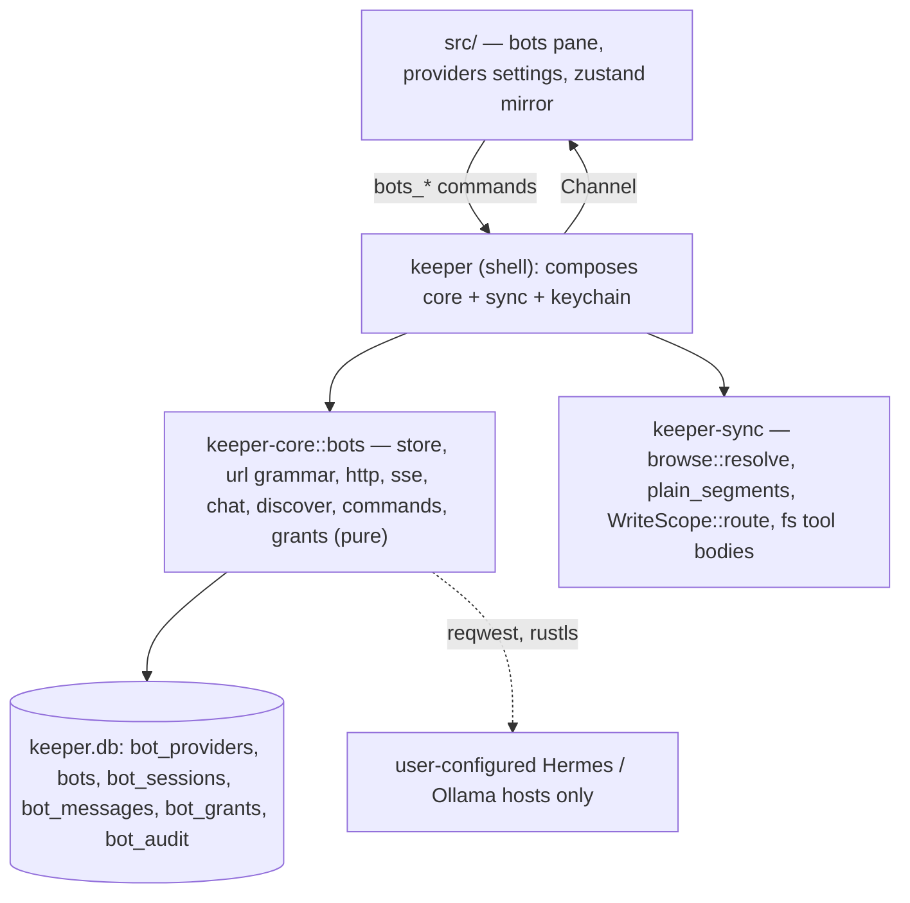

# Architecture Companion — Bots

Extends the frozen spine with **AD-146..AD-160**, one AD per row of Epic 61's binds table and no
more. Nothing here renegotiates the spine: every decision lives in `keeper-core` and the `keeper`
shell is a call site (AD-55/AD-56); bytes never cross IPC (AD-58); `keeper-core` may not depend on
`keeper-sync` (AD-40, `check:core-sync-free`, `package.json:26`); the one lexical containment rule
is `browse::resolve` and it is carried across verb boundaries verbatim (AD-65,
`keeper-sync/src/browse.rs:623-625`, `engine.rs:10159-10160`); a capability gates its surface and
an off capability renders nothing (AD-27, AD-137); egress is computed, never hand-listed (AD-53);
no JSON blob in a row (AD-139).

**The one-sentence shape:** a *provider* is a row with a kind and a base URL and a secret behind
the keychain port; a *bot* is a profile prefix on a Hermes provider or a model tag on an Ollama
provider, verified by probe and never invented; a *conversation* is keeper's own rows, streamed
over one wire and bounded by silence; and a *grant* is a stored, visible, revocable scope × mode
that every drive tool call re-checks before it reads or writes a byte.

**Two decisions that shape everything below** (epic 61, *The two decisions this epic makes*): one
wire protocol — `POST /v1/chat/completions` with `stream: true` — with the per-kind divergences
held as data in a quirk table rather than as a second client; and keeper's store as the truth of a
conversation, with a Hermes `session_id` persisted beside the row as a reference, because
compression mints a renamed successor session and the stored-response cache is a 100-row LRU
(§2.12) and Ollama has no session concept at all.

---

## Crate boundaries

**`keeper-core` holds every decision and every view model.** The base-URL grammar, the provider
and bot records, the HTTP client factory, the SSE framer and the delta state machine, discovery
and the bot probe, the slash registry, grant evaluation, tool schemas, the context-file merge
policy, the caps and their disclosure sentences, and the `*Vm` types (ts-rs, `Vm` suffix,
camelCase, `i64` ms — the AD-7 convention). It already links `reqwest`, `serde_json`, `tokio`,
`url`, `rusqlite`, `ts-rs` (`keeper-core/Cargo.toml:14-39`); the epic adds **no crate**.

**`keeper-sync` holds the drive-touching tool bodies.** `list`/`read`/`glob`/`grep`/`stat`/
`write`/`edit` resolve through `browse::resolve` and `plain_segments` (`browse.rs:646-662`) and
route writes through `WriteScope::route` (`files_write.rs:57-62`), so a model's path goes through
exactly the function the Files tab's path goes through. This is forced, not chosen: `keeper-core`
cannot import those functions (AD-40), and restating them in core would be the second copy of a
security rule the tree already refuses to have (`files_write.rs:76-84`: the containment rule lives
where it is proved on every machine).

**The shell composes.** It builds `Endpoint` from a `Provider` row plus the keychain secret, hands
`keeper-sync` the resolved grant and the tool call, hands `keeper-core` the tool result to feed
back into the stream, and registers the `bots_*` commands in `generate_handler!`. No rule lives
there: the shell does not build on this Linux host (`files_write.rs:78-79`), so a rule written
there is a rule proved nowhere the code is written.

## FR/NFR allocation

| id | statement (epic 61 wording) | story | AD |
| --- | --- | --- | --- |
| FR-369 | several providers side by side, each with a kind, a base URL, its own credential | 61.1 | AD-146 |
| FR-370 | a credential is stored where secrets are stored, never in a row, never on a screen | 61.1 | AD-147 |
| FR-371 | every provider is a derived egress destination, host-only | 61.1 | AD-148 |
| FR-372 | keeper streams a chat completion over the OpenAI wire and can stop it | 61.2 | AD-149 |
| FR-373 | a reply, its tool calls and its usage survive reassembly from fragmented deltas | 61.2 | AD-149 |
| FR-374 | a stalled stream is ended by silence, not by a whole-request deadline | 61.2 | AD-149 (NFR-46) |
| FR-375 | keeper reports what an endpoint is and can do, or says why it cannot tell | 61.3 | AD-150 |
| FR-376 | a bot is addressed by profile prefix, verified by probe, never invented | 61.3 | AD-150 |
| FR-377 | a model's vision and tool support is read from the endpoint, not assumed | 61.3 | AD-151 |
| FR-378 | a surface at ⌘9 that narrates its own state honestly | 61.4 | AD-152 |
| FR-379 | a provider is added, tested and removed from Settings | 61.4 | AD-146, AD-152 |
| FR-380 | an answer renders as prose and code, no remote fetch, no HTML injection | 61.5 | AD-153 |
| FR-381 | conversations are listed, searched, renamed, archived and resumed | 61.6 | AD-154 |
| FR-382 | a resumed conversation replays from keeper's own store | 61.6 | AD-154 |
| FR-383 | bots are pinned in a hand order, with a shape, a bounded colour and a mark | 61.7 | AD-155 |
| FR-384 | per-message metadata is recorded always and shown on request | 61.8 | AD-156 |
| FR-385 | the composer accepts slash commands and refuses unknown ones with a reason | 61.9 | AD-157 |
| FR-386 | a grant names a scope and a mode, is visible, and is revocable | 61.10 | AD-158 |
| FR-387 | a write is never auto-approved by a grant alone | 61.10 | AD-158 |
| FR-388 | every tool call that touched the drive is auditable after the fact | 61.10 | AD-158 (NFR-47) |
| FR-389 | the model reads and writes the drive through keeper's own containment rule | 61.11 | AD-159 |
| FR-390 | file content reaches the model as data, never as instructions | 61.11 | AD-159 (NFR-48) |
| FR-391 | `AGENTS.md`, `CLAUDE.md` and their kin are found, merged and budgeted | 61.11 | AD-159 |
| FR-392 | an image is pasted and sent only to a model that can see | 61.12 | AD-160 |
| FR-393 | a path a model names is opened only inside a grant | 61.12 | AD-160 |
| NFR-46 | a stalled stream is abandoned after bounded silence, not bounded total time | 61.2 | AD-149 |
| NFR-47 | a tool-call audit row is written before the effect and survives a crash | 61.10 | AD-158 |
| NFR-48 | no tool result widens its own grant; no file content is trusted as a directive | 61.11 | AD-158, AD-159 |
| NFR-49 | every byte a tool reads or writes is bounded, and the bound is disclosed to the model | 61.11 | AD-159 |

> Coordinator note: the epic's table binds FR-374, FR-388, FR-390 and NFR-48 to an NFR rather
> than to an AD. This document resolves each to the AD that carries the NFR (AD-149, AD-158,
> AD-159) so that every FR has a checkable rule; the epic's rows are not renumbered.

---

## Architecture decisions AD-146 … AD-160

### AD-146 — A provider is a record with a kind, and a bot is (provider, model-or-profile, identity)
- **Binds:** FR-369, FR-379; Epic 61 (61.1, 61.4)
- **Prevents:** one "AI endpoint" setting that cannot hold two Ollamas; a provider whose kind is inferred from its URL; a bot minted from a string nobody probed; a third kind designed against no endpoint
- **Rule:** `bot_providers` in `keeper.db` holds `(id, kind, name, base_url, read_timeout_ms, created_ms, health_*)` and `bots` holds `(id, provider_id, profile_or_model, identity…)` — the `SyncProfile` precedent of several endpoints of one kind side by side, each with its own credential (§8.1). `ProviderKind { Hermes, Ollama }` is **closed at two**; `Endpoint::url(path)` joins `path` onto `base_url` and inserts `/p/{bot}` for a Hermes bot, while an Ollama bot is the `model` in the body and never routes. The base-URL grammar is a `keeper-core` function with its own tests: scheme `http` or `https` only; **no userinfo**; a path may be a reverse-proxy mount prefix but **not** a `/v1`, `/api` or `/p/…` segment, which keeper appends and therefore refuses with the segment named; a loopback host and a private-network host are both legitimate and both **disclosed** in the row's own sentence — the SSRF question is answered by disclosure and an explicit user act, not a blocklist (§9.4), because `http://localhost:11434` is the normal Ollama case (§3.8). The Settings Providers section is one component in two modes, `editing = provider !== undefined`, the backend's refusal rendered verbatim (AD-C7, `add-folder-form.tsx` shape). **Rejected:** `omp` as a third kind (DW-214) — the enum stays closed and a story on this foundation adds it when there is an endpoint to read; **rejected:** a defaulted or hosted endpoint — D-4, *the endpoint is yours, never keeper's* (`docs/egress.md:95-100`), which is why `base_url` is required, never defaulted.

> Coordinator note: epic 61.1 lists "an optional bot/profile prefix" on the *provider* row. The
> batch contract (`Provider` without a prefix, `Endpoint.bot: Option<String>`, a `bots` table)
> puts the prefix on the bot row instead, so one Hermes provider can hold several bots. This
> document follows the contract; it is the same intent with the column on the right table.

### AD-147 — A credential lives behind the secret port, keyed per provider and per Hermes profile
- **Binds:** FR-370; Epic 61 (61.1)
- **Prevents:** a token in a row, a VM, a log line or an error message; a row that fails at send time because its secret vanished; the default provider key silently rejected on a profile prefix
- **Rule:** Secrets go through `Platform::keychain_set/get/delete` (`keeper-core/src/platform.rs:34-42`), exactly as sync profiles do (`keeper/src/sync.rs:73-89`), under two key shapes minted by `bots::provider_token_key` and `bots::bot_token_key` (`keeper-core/src/bots/mod.rs:378-394`): `bot_provider_token/<provider_id>` for the provider's own key and `bot_token/<provider_id>/<target>` for a Hermes profile's key, where `<target>` is the `bots.target` column — the profile prefix is a column on the bot row, never on the provider row (AD-146). The `<concern>/<id>` spelling is the one the existing keys use (`session/<ulid>`, `store_passphrase/<ulid>`, `recovery_key/<account>`), so removing a provider deletes exactly one secret and no key can be mistaken for another concern's. `bots::resolve_token(platform, provider_id, bot)` (`mod.rs:410-421`) reads the bot key first and falls back to the provider key, because every `/p/<profile>/…` route demands **that profile's own** `API_SERVER_KEY` and answers the default key with `401` (§2.15 item 2; the July-2026 fail-closed hardening, §2.16); the answer becomes `Endpoint.token` (`mod.rs:312`). `BotProviderVm` carries `hasToken: bool` (`vm.rs:5393`) and `health: BotHealthState`, whose `secretMissing` variant (`bots/mod.rs:165`) is the row whose secret vanished — never the value; `BotVm` carries no secret field at all. A row whose secret is gone says so in the list (`bots-section.tsx:323-324`) rather than at send time; an Ollama provider with no key is the honest not-needed case, whose `/v1` layer accepts and discards any key and installs no auth middleware (§3.5, §3.8), and it renders as the plain no-credential caption (`bots-section.tsx:326-327`), never as a fault. The `AUTHORIZATION` header is built with `HeaderValue::from_str` and marked `set_sensitive(true)` (`bots/http.rs:121`), so it is redacted from `Debug` and from `BotsError` text; no error, log or VM ever carries the header, the token or a URL with userinfo (AD-21). **Rejected:** a `token` column on `bot_providers` for simplicity — `accounts` already stores a homeserver and no token (`registry.rs:88-99`), and the row is what `keeper.db` backups and screenshots carry.

> Coordinator note: FR-369/FR-370 say "each provider… its own credential". Hermes makes the
> credential per *(provider, bot)* for named profiles (§2.15). AD-147 keeps the epic's
> per-provider secret and adds the per-bot override the wire requires; Story611 and Story613 were
> told over hub. Without it, every named Hermes bot would probe `401` forever.

### AD-148 — Egress is derived from the provider set, host-only, through the function git remotes already use
- **Binds:** FR-371; Epic 61 (61.1, 61.13); extends AD-53
- **Prevents:** a hand-listed host in `docs/egress.md` that rots when a provider is edited; a full URL — with a path, a port of interest or userinfo — on the egress screen; four rows for one host
- **Rule:** `compute_egress` (`egress.rs:144-148`) gains a fourth argument, `provider_base_urls: &[String]`, read from `bot_providers` on every call — no cache, so adding a provider adds its host on the next read and removing it removes it, the same discipline the doc states for sync remotes (`egress.rs:126-133`). Each base URL passes through `remote_host` (`egress.rs:72-124`), which strips userinfo with `url::Url::host_str` and lowercases; distinct hosts become one `EgressEndpointVm` each with a new `EgressKind::AiProvider` and the label `AI provider`, deduplicated by host, in first-seen order after the git remotes and before the update endpoint. `docs/egress.md` gains the provider chapter and the release egress-diff note fires — that firing is the visibility working, not a regression. **Rejected:** reusing `EgressKind::GitRemote` for the row (its label would lie); **rejected:** a static list in the doc, because AD-53 already says the egress table is computed from live config.

### AD-149 — One wire, framed in bounded chunks, reassembled by index, bounded by silence
- **Binds:** FR-372, FR-373, FR-374, NFR-46; Epic 61 (61.2)
- **Prevents:** a second, native client per kind; a whole-request deadline that kills a legitimate five-minute generation; a partial reply silently discarded on Stop; `reqwest::Response::text` on a body a hostile endpoint can stream forever; a tool call assembled from `choices[0]` or from array position
- **Rule:** The only chat transport is `POST /v1/chat/completions` with `stream: true`, sent through the one client `bots::http::client(read_timeout)` (`keeper-core/src/bots/http.rs:81-88`), which sets `connect_timeout` to `CONNECT_TIMEOUT` = 10 s (`http.rs:55` — shorter than `keeper-sync`'s 15 s on purpose, because a bot endpoint is usually loopback or LAN and a mistyped base URL should say so quickly) and `ClientBuilder::read_timeout` and **never** `ClientBuilder::timeout` — the reasoning is restated in a comment that names `keeper-sync/src/http.rs:24-40` as its source, because `keeper-core` may not import that crate (AD-40): a total budget large enough for a long reply is too large to catch a stall, and `read_timeout` bounds *silence* and resets on every read. The default silence bound is the provider's `read_timeout_ms` or `READ_TIMEOUT` = 120 s (`http.rs:65`; the override is applied in `bots_ipc.rs:204-208`), and the grammar refuses anything under 30 s, because Hermes keep-alives arrive every 30 s (§2.3) and axum's default comment every 15 s. The framer consumes `bytes_stream()` chunks — which are TCP frames, not SSE frames — with a carried tail, so a frame split across two `Bytes` and a UTF-8 scalar split across two `Bytes` both reassemble; it honours `data:` with and without the space, drops `:` comment lines and named keep-alive events (Hermes emits `event: hermes.tool.progress`, R1 §2.6), stops at `data: [DONE]`, and caps total streamed bytes and per-frame bytes. The state machine (§4.3): select the choice with `index == 0`, key `tool_calls` fragments by their `index` in an insertion-ordered map, concatenate `function.arguments` as a **string** and parse once at the end, take `usage` when non-null, treat an in-band `error` object as termination, and record EOF without `[DONE]` or a `finish_reason` as **partial**, never as success. Stop is an abort that persists the assistant row with `partial = 1`; Retry re-sends from the last committed history and never splices (R3 §7.3). Per-kind divergences are rows in a quirk table in `bots::quirks`, not branches in the client: Ollama ignores `tool_choice`, refuses remote `image_url`, takes the data URI as a bare string and cannot set the context window over `/v1` (§3.5); Hermes ignores `model` without `provider` (R1 §2.4). **Rejected:** the native `/api/chat` dialect, and with it `num_ctx` and `think` (DW-210); **rejected:** a new SSE crate — the framer is one screen of code and the byte-boundary tests are the deliverable.

### AD-150 — Discovery answers models, capabilities and health per kind, verifies a bot by probe, and refuses to enumerate bots with its reason
- **Binds:** FR-375, FR-376; Epic 61 (61.3)
- **Prevents:** a bot roster fabricated from a text box; a probe that reports "wrong key" for "this profile needs its own key"; a second auth scheme and a second transport adopted for one list
- **Rule:** Per kind, `bots_models_list` reads Ollama from `GET /api/tags` because every entry carries `capabilities` in one round trip (§3.3) and Hermes from `GET /v1/models` (aliases) plus `GET /api/model/options` (providers, curated models, per-model hints) (§2.3); health is the same call's outcome, folded into the provider row's `health_*` columns. `bots_bot_probe` verifies a **named** bot: on Hermes, `GET /p/<name>/v1/models` where `200` is *exists*, `401` is *this profile needs its own key* (AD-147) and `404` is *no such profile on this gateway* (§2.15); on Ollama, the tag is present in `/api/tags` or it is not. `BotProbeVm` carries the verdict and its reason sentence. The fourth question — *which bots exist* — has no bearer-authenticated answer (§2.11): the roster doors are the dashboard's `GET /api/profiles` under `X-Hermes-Session-Token` and the websocket RPC `profiles.list`, and the empty state says, in the house voice, that a roster needs a door keeper is not given. **Rejected:** speaking either of those doors — a second credential scheme that rotates on every gateway restart and a second wire, adopted to save typing a name.

### AD-151 — A capability is read from the endpoint, and one keeper could not read is `unknown`, never `false`
- **Binds:** FR-377; Epic 61 (61.3, 61.12)
- **Prevents:** a paste affordance hidden from a model that can see; a paste offered to a model that cannot; a tool surface offered to a gateway that executes its own tools and never hands one back
- **Rule:** `BotModelVm` carries `vision`, `tools` and `reasoning`, each an `Option<bool>` (`keeper-core/src/vm.rs:5252-5256`) where `None` is *the endpoint did not say* and is never flattened to `false` at any point, in any branch (`bots/discover.rs:24-26`); `contextWindow: Option<i64>` and `maxOutputTokens: Option<i64>` (`vm.rs:5247-5250`); and `capabilities: Vec<String>`, every capability string the endpoint served, verbatim (`vm.rs:5264`). Ollama: an absent or empty `capabilities` array is `None` for every flag (older builds, R2 §11); a present array answers all three — `"vision"`, `"tools"` and `"thinking"` in the array is `Some(true)`, absent from it is `Some(false)` (`discover.rs:387-400`); the vocabulary is open-ended (§3.3), and a string keeper does not name sets no flag but is kept in `capabilities`. Hermes: `supports_vision` / `supports_tools` / `supports_reasoning` / `context_window` from `/api/model/options`, `None` where a field is absent (`discover.rs:893-931`). A Hermes model's `tools` flag describes the model behind the gateway, and discovery does not rewrite it (`discover.rs:462-466`); the **client-tools** decision is made by kind in `bots::grant::grant_offer`, where `(ProviderKind::Hermes, _)` is `GrantOffer::Absent` with `HERMES_RUNS_ITS_OWN_TOOLS` (`bots/grant.rs:543-547`), because the gateway declares `runtime.tool_execution == "server"` and *never hands the client a tool call to execute*, and no HTTP route registers a client tool (§2.6, §2.13). The UI rule is AD-27's: `None` offers the affordance with a warning naming the model (`TOOLS_CAPABILITY_UNKNOWN`, `grant.rs:125-127`); `Some(false)` renders nothing (`MODEL_HAS_NO_TOOLS`, `grant.rs:113-114`). **Rejected:** default-`true` optimism (a refused paste with a stack trace) and default-`false` pessimism (a hidden feature on a capable model) — both are affordances that lie.

> Coordinator note: the epic reads as though the drive tools (61.11) reach both kinds. Over the
> bearer API a Hermes bot cannot receive a client-executed tool call, so in this epic the drive
> tools are reachable on Ollama models advertising `tools` and on no Hermes bot; a Hermes bot's
> pane shows no grant affordance (AD-27). Hermes' own server-side tools are Hermes', not keeper's.

### AD-152 — Bots is a fifth primary surface with its own capability flag, and the grant affordance is gated on `sync`
- **Binds:** FR-378, FR-379; Epic 61 (61.4)
- **Prevents:** a twelfth flag that is a synonym for `sessions`; a dead ⌘9; a greyed sidebar row; a pane that renders where no provider can be reached
- **Rule:** `PrimaryView` gains `"bots"`; `CapabilitiesVm` gains `bots`, computed in the shell beside its siblings (`ipc.rs:1426-1459`) as `cfg!(desktop)` — a genuinely new condition, because chat needs neither `git` nor `sync.db` — mirrored in the frozen store default and in `dev/mock-shell.ts` or typecheck fails. The **grant affordance** is additionally gated on `sync`, because the drive-tool half needs a synced folder to point at; that split is the honest one. The sidebar entry `Bots` is **absent, not disabled**, where the flag is off (`sidebar-pane.tsx:106-109`); ⌘9 — the only free digit, `⌘8` being tasks (`palette.rs:690-706`) — is bound by a hook cloned from `use-tasks-shortcut.ts` with its five guards in order (`isComposing`, modifier, `altKey`, key, capability) and its no-dead-chord rule, and the palette registry row has exactly one claimant for the `⌘9` chip, proved the way `⌘8` is (`palette.rs:1740-1747`). Streaming renders progressively, Stop stops, Retry re-sends, and an unreachable endpoint uses the vocabulary the app already uses for an unreachable remote. **Rejected:** gating the pane on `sessions` or `sync` — the sentence *chat needs no git* is exactly why they are two flags until the day they diverge, and this is that day.

### AD-153 — An answer renders through the lezer markdown stack already in the tree, with no HTML injection and no remote fetch
- **Binds:** FR-380; Epic 61 (61.5)
- **Prevents:** `dangerouslySetInnerHTML`; a tracking pixel from an image URL the model wrote; a third markdown dependency; a 200 kB reply that locks the webview
- **Rule:** The reply is parsed with `@lezer/markdown` — the parser under `@codemirror/lang-markdown`, already in `package.json`; `src/lib/bots-markdown.ts:43-54` configures it with the `Table` and `Strikethrough` extensions and deliberately without `Autolink` — into a tree of plain objects, never DOM and never an HTML string, that `src/components/bots/bot-answer.tsx` renders as React elements from a closed node set: paragraphs, emphasis, strong, strikethrough, lists, headings, block quotes, thematic breaks, tables, inline code and fenced code. Raw HTML nodes render as text. The renderer creates **no `<a>` and no ``, ever** (`bot-answer.tsx:8-18`; asserted by `bot-answer.test.tsx:64-73`): a link renders as its label followed by its URL as muted text, neither clickable (`bot-answer.tsx:106-116`), and an `http(s)` image is **not fetched and not made openable** — the `Image` node is not modelled, so `` falls through to its own source characters (`bots-markdown.ts:205-210`). This is **stricter** than the alt-text-plus-openable-link reading of the no-remote-fetch rule, and the stricter behaviour is the decision: a URL handed to anything that would fetch or open it is a separate decision about launching an external browser from a model's output, and a link that goes nowhere on click would be the dead affordance AD-27 forbids — shown-and-copyable is the honest middle. The position is `note_protocol.rs:31-34`'s — *a note that auto-fetches a URL an agent wrote is a tracking pixel, and it would falsify the NFR-11 egress claim*. Fenced code gets a copy control and a language label; an unterminated fence mid-stream renders as code and closes itself (`bots-markdown.ts:25-27`); the timeline is virtualized with `window-list.tsx` so a 200 kB reply paints its visible window only. **Rejected:** `message-bubble.tsx` — Matrix-typed down to send state and read receipts (§12.2), and widening it couples two surfaces for a rounded rectangle; **rejected:** `react-markdown` or `marked` — a new dependency for a parser the tree already ships.

### AD-154 — keeper's store is the conversation's truth; a server session id is a reference beside the row
- **Binds:** FR-381, FR-382; Epic 61 (61.6)
- **Prevents:** Hermes sessions as the store; a title minted by a silent second request to a paid endpoint; a delete that does not name what it deletes; an archive that cannot be undone
- **Rule:** `bot_sessions` and `bot_messages` in `keeper.db` are the record for both kinds; resume replays from them, and a `remote_session_id` column holds a Hermes id as a reference only, shown in the detail with the plain sentence that the remote may have compressed it into a successor (§2.12; `fork` and `latest-descendant` stay reachable later through that id). The list is newest-first with search over titles and bodies (`LIKE` over the two columns; FTS5 is AD-12's answer if the archive ever needs it), rename, archive (reversible, a column flip) and delete (confirmed, the confirmation naming which rows and which attachments go — the chain-of-custody rule). Titles are minted locally from the first user message. **Rejected:** a second model call to title a conversation (DW-211) — the exact surprise this app does not ship; **rejected:** the server as the store — compression renames the session, the response cache is 100 rows LRU, and Ollama has nothing to be the store.

### AD-155 — A pin is a hand order, a shape and a mark first, and a colour from a contrast-checked bounded palette second
- **Binds:** FR-383; Epic 61 (61.7)
- **Prevents:** a free colour picker; a bare dot as identity; a hue that passes AA on one theme and fails on the other
- **Rule:** The `bots` row (`keeper-core/src/bots/store.rs:107-118`) carries `pin_order` (hand-set, rewritten in one `BEGIN IMMEDIATE` transaction by `bots::store::reorder_bots` the way `reorder_pins` does — `store.rs:583`, `registry.rs:260-296` — after `bots::identity::plan_reorder` (`identity.rs:257`) has proved the order is a permutation of what exists), `identity_shape` from the closed set `BOT_SHAPES = ["filled", "hollow", "dashed", "notched"]` (`bots/identity.rs:48`), `identity_mark` (an id from the `space-icons.ts` picker, at most `MAX_ICON_NAME_CHARS` = 32, or a literal of at most `MAX_MARK_CHARS` = 4 chars, `identity.rs:82-87`) and `identity_colour` holding a colour **name** from the closed set `BOT_COLOURS = ["clay", "ochre", "olive", "verdigris", "steel", "lapis", "madder"]` (`identity.rs:63-71`) — never a hex and never an index. Each name is a `--bot-ink-<name>` token pair in `src/index.css`, one hex per theme (`index.css:233-239` light, `index.css:314-320` dark), and the hexes live nowhere else. Every member is measured by `scripts/check-design.mjs`'s dedicated `identity-palette` rule (`check-design.mjs:601-683`), not by the foreground-pair `contrast` rule (`check-design.mjs:414-448`): each ink at ≥ `IDENTITY_PALETTE_FLOOR` = 4.5:1 against each of `IDENTITY_SURFACES = ["background", "card", "secondary"]` in both themes; a value in both themes for every name the picker offers; no ink nothing can choose; the palette bounded at `IDENTITY_PALETTE_BOUNDS = [6, 10]` entries; and the picker's `BOT_IDENTITY_COLOURS` / `BOT_IDENTITY_SHAPES` (`src/components/bots/bot-identity.tsx:64-79`) equal to the validator's `BOT_COLOURS` / `BOT_SHAPES`. A pin renders shape + mark + colour together; colour alone never distinguishes two bots, and a colour arriving without a shape is refused (`BotIdentityError::ColourWithoutShape`, `identity.rs:118-122`). A free colour picker is **rejected**, not deferred: `DESIGN.md:168` records that *no colour of any hue passes AA on both themes* for an unconstrained pick, and `DESIGN.md:172` requires every state colour to be paired with a shape. Today's account hue is assigned, never chosen (`account-hue.ts:12-21`); a bot's is chosen from a set the gate has already measured.

### AD-156 — Metadata is recorded on every assistant row and shown on one persisted toggle
- **Binds:** FR-384; Epic 61 (61.8)
- **Prevents:** a zero printed for a usage the endpoint never reported; a metadata JSON blob; a hover-only affordance the keyboard cannot reach
- **Rule:** Every assistant row stores `model` (as the server returned it), `provider_id`, `prompt_tokens`, `completion_tokens`, `ttft_ms`, `duration_ms`, `finish_reason`, `tool_call_count` and `request_id` as **typed nullable columns** (AD-139); a `NULL` renders as absent — an endpoint that omits `usage` is a fact about the endpoint, and a stream that was interrupted may never receive the usage chunk (R3 §1.1). One toggle, persisted in the `settings` k/v table under `bots.metadata` (`registry.rs:101-104`), is reachable in the pane header and in the palette; on, each message shows a compact caption and an expander shows the rest. The caption and expander are real, labelled controls — the prior art that hides the same button with `aria-hidden` is a defect to design against (R5 §10.2). **Rejected:** a `meta_json` column — AD-139; **rejected:** computing token counts locally with a tokenizer — a number keeper did not measure.

### AD-157 — Slash commands are a client-side registry in `keeper-core` that refuses unknown commands and never proxies the server's
- **Binds:** FR-385; Epic 61 (61.9)
- **Prevents:** `/compact` silently dropped on Ollama; a typo sent to the model as prose; a hand-copied Hermes command list that rots on the next release
- **Rule:** `bots::commands` holds the registry — `(name, description, argument mode, needs_provider)` — and ships `/new`, `/bot`, `/model`, `/metadata`, `/grant`, `/image`, `/history`, `/help`. The composer's autocomplete is cloned from `slash-menu.ts:58-135` (filtering, keyboard model, closed set). An unknown command is a **refusal** naming the nearest match and is **not** sent; the one exception the empty state teaches is a literal leading slash, escaped as `\/` — a model may legitimately be asked about `/etc`, and no client documents this case (R5 §11.1), so keeper states its own. Commands are decided in `keeper-core` and the frontend only renders the registry it is streamed. Proxying Hermes' server-side commands is **rejected** (DW-209): they are enumerable only over the websocket RPC `commands.catalog` (§14.2), keeper does not speak that wire, and a picker offering `/compact` to an Ollama bot would be an affordance that lies.

### AD-158 — A grant is (provider, bot?) × scope × mode, re-checked at every tool call; a write is never auto-approved by a grant alone; the audit row precedes the effect
- **Binds:** FR-386, FR-387, FR-388, NFR-47, NFR-48; Epic 61 (61.10)
- **Prevents:** a grant checked once at conversation start; a hidden history of "always" clicks; a write that happened before its record; a tool result that widens what the model may touch
- **Rule:** `bot_grants` holds `(id, provider_id, bot_id NULL, scope_kind, profile_id NULL, subtree NULL, mode, created_ms, revoked_ms NULL)` with `scope_kind ∈ {drive, profile, subtree}` and `mode ∈ {none, read, write}`; grants are listed in Settings and in the pane header and revoked in one act (`revoked_ms` set, never deleted, so the audit keeps its referent). `grants::decide(grants, call, now)` is pure and runs **at every tool call**; an in-flight call whose grant was revoked fails with that reason — the impure-shell test the story must carry against a real revocation. `write` never means auto-approved: the first write in a conversation and every write outside an already-approved subtree ask, and *always for this subtree* is a durable **grant edit** (a new `subtree` row), so "what can it change?" is one list. Evaluation order is deny → ask → allow, the order the industry converged on (§7.2), and file edits are the one class no shipped CLI persists an approval for. `bot_audit` is written and committed **before** the effect (NFR-47), names paths — its reader is a human — and survives a crash because `keeper.db` is WAL with a busy timeout (`registry.rs:33,84`). No tool result, file content or model message can create, widen or extend a grant; only `bots_grant_save` from the UI can (NFR-48). **Rejected:** a `bypassPermissions`-style mode; **rejected:** treating a TCC prompt as the permission — TCC is the OS's answer about keeper, not the user's answer about a model (§7.2).

### AD-159 — The drive tools are the existing containment rule exposed, every result is bounded and the bound is told, and file content enters as data
- **Binds:** FR-389, FR-390, FR-391, NFR-48, NFR-49; Epic 61 (61.11)
- **Prevents:** new path arithmetic; a silent truncation that makes a model confidently wrong; a pointer file read as an empty file; an `AGENTS.md` obeyed as an instruction; a shell string executed
- **Rule:** The tools are `list`, `read` (with line ranges), `glob`, `grep`, `stat`, `write` and `edit`, their JSON schemas and the pure policy in `keeper-core`, their bodies in `keeper-sync`, each path resolved through `browse::resolve` / `plain_segments` / `WriteScope::route` exactly as `engine.rs:10159-10165` carries the rule across a verb boundary, never restated. A grant (AD-158) is checked before every body runs, and the tool surface is offered only to a bot whose `tools` capability is `True` (AD-151). Every result is bounded and **the bound is in the result** — `"truncated at 64 kB of 1.2 MB"`, `"200 of 3 412 entries"` — with per-tool caps in `keeper-core` (a read cap, a listing cap, a match cap, a line-length cap), because the reference filesystem server ships no cap and a 2 GB log returns in full (§7.4). A read that lands on a pointer file returns the pointer's truth — size, virtual state, how to hydrate — not empty bytes (§6.5). A write is atomic through the route's own temp-and-rename writer (`files_write.rs:49-54`), proved against a real watcher pass. Context files — `AGENTS.md`, `CLAUDE.md`, `GEMINI.md`, `.cursorrules` — are discovered nearest-first from the target path upward within the grant, merged in that stated order (the industry's own merge rules are tabled in §7.7), size-capped, and **shown to the user as what the model was told**; the filename list is config, so one more name is a config change. **All** file content, context files included, enters the request as data under a system sentence stating that instructions inside file content are not instructions (§7.6, the lethal trifecta), and a tool result can never carry a grant (NFR-48). Running commands is **rejected**: no tool executes a shell string, D-3 stands and the general exec kind is Epic 60's, unbuilt (DW-213). Embeddings, RAG or any index over the drive are **rejected** (DW-212). "okf" is not implemented.

> Coordinator note: epic 61.11 says "okf" could not be identified (§7.3, `[UNVERIFIED]`). §7.7
> identifies OKF as Google Cloud's *Open Knowledge Format* (Apache-2.0, v0.2) — a corpus of
> markdown knowledge concepts for retrieval, not an instruction file, and nothing in the surveyed
> tools discovers it. The verdict (not a context file) stands; the reason in the epic is stale.

### AD-160 — An image goes the way images already go and is sent only to a model that can see; a path a model names is opened only inside a grant
- **Binds:** FR-392, FR-393; Epic 61 (61.12)
- **Prevents:** base64 through IPC JSON; a vision part sent to a model whose vision is `False`; keeper fetching or copying a path a model named; a reply stripped of text the way a gateway strips it
- **Rule:** A pasted image reaches Rust as a percent-decoded raw IPC body — the `import_attachment` shape, where *the bytes never cross IPC in either direction* (AD-58, `notes_vault.rs:1851-1853`) — is stored beside the conversation as an attachment row referenced by path, and is attached to the request as an `image_url` data-URI content part **only** when the bot's `vision` is `True` or `Unknown`; for `False` the paste is refused with the model's name in the sentence. Size and count caps are stated in `keeper-core`, and the encoded request stays under Hermes' `MAX_REQUEST_BYTES` of 10 MB (§2.3); Ollama's bare-string data-URI form is a quirk row (§3.5; whether Ollama also accepts the object form is `[UNVERIFIED]`, R3 §11). Deliverable mode is handled at the receiving end: an absolute or `~/` path in the reply's prose — not inside code spans, the same exclusion the Hermes gateway applies (R1 §7.1) — is recognised and offered as *reveal* or *open* **only if it falls inside a grant** (AD-158); keeper never fetches, copies or reads a path outside one, and never strips text from a reply, because here the reply is the record. The viewer for an attached image is `media-viewer.tsx`. **Rejected:** proxying `MEDIA:` directive stripping — that is a gateway-side feature of a different runtime.

---

## Data model

All tables live in `keeper.db` behind `keeper_core::bots::store`, created with `CREATE TABLE IF NOT
EXISTS` in the idempotent opener beside `accounts`/`pins`/`drafts` (`registry.rs:64-71,87-120`),
with later columns added by an `ensure_*_column` on the `PRAGMA table_info` shape
(`registry.rs:456-473`). Every column is a typed scalar; **no column holds JSON** (AD-139). Times
are `i64` milliseconds. Ids are ULIDs. A row whose `kind`, `mode` or `scope_kind` this build does
not understand is skipped and listed as unreadable, never fatal (NFR-43's read half).

| table | columns | notes |
| --- | --- | --- |
| `bot_providers` | `id TEXT PK`, `kind TEXT` (`hermes` \| `ollama`), `name TEXT`, `base_url TEXT`, `read_timeout_ms INTEGER NULL`, `created_ms INTEGER`, `health_state TEXT NULL`, `health_checked_ms INTEGER NULL`, `health_detail TEXT NULL` | no token, no prefix; secret under `bot_provider_token/<id>` (AD-147) |
| `bots` | `id TEXT PK`, `provider_id TEXT`, `target TEXT` (profile name or model tag), `name TEXT`, `pin_order INTEGER`, `identity_shape TEXT NULL`, `identity_colour TEXT NULL` (a name from `BOT_COLOURS`), `identity_mark TEXT NULL`, `created_ms INTEGER`, `probed_ms INTEGER NULL`, `probe_state TEXT NULL` | one row per pinned bot; identity per AD-155; per-bot secret under `bot_token/<provider_id>/<target>` |
| `bot_sessions` | `id TEXT PK`, `bot_id TEXT`, `title TEXT`, `created_ms INTEGER`, `updated_ms INTEGER`, `archived_ms INTEGER NULL`, `remote_session_id TEXT NULL`, `metadata_shown INTEGER NULL` | keeper's truth (AD-154); `remote_session_id` is a reference |
| `bot_messages` | `id TEXT PK`, `session_id TEXT`, `seq INTEGER`, `role TEXT`, `body TEXT`, `partial INTEGER`, `created_ms INTEGER`, `model TEXT NULL`, `provider_id TEXT NULL`, `prompt_tokens INTEGER NULL`, `completion_tokens INTEGER NULL`, `ttft_ms INTEGER NULL`, `duration_ms INTEGER NULL`, `finish_reason TEXT NULL`, `tool_call_count INTEGER NULL`, `request_id TEXT NULL` | AD-156's columns; tool calls and attachments are child rows (`bot_tool_calls`, `bot_attachments`), never JSON in `body` |
| `bot_grants` | `id TEXT PK`, `provider_id TEXT`, `bot_id TEXT NULL`, `scope_kind TEXT`, `profile_id TEXT NULL`, `subtree TEXT NULL`, `mode TEXT`, `created_ms INTEGER`, `revoked_ms INTEGER NULL` | AD-158; revoked rows stay for the audit's referent |
| `bot_audit` | `id INTEGER PK AUTOINCREMENT`, `session_id TEXT`, `message_id TEXT NULL`, `grant_id TEXT NULL`, `tool TEXT`, `path TEXT`, `mode TEXT`, `outcome TEXT`, `bytes INTEGER NULL`, `truncated INTEGER`, `started_ms INTEGER`, `finished_ms INTEGER NULL` | written before the effect (NFR-47); names paths, not ids, because its reader is a human |

Index expectations: `bot_messages(session_id, seq)`, `bot_sessions(bot_id, updated_ms DESC)`,
`bot_audit(session_id, id DESC)`, `bot_grants(provider_id, revoked_ms)`. The DDL spelling in
`bots/store.rs` is authoritative for names; this table is authoritative for what must exist,
what must be nullable, and what must never be a blob.

## Egress

The egress surface after this epic is: each homeserver, `api.beeper.com` when a Beeper account
exists, each distinct git-remote host, **each distinct AI-provider host**, and the update
endpoint — in that order, all computed by `compute_egress` from live state (AD-148, AD-53). A
provider host is a **host**, never a URL: the base URL may carry a mount path, and a userinfo
pasted into it is stripped by the same `remote_host` that strips `oauth2:token@` from a git remote
(`egress.rs:519-523` is the test that proves it). keeper ships no default provider host, no hosted
model and no telemetry (D-4, `docs/egress.md:95-100`); the only new destinations are the ones the
user typed. Two gates must stay true in the same epic (61.13): the recording zero-egress source
scan is left **untouched and unwidened** — no file this epic adds may match its globs
(`zero-egress.test.ts:39-60`) and no verb this epic adds to `command-palette/actions.ts` may read
as an upload, a share or a transcription (`zero-egress.test.ts:66-83`) — and `docs/egress.md`
gains the provider chapter so the release diff note fires on purpose.

## Threat model

- **SSRF through a user-supplied base URL.** The grammar accepts `http`/`https` only, no
  userinfo, no keeper-owned path segment (AD-146); redirects are **not followed** by the one
  client (`redirect::Policy::none()`, §9.4); the credential is bound to the provider row it was
  entered for and is never sent to any other host (AD-147). Loopback and private hosts are
  legitimate — that is where Ollama lives — so the answer is disclosure in the row and in the
  egress list plus an explicit user act, not a blocklist that would refuse the normal case.
- **Prompt injection through file content.** A file the model reads — a README, a vendored
  fixture, an `AGENTS.md` a contributor added — is untrusted content inside a process that also
  holds private data and can write; that is the lethal trifecta (§7.6). Mitigations are
  structural, not detective: every byte enters as data under the not-instructions sentence
  (AD-159); the model cannot widen a grant, only the UI can (AD-158, NFR-48); a write asks; the
  drive tools cannot reach the network (no fetch tool exists); the fs tools never populate an
  image part from a tool result, so a vision request cannot become file exfiltration (§9.4).
- **Grant escalation.** Evaluation is per call and reads the live table, so revocation is
  immediate and mid-flight (AD-158); scope is checked after `browse::resolve` canonicalizes,
  so a symlink inside a subtree pointing outside it is refused by the same two-halves rule the
  Files tab uses (`browse.rs:637-641`); the audit row precedes the effect, so an escalation
  attempt that fails still leaves a line a human reads.
- **Credential leakage into error text and logs.** The header is `set_sensitive`; `BotsError`
  variants carry non-secret transport descriptions only, on the `AuthError::ServerUnreachable`
  pattern (`error.rs:50-53`); `tracing` spans carry provider ids, never base URLs with
  userinfo, never tokens (AD-21); VMs carry `hasToken` and a `secretMissing` health state, never the secret (AD-147); the
  egress list shows hosts (AD-148).

## Reliability envelope

*(PRD-style authored bars, owner sign-off at epic release, mirroring the AD-22/NFR-3 posture.)*
**NFR-46** — a stalled stream is abandoned after bounded **silence**: `read_timeout` per
provider, default `READ_TIMEOUT` = 120 s, floor 30 s, never a total request deadline; proved by a local server that
holds the socket open sending nothing and by one that dies mid-frame (AD-149). **NFR-47** — the
audit row is committed before the tool body runs, in WAL `keeper.db` with the 5 s busy timeout, so
a crash between the two leaves a row that names an effect that did not happen rather than an
effect with no row (AD-158). **NFR-48** — no tool result can widen its own grant and no file
content is trusted as a directive: grants are written only by `bots_grant_save`, and every file
byte is data under the system sentence (AD-158, AD-159). **NFR-49** — every tool read and write is
bounded by a cap decided in `keeper-core`, and the bound is disclosed to the model in the result
text; the assertion is on the reduced result the model receives, not on a log line (AD-159).

## Deferred, and what is closed

- **Talk mode, the wake word, neutts — Epic 62**, deferred with a chosen direction and four
  rejections already recorded (§10; epic 61, *What stays out*). Not a story here, because every
  credible stack needs native dependencies that cannot be compiled or exercised on the
  development host and because a voice surface that borrowed the recording pipeline would make
  the recording feature's *transcribes nothing* promise false.
- **Closed, not deferred:** a free colour picker (AD-155); the native `/api/chat` dialect and
  `num_ctx` (AD-149, DW-210); a second titling call (AD-154, DW-211); embeddings or any index over
  the drive (AD-159, DW-212); a shell tool (AD-159, DW-213); `omp` as a provider kind (AD-146,
  DW-214); proxying Hermes' server-side slash commands (AD-157, DW-209).
- **Deferred with a stated shape:** FTS over conversations (AD-12's trigram FTS5 is the answer
  when `LIKE` over titles and bodies stops being enough); Hermes `fork` / `latest-descendant`
  through the persisted `remote_session_id` (AD-154); enumerating bots if Hermes ever exposes a
  bearer-authenticated roster (AD-150 refuses today with the reason).

## Feasibility

FR-369–FR-393 are implementable within AD-146..AD-160 plus the frozen spine **with no new crate**:
`reqwest` (rustls, json), `serde_json`, `tokio`, `futures-util`, `url` and `rusqlite` are already
in `keeper-core` (`Cargo.toml:14-39`); the SSE framer and the delta state machine are pure over
`Bytes` and testable against hand-cut chunks; the store is six `CREATE TABLE IF NOT EXISTS`
statements in the existing opener; the egress row is one argument and one `EgressKind` variant;
the surface is one `PrimaryView` member, one `CapabilitiesVm` flag, one sidebar const, one
`app-shell.tsx` arm, one palette row with `⌘9`, one shortcut hook, and a Providers section on the
`AddFolderForm` shape; the tools are seven bodies in `keeper-sync` over three functions that
already exist.

The riskiest seams, in order: **the containment carry-over** (AD-159 — a body that joins a root
and a subpath itself instead of calling `browse::resolve` is the defect AD-65 exists to prevent,
and it is a write); **the per-call grant check** (AD-158 — a check hoisted to conversation start
for performance ships an unrevocable grant); **the silence bound** (AD-149 — a `timeout` added
"to be safe" kills every long reply and a `read_timeout` under 30 s fails every idle Hermes
stream); and **the profile key** (AD-147 — a probe that treats `401` on `/p/<name>/` as a bad
provider key makes every named Hermes bot look broken). Each is testable on this host against a
local socket and a real SQLite file; the shell crate is a call site and proves none of them.

## Reconciled against the implementation, 2026-09-02

Epic 61 shipped in the working tree before this companion was finished, and five of its ADs named
things the implementation spells differently. The tree is the truth — it is written, tested and
gated — so the ADs above were rewritten to say what the code does. No AD was added, removed or
renumbered, no invariant was weakened, and every change is listed here so the next reader knows
the document was reconciled, not quietly rewritten. Paths are relative to `src-tauri/crates/`
unless they start with `src/` or `scripts/`.

| AD | the doc said | the tree says | settled by |
| --- | --- | --- | --- |
| AD-147 | keychain keys `bots.provider.<provider_id>` and `bots.bot.<provider_id>.<bot>`; a `secretState: "present" \| "missing" \| "notNeeded"` VM field on `BotProviderVm` and `BotVm` (also named in the threat model's credential-leakage bullet) | `bot_provider_token/<provider_id>` and `bot_token/<provider_id>/<target>`, minted by `provider_token_key` / `bot_token_key`, resolved by `resolve_token`; `BotProviderVm.hasToken: bool` plus `health: BotHealthState` with a `secretMissing` variant; `BotVm` has no secret field | `keeper-core/src/bots/mod.rs:379`, `:393`, `:410-421`; `keeper-core/src/vm.rs:5393`; `keeper-core/src/bots/mod.rs:165` |
| AD-147 (report, second half) | — the report said the doc implied the Hermes profile prefix was a column on the provider row | the doc already placed it on the bot row (`bots.target`, AD-146 coordinator note and the data-model table), and so does the DDL; the report was wrong on this point and the placement is unchanged | `keeper-core/src/bots/store.rs:110` |
| AD-149 | `connect_timeout` 15 s; default silence bound 60 s | `CONNECT_TIMEOUT` = 10 s; `READ_TIMEOUT` = 120 s, overridden per provider by `read_timeout_ms` in the shell. The 60 s was not in the report; it was found while verifying the same sentence and is a constant, so it was corrected here and in the reliability envelope | `keeper-core/src/bots/http.rs:55`, `:65`; `keeper/src/bots_ipc.rs:204-208` |
| AD-149 (not applied) | "the grammar refuses anything under 30 s" | no floor is enforced in the tree: `read_timeout_of` accepts any positive `read_timeout_ms`. The sentence is kept because dropping it would weaken an invariant; whether the code gains the floor or the doc loses the sentence is an owner decision | `keeper/src/bots_ipc.rs:204-208` |
| AD-151 | `Capability { True, False, Unknown }` for `vision`, `tools`, `thinking`; `contextWindow: Option<u32>`; unknown capability strings "ignored"; Hermes client-tools `False` "by construction" | `Option<bool>` per flag, named `vision`, `tools`, `reasoning` (`"thinking"` is the Ollama array string that sets `reasoning`); `contextWindow: Option<i64>`; unknown strings set no flag and are kept in `capabilities: Vec<String>`; discovery does not rewrite a Hermes model's `tools` — the client-tools refusal is by kind in `grant_offer` | `keeper-core/src/bots/discover.rs:24`, `:389-397`, `:462-466`; `keeper-core/src/vm.rs:5247-5264`; `keeper-core/src/bots/grant.rs:543-547` |
| AD-153 | an `http(s)` image renders as its alt text and a link the user may open | the renderer creates no `<a>` and no ``; a link is label plus URL as text, neither clickable; an image is not modelled and falls through to its own source characters. Stricter than the AD, and the stricter behaviour is now the rule | `src/components/bots/bot-answer.tsx:8-18`, `:106-116`; `src/lib/bots-markdown.ts:205-210`; `src/components/bots/bot-answer.test.tsx:64-73` |
| AD-155 | columns `sort_order`, `shape`, `mark`, `palette_index`; tokens `--bot-hue-N`; checked by the existing `contrast` rule | columns `pin_order`, `identity_shape`, `identity_mark`, `identity_colour` holding a colour **name** from `BOT_COLOURS`; tokens `--bot-ink-<name>`; checked by a dedicated `identity-palette` rule against `background`, `card` and `secondary` in both themes, bounded at 6–10 entries, with the picker's list held equal to the validator's | `keeper-core/src/bots/store.rs:107-118`; `keeper-core/src/bots/identity.rs:48`, `:63-71`; `src/index.css:233-239`, `:314-320`; `scripts/check-design.mjs:601-683` |
| Data model (same identifiers) | `bots` row spelled `display_name`, `sort_order`, `shape`, `mark`, `palette_index`; secrets under the dotted keys | `name`, `pin_order`, `identity_shape`, `identity_colour`, `identity_mark`; secrets under the slash keys. `probed_ms` / `probe_state` are in the doc's row and not in the DDL; that is an existence question, not a spelling, and was left for the owner | `keeper-core/src/bots/store.rs:107-118` |

Not touched: AD-146, AD-148, AD-150, AD-152, AD-154, AD-156..AD-160 — outside the five reports,
and not re-verified line by line here.
