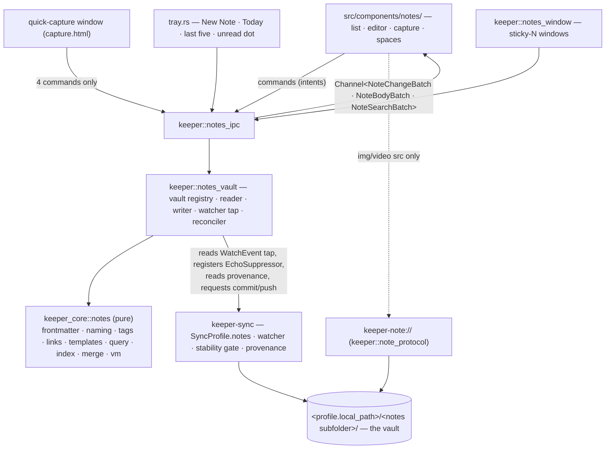
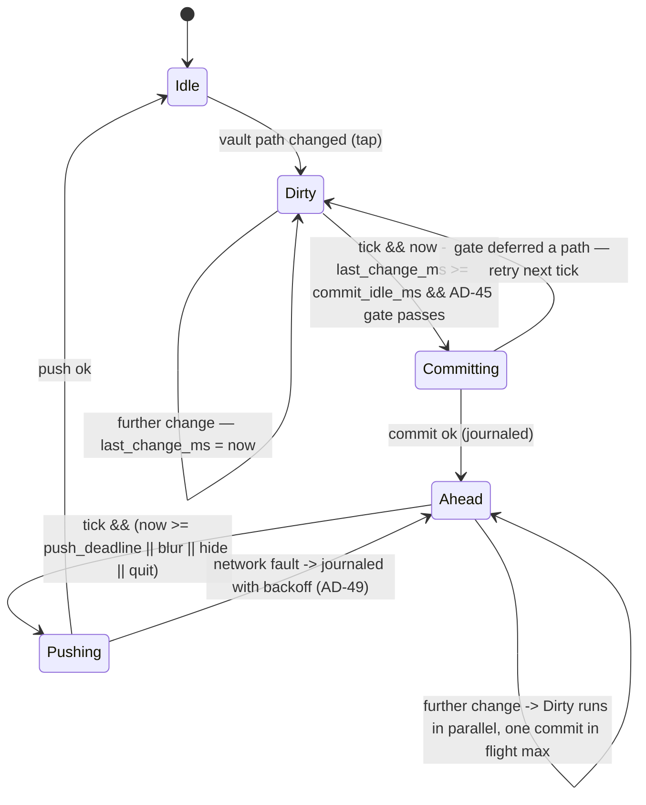

# Architecture Companion — Notes (Phase 5)

Extends the frozen AD-1..AD-53 with AD-54..AD-63. Nothing here renegotiates the spine: the
hexagon, the IPC contract (AD-4, AD-7, AD-8), the licensing firewall (AD-5), the crate
topology (AD-6, AD-40) and the tray/window posture (AD-26, AD-39, AD-51) are inputs, not
open questions. Where this phase touches an existing subsystem it says exactly which line of
it moves.

The one-sentence shape of the phase: **a vault is a subfolder of a folder keeper already
syncs, the notes domain is pure, and everything that makes notes feel alive — the watcher,
the cadence, the second window, the asset protocol — is shell glue over machinery that
already exists.**

## Position in the hexagon



**The pure side — `keeper_core::notes`.** Everything that is a *rule* rather than an
*effect* lives here: what a frontmatter block means, what filename a title produces, what a
tag tree looks like, what a wikilink resolves to, what a template expands to, what a space
query matches, what the index is, and how two edits of the same note merge. It takes bytes
and returns values. It never opens a file, never spawns a task, never knows a profile id
means anything to git. This is AD-55 and it is the reason the phase is testable at all: the
interesting logic is reachable from `cargo nextest run -p keeper-core` with no vault, no
tokio and no Tauri.

**The driven adapter — `keeper::notes_vault`.** The shell module that turns effects into the
core's plain inputs: it canonicalizes vault roots, walks the tree, reads and atomically
writes files, taps `keeper-sync`'s per-profile watcher, owns the one reconciler task per
vault, and asks the sync engine for provenance and for commits. It is to notes what
`recorder.rs` is to recording (AD-33): the place where the platform lives so the core does
not have to.

**The driving adapter — `keeper::notes_ipc` + `note_protocol` + `notes_window`.** Commands,
channels, the asset scheme and the extra windows. No decisions, only plumbing and argument
validation.

**Reuse of `keeper-sync`.** Notes adds no scheduler, no watcher, no git code and no second
database. It adds one optional field to `SyncProfile` (AD-54), one broadcast tap on the
watcher stream and one commit-subject placeholder (AD-62). The four-tier stability gate
(AD-45), the conflict-copy shape (AD-43), the commit trailers (AD-44), the journal and
backoff (AD-49) and the echo suppressor all apply to a notes vault unchanged, because a
notes vault *is* a synced folder.

**Why the purity gates stay green.**

- `check:core-tauri-free` greps `cargo tree -p keeper-core` for `tauri` / `tauri-*`.
  `keeper_core::notes` introduces no Tauri surface at all: `Channel` lives in the shell,
  and the note view models are ordinary serde + `ts_rs` structs like every other DTO (AD-7).
- `check:core-sync-free` greps the same tree for `gix`, `gix-*` and `keeper-sync`. The notes
  core never names any of them. Provenance is not read by the core — it is **handed** to the
  core as plain data (`NoteRevision { rev, author, device, origin, source, ts_ms, subject }`,
  a `keeper_core::notes::vm` type the *shell* fills from `keeper_sync::provenance`). This is
  the same inversion AD-33 uses for the `Recorder` port, and it is what lets AD-63 project
  "who changed this note" without a dependency edge.
- The two new core dependencies are chosen with that regex in mind: **`imara-diff`**
  (Apache-2.0, the upstream crate — *not* gitoxide's `gix-imara-diff` fork, whose name would
  trip `check:core-sync-free` verbatim) for the three-way merge, and **`globset`** (already
  in `Cargo.lock` via `keeper-sync`, promoted to a direct `keeper-core` dependency) for
  `path:` predicates. No YAML crate is added — see AD-55.
- `check:syncd-lean` is untouched: `keeper-syncd` depends on `keeper-sync` only, and notes
  lives entirely in `keeper-core` + `keeper`. A notes-flagged profile syncing under the
  daemon is just a folder; the daemon neither knows nor needs to.
- `CapabilitiesVm` (AD-27) gains `notes: bool`, true only where folder sync is (`sync == true`)
  — FR-122. iOS renders no notes surface; the desktop-only commands still compile there
  behind `Unsupported` twins (see IPC surface).

## Architecture decisions AD-54 … AD-63

### AD-54 — Vault = notes-flagged `SyncProfile` + a subfolder

- **Binds:** FR-94, FR-95, FR-120, FR-121; Epic 35
- **Decision.** A vault is not a configured object. It is a `SyncProfile` (AD-42) carrying
  `notes: Option<NotesConfig>`; `Some` means "this synced folder contains a vault", and
  `NotesConfig.subfolder` (default `"notes"`) says where inside it. Every notes-flagged
  profile is a vault; the vault list *is* a filter over the profile list; the vault id *is*
  the profile id. There is no vault picker, no path validator, no import, no migration.
- **Forces.** The stakeholder ask was explicit that the sync element gains an option marking
  it as notes. The codebase makes that nearly free: profiles persist as **one JSON blob per
  profile** in `sync.db`, so `#[serde(default)]` on a new optional field *is* the migration —
  a profile written before this phase deserializes to `notes: None` and re-serializes
  identically. Meanwhile every alternative shape has to answer questions this one deletes:
  where does the vault live, is the path still valid, what happens when the user moves it,
  how does it get synced, who owns its credentials, what happens on a second machine.
- **Rejected — a `vaults` table in `keeper.db`.** It would be a second registry keyed on a
  path that the sync engine already owns and already re-binds (AD-48 rebinds a removable
  volume by marker, not path). Two registries means two truths about where a folder is, and
  the failure mode — a vault pointing at a path a profile has since moved — is silent.
- **Rejected — a vault as its own sync profile.** Cleaner in isolation, wrong in practice:
  the user's notes almost always live *inside* a folder they already sync (`tgdrive/notes/`),
  and a separate profile would demand a second remote, a second clone and a second set of
  credentials for a subdirectory of a repository they already have.
- **Rejected — vault root = profile root.** Would forbid the overwhelmingly common
  "notes beside other files" layout and would make `attachments/` and `templates/` collide
  with whatever else the folder holds.
- **Consequences.** `NotesConfig` is the entire settings surface for FR-120:
  `{ subfolder, journal_path_template, default_template, capture_subpath, cadence }`.
  Multi-vault (FR-95) is free — switching vaults changes which `Arc<IndexSnapshot>` the list
  query reads, which is a filter change and not a reload (UX-DR41). FR-121 falls out of the
  same place: the vault root is inside a git worktree, so `.keeper/` must be ignored, and
  keeper appends exactly one line to the profile's `excludes` and one to the vault's
  `.gitignore` (`/.keeper/`) at flag time. `.obsidian/` is never in a path keeper constructs,
  so "never read or written" is enforced by the fact that nothing names it — plus an explicit
  reject in the reader and in the `keeper-note://` handler, because "we never generate that
  path" is not the same as "that path cannot be requested".

### AD-55 — `keeper_core::notes` is pure, and its frontmatter parser is first-party

- **Binds:** FR-96–FR-100, FR-104, FR-105, FR-107, FR-108, FR-119; NFR-28; Epic 35
- **Decision.** The notes domain is a pure library: frontmatter parse/serialise, filename and
  slug rules, tag extraction and tree building, link extraction and graph, template
  expansion, the space query language, the index model, the three-way merge and the view-model
  projection. No `std::fs`, no `tokio`, no `tauri`, no `gix`. And the frontmatter parser is
  **written here, not delegated to a YAML crate.**
- **Forces.** Three of them push the same way. (1) The repo has no YAML dependency today and
  `serde_yaml` is archived upstream — adopting an unmaintained parser for the one file format
  an autonomous agent writes directly is the wrong direction. (2) Full YAML is a hostile
  surface for untrusted input: anchors and aliases give you billion-laughs, merge keys give
  you surprise inheritance, and implicit typing gives you the Norway problem (`country: NO`
  → `false`) in a user's own metadata. (3) Decisive: **round-trip preservation is impossible
  through a serde model.** FR-121's promise is that keeper does not mangle files it did not
  author. A `Value`-based parse-then-reserialise loses key order, comment lines, quoting
  style and block-vs-flow list form on every write. keeper must be able to change `pinned`
  and leave the other 400 bytes byte-identical.
- **Rejected — `serde_yaml`.** Archived; would still lose formatting.
- **Rejected — `serde_yaml_ng` / `serde_norway`.** Maintained forks, but they solve the
  maintenance problem and not the preservation problem, and they still accept the full
  language including anchors.
- **Rejected — `saphyr` / `yaml-rust2` in event mode.** Technically capable of preservation,
  but the work of driving an event stream into a preserving editor is comparable to writing
  the subset parser, and it drags the full grammar in behind it.
- **Decision detail.** `frontmatter.rs` parses the **Obsidian property subset** and nothing
  else: a leading `---` fence, `key: scalar`, block lists (`- item`), flow lists
  (`[a, b]`), single/double-quoted strings, unquoted strings taken literally (no implicit
  bool/null coercion outside a closed keyword set), ISO-8601 dates and date-times, integers
  and floats, and exactly one level of nesting under the reserved `keeper:` key. Anchors,
  aliases, merge keys, multi-document streams, block scalars (`|`, `>`) and tags (`!!str`) are
  **rejected with a located error**, not silently reinterpreted. The parse result is a
  `Frontmatter { entries: Vec<(Span, Key, FieldValue)>, raw: Box<str> }` that remembers where
  every key started and ended, so `Frontmatter::set(key, value)` is a splice over `raw` and
  every untouched byte survives.
- **Consequences.** A note whose frontmatter keeper cannot parse is **not** an error and
  **not** skipped: it is indexed with `frontmatter: Unparsed { reason, line }`, its body is
  still searchable and editable, and the properties panel shows the raw block with the
  located complaint. Refusing to index a note because its metadata is odd would violate the
  spirit of NFR-30 — the note is the user's, the index is ours. The parser is also the
  cheapest thing in the cold-scan budget (NFR-28): it stops at the closing fence and never
  allocates a document model.

### AD-56 — Vault IO and watching live in the shell, on `keeper-sync`'s watcher

- **Binds:** FR-96, FR-112, FR-121; NFR-28, NFR-29, NFR-30; AD-45, AD-49; Epic 35, Epic 38
- **Decision.** `keeper::notes_vault` owns every effect: the canonicalized vault registry, the
  cold scan, the reader, the atomic writer, the reconciler task, and the subscription to
  changes. It does not start a watcher. It **taps the one `keeper-sync` already runs** for
  that profile: `keeper_sync::engine::Engine` gains a lazily-created
  `broadcast::Sender<(ProfileId, WatchEvent)>` fanned out at the point where it already
  drains its `UnboundedReceiver<WatchEvent>`, and `notes_vault` subscribes to it.
- **Forces.** `FolderWatcher` is already one recursive `notify` instance per profile, and the
  module's own doc comment explains why: inotify `max_user_instances` is 128 on a typical
  host, so a watcher per *feature* is a resource leak with a hard ceiling. A vault is a
  subtree of a folder that is already watched — a second watcher on the same subtree would
  double every event, double the syscall cost, and desynchronize two debouncers over one
  file. The engine also already owns `EchoSuppressor`, which is the only thing standing
  between "keeper writes a note" and "keeper's watcher reports a change to the note keeper
  just wrote, which the reconciler applies to the editor, which marks it dirty".
- **Rejected — a second `notify` watcher scoped to the vault subfolder.** Instance pressure,
  duplicate events, and a second echo-suppression implementation that must agree with the
  first one exactly or produce write loops.
- **Rejected — polling the vault from the 1 Hz supervisor.** 10 000 `lstat` calls per second
  is not a steady state, and NFR-28 explicitly bounds steady-state cost at one `lstat` per
  *changed* path.
- **Rejected — putting the watcher in `keeper-core` behind a port.** It would need a tokio
  runtime and a `notify` dependency in the hexagon for one consumer, and AD-6 says new
  platform-touching code defaults *out* of the core.
- **Consequences.** The notes reconciler inherits three behaviours for free: the 500 ms
  `DEFAULT_DEBOUNCE_MS` coalescing, the periodic `rescan_interval_ms` sweep that covers a
  dropped event queue, and the `IN_Q_OVERFLOW` / `MustScanSubDirs` → full-rescan path. It
  inherits one problem: 500 ms of debounce is tuned for *committing* and is slower than notes
  wants for *rendering*. The tap therefore carries the **pre-stability** event, and notes
  applies its own 150 ms coalescing window on top (see Concurrency), because rendering a
  half-written file is a repaint and committing one is corruption — the four-tier gate still
  governs the commit and only the commit. `broadcast` lag (`RecvError::Lagged`) is converted
  to a `Resync` marker that triggers a full vault rescan, so a burst that outruns the channel
  degrades to a slower correct answer and never to a lost update.

### AD-57 — The index is a cache, not a database

- **Binds:** FR-96, FR-103, FR-118, FR-121; NFR-28; Epic 35, Epic 37
- **Decision.** The vault index is an in-memory `IndexSnapshot` published through
  `tokio::sync::watch` and rebuilt from disk on demand. It is persisted only as an advisory
  `<vault>/.keeper/index.json` to make a warm start fast. A corrupt, truncated, absent or
  version-mismatched cache is a rescan, never an error and never a user-visible failure.
  `.keeper/` is git-ignored and never committed.
- **Forces.** The brainstorm's sharpest line — "search is not an engine" — is a scale
  judgement, and the numbers back it: a 10 000-note personal vault is ~40 MB of text, which a
  bounded parallel scan reads in seconds and a boolean predicate sweep filters in under a
  millisecond. The cost of the alternative is not CPU, it is *lifecycle*: a real database
  needs migrations, invalidation, corruption recovery, a writer task, a backup story and an
  answer for "what if the user edits the vault in Obsidian while keeper is closed" — and the
  answer to that last one is always "rescan", which is the thing the database was supposed to
  avoid.
- **Rejected — a `notes.db` SQLite database.** A fourth database (after `keeper.db`,
  `archive.db`, `sync.db`) whose contents are 100% derivable from files the user owns. Every
  row is a cache entry pretending to be a fact.
- **Rejected — tantivy or any full-text engine.** Explicitly out of scope this phase, and its
  cost is exactly the invalidation problem above. FR-118 is a bounded parallel content scan
  precisely so it can never be stale.
- **Rejected — no cache at all (always cold scan).** A 3–5 s wait on every launch is a
  usability failure for a feature whose headline job is "catch a thought in under two
  seconds".
- **Consequences.** Deleting `.keeper/` is a supported repair, and the doctor surface says so.
  The cache is validated entry-by-entry with one `lstat` — matching `(size, mtime_ns, ino)`
  adopts the cached parse, a mismatch re-parses that one note. The convergence property
  (`rebuild_from_disk() == replay_of_incremental_deltas()`) is the phase's most important
  test assertion, because it is what makes "the cache is disposable" a fact rather than a
  hope. `index.json` carries a `schema` integer; a bump is a rescan, so the index model may
  change freely without a migration.

### AD-58 — Bodies stream, lists project, nothing large crosses IPC as JSON

- **Binds:** FR-103, FR-107, FR-110, FR-118, FR-123; NFR-28; AD-4, AD-8, AD-20; Epic 37
- **Decision.** The note list carries **view models only** — id, title, snippet, tags,
  timestamps, flags — windowed to the visible range plus buffer, exactly like the inbox
  (AD-20). A note **body** is not a command return value: opening a note subscribes a
  `Channel<NoteBodyBatch>` which opens with a full `Reset { rev, text }` snapshot and then
  emits diffs (AD-8's snapshot-then-diff, applied to a document instead of a list). Search
  results stream on their own channel as they are found. Attachment bytes never cross IPC in
  either direction.
- **Forces.** AD-4 already bans media over IPC; a 200 KB note body is not media, but 10 000 of
  them are, and the list is the surface the user drives with the keyboard. The editor also
  needs *incremental* delivery for a different reason: FR-112's live external write is a diff
  applied to an open document, and re-sending the whole body on every agent keystroke-batch
  would both blow the NFR-29 budget and destroy the cursor.
- **Rejected — `notes_body(id) -> String`.** Simple, and it forecloses live external writes:
  there is no channel to push the next version down. The editor would have to poll.
- **Rejected — shipping the whole list and filtering in TS.** Forks the query semantics
  between Rust and TypeScript, which AD-20 already ruled out for the inbox, and would put the
  space DSL evaluator in JavaScript where it cannot be the same code the tray and palette use.
- **Rejected — base64 attachment bytes on a command.** Both directions have a payload-free
  answer, so paying for base64 would be a choice: **paste** is handled by Rust reading the
  system clipboard through the already-adopted clipboard-manager plugin (the webview sends
  `notes_attachment_paste(vault_id, note_id)` with no payload), and **drop** is handled by
  Tauri's window `DragDropEvent::Drop { paths }`, which gives Rust real paths. The webview
  never holds the bytes it is asking keeper to write.
- **Consequences.** Every editing surface is a channel subscriber, so a sticky window
  (FR-124) and the main editor viewing the same note are two subscriptions to one document
  and stay coherent for free. The table/board lens (FR-123) is a different projection of the
  same list VM and adds no transport. The `NoteListVm` carries a `total` alongside the window,
  so the UI can render a scrollbar without knowing 10 000 rows.

### AD-59 — `keeper-note://` serves vault assets, contained by canonicalization

- **Binds:** FR-109, FR-110, FR-111; NFR-9 posture; AD-4, AD-28; Epic 37
- **Decision.** Vault-local assets — pasted images, embedded attachments, linked files — are
  served over a new async custom URI scheme `keeper-note://<vault_id>/<url-encoded
  vault-relative path>`, registered exactly like `keeper-media://` and implemented by cloning
  `media_protocol.rs` (async responder, `Range` support with the per-request slice cap, 200 /
  206 / 416, fire-and-forget response on an invalidated scheme task). Every request resolves
  the vault root from the **in-memory registry by id** — never from the URL — canonicalizes
  `root.join(rel)`, and refuses anything whose canonical form is not a descendant of the
  canonical root.
- **Forces.** FR-110 says assets are served over a scheme and never base64 over IPC, and
  `media_protocol.rs` is a complete, tested, Range-capable recipe for that in this codebase —
  including the awkward parts (WebKit scheme-task invalidation, the cap that keeps a seek
  sweep from allocating the file repeatedly). The security force is that a note is
  agent-authored text: `` is not a hypothetical, it is one line an
  autonomous writer can emit by accident.
- **Rejected — reusing `keeper-media://` with a vault path.** It resolves against the
  Matrix media cache; overloading it would put user-file path handling inside the code path
  that serves decrypted message media, and one bug there is worse than two handlers.
- **Rejected — `tauri-plugin-fs` with a scoped allowlist.** See AD-60's Security discussion:
  scope globs are string matching, they are evaluated before symlink resolution, and adopting
  the plugin hands the webview a *general* file API to satisfy an *image* requirement.
- **Rejected — path-prefix checking without canonicalization.** `starts_with` on an
  unresolved path is defeated by `..`, by a symlink inside the vault pointing out of it, and
  by percent-encoded separators. Canonicalize first, compare after — and canonicalize the
  root exactly once, at vault registration, so the hot path is one `canonicalize` and one
  `starts_with`.
- **Consequences.** Three extra refusals ride along, because containment alone is not enough:
  components named `.git`, `.keeper` or `.obsidian` are rejected (FR-121 in the one place a
  webview could otherwise reach them); the response `Content-Type` comes from an
  extension→MIME allow-list of image/video/audio/pdf types and never from sniffing, with
  `X-Content-Type-Options: nosniff`, so a `.md` file cannot be coaxed into rendering as HTML
  inside the webview; and non-regular files (fifos, devices) are refused. Remote (`http(s)`)
  image sources in a note body are **not** fetched — they render as a click-to-open link,
  because a note that auto-fetches a URL an agent wrote is a tracking pixel and would falsify
  the NFR-11 egress claim.

### AD-60 — Quick capture is a second window, declared statically

- **Binds:** FR-101; NFR-27; UX-DR35; AD-26; Epic 36
- **Decision.** `tauri.conf.json` gains a second window: `label: "quick-capture"`,
  `visible: false`, `alwaysOnTop: true`, `decorations: false`, `skipTaskbar: true`,
  `resizable: false`, `url: "capture.html"`. It is created at startup and never destroyed.
  Rust owns show / hide / position / focus; the capture webview asks for nothing about its own
  window. It gets its own capability file, `capabilities/quick-capture.json`, scoped
  `"windows": ["quick-capture"]`.
- **Forces.** NFR-27's 300 ms bar with no dropped first keystroke is the whole design
  constraint. There is no `WebviewWindowBuilder` anywhere in this codebase and exactly one
  static window today, so this is a new capability either way — but building a window on
  hotkey means constructing a webview, loading a bundle, mounting React and *then* focusing a
  textarea, which is hundreds of milliseconds of jitter and a guaranteed lost keystroke on a
  cold page. A pre-created hidden window makes the hotkey path three synchronous calls.
  The capability force is structural: every capability file in this repo is scoped
  `"windows": ["main"]`, so a new label with no capability file of its own can invoke
  *nothing* — the plugin ACL denies it. That is a good default and it means the file is
  mandatory, not optional.
- **Rejected — a runtime `WebviewWindowBuilder` per capture.** Blows the latency budget,
  introduces a window-lifecycle race with the hotkey, and needs the capability granted
  dynamically anyway.
- **Rejected — capture inside the main window.** UX-DR35 and the brainstorm are explicit that
  the main window is optional for a whole day of use; showing a 1280×800 window to catch a
  sentence is the behaviour the feature exists to replace.
- **Rejected — a native (non-webview) panel.** Would need per-platform UI code in the shell
  for a textarea, and Linux parity (UX-DR43) is a first-class criterion this phase.
- **Consequences.** `capture.html` is a **second Vite entry point** with its own tiny root
  (`src/capture-main.tsx`) — not the app shell with a route. It imports four IPC wrappers and
  a plain `<textarea>`, and it stays mounted and focused while hidden, so `show()` lands on a
  live focused DOM node and the first keystroke has nowhere to go but the buffer. The buffer
  is persisted through `notes_capture_buffer_save` debounced at 300 ms into `keeper.db`
  settings, so it survives both dismissal and process restart (FR-101). Note the honest
  limit of the ACL: Tauri's capability system gates *core and plugin* commands, not the app's
  own `#[tauri::command]`s, so the capability file is a floor and not a fence — the real
  containment is that every notes command re-validates its arguments against the vault
  registry in Rust regardless of which window called it.

### AD-61 — Tray items live in the first-built menu; the glyph set gains a Linux variant

- **Binds:** FR-102, FR-117; UX-DR39, UX-DR43; AD-39, AD-51; Epic 36
- **Decision.** Every notes affordance the tray will ever show is present in the menu built at
  tray creation: New Note, Today's Journal, a Recent Notes section of five slots, Quick
  Capture, and a disabled status line. Slots are **populated, never appended** — their labels
  are updated with `MenuItem::set_text` and their visibility with `set_enabled`. The glyph set
  gains a second, non-template variant for platforms where `icon_as_template` does nothing,
  selected at build/run time by target. The notes unread indicator is a distinct glyph in the
  existing set, composed by the same pure `decide_tray_state` that already reconciles
  recording and sync, never by a second writer.
- **Forces.** Two hard platform facts. A **Linux tray menu cannot be replaced after it is
  first set** — the ayatana/`libappindicator` bridge takes the menu once, so the
  `set_menu`-to-refresh strategy that works on macOS silently does nothing on XFCE. And
  `icon_as_template` is a **macOS-only no-op elsewhere**, so keeper's ten 44×44 RGBA8
  pure-black-plus-alpha glyphs render black-on-black on a dark Linux panel. The tray is the
  primary surface for this feature (the brainstorm is unambiguous), so both are blocking
  defects, not polish — which is why the numbering spine places them in Epic 36 ahead of
  everything that depends on them.
- **Rejected — rebuilding the tray menu when the recent list changes.** Works on macOS, is a
  no-op on Linux, and would make the feature's primary surface quietly wrong on the platform
  the owner runs.
- **Rejected — destroying and recreating the `TrayIcon` to get a new menu.** Flickers, loses
  the `on_menu_event` router registered on the tray, and on some Linux panels re-registers at
  the end of the tray order, moving the icon.
- **Rejected — a colour-coded unread state.** AD-51 already established shape-not-colour for
  sync, for the same reason: template rendering discards colour on macOS anyway.
- **Consequences.** The five recent slots exist from boot with `set_enabled(false)` and empty
  labels; fewer than five touched notes means disabled slots, not a shorter menu. The
  existing single `on_menu_event` router on the tray (which survives `set_menu`) gains the
  notes ids, so click routing needs no new mechanism. `TrayIconEvent` clicks and
  `show_menu_on_left_click` remain unused — they are Linux-unsupported, and UX-DR43 forbids a
  load-bearing macOS-only affordance. FR-117's actions are declared in
  `keeper_core::palette::registry_sections()`, which already derives the native menu and the
  cheat sheet, so palette + ⌘? + native menu + tray all come from one declaration
  (UX-DR42).

### AD-62 — Cadence is a profile knob; no second scheduler

- **Binds:** FR-115, FR-120; NFR-25 posture; AD-42, AD-45, AD-49; Epic 39
- **Decision.** `NotesConfig.cadence` is a `NotesCadence { commit_idle_ms, push_interval_ms,
  push_on_blur, flush_on_hide, flush_on_quit }`, defaulting to
  `{ 2000, 30_000, true, true, true }`. The **existing 1 Hz supervisor** reads it on the tick
  it already runs; a notes profile additionally pins `poll_interval_ms` to the 2 s floor. No
  new task, no new timer, no notes-specific scheduler.
- **Forces.** The supervisor already exists, is idempotent, is stop-signalled at quit, and
  already re-reads the journal each tick with `MissedTickBehavior::Delay`. A 1 Hz tick has
  exactly the resolution a 2 s idle-commit needs. A second scheduler would have to coordinate
  with the first over the same working tree and the same journal, and "two schedulers, one
  git repo" is how you get concurrent index locks.
- **Rejected — a per-vault tokio timer.** Duplicates supervision, backoff, quit-flush and
  offline handling — all four already solved in `keeper-sync` (AD-49).
- **Rejected — commit-on-every-save.** A note saved while typing would produce a commit per
  keystroke burst; git history becomes unreadable and the push queue unbounded.
- **Rejected — sync-on-a-fixed-interval only, with no idle trigger.** Fails the felt
  requirement: a thought captured and abandoned should be on the other machine seconds later,
  not up to `interval` later.
- **Consequences.** `SUBJECT_PLACEHOLDERS` grows from six to seven with `{notes}`, and notes
  profiles ship `commit_subject_template = "notes({profile}): {notes}"`. Because
  `SyncProfile::validate` refuses unknown placeholders, this is a one-line closed-set addition
  rather than a template free-for-all; on a non-notes profile `{notes}` resolves to the
  mechanical `{changed}` text so a subject is never blank. Everything else about the commit is
  unchanged — the trailer block is provenance and stays byte-identical (AD-44). The four-tier
  stability gate still decides *whether* a path may be staged; the cadence only decides *when*
  keeper asks.

### AD-63 — Provenance is the audit log

- **Binds:** FR-113, FR-114, FR-116; UX-DR39; AD-43, AD-44; Epic 38
- **Decision.** "Who changed this note, on which machine, and was it the agent" is read from
  the commit trailers `keeper-sync` already writes: `Keeper-Device`, `Keeper-Origin`,
  `Keeper-Source: watch|manual|cli|bot`, `Keeper-Profile`. Per-note history (FR-114) is
  `git log --follow`-shaped over one path, projected into `NoteRevisionVm`. The unread mark
  (FR-113) is *local* state — the last revision id the user acknowledged, per note, in
  `keeper.db` — compared against the head revision that touched that path. keeper adds no
  parallel history store, no per-note changelog file, no sidecar.
- **Forces.** This is the phase's cheapest differentiator and the brainstorm called it: the
  most distinctive cluster of features (agent unread dot, per-note history, blame, "what did
  the agent change") is a *projection of data the sync engine already writes on every commit*.
  Building it as a view costs a query; building it as machinery costs a store that can drift
  from the history it describes.
- **Rejected — a `note_history` table.** Would duplicate git and diverge the moment a change
  arrives from another machine, which is exactly the case the feature exists for.
- **Rejected — a `.keeper/activity.json` in the vault.** It would sync, so it would conflict,
  so keeper would be shipping a file whose only purpose is to describe files that already
  describe themselves.
- **Rejected — storing the unread mark in frontmatter.** Read state is per-person, per-device
  and not interesting to Obsidian; writing it into the note would make every read a file
  write, every file write a commit, and every commit a change other machines mark unread.
  Local, in `keeper.db`, keyed by the ULID `id` so it survives a rename (FR-97).
- **Consequences.** History is only as granular as the cadence — a 2 s idle commit means a
  revision is an editing burst, which is the right granularity for a diff a human reads. A
  vault whose profile has never committed shows an honest empty history, not an error. FR-116
  falls out of AD-43: a conflict copy is an ordinary tracked file matching
  `*.sync-conflict-<UTC>-<device>.*`, so the index recognizes it by name, hides it from the
  default lens, and surfaces it as a first-class conflict row bound to its canonical note —
  resolving it inside the editor is a three-way merge and a delete of the copy, both ordinary
  writes. The agent-unread dot on the tray glyph (UX-DR39) is `any(note.head_source == Bot &&
  note.head_rev != acknowledged_rev)` over the active vault, recomputed on every index delta
  and fed to `decide_tray_state`.

## Module map

### `keeper-core/src/notes/` — the pure domain

```text
keeper-core/src/notes/
  mod.rs          # re-exports; NotesError (thiserror) rolling up into CoreError; the
                  #   NoteRecord / NoteId / VaultId newtypes shared by every submodule
  frontmatter.rs  # the first-party Obsidian-subset parser/writer (AD-55).
                  #   parse(&str) -> (Frontmatter, body_offset); Frontmatter::get/set/remove
                  #   with span-splice preservation; FieldValue { Str|Num|Bool|Date|List|Map };
                  #   serialise_new() for notes keeper authors; Unparsed { reason, line }.
  naming.rs       # title -> slug (unicode-aware, NFC, punctuation folded, 60-char cap);
                  #   filename YYYY-MM-DD-<slug>.md; collision counter -2, -3 …;
                  #   journal path from a template; reserved-name and length guards.
                  #   Pure: takes the set of existing sibling names, returns a name.
  tags.rs         # tag extraction from frontmatter `tags` + inline #a/b (skipping code
                  #   fences, inline code, URLs and escaped \#); normalisation (case-fold,
                  #   trim, collapse //); TagTree build with per-node counts (FR-104).
  links.rs        # [[wikilink]] / [[link|alias]] / ![[embed]] / [md](rel/path) extraction;
                  #   resolution against the index (by filename stem, alias, then path);
                  #   the LinkGraph (out-edges + inverted backlink map) for FR-108.
  templates.rs    # placeholder expansion: {{date:FMT}}, {{time:FMT}}, {{title}}, {{cursor}},
                  #   {{id}}. Closed placeholder set, unknown = left literal + a warning.
                  #   Returns (text, cursor_offset) so the editor knows where to land.
  query.rs        # the space query DSL (see Data contracts): tokenizer, recursive-descent
                  #   parser, Query AST, and eval(&Query, &IndexEntry, BodyProvider) -> bool
                  #   with the cheap-predicates-first ordering rule. Depth and token caps.
  index.rs        # IndexEntry, IndexSnapshot (Arc-shared, immutable), NoteDelta
                  #   { Upsert | Remove | Rescan }, apply(&mut IndexBuilder, NoteDelta),
                  #   build_from(Vec<NoteRecord>), tag posting lists, and the
                  #   index.json (de)serialisation with its schema integer.
  merge.rs        # three-way line merge over imara-diff: base/mine/theirs -> MergeOutcome
                  #   { Clean(Vec<Hunk>) | Diverged { theirs: Vec<Hunk>, overlaps } }.
                  #   The one-line context guard and the overlap rule live here.
  search.rs       # the pure matcher for FR-118: case/diacritic folding, match spans for
                  #   highlighting, snippet windowing. The parallel walk is the shell's.
  vm.rs           # NoteListVm, NoteRowVm, NoteBodyBatch, NoteChangeBatch, NoteTagTreeVm,
                  #   NoteSpaceVm, NoteRevisionVm, NoteDiffVm, NoteVaultVm, NoteRefVm,
                  #   NoteConflictVm, NoteAttachmentVm, NoteLinkTargetVm, NoteSearchBatch,
                  #   NoteIndexProgressVm — serde camelCase + ts_rs::TS (AD-7).
```

`keeper-core/src/lib.rs` gains `pub mod notes;`. `keeper-core/src/vm.rs` gains
`CapabilitiesVm.notes: bool`. `keeper-core/src/palette.rs` gains a Notes section in
`registry_sections()` — six entries (New Note, Quick Capture, Today's Journal, Open Note…,
Search Notes, Switch Vault) — which is the whole of FR-117: palette, ⌘? cheat sheet and the
native menu are all derived from that function today. `keeper-core/src/registry.rs` gains
`hotkey.capture` beside `hotkey.global` and `hotkey.recording` (an opaque accelerator string,
exactly the existing pair's shape) and the per-note `notes.read/<note_id>` acknowledgement
rows for AD-63.

### `keeper/src/` — the shell

```text
keeper/src/
  notes_vault.rs   # the driven adapter. VaultRegistry { id -> (profile, canonical_root,
                   #   NotesConfig) } rebuilt whenever profiles change; cold_scan() with a
                   #   bounded JoinSet; read_note()/write_note() (temp + rename, echo-
                   #   suppressed); one reconciler task per vault owning the IndexBuilder and
                   #   publishing Arc<IndexSnapshot> over tokio::sync::watch; the watcher-tap
                   #   subscriber and its 150 ms coalescer; trash_note(); conflict detection;
                   #   attachment import; provenance lookup that fills NoteRevision from
                   #   keeper_sync. Nothing here decides anything the core can decide.
  notes_ipc.rs     # every #[tauri::command] below + the Channel subscription registry
                   #   (same shape as sync_ipc's progress subscriptions) + NotesError ->
                   #   IpcError mapping. #[cfg(not(desktop))] Unsupported twins live here.
  note_protocol.rs # keeper-note:// — a clone of media_protocol.rs's async responder with
                   #   the containment check, the MIME allow-list and Range support.
  notes_window.rs  # quick-capture show/hide/position/focus (monitor-aware centring) and the
                   #   sticky-note windows for FR-124 (labels "sticky-<ulid>", created from
                   #   the same static config shape, tracked in a Mutex<HashMap<label,
                   #   note_id>>, closed on note delete). #[cfg(desktop)] throughout.
  tray.rs          # (changed) notes section in the first-built menu; five recent slots;
                   #   the unread glyph folded into decide_tray_state; the Linux glyph
                   #   variant selection (AD-61).
  hotkey.rs        # (changed) a third registration triple for hotkey.capture, cloned from
                   #   the recording pair, raising the quick-capture window rather than main.
  lib.rs           # (changed) mod declarations; register keeper-note://; create the
                   #   quick-capture window at setup; wire DragDropEvent::Drop for the
                   #   editor window; start the vault registry after the sync supervisor.
  capabilities/quick-capture.json   # new: windows ["quick-capture"], core:event:default +
                                    #   core:window:allow-hide only.
  tauri.conf.json  # (changed) the second static window declaration.
```

### `keeper-sync` — the two additions and nothing else

- `profile.rs`: `#[serde(default)] pub notes: Option<NotesConfig>` on `SyncProfile`, plus
  `NotesConfig` / `NotesCadence` and their `Default` impls, and `validate()` clauses (subfolder
  must be relative, non-empty, no `..`, not `.obsidian`; cadence values clamped —
  `commit_idle_ms` floor 500, `push_interval_ms` floor 5 000). Because a profile is one JSON
  blob per row, `#[serde(default)]` **is** the migration; no SQL change, no schema bump.
- `engine.rs`: a lazily-created `broadcast::Sender<(String, WatchEvent)>` fanned out where the
  engine already drains its `UnboundedReceiver<WatchEvent>`, exposed as
  `Engine::watch_tap() -> broadcast::Receiver<…>` (capacity 1024). Send failures and absent
  receivers are ignored — the tap must never affect sync.
- `provenance.rs`: `SUBJECT_PLACEHOLDERS` gains `"notes"`; the resolver takes an optional
  caller-supplied summary and falls back to the mechanical `{changed}` text.
- Nothing else. No notes types in `keeper-sync`, no vault knowledge, no markdown.

### `src/` — the frontend

```text
src/
  capture.html                 # second Vite entry (AD-60)
  capture-main.tsx             # ~40 lines: a focused <textarea>, Escape -> commit+hide
  components/notes/
    notes-pane.tsx             # the notes primary view: filter bar + list + editor
    note-list.tsx              # virtualised rows over the windowed VM (first virtualised
                               #   list in the app — @tanstack/react-virtual, MIT)
    note-row.tsx               # title · snippet · tags · unread dot · pin · conflict badge
    note-filter-bar.tsx        # text query, tag chips, date range, origin, pinned, "save
                               #   as space" (UX-DR37)
    tag-tree.tsx  space-list.tsx  physical-tree.tsx   # the three lenses (FR-104–106)
    note-editor.tsx            # CodeMirror 6 host; live preview via decorations
    editor/live-preview.ts     # @lezer/markdown-driven decoration set: source revealed only
                               #   on the cursor line (UX-DR40)
    editor/mermaid-widget.ts   # block widget; securityLevel strict, htmlLabels off, render
                               #   timeout, error -> source text (UX-DR44)
    editor/wikilink.ts         # [[ ]] autocomplete + create-on-Enter over notes_link_targets
    properties-panel.tsx       # typed frontmatter editor (FR-107)
    backlinks-panel.tsx  note-history-panel.tsx  note-diff-bar.tsx  conflict-resolver.tsx
    table-lens.tsx  board-lens.tsx        # FR-123
    vault-switcher.tsx                    # in the account-switcher position (UX-DR36)
    sticky-note.tsx                       # FR-124 window body
  lib/stores/
    notes-vaults.ts   # vault list + active vault (a filter, not a route)
    notes-list.ts     # windowed list mirror; applies NoteChangeBatch diffs imperatively
    notes-editor.ts   # open note, rev, dirty flag, pending merge/diverged state
    notes-filters.ts  # query text, tag chips, date range, origin, lens selection
    notes-capture.ts  # capture buffer mirror (used by the capture entry point only)
  hooks/
    use-notes-changes.ts   use-notes-body.ts   use-notes-search.ts
    use-notes-shortcut.ts  use-notes-capture.ts   use-notes-actions.ts
  lib/ipc/gen/           # ts-rs output for every Note*Vm (generated, CI-diffed)
```

Navigation: `PrimaryView` in `src/lib/stores/primary-view.ts` gains `"notes"`, the ternary
chain in `src/components/layout/app-shell.tsx` gains its branch, and `BASE_VIEWS` in
`src/components/layout/sidebar-pane.tsx` gains the entry — all three gated on
`CapabilitiesVm.notes` (AD-27: a surface whose capability is off does not render at all).

New frontend dependencies, all MIT and all pre-cleared against the AD-5 firewall:
`codemirror` 6 + `@codemirror/lang-markdown` + `@lezer/markdown`, `mermaid`, and
`@tanstack/react-virtual`. **No markdown renderer is added** — live preview is the only mode
(UX-DR40), so the editor's decoration layer *is* the renderer, and a second rendering path
would be a second place for the two to disagree.

## Data contracts

### On-disk vault layout

```text
<profile.local_path>/                    # the synced folder — keeper already owns this
  <NotesConfig.subfolder>/               # the vault root, default "notes/"
    *.md                                 # flat notes at the root (the default destination)
    journal/<YYYY>/<YYYY-MM-DD>.md       # FR-99, path from journal_path_template
    templates/*.md                       # FR-100
    spaces/*.md                          # FR-105 — space definitions, ordinary notes
    attachments/*                        # FR-110 — pasted/dropped assets
    .keeper/                             # keeper's cache. git-ignored, never committed.
      index.json                         # AD-57 advisory index
      trash/<ulid>/<original-rel-path>   # NFR-30 recoverable deletes
    .obsidian/                           # NEVER read, NEVER written, NEVER walked (FR-121)
    <stem>.sync-conflict-<UTC>-<dev>.md  # AD-43 conflict copies, recognised by name
```

keeper creates `journal/`, `templates/`, `spaces/` and `attachments/` lazily — on first use,
never at flag time — because an empty scaffold in someone's existing vault is exactly the
"keeper moved my stuff" failure FR-121 forbids. Nothing outside `<subfolder>/` is ever
written by the notes feature; file links (FR-109) may *point* anywhere inside
`profile.local_path` and are opened or revealed, never rewritten.

### Frontmatter schema

Three tiers, and the tier decides who may write a key.

| tier | keys | type | rule |
| --- | --- | --- | --- |
| **keeper-owned** | `id` | ULID string | Written once, on the first note keeper authors or touches. Never rewritten. If a note already has a non-ULID `id`, keeper **does not overwrite it** — the note is indexed under a path-derived identity and flagged `unstable_identity` (its pins and unread marks do not survive a rename, and the UI says so). |
| | `pinned` | bool | FR-119. Absent = false. Obsidian renders it as a checkbox property; harmless there. |
| | `created`, `updated` | ISO-8601 with offset | Obsidian's date-time property format, so Obsidian shows them as dates. `updated` is rewritten on every keeper-authored save; `created` never. |
| | `keeper` | map, one level | The reserved namespace, and the only nested key keeper's parser accepts. Sub-keys this phase: `keeper.space` (see below), `keeper.template` (`{ target, cursor }`), `keeper.capture` (`true` on notes born in the capture panel, so the inbox lens can find unfiled thoughts). |
| **Obsidian-native** | `tags` | list of string | Read and merged with inline `#a/b` tags. keeper appends to it when the user adds a tag; it never reorders or reformats the existing entries. |
| | `aliases` | list of string | Read for wikilink resolution (FR-108). Never written. |
| | `cssclasses` | list of string | Read only for preservation. Never interpreted, never written. |
| **user / agent arbitrary** | anything else | `FieldValue` | Parsed, indexed, addressable by the `field:` predicate, rendered in the properties panel with a type inferred from the value, and **preserved byte-identically on any write that does not target that key**. |

Why `id` is top-level rather than `keeper.id`: Obsidian's own unique-note-id convention and
its Bases/Dataview query surfaces address top-level keys only, so a nested id would be
invisible to the tools the user already has pointed at this vault. The cost is one common
word of namespace, and the collision rule above makes that cost recoverable.

The rewrite guarantee is the contract that matters: **for any note, a keeper write that
changes key K leaves every byte outside K's span identical.** That is asserted as a property
test over a corpus of real-world frontmatter (see Test strategy) and it is what makes
"Obsidian reads it unchanged" (FR-121) an invariant rather than an aspiration.

### `.keeper/index.json` — the advisory cache

```jsonc
{
  "schema": 1,
  "vault_id": "01J…",           // profile ULID — a cache copied to another machine is
                                //   rejected rather than trusted
  "built_ms": 1754121600000,
  "entries": [
    {
      "id": "01J…",             // ULID from frontmatter, or "path:<rel>" when unstable
      "path": "journal/2026/2026-08-02.md",
      "title": "2026-08-02",
      "size": 4210,             // the three lstat fields that validate this entry
      "mtime_ns": 1754121599123456789,
      "ino": 8419021,
      "created_ms": 1754121000000,
      "updated_ms": 1754121599123,
      "tags": ["journal", "project/keeper"],
      "fields": { "status": "open", "priority": 3 },
      "links": ["Vault as a lens", "attachments/diagram.png"],
      "flags": ["pinned"],      // pinned | archived | conflict | template | space |
                                //   capture | oversize | unstable_identity | unparsed
      "snippet": "First 240 chars of body, folded whitespace"
    }
  ]
}
```

It is **advisory** because every field in it is derivable from the file it describes, and
because nothing downstream is allowed to trust it without an `lstat`: on load, each entry's
`(size, mtime_ns, ino)` is compared against the file, a match adopts the cached parse and a
mismatch re-parses that one note. A file present on disk but absent from the cache is parsed;
an entry whose file is gone is dropped. A bad `schema`, a mismatched `vault_id`, a parse
failure or a truncated file all take exactly one branch: **discard and cold-scan**. Writing
it is best-effort (temp + rename) and a write failure is a `tracing::warn!`, never a surfaced
error — a vault on a read-only mount must still work, just slower to start. It is never
committed: `/.keeper/` goes into the vault's `.gitignore` and into the profile's `excludes`
at flag time (FR-121).

### Space notes and the query DSL

A space is an ordinary markdown note under `spaces/`, so it syncs, diffs, has history and is
agent-editable like everything else (FR-105). Its frontmatter carries the definition and its
body is free prose describing the space to a human:

```markdown
---
id: 01J8ZQ4M7T5R9V3XK2B6C0DFGH
keeper:
  space:
    query: 'tag:project/keeper -tag:archive (field:status=open | field:status=review) date:modified>=-14d'
    sort: modified desc
    lens: list
    limit: 500
---

# Active keeper work

Everything still moving on the keeper project, touched in the last fortnight.
```

`sort`, `lens` and `limit` are **not** part of the query grammar. Presentation is a separate
key on purpose: the moment a boolean expression grows an `order by`, it grows a parser, and
this one must stay small enough to hand-write and small enough to audit.

**Grammar.** A query is one line of text. The tokenizer splits on whitespace outside double
quotes, treating `(`, `)` and `|` as standalone tokens and `\"` as an escaped quote.

```ebnf
query       = disjunction ;
disjunction = conjunction , { "|" , conjunction } ;      (* OR  — lowest precedence *)
conjunction = term , { term } ;                          (* AND — juxtaposition      *)
term        = [ "-" ] , ( group | predicate | bareword ) ;
group       = "(" , disjunction , ")" ;
predicate   = key , ":" , value ;
key         = "tag" | "path" | "field" | "date" | "origin" | "is" | "text"
            | "link" | "backlink" ;
bareword    = ? any token containing no ":" ? ;          (* sugar for text:<token>   *)
value       = quoted | unquoted ;
```

Precedence is juxtaposition (AND) tighter than `|` (OR); `-` negates exactly the term that
follows it; parentheses regroup. `a b | c` is `(a AND b) OR c`. That is the Gmail/GitHub
shape, which is the point — it is the search syntax a person already knows.

This parses as a ~120-line recursive-descent walk over a `Vec<Token>`: `parse_disjunction`
loops on `|`, `parse_conjunction` loops until `)` or end, `parse_term` handles `-` and `(`.
No generator, no grammar file, no dependency.

**Predicates.**

| predicate | value form | semantics |
| --- | --- | --- |
| `tag:` | tag path, optional trailing `/*` | Segment-prefix match over the union of frontmatter `tags` and inline `#a/b` tags. `tag:project` matches `project` and `project/keeper` but not `projects`. `tag:project/*` matches strict descendants only, so exact-match is `tag:x -tag:x/*`. |
| `path:` | `globset` glob, vault-relative | `path:journal/**`, `path:*.md`, `path:spaces/*`. Separators are always `/`; matching is case-sensitive on Linux and case-insensitive on macOS, matching the filesystem the user sees. |
| `field:` | `key` \| `key OP value`, `OP ∈ { = != < <= > >= }` | Frontmatter field. Bare `field:status` = "present and non-empty". Comparison is typed by the stored `FieldValue`: numbers numerically, dates chronologically, bools by keyword, strings case-insensitively. `=` against a list field means **contains**. A comparison between incompatible types is `false`, never an error — an agent writing `priority: high` into a numeric field must not break the space that queries it. |
| `date:` | `dfield OP datespec`, `dfield ∈ { created, modified, touched }` | Resolved against the index's timestamps, not raw frontmatter: `created` = frontmatter `created`, else first commit time, else file birth time; `modified` = frontmatter `updated`, else mtime; `touched` = last time this device opened it. This is why `date:` exists separately from `field:` — the fallback chain is the useful part. `datespec` is `YYYY-MM-DD`, `YYYY-MM-DDTHH:MM`, `today`, `yesterday`, or a relative offset `-<n>[dwmy]`. Relative specs resolve against local midnight, so a space does not change meaning mid-afternoon. |
| `origin:` | `local` \| `agent` \| `remote` \| `device:<label>` | From the trailers of the last commit touching the note (AD-63). `agent` is `Keeper-Source: bot`; `local` is this device's `Keeper-Device`; `remote` is any other device; `device:<label>` names one. A note with no commit yet matches `local`. |
| `is:` | closed enum | `pinned`, `archived`, `unread`, `conflict`, `journal`, `template`, `space`, `capture`, `orphan` (no inbound links), `untagged`. Index-computed booleans only — the enum is closed so an unknown flag is a located parse error rather than a silently false predicate. |
| `text:` | quoted or unquoted string | Case- and diacritic-folded substring match over title + body. A bareword with no `:` is sugar for this. |
| `link:` | note title, alias or vault-relative path | This note links to the target. |
| `backlink:` | same | The target links to this note. |

**Evaluation.** `eval` is a pure total function over an `IndexEntry` plus a lazy
`BodyProvider`. The AST is reordered before evaluation so that index-only predicates (`tag`,
`path`, `field`, `date`, `origin`, `is`, `link`, `backlink`) run before any `text:` predicate
inside the same conjunction — `text:` is the only one that needs a body read, and by the time
it runs the candidate set is usually two orders of magnitude smaller. That ordering is a
documented part of the contract, not an optimisation detail, because it is what keeps NFR-28's
100 ms list paint true for a space that contains a text term.

**Failure and limits.** An unknown key, an unknown `is:` flag, an unbalanced parenthesis or a
malformed date is a `SpaceQueryError { message, token_index, byte_span }`. The space row
renders with a warning chip and the editor underlines the offending token. A broken query
matches **nothing** and says so — it never falls back to matching everything, because a space
is a surface people run bulk actions from. Nesting depth is capped at 8 and token count at
256; a hand-written query never approaches either, and an agent-written one cannot use them
to make the parser expensive.

## IPC surface

Conventions are the existing ones (AD-8, and `sync_ipc.rs` as the local precedent): commands
are `notes_*` snake_case, fallible ones return `Result<T, IpcError>`, subscriptions take a
`Channel<T>` and return a subscription id string, and every stream opens with a full
snapshot/reset batch before any diff. All DTOs live in `keeper_core::notes::vm`, derive serde
`camelCase` + `ts_rs::TS`, and are exported to `src/lib/ipc/gen/` by the cargo test step —
`bun run bindings:check` fails CI if the committed tree differs.

### Commands

| command | signature | notes |
| --- | --- | --- |
| `notes_vaults` | `() -> Vec<NoteVaultVm>` | Every notes-flagged profile, with index state and unread count. |
| `notes_vault_flag` | `(profile_id: String, config: Option<NotesConfig>) -> NoteVaultVm` | Flag or unflag (FR-94). Unflagging removes no files. |
| `notes_vault_settings_save` | `(vault_id: String, settings: NoteVaultSettingsReq) -> NoteVaultVm` | FR-120. |
| `notes_index_rebuild` | `(vault_id: String) -> ()` | Drops the cache and cold-scans; progress on the index channel. |
| `notes_list` | `(vault_id: String, query: NoteQueryReq) -> NoteListVm` | Windowed (`offset`, `limit`) with `total`; `query` carries text, tag chips, date range, origin, flags and an optional space id (FR-103). |
| `notes_tag_tree` | `(vault_id: String) -> NoteTagTreeVm` | FR-104. |
| `notes_tree` | `(vault_id: String, rel_dir: String) -> NoteFolderVm` | Physical lens, one level (FR-106). |
| `notes_spaces` | `(vault_id: String) -> Vec<NoteSpaceVm>` | Includes each space's parse status. |
| `notes_space_save` | `(vault_id: String, space: NoteSpaceReq) -> NoteRefVm` | Writes/updates the space note (FR-105). |
| `notes_space_validate` | `(query: String) -> NoteQueryCheckVm` | Parse-only; powers the live underline while typing a query. |
| `notes_create` | `(vault_id: String, req: NoteCreateReq) -> NoteRefVm` | `req = { title?, body?, template?, dest?, tags[] }`. No dialog anywhere in the path (FR-98, UX-DR35). |
| `notes_journal_today` | `(vault_id: String) -> NoteRefVm` | Opens or creates from the journal template (FR-99). |
| `notes_templates` | `(vault_id: String) -> Vec<NoteTemplateVm>` | FR-100. |
| `notes_open` | `(vault_id: String, note_id: String, channel: Channel<NoteBodyBatch>) -> String` | Returns a subscription id; opens with `Reset` (AD-58). |
| `notes_close` | `(subscription_id: String) -> ()` | |
| `notes_buffer_report` | `(subscription_id: String, text: String, rev: String) -> ()` | The editor's dirty-text heartbeat; `text` is the body. See Concurrency. |
| `notes_save` | `(subscription_id: String, text: String, base_rev: String, frontmatter: Option<String>) -> NoteWriteVm` | Explicit save/flush. `text` is the **body**; `frontmatter` is `Some` only from the properties panel, and absent it the block keeper last delivered stands (FR-121). A `base_rev` older than disk triggers the conflict-copy path (NFR-30). |
| `notes_rename` | `(vault_id: String, note_id: String, title: String) -> NoteRefVm` | Retitles and renames the file; `id` keeps links intact (FR-97). |
| `notes_set_flag` | `(vault_id: String, note_id: String, flag: NoteFlag, on: bool) -> ()` | `pinned` / `archived` (FR-119). |
| `notes_delete` | `(vault_id: String, note_id: String) -> ()` | Moves to `.keeper/trash/` and stages the removal. Never an unlink. |
| `notes_search` | `(vault_id: String, req: NoteSearchReq, channel: Channel<NoteSearchBatch>) -> String` | Bounded parallel content scan, results streamed as found (FR-118). |
| `notes_link_targets` | `(vault_id: String, prefix: String) -> Vec<NoteLinkTargetVm>` | Wikilink autocomplete (FR-108). |
| `notes_backlinks` | `(vault_id: String, note_id: String) -> Vec<NoteRowVm>` | FR-108. |
| `notes_history` | `(vault_id: String, note_id: String, limit: u32) -> Vec<NoteRevisionVm>` | Projected from commit trailers (FR-114, AD-63). |
| `notes_diff` | `(vault_id: String, note_id: String, from_rev: String, to_rev: Option<String>) -> NoteDiffVm` | `to_rev: None` = working tree. |
| `notes_mark_read` | `(vault_id: String, note_id: String, rev: String) -> ()` | Clears the unread mark and the tray dot (FR-113). |
| `notes_conflicts` | `(vault_id: String) -> Vec<NoteConflictVm>` | FR-116. |
| `notes_resolve_conflict` | `(vault_id: String, note_id: String, choice: NoteConflictChoiceReq) -> NoteRefVm` | `{ TakeMine \| TakeTheirs \| Merged { text } }`, where `text` is a **body** and the canonical note's block is re-attached; deletes the conflict copy. |
| `notes_attachment_paste` | `(vault_id: String, note_id: String) -> NoteAttachmentVm` | Rust reads the clipboard image; **no payload crosses IPC** (AD-58). |
| `notes_attachment_drop` | `(vault_id: String, note_id: String, paths: Vec<String>) -> Vec<NoteAttachmentVm>` | Paths come from Tauri's own drag-drop event, not from JS. |
| `notes_capture_buffer` | `() -> String` | |
| `notes_capture_buffer_save` | `(text: String) -> ()` | Debounced 300 ms by the caller; persisted in `keeper.db` (FR-101). |
| `notes_capture_commit` | `(text: String) -> NoteRefVm` | Writes the note and clears the buffer. |
| `notes_subscribe_changes` | `(vault_id: String, channel: Channel<NoteChangeBatch>) -> String` | Opens with a `Reset` snapshot of the list window, then diffs. |
| `notes_unsubscribe_changes` | `(subscription_id: String) -> ()` | |
| `notes_subscribe_index` | `(vault_id: String, channel: Channel<NoteIndexProgressVm>) -> String` | Cold-scan progress. |

### Desktop-only commands and their `Unsupported` twins

These five touch windows, the tray or a file manager, and are therefore `#[cfg(desktop)]`
with a `#[cfg(not(desktop))]` twin returning `IpcError` from `CoreError::Unsupported` — the
same honesty pattern `Platform::sidecar_path` and the `Recorder` port already use (AD-27,
AD-33), so the `invoke_handler` list is identical on every target and
`cargo check --target aarch64-apple-ios` stays green.

| command | signature |
| --- | --- |
| `notes_capture_show` | `() -> ()` — position on the focused monitor, show, focus |
| `notes_capture_hide` | `(commit: bool) -> Option<NoteRefVm>` — Escape saves and hides |
| `notes_reveal` | `(vault_id: String, note_id: String) -> ()` — reveal the real path (UX-DR38) |
| `notes_open_file` | `(vault_id: String, rel_path: String) -> ()` — open a linked file (FR-109) |
| `notes_sticky_open` / `notes_sticky_close` | `(vault_id, note_id) -> String` / `(label: String) -> ()` (FR-124) |

### Channels and events

| channel | payload | opens with |
| --- | --- | --- |
| `Channel<NoteChangeBatch>` | `{ vault_id, ops: Vec<NoteListOp> }` where `NoteListOp = Reset { rows, total } \| Upsert { index, row } \| Remove { id } \| Move { from, to }` | `Reset` |
| `Channel<NoteBodyBatch>` | `Reset { rev, text, cursor_hint } \| Merge { rev, hunks } \| Diverged { rev, theirs } \| Renamed { path } \| Gone` | `Reset` |
| `Channel<NoteSearchBatch>` | `{ done: bool, hits: Vec<NoteSearchHitVm> }` | first batch (possibly empty) |
| `Channel<NoteIndexProgressVm>` | `{ scanned, total_estimate, phase }` | current phase |

One event, following the `keeper://kebab-case` rule and carrying ids only:
`keeper://notes-capture-shown` (so the capture entry point can re-assert focus after a
compositor race on Linux).

## Concurrency and change propagation

One reconciler task per vault owns the `IndexBuilder`. It is the only mutator, so the index
needs no lock; readers take an `Arc<IndexSnapshot>` from a `tokio::sync::watch` and are never
blocked by a write. Everything below happens on that one task.

An external write — an agent's `write()`, another editor's atomic rename-into-place, or a
checkout from a remote change — travels this path:

1. **t+0 ms — the write lands.** `notify` (inotify / FSEvents) reports it to the
   `FolderWatcher` `keeper-sync` already runs for the profile. Editor-atomic writes arrive as
   a rename into place, which the fold step treats as a modification of the destination —
   the failure mode the brainstorm flagged, already handled upstream.
2. **The echo check.** If keeper itself wrote the path, `notes_vault` registered it with the
   engine's `EchoSuppressor` before the write and clears it after; the suppressed event is
   dropped here and the loop ends. This is the same mechanism the sync engine uses for its own
   checkouts, not a second one.
3. **t+0..500 ms — the sync debouncer.** The existing `DEFAULT_DEBOUNCE_MS = 500` coalescer
   folds the batch. The tap fires from the drain point, so notes sees the coalesced
   `WatchEvent { path, close_write }` at the same instant the engine does — *before* the
   four-tier stability gate, which continues to govern staging and commits only.
4. **t+150 ms — the notes coalescer.** The reconciler accumulates tapped paths for 150 ms
   (a sliding window, reset by each new path) and filters to the vault subfolder. Rendering a
   partially-written file is a repaint; committing one is corruption — so notes may be
   optimistic here where AD-45 may not. A `broadcast` `Lagged` error becomes a `Resync`
   marker and the window is replaced by a full rescan.
5. **The `lstat` gate.** One `lstat` per path in the window — the whole of NFR-28's
   steady-state cost. `(size, mtime_ns, ino)` identical to the index entry → drop.
6. **Read and parse.** Bounded read (bodies over 1 MiB are indexed head-only and flagged
   `oversize`), then the pure calls: `frontmatter::parse`, `tags::scan`, `links::scan`,
   `naming::classify` → a `NoteRecord`. Typical note: well under a millisecond.
7. **Index apply.** `index::apply(NoteDelta)` produces the new `IndexSnapshot`, the tag-tree
   delta, the link-graph delta and a `NoteChangeBatch` of list ops. The snapshot is published
   on the `watch`.
8. **Provenance and unread.** The reconciler asks `keeper-sync` for the head commit touching
   that path and reads its trailers; `Keeper-Source: bot` (or any device that is not this one)
   with `head_rev != acknowledged_rev` sets `unread`. `decide_tray_state` recomputes, and the
   tray glyph gains or loses its dot (UX-DR39) — one writer, composed with recording and sync
   exactly as AD-51 requires.
9. **t+≤250 ms — the channel batch.** `NoteChangeBatch` is pushed to every open changes
   subscription, coalesced to at most one message per 250 ms per subscription. A 500-file
   agent run is therefore ~4 messages per second, not 500.
10. **The editor branch.** If the changed note is open, the body subscription fires:

**Clean buffer** (no unsaved local edits). `NoteBodyBatch::Reset { rev, text }`. The webview
applies it in a single CodeMirror transaction annotated `external`, so the user's undo history
is not polluted with someone else's edit, then paints a 1.2 s fading highlight over the
changed line ranges. Cursor and scroll are preserved by position mapping.

**Dirty buffer.** Rust holds three texts: `base` (the exact bytes keeper last wrote or last
delivered as a `Reset` for this note — never re-read from disk, which is what makes it a true
common ancestor), `theirs` (the new disk bytes), and `mine` (the buffer text, kept current by
`notes_buffer_report`, which the editor sends after 400 ms of typing idle and immediately on
blur). `keeper_core::notes::merge` runs a three-way line merge over `imara-diff`:

- **Non-overlapping hunks** — a `theirs` hunk whose line range does not intersect any `mine`
  hunk, with a one-line context guard on each side — are merged automatically and delivered as
  `NoteBodyBatch::Merge { rev, hunks }`. The editor applies them as one `external`-annotated
  transaction with position-mapped cursor. This is the common case for an agent appending a
  section while the user edits a paragraph elsewhere.
- **Overlapping hunks** are never auto-applied. They are delivered as
  `NoteBodyBatch::Diverged { rev, theirs }` and the editor raises the inline diff bar —
  "changed on disk · Review · Keep mine · Take theirs" — inline, never modal (UX-DR40 and the
  phase's concurrency verdict). A merge that is partly clean and partly overlapping delivers
  both: the clean hunks apply, the overlapping ones raise the bar, so the user reviews the
  smallest possible thing.
- **Saving while diverged** does not lose the other side. `notes_save` with a stale `base_rev`
  first writes the current disk bytes as an AD-43-shaped conflict copy
  (`<stem>.sync-conflict-<UTC>-<device>.md`), *then* writes the buffer. The copy is an ordinary
  tracked file, so it becomes a conflict row (FR-116) and a commit on the next cadence tick.
  This is the concrete answer to "does an overlapping merge fall through to conflict rows":
  yes, but only at save time, and never before the user has seen the diff bar.

**NFR-29 budget.** 150 ms coalesce + ~1 ms read/parse/index + ≤250 ms batch window + one
frame ≈ **420 ms worst case**, against a 1 s bar. The 500 ms upstream debounce is not additive
for the common single-write case (it fires once, at the end of the quiet period) but is the
reason the bar is 1 s and not 500 ms.

## Sync cadence

The 1 Hz supervisor started by `keeper::sync::start_supervisor` is the only clock. On each
tick it already re-reads the journal and dispatches due units; notes adds one more thing to
evaluate per notes-flagged profile. `poll_interval_ms` for a notes profile is pinned to the
2 s floor, which is the paced-scan cadence, and the state machine below runs on top of it.



- **Debounce.** `commit_idle_ms` (default 2 000) measured from the *last* change, not the
  first, so a typing burst produces one commit. `SyncProfile::validate` floors it at 500 ms.
- **Coalesce.** Changes arriving while `Committing` accumulate into the next `Dirty` window;
  there is never more than one commit in flight per profile, which is already guaranteed by
  the per-profile supervisor's serialization — notes adds no new concurrency here.
- **Push.** `push_deadline = commit_time + push_interval_ms` (default 30 s). `push_on_blur`
  brings it forward when the main window loses focus, because the user walking away is the
  strongest available signal that the other machine wants these bytes.
- **Force-flush.** `flush_on_hide` fires on window hide (including the capture panel hiding
  after a capture) and `flush_on_quit` rides the existing bounded graceful finalize used by
  the quit-honesty path (AD-39/AD-52) — a bounded wait, then the journal covers the remainder
  on next launch. Nothing is lost either way, because the commit already happened locally;
  only the push is outstanding, and an outstanding push is a journal row (AD-49).
- **Offline.** Unchanged from AD-49: commits never require the network, pushes are journaled
  units with exponential backoff and jitter, and a laptop on a train accumulates commits and
  flushes them when connectivity returns.

**Commit subject.** Notes profiles ship `commit_subject_template = "notes({profile}): {notes}"`,
where `{notes}` is the seventh entry in the closed `SUBJECT_PLACEHOLDERS` set. The summary is
computed by the shell from the changed set and is deliberately note-shaped rather than
file-shaped:

| changed set | subject |
| --- | --- |
| one new note | `notes(mind): new note "Vault as a lens"` |
| one modified note | `notes(mind): update "2026-08-02 daily"` |
| one deleted note | `notes(mind): delete "Scratch"` |
| several notes | `notes(mind): 3 notes changed` |
| notes + attachments | `notes(mind): 3 notes changed, 2 attachments` |
| a non-notes profile using `{notes}` | falls back to the mechanical `{changed}` text |

Titles are sanitized through the same single-line `sanitize` every trailer value uses, and
the subject can never be blank. The **trailer block is untouched** (AD-44): `Keeper-Profile`,
`Keeper-Device`, `Keeper-Origin`, `Keeper-Source`, `Keeper-Agent` and any configured
`Keeper-Tag` lines are byte-identical to what a non-notes profile writes, because AD-63 reads
them back and a clone must be able to trust their shape without keeper installed.

## Security

**`keeper-note://` containment.** The URL is `keeper-note://<vault_id>/<url-encoded
vault-relative path>`. The vault id is a lookup key into the in-memory registry, so the
**root never comes from the URL** — the worst a forged URL can do is name a vault that does
not exist. The check, in order: reject if the vault id is unknown; percent-decode the path and
reject if it decodes to an absolute path, a UNC path, or contains a NUL; reject if any
component is `.git`, `.keeper` or `.obsidian`; `canonicalize(root.join(rel))` and require the
result to be a descendant of the root's canonical form, which was computed **once** at vault
registration (so the hot path is one `canonicalize` plus one `starts_with`, and symlinks,
`..`, `..%2f` and NFC/NFD variants all collapse before the comparison); reject non-regular
files; derive `Content-Type` from an extension allow-list (image, video, audio, pdf) and send
`X-Content-Type-Options: nosniff`, so no vault file can be coaxed into rendering as HTML
inside the webview. Range handling, the per-request slice cap and the fire-and-forget
responder are inherited verbatim from `media_protocol.rs`, including its tolerance of WebKit
scheme-task invalidation.

**Why no `tauri-plugin-fs`.** It would be the fastest way to render an image and the fastest
way to lose the property AD-1 exists for. Its scope globs are string patterns evaluated
against the requested path, not against the canonicalized one, so a symlink inside a scoped
directory escapes it; and more fundamentally, the requirement is "show images from the vault",
while the plugin grants "read and write files" and then tries to narrow it back down. Every
path the webview can name in this feature is either a `note_id` (an opaque ULID resolved
server-side) or a vault-relative path validated by the check above. The webview never
constructs a filesystem path that Rust does not re-derive.

**Capability scoping for the second window.** `capabilities/quick-capture.json` is scoped
`"windows": ["quick-capture"]` and grants `core:event:default` (channel delivery) and
`core:window:allow-hide` — nothing else: no `opener`, no `dialog`, no `deep-link`, no
`global-shortcut`, no `process`. Since every capability file in this repo is window-scoped,
the capture window inherits none of `default.json`'s or `desktop.json`'s grants. The honest
limit, stated so nobody plans around a fence that is not there: Tauri's ACL gates *core and
plugin* commands, not the application's own `#[tauri::command]`s, so a capability file cannot
by itself stop the capture webview from invoking `notes_delete`. The real containment is
threefold — the capture window loads a separate 40-line entry point that imports four IPC
wrappers and nothing else; every notes command re-validates its `vault_id` and path arguments
against the registry in Rust regardless of caller; and the capture window's only privileged
operation, `notes_capture_commit`, writes to a fixed destination it does not choose. Sticky
windows (FR-124) get the same treatment: `capabilities/sticky.json`, scoped by a
`"sticky-*"` window pattern, granting the same two permissions.

**What an agent writing arbitrary markdown can cause.** It can create, modify, rename and
delete notes; set any frontmatter key including `id`, `tags` and `pinned`; author a space note
with any query; embed vault images; produce commits stamped `Keeper-Source: bot`; raise unread
marks and the tray dot; trigger index deltas and, with enough churn, a full rescan. All of
that is the feature working.

**What it cannot cause.** It cannot execute anything: markdown is rendered by CodeMirror
decorations, raw HTML in a note body is displayed as escaped source rather than parsed, and
there is no HTML sink to inject into — so `<script>`, `<iframe>` and `onerror=` are text. It
cannot reach outside the vault: `keeper-note://` is contained as above, wikilinks resolve only
within the index (an unresolvable link is a create affordance, not a path), and file links
(FR-109) are validated against `profile.local_path` before `opener` sees them. It cannot read
another vault, because vault roots are server-side and keyed by profile id. It cannot cause a
network request: remote image URLs are not fetched, so a note cannot become a tracking pixel
and the NFR-11 egress claim stays computable from the profile set alone. It cannot make keeper
destroy data: every keeper-side overwrite is preceded by a commit or a conflict copy and every
delete goes to `.keeper/trash/` (NFR-30). It cannot exhaust the machine: query token and depth
caps, the 1 MiB body index cap, the bounded scan concurrency and the coalesced channel batches
each bound one axis. Mermaid is the one component that *interprets* agent-authored input, so
it runs with `securityLevel: 'strict'` and `htmlLabels: false`, inside an error boundary and
behind a render timeout — a hostile or merely broken diagram renders its error inline and
falls back to source text (FR-111, UX-DR44).

## Performance budget

**NFR-27 — capture visible and focused within 300 ms, first keystroke never dropped.**
The `quick-capture` window is created at startup and never destroyed (AD-60), so the hotkey
path is `set_position` → `show` → `set_focus` — three synchronous calls on the main thread,
under 5 ms, plus one compositor frame. No webview construction, no bundle load, no React
mount, no IPC round trip before the window is visible. The keystroke guarantee comes from the
window never unmounting: the `<textarea>` stays focused while hidden, so `show()` reveals an
already-focused live DOM node rather than racing an `autoFocus` effect. The buffer save is
debounced 300 ms and never on the critical path. Budget: ~5 ms Rust + ~16 ms present, with
~280 ms of headroom for a cold compositor on a loaded Linux desktop.

**NFR-28 — 10 000 notes cold in under 5 s, list paints in under 100 ms, one `lstat` per
changed path.** Cold scan is a bounded `JoinSet` at `min(8, available_parallelism())`
concurrent read-and-parse jobs — bounded because an unbounded fan-out over 10 000 files
exhausts file descriptors and thrashes the page cache. 10 000 notes at ~4 KB is ~40 MB of
reads; the frontmatter parser stops at the closing fence and the tag/link scan is a single
pass over at most 1 MiB, so per-note cost is dominated by the read. Warm start is one
`index.json` read plus 10 000 `lstat`s (~1.2 µs each, the figure NFR-23 already measured for
sync) ≈ 12 ms, with re-parses only for mismatches. List paint: predicates evaluate over the
in-RAM `IndexSnapshot` with `tag:` accelerated by sorted posting lists (`HashMap<Tag,
Vec<u32>>`, intersected smallest-first) and `text:` deferred to last by the evaluation-order
rule; the projected VM is **windowed** to the visible range plus buffer (AD-20/AD-58), so the
IPC payload is ~60 rows with a `total`, not 10 000. Steady state is exactly one `lstat` per
path named by a watcher event, and zero per unchanged note, because the reconciler only ever
looks at paths the tap gave it.

**NFR-29 — external write reflected within 1 s.** Budgeted above: 150 ms notes coalesce +
~1 ms read/parse/index-apply + ≤250 ms channel batch window + one frame ≈ 420 ms worst case.
The mechanisms that make it hold under load are the coalescing (a 500-file agent run costs
~4 messages/s, not 500) and the single-mutator reconciler (no lock contention to queue behind).

**NFR-30 — no path deletes or overwrites a body without a recoverable copy.** Four
mechanisms, each covering a different way to lose bytes. (1) Every write is
`write(<name>.keeper.<ulid>.tmp)` in the same directory followed by `rename` — atomic, and the
`.keeper.*.tmp` prefix is already in AD-45's tier-0 exclusion list, so a torn temp file can
never be staged. (2) Before overwriting a note whose disk bytes differ from the last bytes
keeper wrote, keeper writes the disk version as an AD-43 conflict copy first, so the
overlapping-merge case has a recoverable other side. (3) Delete is never `unlink`: the file
moves to `.keeper/trash/<ulid>/<original-path>` and the removal is staged, so the bytes are
recoverable locally *and* from history. (4) The 2 s idle-commit cadence means the overwhelming
majority of states are already in git before anything else touches them. The invariant is
stated as an assertable property (see below) rather than a review checklist.

## Test strategy

**Pure core — `cargo nextest run -p keeper-core`, no vault, no tokio, no Tauri.** This is
where the phase's logic lives and therefore where most of its tests live: frontmatter parse
and preservation, slug and collision naming, tag scanning (including `#tags` inside code
fences, inline code, URLs and escaped `\#`), link extraction and resolution precedence
(filename stem → alias → path), template placeholder expansion and cursor placement, the query
tokenizer/parser/evaluator, index apply and rebuild, the three-way merge, and the search
matcher's fold and span computation. All of it is table-driven over `&str` inputs.

**Shell — `src-tauri/tests/` and `#[cfg(test)]` in `keeper`.** The watcher tap and the 150 ms
coalescer against a paused tokio clock (the `keeper_sync::backoff` precedent); the echo
suppressor round trip (keeper writes, no self-event reaches the reconciler); the
`keeper-note://` containment check against a generated adversarial path corpus; the atomic
write and trash paths against a `tempfile` tree; cadence state-machine transitions driven by a
fake clock. The capability files are asserted structurally — a test that parses
`quick-capture.json` and fails if its permission list grows, because the interesting failure
is a future PR quietly widening it. `cargo check --target aarch64-apple-ios` (already a
required PR gate) is what proves the `Unsupported` twins compile and the handler list matches.

**Real vault fixtures.** Two kinds. A small committed tree under
`src-tauri/tests/fixtures/vault-obsidian/` holding the awkward real-world cases — frontmatter
with comments and odd quoting, a note with a non-ULID `id`, a note with unparseable
frontmatter, a `.obsidian/` directory that must never be walked, a conflict copy, a 2 MiB
note, unicode and NFD filenames — which is the corpus the preservation property runs against.
And a **generated** 10 000-note vault built at test time (not committed) for the NFR-28 cold-scan
and list-paint assertions, in the same CI perf-harness slot as the FTS and concat gates.

**Properties worth asserting** — each of these is a claim this document makes that would
otherwise decay into a comment:

1. **Preservation.** For any fixture note and any single key change, every byte outside that
   key's span is identical after the write. This is FR-121 made mechanical.
2. **Index convergence.** `rebuild_from_disk(vault) == replay(deltas)` for any sequence of
   creates, edits, renames and deletes. This is the assertion that makes AD-57's "the cache is
   disposable" true; if it ever fails, the cache has become a database.
3. **Containment.** Over a generated corpus of `..` chains, absolute paths, symlinks pointing
   out of the vault, percent-encoded separators, NFC/NFD pairs and `.git`/`.keeper`/`.obsidian`
   components, `keeper-note://` never resolves outside the canonical root.
4. **Merge determinism and safety.** Non-overlapping hunks applied in any order produce the
   same buffer; an overlapping hunk is never auto-applied; and `merge(base, mine, mine)` is
   `mine` for every input.
5. **Recoverability (NFR-30).** Over a fuzzed sequence of write/save/delete/external-write
   operations, the previous body of every note is always reachable from at least one of git
   history, `.keeper/trash/`, or a conflict copy. This is the one invariant whose violation is
   unacceptable, so it is asserted over generated op sequences rather than over examples.
6. **Query totality.** No query — including malformed, deeply nested, or type-mismatched ones
   — panics, and no query returns an entry from a different vault. A parse failure matches
   nothing and reports a byte span.
7. **Naming.** Slug generation is idempotent, never produces an empty or reserved filename,
   and the collision counter always terminates given the sibling set.
8. **Bindings.** `bun run bindings:check` — every `Note*Vm` regenerates identically, which is
   AD-7 applied to this phase's twenty-odd new DTOs.
</content>
<parameter name="i">Writing Phase 5 architecture companion