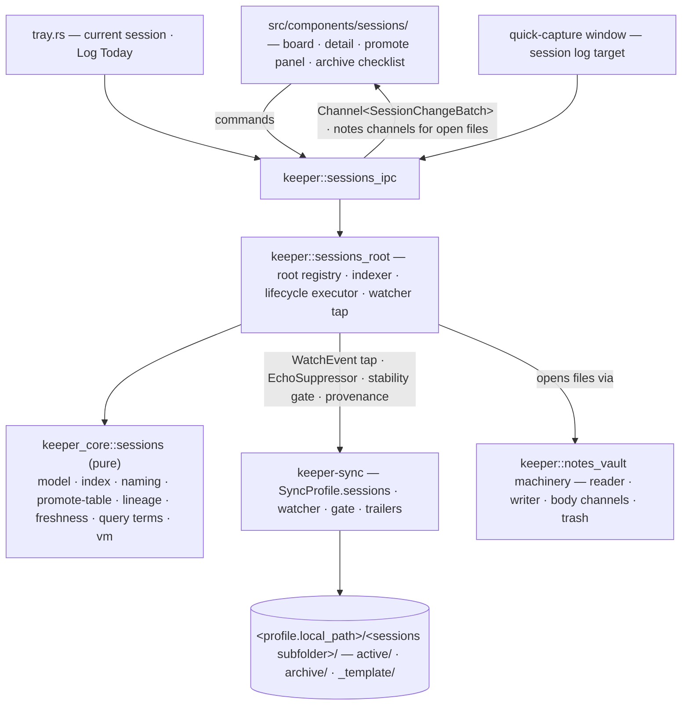

# Architecture Companion — Sessions (Phase 7)

Extends the frozen AD-1..AD-106 with AD-107..AD-115. Nothing here renegotiates the spine
or the notes companion: the hexagon, the IPC contract (AD-4, AD-7, AD-8), the notes purity
and preservation rules (AD-55), the watcher tap (AD-56), the stability gate (AD-45), the
provenance trailers (AD-44) and the settings-as-files posture (AD-98..AD-106) are inputs,
not open questions. Where this phase touches an existing subsystem it says exactly which
line of it moves.

The one-sentence shape of the phase: **a session is a directory with a contract the drives
already enforce; keeper adds a pure folder-level domain (index, lineage, promote table,
naming) in `keeper-core`, a lifecycle executor in the shell, and points every existing
file-level surface — editor, capture, change channels, history, trash, query grammar — at
the files inside that directory.**

## Position in the hexagon

## Architecture decisions AD-107 … AD-115

### AD-107 — A sessions root = sessions-flagged `SyncProfile` + a subfolder

- **Binds:** FR-222, FR-223, FR-224; Epic 47
- **Decision.** The AD-54 move, repeated exactly. `SyncProfile` gains
  `sessions: Option<SessionsConfig>` with `#[serde(default)]`; `Some` means "this synced
  folder contains a sessions zone", `SessionsConfig.subfolder` (default `"60-sessions"`)
  says where. The root id *is* the profile id; the root list *is* a filter over the
  profile list. `CapabilitiesVm` gains `sessions: bool`, true only where `sync == true`.
  A profile may carry both `notes` and `sessions` — the two flags are independent and the
  common case (tgdrive has both `10-notes` and `60-sessions`) requires it.
- **Forces.** The profile-blob-per-row persistence makes the field the migration, as it
  did for notes. Every rejected alternative from AD-54 is rejected here for the same
  reasons, unchanged.
- **Decision detail — adopt-only (FR-222).** Flagging validates that
  `<subfolder>/{active,archive,_template}` — at least one — exists; otherwise the flag
  dialog offers the separate skeleton-creation action, which writes exactly: `active/`,
  `archive/`, `_template/{README.md,workspace/.gitkeep,artifacts/.gitkeep,refs/.gitkeep,prompts/.gitkeep}`
  (canonical template README), the zone `README.md` stub, and — only if the profile's
  ignore rules do not already cover it — one line `**/workspace/` scoped to the
  subfolder in the zone's `.gitignore`. Each write is named in the confirmation.
  `.keeper/` inside the zone joins the existing tier-0 exclusion exactly as the vault's
  `.keeper/` did (AD-54's consequence, same line of code parameterized by root).

### AD-108 — `keeper_core::sessions` is pure; the shell executes

- **Binds:** FR-225–FR-228, FR-238, FR-239; NFR-36; Epic 47
- **Decision.** Everything that is a rule lives in `keeper_core::sessions`, tauri-free
  and sync-free like `keeper_core::notes`: what directory names are sessions
  (`active/*`, `archive/YYYY/*`; skip `_*`, `.*`, loose files), the
  `YYYY-MM-DD-<slug>` naming and collision rules (delegating slug logic to
  `notes::naming`), the session model (id, title, status-from-location, frontmatter via
  `notes::frontmatter` — the same parser, same preservation), the promote-table parser,
  the lineage graph, freshness derivation (given plain `(path, mtime)` inputs), the
  index snapshot, query-term evaluation (extending the `notes::query` grammar with the
  sessions `is:` set — one parser, one crate path, AD-109), and the template/pattern
  copy *plan* (a `Vec<CopyStep>` the shell executes). The shell module
  `keeper::sessions_root` owns every effect: registry, cold scan, fs walks, the
  lifecycle executor, the watcher subscription.
- **Forces.** The purity gates (`check:core-tauri-free`, `check:core-sync-free`) and the
  testability argument from AD-55 apply verbatim. The promote-table parser and the
  archive plan are exactly the logic that must be reachable from `cargo nextest` with no
  filesystem: they are the phase's risk concentrations and they take bytes/paths and
  return values.
- **Decision detail — the promote-table parser.** Parses the documented shape
  (`| workspace | → artifacts | note |` header, one row per promotion) from the README
  body by section heading. Unparseable rows are carried as
  `PromoteRow::Unreadable { raw, line }` — surfaced, preserved, never rewritten
  (PRD §8). Writes are span-splices over the body through the same
  byte-preservation discipline as frontmatter (NFR-39): a row update touches its row,
  a row append touches the table's end, nothing else.

### AD-109 — One grammar, one writer, one editor: sessions extend, never fork

- **Binds:** FR-227, FR-229, FR-233, FR-241; NFR-39; Epic 48
- **Decision.** Three explicit no-fork rules. (1) `notes::query` gains a
  sessions-predicate extension point (the `is:` closed set is provided by the caller),
  so both surfaces parse with the same code and error copy. (2) `notes::frontmatter` is
  the only frontmatter reader/writer; `keeper.session.*` is one more reserved subtree
  under the existing one-level `keeper:` nesting rule (AD-55 detail: the parser already
  allows exactly one level under `keeper:`; `keeper.session.continues` is stored as
  `keeper: { session-continues: [...] }`-shaped keys if the nesting budget forbids two
  levels — the amendment defers the exact spelling to the code, AD-8, but the *budget*
  is: no parser change beyond a reserved-key list entry). (3) The frontend opens session
  files through the **notes body machinery** — the same keyed document store, body
  channels, autosave/heartbeat, diff bar — by teaching `notes_vault`'s reader/writer to
  operate on a *file target* `(rootKind, rootId, relPath)` instead of only
  `(vaultId, noteId)`. Epic 45/46 already generalized much of this for Files-pane
  editing; sessions reuse that generalization rather than adding a third path.
- **Rejected — a sessions-specific editor or a second buffer system.** The drift risk is
  the whole argument; Story 45.14's "stop having two editors" lesson is one phase old.

### AD-110 — Freshness is derived, split by subtree, and the index is disposable

- **Binds:** FR-228, FR-229 (`is:stale`), FR-235, FR-237; NFR-36, NFR-37; Epic 47
- **Decision.** A session row's two freshness signals are computed, never stored:
  *record* freshness = max mtime/head-commit time over README + `artifacts/` + `refs/`
  + `prompts/`; *workspace* freshness = max mtime under `workspace/` from a bounded fs
  walk. The index snapshot (`Arc<SessionIndexSnapshot>`, swapped whole like the notes
  index) caches both with their scan times in `.keeper/sessions-index.json`; deleting
  the cache costs a rescan and nothing else.
- **Decision detail — bounded workspace scanning (NFR-37).** The watcher tap already
  delivers events for the whole profile; workspace events update freshness directly
  (cheap — no read, just a timestamp fold) but are **dropped from every other pipeline**
  (no index text, no change rows, no unread). The *initial* workspace freshness for
  off-screen sessions comes from a lazy, depth-capped, entry-capped walk executed at
  index time with a budget; a workspace that blows the budget reports freshness as
  "at least T" — the UI never promises precision it did not pay for.
- **Unread (FR-235)** follows the notes contract: `head_rev != acknowledged_rev` over
  the session's *versioned* files, acknowledged revs stored in `.keeper/` beside the
  index (cache-tier data, loss = everything unread once, which is honest).

### AD-111 — Lifecycle verbs are journaled plans; promote copies pass the gate

- **Binds:** FR-238, FR-239, FR-243–FR-249; NFR-38; Epic 49
- **Decision.** Create, pattern-copy, promote, archive, delete and unarchive each
  compile (in the core) to a **plan** — an ordered list of primitive steps (mkdir, copy,
  splice-write, move, trash) — that the shell executor runs with a journal row in
  `.keeper/sessions-journal.json` recording the plan and its progress. On relaunch, an
  incomplete journal entry either resumes (steps are idempotent — copy-if-absent,
  move-if-source-exists) or rolls back the completed prefix; the archive checklist UI
  is a projection of the same plan. The folder **move is the last step** of an archive
  plan, so a crash never yields a half-moved session.
- **Decision detail — promote copies.** A promote copy runs the source through the
  four-tier stability gate (AD-45) exactly as the sync scanner would before committing
  it: a file mid-write by an agent is *parked* (the panel shows "still changing"), never
  half-copied. Re-promotion is copy-over-then-table-splice; git history keeps versions
  because the target is versioned and the zone commit cadence picks it up (AD-107 —
  keeper's own sync engine owns the commit; sessions add **no git code**).
- **Rejected — transactional fs libraries / staging dirs.** The step set is five
  primitives on one local filesystem; a journal of idempotent steps is auditable and
  sufficient, and matches the recording ledger precedent (AD-37).

### AD-112 — Lineage is frontmatter, written on both ends

- **Binds:** FR-239, FR-248, FR-250; Epic 49
- **Decision.** `continues` / `continued-by` are ULID lists in the two READMEs'
  reserved `keeper.session` namespace — written through the one frontmatter writer,
  including into `archive/` (files are truth; a lineage the index alone knew would be
  invisible to Obsidian and the agent). The lineage graph is built at index time from
  frontmatter only; a dangling ref (target deleted) renders as an inert chip, never an
  error. Unarchive never rewrites lineage.

### AD-113 — Workspace is a read-only projection

- **Binds:** FR-230, FR-237; NFR-37; Epic 47, Epic 48
- **Decision.** `workspace/` contents appear only as `(name, size, mtime)` listings and
  read-only viewer targets. The write path refuses `workspace/` targets structurally
  (the file-target resolver returns `ReadOnly`), search excludes it by default
  (FR-230's toggle widens one scan call), the index stores no workspace text, and the
  `keeper-note://`-style asset protocol never serves from it. This is enforcement by
  construction — the same "nothing names it" + explicit-reject pairing AD-54 used for
  `.obsidian/`.

### AD-114 — Session IPC mirrors notes IPC

- **Binds:** FR-233, FR-234, FR-251; Epic 48
- **Decision.** ts-rs DTOs `Session*Vm/Req/Batch/Op` (`SessionRowVm`, `SessionVm`,
  `SessionTreeVm`, `SessionPromoteVm`, `SessionArchivePlanVm`, `SessionChangeBatch`,
  `SessionListOp`, `SessionQueryReq`, `SessionCreateReq`, …), commands
  `sessions_<verb>` (list, subscribe/unsubscribe changes, get, tree, create,
  create_from, log_today, promote, promote_panel, archive_plan, archive_run,
  archive_resume, delete_plan, delete, unarchive, set_flag, set_current, mark_read,
  changes_since, search, reveal, roots, root_flag, skeleton_create, index_rebuild),
  channel subscriptions via the same `subscribeWithStringId` shape, events
  `keeper://sessions-*`. Open-file editing rides the existing notes body commands with
  the file-target extension (AD-109); no parallel body pipeline. Frontend state mirrors
  the notes stores one-for-one: `sessions-list`, `sessions-filters`, `sessions-roots`,
  reusing the vanilla-zustand boilerplate and the `use-notes-changes` hook shape.
- **iOS**: desktop-only commands compile behind `Unsupported` twins, as notes do.

### AD-115 — Sessions surfaces live in the existing shell

- **Binds:** FR-241, FR-242, FR-251, FR-252; Epic 48
- **Decision.** Sessions are a primary view (`primaryViewStore` gains `"sessions"`),
  session/detail/file targets join the `panels` addressable-target union, the command
  palette registers verbs through the existing action registry, the menu and tray add
  items exactly where notes items sit, and the quick-capture window gains the session
  log target through `CaptureTargetVm` (one more variant: `{ kind: "session-log",
  rootId, sessionId }`) — same prewarmed window, same draft machinery, the log-append
  performed by the same splice-writer that FR-240 uses. "Current session" is Rust-owned
  state (per-root, in the profile's settings blob) so the tray, capture window and main
  window agree, mirroring the active-vault precedent.

## Deferred

- Board/table lenses over session properties — follows the notes FR-123/124 machinery.
- Cross-session property comparison; any persistent FTS for sessions.
- Configurable staleness threshold; per-session cadence.
- Transcript ingestion, agent launching, or any execution surface.
- `keeper-syncd` awareness of sessions — the daemon syncs a flagged profile as a plain
  folder, exactly as it does a vault (`check:syncd-lean` untouched).

## Consistency check

All FR-222–FR-252 and NFR-36–NFR-39 are implementable within AD-107..AD-115 plus the
frozen spine; no PRD amendment required. The two purity gates stay green by
construction (§AD-108); the one new `SyncProfile` field follows the AD-54 migration
argument; no new crates are anticipated (`imara-diff`, `globset` already present via
notes; the promote-table parser is first-party by the AD-55 argument). The riskiest
seams — the file-target generalization of the notes body pipeline (AD-109) and the
journaled archive plan (AD-111) — are named as the first stories of Epics 48 and 49
respectively so they are proven before anything stacks on them.
