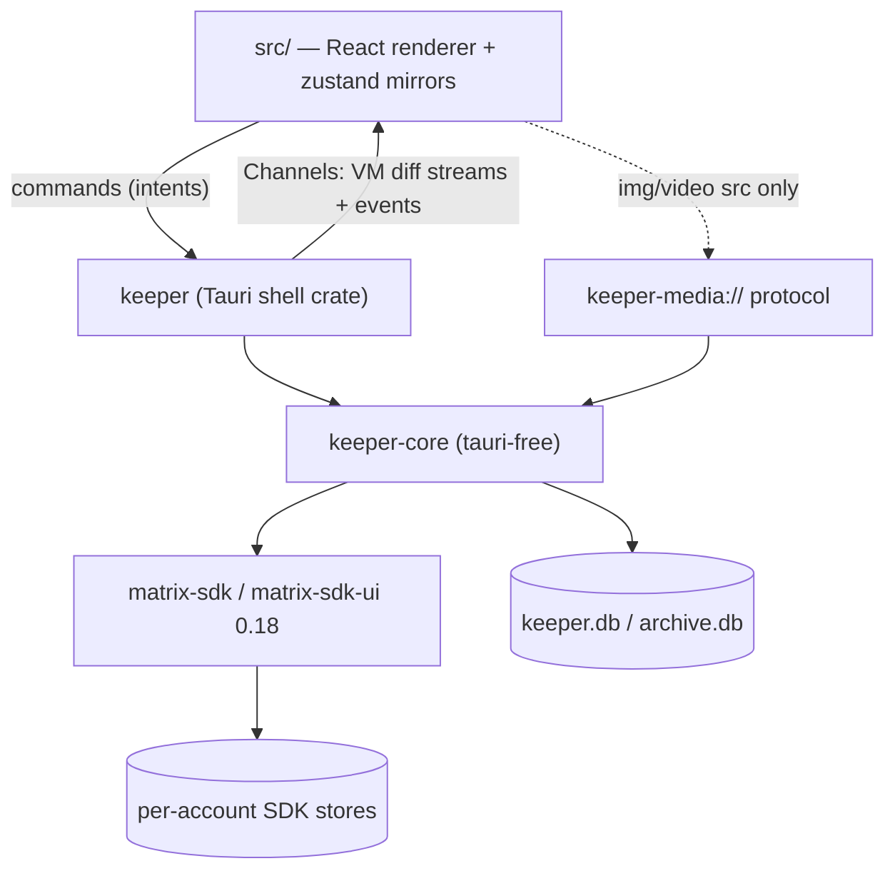
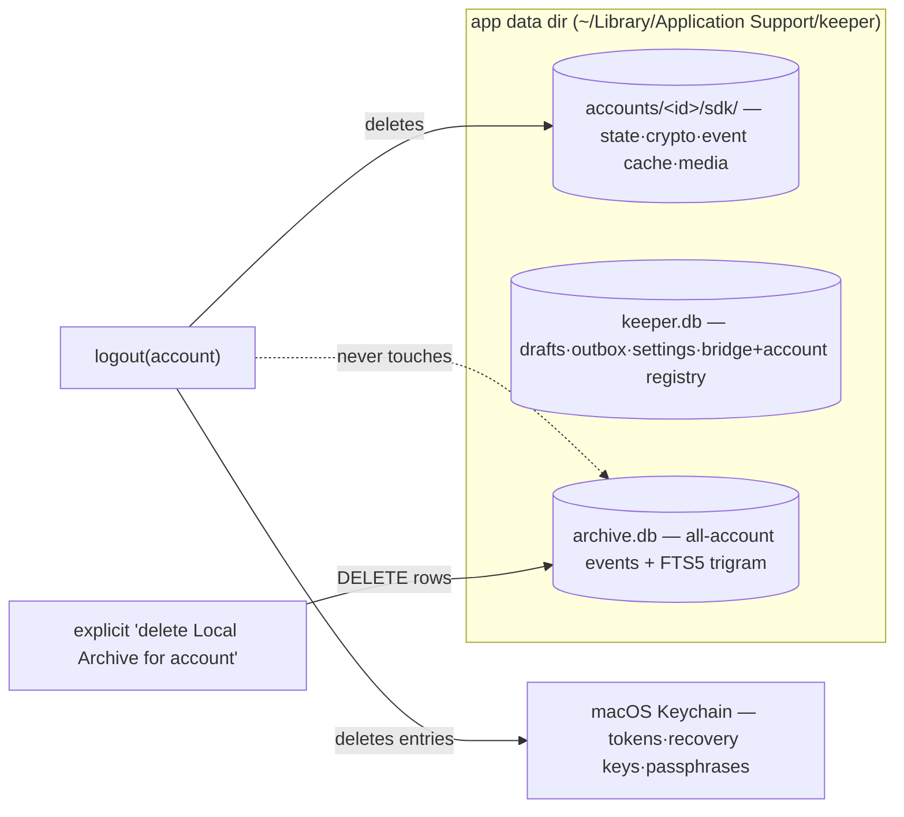

# Architecture Spine — keeper

## Design Paradigm

**Hexagonal (ports-and-adapters) Rust core with unidirectional view-model projection.** Element X's three-layer design with UniFFI deleted: the Tauri backend *is* the Rust process.

- `keeper-core` (crate) — the hexagon. Owns every Matrix client, all crypto, all persistence, all business rules. Talks to the world through ports: `matrix-sdk` (driven), SQLite (driven), `Platform` trait (dirs/keychain/notifier — driven), and a **view-model boundary** (driving) that emits serde DTO streams and accepts typed intents.
- `keeper` (crate) — the Tauri adapter. Binds core intents to `#[tauri::command]`s, core streams to `tauri::ipc::Channel<T>`, decrypted media to the `keeper-media://` protocol, plus plugin/tray/deep-link glue. No business logic.
- `src/` (React 19) — a pure renderer. Zustand stores mirror core streams; every mutation is a command round-trip; the UI never derives truth.

Data flows one way: `matrix-sdk streams → core projection → IPC channel → zustand mirror → React`; intents flow back: `UI → command → core → SDK`.

## Invariants & Rules



Allowed dependency direction is exactly the arrows above. `keeper-core` never imports `tauri`; `src/` never imports a Matrix library.

### AD-1 — Rust-core confinement [ADOPTED]
- **Binds:** all (NFR-9)
- **Prevents:** two sources of truth; crypto/tokens/plaintext reachable from JS
- **Rule:** All Matrix state, E2EE, protocol logic, and persistence live in `keeper-core`. The webview receives only view models for visible ranges. No Matrix JS library, no message DB, no token ever enters TypeScript.

### AD-2 — Simplified Sliding Sync only [ADOPTED]
- **Binds:** FR-5, FR-8, accounts/sync
- **Prevents:** building against the dead MSC3575 path; silent degraded sync
- **Rule:** `SyncService`/`RoomListService` over MSC4186 is the only sync mechanism. An SSS capability probe gates account creation; failure produces a named, actionable error before any account state is created.

### AD-3 — One SDK `Client` per Account [ADOPTED]
- **Binds:** FR-4, accounts, storage
- **Prevents:** account-count limits; cross-account store corruption
- **Rule:** Each Account = one `matrix_sdk::Client` with its own store directory `accounts/<account_id>/sdk/`. No code path may assume a maximum account count. Cross-account features consume per-account streams; they never share stores.

### AD-4 — IPC = commands + Channels + events; media via protocol [ADOPTED]
- **Binds:** all IPC surfaces (FR-13, NFR-4, NFR-9)
- **Prevents:** base64 media over IPC; polling; unbounded payloads
- **Rule:** One-shot intents are Tauri commands. Ordered high-frequency updates are `Channel<T>` subscriptions streaming `VectorDiff`-style batches. Low-frequency broadcasts are Tauri events. Decrypted media bytes travel exclusively over `keeper-media://` (Range-capable); never through IPC JSON.

### AD-5 — Client-only + Apache-2.0 licensing firewall [ADOPTED]
- **Binds:** all (NFR-11, NFR-13, §5 non-goals)
- **Prevents:** AGPL contamination; hidden egress; server creep
- **Rule:** No server-side components in this repo. Egress only to user-configured homeservers/bridges, api.beeper.com when a Beeper Account exists, and the signed-update endpoint — documented and diffable per release. cargo-deny (and the same policy for npm deps) blocks GPL/AGPL; AGPL projects are study-only; MPL files are never ported; ported code carries a provenance note in the PR.

### AD-6 — Workspace split: `keeper-core` / `keeper`
- **Binds:** repo layout, all Rust code
- **Prevents:** core becoming Tauri-bound, blocking mobile reuse and pure-Rust testing
- **Rule:** `src-tauri/` becomes a cargo workspace with `crates/keeper-core` (no `tauri` dependency anywhere in its tree; platform needs injected via the `Platform` port) and `crates/keeper` (the Tauri app). New Rust code defaults into `keeper-core`; only IPC/plugin/protocol glue may live in `keeper`.

### AD-7 — Shared types generated with ts-rs
- **Binds:** every IPC DTO, `src/lib/ipc/*`
- **Prevents:** hand-maintained TS types drifting from Rust serde shapes
- **Rule:** Every type crossing IPC lives in `keeper-core::vm`, derives `serde` + `ts_rs::TS` (`#[ts(export)]`), and is emitted to `src/lib/ipc/gen/` by the cargo test export step. CI fails if generated bindings differ from committed ones. Hand-written code in `src/lib/ipc/` is limited to thin typed `invoke`/`Channel` wrappers. (tauri-specta rejected while it remains release-candidate; ts-rs 12 is stable and runtime-free.)

### AD-8 — IPC contract conventions
- **Binds:** all commands, channels, events
- **Prevents:** per-feature ad-hoc envelopes; unrecoverable stream states
- **Rule:** Commands are `domain_verb` snake_case and fallible ones return `Result<T, IpcError>` where `IpcError = { code: stable enum, message: string, account_id?: string, retriable: bool }`. Subscriptions are commands accepting a `Channel<Batch>` and returning a subscription id; **every stream opens with a full snapshot/reset batch, then diffs**, so (re)subscribing at any time is safe. Events use `keeper://kebab-case` names and carry only ids + small payloads.

### AD-9 — Frontend state: zustand mirror stores
- **Binds:** all of `src/` state (FR-18–24, FR-40, NFR-4)
- **Prevents:** JS-side derived truth; state dying with components; React-render-coupled diff application
- **Rule:** Zustand 5 vanilla stores created outside React, one per stream domain (accounts, inbox, per-open-room timeline, bridges, send/outbox, drafts/approval, settings). Channel handlers apply diff batches imperatively; components subscribe via selectors. Stores hold only what Rust streamed plus ephemeral UI state (selection, open dialogs). TanStack Query and component-local reducers are not used for server-originated state.

### AD-10 — Storage layout & data lifecycle
- **Binds:** FR-6, FR-33, FR-37, NFR-8, accounts/archive/drafts/settings
- **Prevents:** archive dying with the SDK store; tokens on disk; per-account archive files hitting SQLite ATTACH limits
- **Rule:** Under the app data dir: `accounts/<account_id>/sdk/` (matrix-sdk-sqlite state+crypto+event cache+media cache — deleted on logout), `keeper.db` (drafts, outbox, settings, bridge registry, account registry), `archive.db` (Local Archive for **all** accounts keyed by `account_id`, plus FTS index). Logout deletes the SDK dir and that account's Keychain entries — nothing else. Archive deletion is a separate, explicit, per-account destructive action. Secrets (access/refresh tokens, recovery keys, store passphrases) live only in the macOS Keychain via `keyring` (service `dev.tgorka.keeper`). All SQLite in WAL mode.

### AD-11 — Archive ingestion & durability semantics
- **Binds:** FR-33, FR-35, FR-36, FR-37, NFR-5, NFR-8
- **Prevents:** archive diverging from timeline truth; remote rewrites destroying local history; writer races
- **Rule:** A per-account archiver task consumes post-decryption events and appends normalized rows (event id, account, room, sender, origin ts, type, content JSON, media metadata). Edits append a version chain; redactions/deletions **mark, never erase** (the "honor remote deletions" setting governs retention only — the timeline view always honors redaction). One serialized writer task owns `archive.db`. Export (lossless JSON, Markdown transcript) reads `archive.db` only, as a background job with progress.

### AD-12 — FTS: SQLite FTS5 with trigram tokenizer
- **Binds:** FR-34, NFR-2 (closes PRD OQ-6)
- **Prevents:** CJK-blind search; a second search engine dependency
- **Rule:** FTS5 external-content table over archive message text, `tokenize="trigram"` (case-insensitive), indexed incrementally at ingest. Queries under 3 chars fall back to trigram-accelerated `LIKE`. The 200 ms / 100k-event bar is a CI perf test.

### AD-13 — Undo-send: outbox ahead of SendQueue; single dispatch gate
- **Binds:** FR-9, FR-41, FR-46, FR-47, UJ-6
- **Prevents:** messages leaving the machine during the window; a second send path eroding the approval invariant
- **Rule:** Approval inserts into the `outbox` table with `dispatch_at = approval_time + window` (0–60 s, default 10). A scheduler moves elapsed rows into that account's `SendQueue`; cancel deletes the row and restores the Draft. After crash/offline, elapsed rows dispatch on startup/reconnect; unelapsed resume their countdown. Held messages are projected into the timeline VM as a distinct `held` state with countdown. **The only path into `SendQueue` is `send::submit(text|draft, trigger)` with `trigger ∈ {ComposerSend, ApprovalPaneApprove}`** — no other public API dispatches; post-dispatch delete = Matrix Redaction with best-effort disclosure.

### AD-14 — Incognito: `signals` module is the sole outbound-signal emitter
- **Binds:** FR-16, FR-19, FR-42–FR-45
- **Prevents:** a stray code path leaking a public receipt/typing event while Incognito is on
- **Rule:** All read receipts, typing notices, and presence emission go through `keeper-core::signals`, which resolves effective policy (Chat > Account > global) at emission time: receipts become `m.read.private`, typing is dropped, presence withheld where applicable. Manual release is an explicit `signals::release_receipt(room)` emitting a public `m.read`. No other module and no command may call SDK receipt/typing/presence APIs. Per-Network coupling caveats ship in the same data file as Risk Tiers.

### AD-15 — Drafts: local truth, mirrored, local-wins conflicts
- **Binds:** FR-38–FR-40
- **Prevents:** draft loss on crash; mirror becoming the source of truth; silent overwrite by another device
- **Rule:** The `drafts` table in `keeper.db` is the source of truth. Mirroring to per-Room account data (custom type `dev.keeper.draft`) is debounced and best-effort; `Room::save_composer_draft` is additionally written for Element-family interop. On conflict the local unsent text wins and the remote version is surfaced for one-tap adoption. The Approval Pane is a cross-account query over drafts + pending outbox rows.

### AD-16 — Bridge manager: two transports behind one trait; layered discovery; data-driven tiers
- **Binds:** FR-25–FR-32, FR-44, NFR-6
- **Prevents:** per-bridge bespoke flows; hardcoded bot ids; risk copy baked into UI
- **Rule:** `BridgeTransport` trait with exactly two impls: `Provisioning` (bridgev2 HTTP provisioning JSON state machine → native login states: waiting/QR/code/success/failure) and `BotDriver` (programmatic Bridge Bot command send/parse with timeouts; the raw bot chat is never hidden). Discovery merges three sources: (a) `GET /_matrix/client/v3/thirdparty/protocols`, (b) a data-driven known-bot MXID probe registry, (c) scan of existing bot DMs/portal rooms. Health is a per-session state machine (healthy/degraded/disconnected) fed by bridgev2 state events with bot-ping fallback, surfaced ≤ 60 s via the notification pipeline. bbctl is an optional Tauri sidecar (Apache-2.0 Go binary, per-arch, launch-on-demand `exec` + parsed output). Network Risk Tiers + coupling caveats are one versioned JSON data file in the repo.

### AD-17 — Auth: provider trait; Beeper isolated
- **Binds:** FR-1–FR-3, FR-5, FR-7, §8 containment
- **Prevents:** Beeper private-API breakage bleeding into core Matrix login
- **Rule:** `AuthProvider` trait with three impls: `password`, `oidc` (SDK OAuth + system browser + `keeper://oauth/callback` deep link), `beeper` (bbctl-ported flow: `/user/login` → `/user/login/email` → `/user/login/response` → JWT → `org.matrix.login.jwt`). All api.beeper.com HTTP lives in the beeper module only, with typed failure states rendered as "Beeper login unavailable"; its failure must be unobservable from non-Beeper accounts.

### AD-18 — Notifications: local rules engine, no push infra
- **Binds:** FR-28, FR-51–FR-54, NFR-7, NFR-11
- **Prevents:** third-party push routing; mute logic duplicated in JS
- **Rule:** `keeper-core::notify` consumes post-decryption events, applies mute/mention-only/DND rules (persisted in settings; mapped to Matrix push rules where representable, evaluated locally otherwise), and posts via tauri-plugin-notification with a preview toggle. Click payload is `(account_id, room_id, event_id)` deep-linked to the exact Chat. Bridge health alerts ride this pipeline. Quitting the app stops sync — stated in UI, never faked.

### AD-19 — Concurrency: per-account supervision, no global mutable state
- **Binds:** all core tasks (FR-4, NFR-8)
- **Prevents:** cross-account lock contention; ad-hoc singletons; orphan tasks after logout
- **Rule:** `AccountManager` owns a registry of `AccountHandle`s, each supervising that account's tasks (Client + SyncService, archiver, signals, send scheduler) on tokio. Cross-account aggregators (inbox merge, palette index, approval pane, notify) consume per-account streams. UI-facing state is exposed via watch/broadcast channels consumed by the shell. The only globally reachable handle is the Tauri-managed `AppState`; all other shared state is owned by a module and reached via its API.

### AD-20 — Inbox & palette projected in Rust, windowed to the UI
- **Binds:** FR-18–FR-24, FR-48–FR-49, NFR-1, NFR-4
- **Prevents:** shipping 10k chat rows to JS; sort/filter logic forked between Rust and TS
- **Rule:** The Unified Inbox is computed in `keeper-core::inbox`: merge N `RoomListService` streams, order by recency, hoist Pins, section Favorites, apply Archive state and Space filter. The UI receives a **windowed** VM stream (visible range + buffer, with totals). Command Palette / Quick-Switcher queries hit a Rust in-memory chat/action index via command (≤ 100 ms at 10k Chats). Ordering/filtering is never re-derived in TS.

### AD-21 — Errors & observability
- **Binds:** all (NFR-5, NFR-11)
- **Prevents:** stringly errors at the boundary; plaintext/tokens in logs; silent failure states
- **Rule:** Per-module `thiserror` enums roll up to `CoreError`, mapped exactly once (in `keeper::commands`) to the `IpcError` envelope. `tracing` everywhere (no `println!`), with per-account spans; message plaintext, tokens, and recovery keys never appear in logs. `tracing-subscriber` EnvFilter + rolling file logs locally; zero telemetry; any crash reporting is explicit opt-in. Every failure that changes user-visible state must map to a rendered state (queued/failed/unhealthy) — no log-only failures.

### AD-22 — At-rest encryption posture
- **Binds:** NFR-10, storage
- **Prevents:** pretending FTS-over-ciphertext works; SQLCipher/libsqlite3-sys linkage conflict with matrix-sdk-sqlite
- **Rule:** SDK stores use matrix-sdk-sqlite's native passphrase (first-run choice; key in Keychain). `archive.db`/`keeper.db` ship **without** passphrase encryption in MVP (FileVault posture, stated honestly in settings copy). Archive-at-rest encryption is a v1.x spike (SQLCipher as the single linked SQLite, or page-level crypto). **Requires PRD amendment** — see Capability Map notes.

### AD-23 — Packaging & release pipeline
- **Binds:** NFR-12, distribution
- **Prevents:** unsigned artifacts; unreproducible releases; silent egress growth
- **Rule:** GitHub Actions on macOS arm64 with tauri-action: Developer ID signing + hardened runtime + notarization (App Store Connect API key in secrets); updater artifacts signed with the Tauri updater key; aarch64 first, universal later. Release job emits dmg + updater bundle + an egress diff note. cargo-deny and all quality gates are required PR checks.

### AD-24 — Future-platform strategy: the core is the product
- **Binds:** keeper-core boundaries, post-MVP roadmap
- **Prevents:** desktop assumptions (paths, AppKit, tray, global shortcut) hard-wired into core
- **Rule:** `keeper-core` accesses platform capabilities only through the `Platform` port (data dirs, keychain, notifier sink, sidecar exec). Plan A for iOS/Android is Tauri mobile reusing keeper-core and the same IPC contract — validated by a walking-skeleton iOS build **before** major UI investment (known caveats: global-shortcut/updater/tray are desktop-only plugins; iOS needs NSE + push decisions out of MVP scope). Plan B fallback is UniFFI bindings over keeper-core with native shells. The `vm` DTO layer is the stable seam either way.

### AD-25 — Settings live in Rust; no JS-writable store
- **Binds:** settings, plugin set
- **Prevents:** a second, JS-owned configuration source of truth
- **Rule:** All settings live in `keeper.db` behind `keeper-core::settings`, exposed via commands + a settings stream. tauri-plugin-store and tauri-plugin-sql are not used. Plugin set: notification, deep-link, global-shortcut, updater, autostart, window-state, clipboard-manager, opener (single-instance deferred to Windows/Linux).

## Consistency Conventions

| Concern | Convention |
| --- | --- |
| Identity | `account_id` = keeper-generated opaque ULID (1:1 with mxid+device), used in paths, DB rows, VMs, Keychain entries; Matrix ids (`room_id`, `event_id`) pass through verbatim as opaque strings |
| Commands / events / streams | Commands `domain_verb` snake_case; events `keeper://kebab-case`; one channel per subscription; snapshot-then-diff always (AD-8) |
| DTOs | Live in `keeper-core::vm`, suffix `Vm` for view models, `Req`/`IpcError` for envelopes; serde `camelCase` rename-all; ts-rs exported (AD-7) |
| Dates & numbers | Timestamps = ms since Unix epoch UTC as integers; durations in ms; no ISO strings inside VMs |
| Rust style | Modules per domain noun; `thiserror` per module; `tracing` only; no `unwrap`/bare `expect` in production paths; `unsafe` denied; tests colocated `#[cfg(test)]` + `src-tauri/tests/`; runner cargo-nextest |
| TS style | Biome-enforced (no `any`, `import type`, 2-space/100-col/double quotes); path alias `@/*`; zustand stores in `src/stores/` named `use<Domain>Store`; hooks kebab-case in `src/hooks/`; `src/components/ui/` is shadcn-generated only |
| Data files | Network Risk Tiers + coupling caveats + known-bot registry = versioned JSON under `src-tauri/crates/keeper-core/data/` |
| Secrets & logs | Secrets only in Keychain; `op://` for dev creds; logs carry ids, never content or tokens |
| Language & tooling | English everywhere; bun only (never npm/pnpm/yarn); quality gates `bun run check`, `check:rust`, `test:rust` before done |

## Stack

| Name | Version |
| --- | --- |
| Tauri (+ plugins-workspace v2) | 2.11.x |
| matrix-sdk / matrix-sdk-ui / matrix-sdk-sqlite | 0.18.0 (pin exact; upgrade every release) |
| tokio / tracing / thiserror / serde | 1.x / 0.1 / 2 / 1 |
| ts-rs | 12.x |
| rusqlite (keeper.db/archive.db; version-aligned with matrix-sdk-sqlite) | workspace-aligned |
| keyring (+ apple-native-keyring-store) | current stable (keyring-core line) |
| React / TypeScript / Vite | 19.1 / ~5.8 / 7 |
| Tailwind CSS / shadcn-ui (radix, cva, lucide) | 4.x / current |
| zustand | 5.0.x |
| bun / Biome / Vitest / cargo-nextest / cargo-deny / lefthook | repo-pinned (bun.lock / Cargo.lock) |
| CI | GitHub Actions macOS arm64 + tauri-action |

## Structural Seed

```text
src-tauri/
  Cargo.toml                 # workspace members: crates/keeper-core, crates/keeper
  crates/
    keeper-core/             # tauri-free hexagon
      data/                  # risk-tiers.json, known-bots.json, coupling-caveats
      src/
        accounts/            # AccountManager, AccountHandle, SSS gate, lifecycle
        auth/                # AuthProvider: password.rs, oidc.rs, beeper.rs
        sync/                # SyncService orchestration, offline/resume
        inbox/               # RoomList merge, pins/favorites/spaces/archive, windowing
        timeline/            # Timeline projection -> TimelineItemVm diffs
        send/                # submit gate, outbox scheduler (undo-send), send states
        drafts/              # drafts store, account-data mirror, approval queries
        archive/             # ingest, version chains, fts.rs, export/{json,md}.rs
        bridges/             # discovery.rs, transport/{provisioning,bot}.rs, health.rs, bbctl.rs
        signals/             # incognito policy + sole receipt/typing/presence emitter
        notify/              # notification rules engine
        keychain/            # keyring wrapper behind Platform port
        settings/            # typed settings over keeper.db
        vm/                  # all IPC DTOs (serde + ts-rs)
        platform.rs          # Platform port trait
        error.rs             # CoreError
    keeper/                  # Tauri shell (today's keeper_lib migrates here)
      src/
        commands/            # #[tauri::command] per domain; CoreError -> IpcError
        channels/            # core streams -> Channel<T> subscriptions
        media_protocol.rs    # keeper-media:// (Range) from SDK media cache
        tray.rs  deep_link.rs  plugins.rs
src/
  lib/ipc/gen/               # ts-rs output (generated; CI-diffed, never hand-edited)
  lib/ipc/                   # typed invoke/channel wrappers
  stores/                    # zustand mirrors: accounts, inbox, timeline, bridges, send, drafts, settings
  features/                  # wizard, inbox, chat, bridges, approval, palette, settings UI
  components/ui/             # shadcn-generated
```



Deployment envelope: a single signed/notarized macOS app bundle (+ optional bbctl sidecar binary); external topology is entirely user-owned (homeserver, bridges, Beeper cloud). CI (GitHub Actions) is the only project-side infrastructure.

## Capability → Architecture Map

| Capability | Lives in | Governed by |
| --- | --- | --- |
| FR-1–7 accounts & auth (incl. Beeper disclosure) | `auth`, `accounts` | AD-2, AD-3, AD-17, AD-10 |
| FR-8–17 messaging, E2EE, media, pagination | `sync`, `timeline`, `send` + SDK; media protocol in shell | AD-1, AD-4, AD-13, AD-19 |
| FR-18–24 Unified Inbox, archive view, favorites/pins, spaces, attribution | `inbox` | AD-20, AD-8, AD-9 |
| FR-25–32 bridge discovery/login/health/bbctl/risk tiers/wizard/start-chat | `bridges` (+ wizard UI in `features/`) | AD-16, AD-18 |
| FR-33–37 Local Archive, FTS, export, durability, sign-out survival | `archive` | AD-10, AD-11, AD-12 |
| FR-38–41 drafts, approval pane, explicit-approval invariant | `drafts`, `send` | AD-15, AD-13 |
| FR-42–47 incognito, manual release, undo-send, post-dispatch delete | `signals`, `send` | AD-14, AD-13 |
| FR-48–50 palette, keyboard nav, global hotkey | Rust palette index + `features/palette`; global-shortcut plugin | AD-20, AD-25 |
| FR-51–54 notifications, mutes, background, click-through | `notify` + shell glue | AD-18 |
| NFR-1–4 performance bars | windowing, event cache, FTS design; CI perf harness | AD-12, AD-20, AD-4 |
| NFR-5–8 reliability, crash safety | outbox, archiver, WAL, supervision | AD-11, AD-13, AD-19, AD-21 |
| NFR-9–11 security/privacy/egress | core confinement, Keychain, signals, no telemetry | AD-1, AD-10, AD-14, AD-21, AD-5 |
| NFR-12–13 packaging, licensing | CI pipeline, cargo-deny | AD-23, AD-5 |
| NFR-14 accessibility baseline | `features/` UI conventions + keyboard-first surfaces | AD-20 (keyboard parity), UX spec |

**PRD consistency check.** All FR-1–54 and NFR-1–9, 11–14 are implementable within this spine. One amendment required: **NFR-10** — "local stores (state, crypto, Local Archive) support passphrase-based at-rest encryption" is satisfiable for SDK stores in MVP but not for `archive.db` (FTS cannot index ciphertext; SQLCipher conflicts with matrix-sdk-sqlite's bundled SQLite linkage). Amend NFR-10 to scope MVP passphrase encryption to SDK stores, with archive-at-rest as a v1.x spike (AD-22). Two PRD open questions become epic-gating tests, not amendments: OQ-1 (walking-skeleton spike: SSS + E2EE + timeline channel + FTS in release build — first epic exit gate) and OQ-3 (hungryserv surface: verify `thirdparty/protocols`, `dev.keeper.draft` account data, `m.read.private`, push rules against a real Beeper account; degrade per-feature with disclosure).

## Deferred

- **Exact VM field shapes, command list, DB schemas** — the code owns them; AD-7/AD-8 keep them convergent.
- **Provisioning API base-URL resolution per deployment** (config key + probe order) — epic-level detail inside AD-16's transport.
- **FTS ranking, snippeting, query syntax surface** — behind the `search` command; bar is NFR-2 only.
- **Archive compaction/vacuum + media cache eviction tuning** — after real-world sizes are observed.
- **Archive at-rest encryption spike** (SQLCipher-as-single-SQLite vs page-level crypto) — v1.x per AD-22.
- **bbctl full lifecycle supervision, bridge health dashboard** — v1.x per PRD §6.2.
- **Element Call widget embed, MatrixRTC** — post-MVP; stays out-of-process/AGPL-clean per AD-5.
- **iOS push/NSE architecture, Windows/Linux packaging, universal binaries** — next platform phase (AD-24 keeps the seam).
- **Threads, spaces management, custom filtered views** — not in MVP scope; inbox projection (AD-20) is the extension point.
- **Homeserver companion-stack docs** — Synapse ≥ 1.114 as documented default (closes PRD OQ-2); docs-only, no code dependency.
