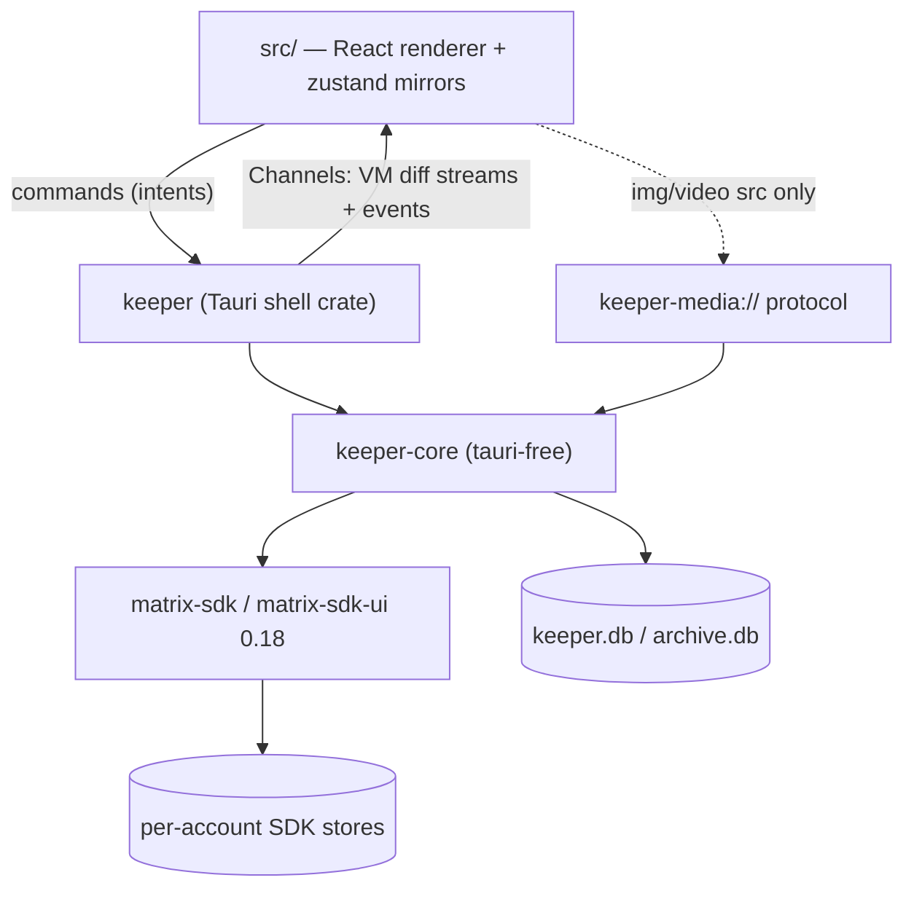
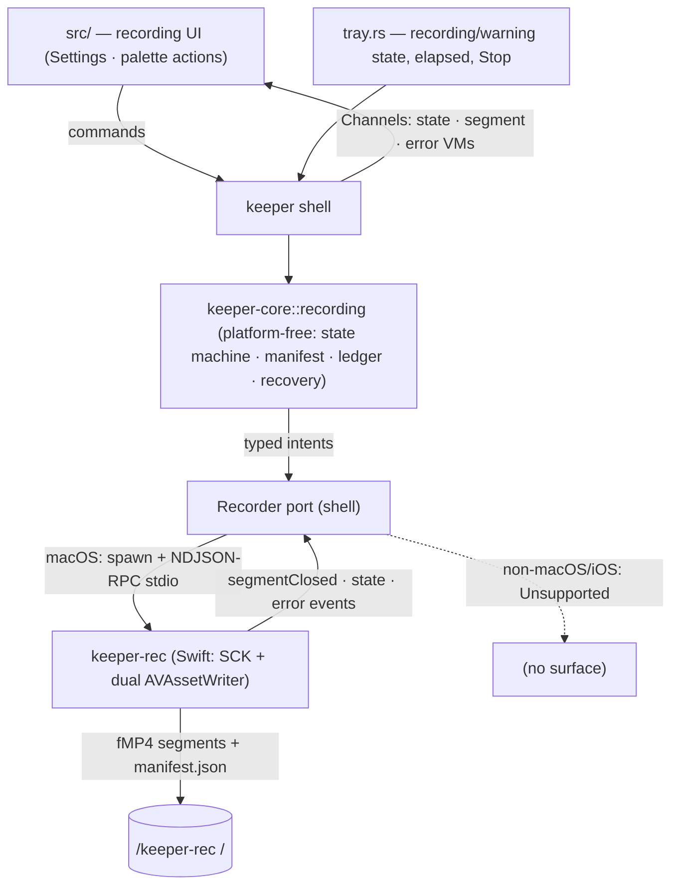
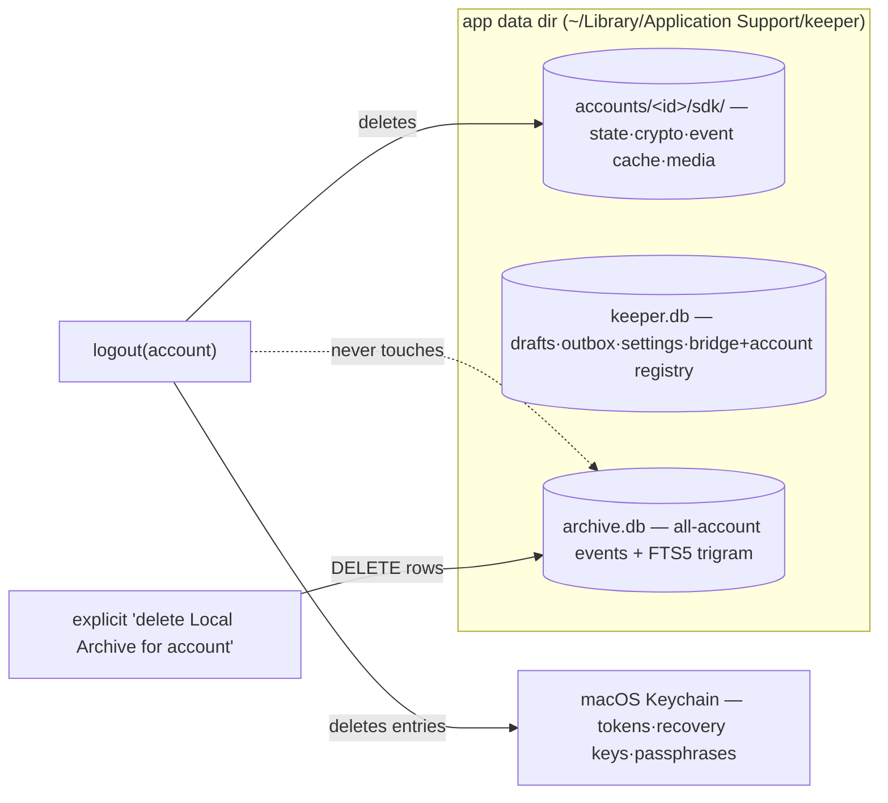

# Architecture Spine — keeper

## Design Paradigm

**Hexagonal (ports-and-adapters) Rust core with unidirectional view-model projection.** Element X's three-layer design with UniFFI deleted: the Tauri backend *is* the Rust process.

- `keeper-core` (crate) — the hexagon. Owns every Matrix client, all crypto, all persistence, all business rules. Talks to the world through ports: `matrix-sdk` (driven), SQLite (driven), `Platform` trait (dirs/keychain/notifier — driven), and a **view-model boundary** (driving) that emits serde DTO streams and accepts typed intents.
- `keeper` (crate) — the Tauri adapter. Binds core intents to `#[tauri::command]`s, core streams to `tauri::ipc::Channel<T>`, decrypted media to the `keeper-media://` protocol, plus plugin/tray/deep-link glue. No business logic.
- `src/` (React 19) — a pure renderer. Zustand stores mirror core streams; every mutation is a command round-trip; the UI never derives truth.

Data flows one way: `matrix-sdk streams → core projection → IPC channel → zustand mirror → React`; intents flow back: `UI → command → core → SDK`.

## Invariants & Rules



Allowed dependency direction is exactly the arrows above. `keeper-core` never imports `tauri`; `src/` never imports a Matrix library.

### AD-1 — Rust-core confinement [ADOPTED]
- **Binds:** all (NFR-9)
- **Prevents:** two sources of truth; crypto/tokens/plaintext reachable from JS
- **Rule:** All Matrix state, E2EE, protocol logic, and persistence live in `keeper-core`. The webview receives only view models for visible ranges. No Matrix JS library, no message DB, no token ever enters TypeScript.

### AD-2 — Simplified Sliding Sync only [ADOPTED]
- **Binds:** FR-5, FR-8, accounts/sync
- **Prevents:** building against the dead MSC3575 path; silent degraded sync
- **Rule:** `SyncService`/`RoomListService` over MSC4186 is the only sync mechanism. An SSS capability probe gates account creation; failure produces a named, actionable error before any account state is created.

### AD-3 — One SDK `Client` per Account [ADOPTED]
- **Binds:** FR-4, accounts, storage
- **Prevents:** account-count limits; cross-account store corruption
- **Rule:** Each Account = one `matrix_sdk::Client` with its own store directory `accounts/<account_id>/sdk/`. No code path may assume a maximum account count. Cross-account features consume per-account streams; they never share stores.

### AD-4 — IPC = commands + Channels + events; media via protocol [ADOPTED]
- **Binds:** all IPC surfaces (FR-13, NFR-4, NFR-9)
- **Prevents:** base64 media over IPC; polling; unbounded payloads
- **Rule:** One-shot intents are Tauri commands. Ordered high-frequency updates are `Channel<T>` subscriptions streaming `VectorDiff`-style batches. Low-frequency broadcasts are Tauri events. Decrypted media bytes travel exclusively over `keeper-media://` (Range-capable); never through IPC JSON.

### AD-5 — Client-only + Apache-2.0 licensing firewall [ADOPTED]
- **Binds:** all (NFR-11, NFR-13, §5 non-goals)
- **Prevents:** AGPL contamination; hidden egress; server creep
- **Rule:** No server-side components in this repo. Egress only to user-configured homeservers/bridges, api.beeper.com when a Beeper Account exists, and the signed-update endpoint — documented and diffable per release. cargo-deny (and the same policy for npm deps) blocks GPL/AGPL; AGPL projects are study-only; MPL files are never ported; ported code carries a provenance note in the PR.

### AD-6 — Workspace split: `keeper-core` / `keeper`
- **Binds:** repo layout, all Rust code
- **Prevents:** core becoming Tauri-bound, blocking mobile reuse and pure-Rust testing
- **Rule:** `src-tauri/` becomes a cargo workspace with `crates/keeper-core` (no `tauri` dependency anywhere in its tree; platform needs injected via the `Platform` port) and `crates/keeper` (the Tauri app). New Rust code defaults into `keeper-core`; only IPC/plugin/protocol glue may live in `keeper`.

### AD-7 — Shared types generated with ts-rs
- **Binds:** every IPC DTO, `src/lib/ipc/*`
- **Prevents:** hand-maintained TS types drifting from Rust serde shapes
- **Rule:** Every type crossing IPC lives in `keeper-core::vm`, derives `serde` + `ts_rs::TS` (`#[ts(export)]`), and is emitted to `src/lib/ipc/gen/` by the cargo test export step. CI fails if generated bindings differ from committed ones. Hand-written code in `src/lib/ipc/` is limited to thin typed `invoke`/`Channel` wrappers. (tauri-specta rejected while it remains release-candidate; ts-rs 12 is stable and runtime-free.)

### AD-8 — IPC contract conventions
- **Binds:** all commands, channels, events
- **Prevents:** per-feature ad-hoc envelopes; unrecoverable stream states
- **Rule:** Commands are `domain_verb` snake_case and fallible ones return `Result<T, IpcError>` where `IpcError = { code: stable enum, message: string, account_id?: string, retriable: bool }`. Subscriptions are commands accepting a `Channel<Batch>` and returning a subscription id; **every stream opens with a full snapshot/reset batch, then diffs**, so (re)subscribing at any time is safe. Events use `keeper://kebab-case` names and carry only ids + small payloads.

### AD-9 — Frontend state: zustand mirror stores
- **Binds:** all of `src/` state (FR-18–24, FR-40, NFR-4)
- **Prevents:** JS-side derived truth; state dying with components; React-render-coupled diff application
- **Rule:** Zustand 5 vanilla stores created outside React, one per stream domain (accounts, inbox, per-open-room timeline, bridges, send/outbox, drafts/approval, settings). Channel handlers apply diff batches imperatively; components subscribe via selectors. Stores hold only what Rust streamed plus ephemeral UI state (selection, open dialogs). TanStack Query and component-local reducers are not used for server-originated state.

### AD-10 — Storage layout & data lifecycle
- **Binds:** FR-6, FR-33, FR-37, NFR-8, accounts/archive/drafts/settings
- **Prevents:** archive dying with the SDK store; tokens on disk; per-account archive files hitting SQLite ATTACH limits
- **Rule:** Under the app data dir: `accounts/<account_id>/sdk/` (matrix-sdk-sqlite state+crypto+event cache+media cache — deleted on logout), `keeper.db` (drafts, outbox, settings, bridge registry, account registry), `archive.db` (Local Archive for **all** accounts keyed by `account_id`, plus FTS index). Logout deletes the SDK dir and that account's Keychain entries — nothing else. Archive deletion is a separate, explicit, per-account destructive action. Secrets (access/refresh tokens, recovery keys, store passphrases) live only in the macOS Keychain via `keyring` (service `dev.tgorka.keeper`). All SQLite in WAL mode.

### AD-11 — Archive ingestion & durability semantics
- **Binds:** FR-33, FR-35, FR-36, FR-37, NFR-5, NFR-8
- **Prevents:** archive diverging from timeline truth; remote rewrites destroying local history; writer races
- **Rule:** A per-account archiver task consumes post-decryption events and appends normalized rows (event id, account, room, sender, origin ts, type, content JSON, media metadata). Edits append a version chain; redactions/deletions **mark, never erase** (the "honor remote deletions" setting governs retention only — the timeline view always honors redaction). One serialized writer task owns `archive.db`. Export (lossless JSON, Markdown transcript) reads `archive.db` only, as a background job with progress.

### AD-12 — FTS: SQLite FTS5 with trigram tokenizer
- **Binds:** FR-34, NFR-2 (closes PRD OQ-6)
- **Prevents:** CJK-blind search; a second search engine dependency
- **Rule:** FTS5 external-content table over archive message text, `tokenize="trigram"` (case-insensitive), indexed incrementally at ingest. Queries under 3 chars fall back to trigram-accelerated `LIKE`. The 200 ms / 100k-event bar is a CI perf test.

### AD-13 — Undo-send: outbox ahead of SendQueue; single dispatch gate
- **Binds:** FR-9, FR-41, FR-46, FR-47, UJ-6
- **Prevents:** messages leaving the machine during the window; a second send path eroding the approval invariant
- **Rule:** Approval inserts into the `outbox` table with `dispatch_at = approval_time + window` (0–60 s, default 10). A scheduler moves elapsed rows into that account's `SendQueue`; cancel deletes the row and restores the Draft. After crash/offline, elapsed rows dispatch on startup/reconnect; unelapsed resume their countdown. Held messages are projected into the timeline VM as a distinct `held` state with countdown. **The only path into `SendQueue` is `send::submit(text|draft, trigger)` with `trigger ∈ {ComposerSend, ApprovalPaneApprove}`** — no other public API dispatches; post-dispatch delete = Matrix Redaction with best-effort disclosure.

### AD-14 — Incognito: `signals` module is the sole outbound-signal emitter
- **Binds:** FR-16, FR-19, FR-42–FR-45
- **Prevents:** a stray code path leaking a public receipt/typing event while Incognito is on
- **Rule:** All read receipts, typing notices, and presence emission go through `keeper-core::signals`, which resolves effective policy (Chat > Account > global) at emission time: receipts become `m.read.private`, typing is dropped, presence withheld where applicable. Manual release is an explicit `signals::release_receipt(room)` emitting a public `m.read`. No other module and no command may call SDK receipt/typing/presence APIs. Per-Network coupling caveats ship in the same data file as Risk Tiers.

### AD-15 — Drafts: local truth, mirrored, local-wins conflicts
- **Binds:** FR-38–FR-40
- **Prevents:** draft loss on crash; mirror becoming the source of truth; silent overwrite by another device
- **Rule:** The `drafts` table in `keeper.db` is the source of truth. Mirroring to per-Room account data (custom type `dev.keeper.draft`) is debounced and best-effort; `Room::save_composer_draft` is additionally written for Element-family interop. On conflict the local unsent text wins and the remote version is surfaced for one-tap adoption. The Approval Pane is a cross-account query over drafts + pending outbox rows.

### AD-16 — Bridge manager: two transports behind one trait; layered discovery; data-driven tiers
- **Binds:** FR-25–FR-32, FR-44, NFR-6
- **Prevents:** per-bridge bespoke flows; hardcoded bot ids; risk copy baked into UI
- **Rule:** `BridgeTransport` trait with exactly two impls: `Provisioning` (bridgev2 HTTP provisioning JSON state machine → native login states: waiting/QR/code/success/failure) and `BotDriver` (programmatic Bridge Bot command send/parse with timeouts; the raw bot chat is never hidden). Discovery merges three sources: (a) `GET /_matrix/client/v3/thirdparty/protocols`, (b) a data-driven known-bot MXID probe registry, (c) scan of existing bot DMs/portal rooms. Health is a per-session state machine (healthy/degraded/disconnected) fed by bridgev2 state events with bot-ping fallback, surfaced ≤ 60 s via the notification pipeline. bbctl is an optional Tauri sidecar (Apache-2.0 Go binary, per-arch, launch-on-demand `exec` + parsed output). Network Risk Tiers + coupling caveats are one versioned JSON data file in the repo.

### AD-17 — Auth: provider trait; Beeper isolated
- **Binds:** FR-1–FR-3, FR-5, FR-7, §8 containment
- **Prevents:** Beeper private-API breakage bleeding into core Matrix login
- **Rule:** `AuthProvider` trait with three impls: `password`, `oidc` (SDK OAuth + system browser + `keeper://oauth/callback` deep link), `beeper` (bbctl-ported flow: `/user/login` → `/user/login/email` → `/user/login/response` → JWT → `org.matrix.login.jwt`). All api.beeper.com HTTP lives in the beeper module only, with typed failure states rendered as "Beeper login unavailable"; its failure must be unobservable from non-Beeper accounts.

### AD-18 — Notifications: local rules engine, no push infra
- **Binds:** FR-28, FR-51–FR-54, NFR-7, NFR-11
- **Prevents:** third-party push routing; mute logic duplicated in JS
- **Rule:** `keeper-core::notify` consumes post-decryption events, applies mute/mention-only/DND rules (persisted in settings; mapped to Matrix push rules where representable, evaluated locally otherwise), and posts via tauri-plugin-notification with a preview toggle. Click payload is `(account_id, room_id, event_id)` deep-linked to the exact Chat. Bridge health alerts ride this pipeline. Quitting the app stops sync — stated in UI, never faked.

### AD-19 — Concurrency: per-account supervision, no global mutable state
- **Binds:** all core tasks (FR-4, NFR-8)
- **Prevents:** cross-account lock contention; ad-hoc singletons; orphan tasks after logout
- **Rule:** `AccountManager` owns a registry of `AccountHandle`s, each supervising that account's tasks (Client + SyncService, archiver, signals, send scheduler) on tokio. Cross-account aggregators (inbox merge, palette index, approval pane, notify) consume per-account streams. UI-facing state is exposed via watch/broadcast channels consumed by the shell. The only globally reachable handle is the Tauri-managed `AppState`; all other shared state is owned by a module and reached via its API.

### AD-20 — Inbox & palette projected in Rust, windowed to the UI
- **Binds:** FR-18–FR-24, FR-48–FR-49, NFR-1, NFR-4
- **Prevents:** shipping 10k chat rows to JS; sort/filter logic forked between Rust and TS
- **Rule:** The Unified Inbox is computed in `keeper-core::inbox`: merge N `RoomListService` streams, order by recency, hoist Pins, section Favorites, apply Archive state and Space filter. The UI receives a **windowed** VM stream (visible range + buffer, with totals). Command Palette / Quick-Switcher queries hit a Rust in-memory chat/action index via command (≤ 100 ms at 10k Chats). Ordering/filtering is never re-derived in TS.

### AD-21 — Errors & observability
- **Binds:** all (NFR-5, NFR-11)
- **Prevents:** stringly errors at the boundary; plaintext/tokens in logs; silent failure states
- **Rule:** Per-module `thiserror` enums roll up to `CoreError`, mapped exactly once (in `keeper::commands`) to the `IpcError` envelope. `tracing` everywhere (no `println!`), with per-account spans; message plaintext, tokens, and recovery keys never appear in logs. `tracing-subscriber` EnvFilter + rolling file logs locally; zero telemetry; any crash reporting is explicit opt-in. Every failure that changes user-visible state must map to a rendered state (queued/failed/unhealthy) — no log-only failures.

### AD-22 — At-rest encryption posture
- **Binds:** NFR-10, storage
- **Prevents:** pretending FTS-over-ciphertext works; SQLCipher/libsqlite3-sys linkage conflict with matrix-sdk-sqlite
- **Rule:** SDK stores use matrix-sdk-sqlite's native passphrase (first-run choice; key in Keychain). `archive.db`/`keeper.db` ship **without** passphrase encryption in MVP (FileVault posture, stated honestly in settings copy). Archive-at-rest encryption is a v1.x spike (SQLCipher as the single linked SQLite, or page-level crypto). **Requires PRD amendment** — see Capability Map notes.

### AD-23 — Packaging & release pipeline
- **Binds:** NFR-12, distribution
- **Prevents:** unsigned artifacts; unreproducible releases; silent egress growth
- **Rule:** GitHub Actions on macOS arm64 with tauri-action: Developer ID signing + hardened runtime + notarization (App Store Connect API key in secrets); updater artifacts signed with the Tauri updater key; aarch64 first, universal later. Release job emits dmg + updater bundle + an egress diff note. cargo-deny and all quality gates are required PR checks.

### AD-24 — Future-platform strategy: the core is the product
- **Binds:** keeper-core boundaries, post-MVP roadmap
- **Prevents:** desktop assumptions (paths, AppKit, tray, global shortcut) hard-wired into core
- **Rule:** `keeper-core` accesses platform capabilities only through the `Platform` port (data dirs, keychain, notifier sink, sidecar exec). Plan A for iOS/Android is Tauri mobile reusing keeper-core and the same IPC contract — validated by a walking-skeleton iOS build **before** major UI investment (known caveats: global-shortcut/updater/tray are desktop-only plugins; iOS needs NSE + push decisions out of MVP scope). Plan B fallback is UniFFI bindings over keeper-core with native shells. The `vm` DTO layer is the stable seam either way.

### AD-25 — Settings live in Rust; no JS-writable store
- **Binds:** settings, plugin set
- **Prevents:** a second, JS-owned configuration source of truth
- **Rule:** All settings live in `keeper.db` behind `keeper-core::settings`, exposed via commands + a settings stream. tauri-plugin-store and tauri-plugin-sql are not used. Plugin set: notification, deep-link, global-shortcut, updater, autostart, window-state, clipboard-manager, opener (single-instance deferred to Windows/Linux). Desktop-only members of this set are compile-gated out of mobile targets per AD-26.

### iOS Phase (2026-07-09) — AD-26 … AD-32

*Extends the frozen AD-1..25 for PRD §13 (FR-55–FR-65, NFR-15–NFR-18). AD-24 Plan A is hereby confirmed: Tauri mobile reusing `keeper-core` and the same IPC contract; Plan B (UniFFI + native shell) stays shelved with recorded revisit triggers (blank-webview bug class proves unfixable across Tauri releases; NSE work begins). Distribution this phase is free Personal Team signing — no APNs/App Groups/TestFlight entitlements exist.*

### AD-26 — One shell crate, cfg-gated platform seams
- **Binds:** FR-55, FR-56, repo layout, all shell code
- **Prevents:** a forked iOS shell crate drifting from desktop; desktop plugin symbols in the iOS binary; keeper-core sprouting platform ifdefs
- **Rule:** The iOS target is the **same** `crates/keeper` shell crate, built as a staticlib via `tauri ios` (`tauri::mobile_entry_point`); no `keeper-ios` crate ever. Desktop-only surface — `tray` module + `tray-icon` feature, global-shortcut, autostart, updater, window-state, desktop deep-link registration — sits behind `#[cfg(desktop)]` / `#[cfg(target_os)]` gates with target-gated Cargo dependencies; the iOS shell registers notification + deep-link (mobile scheme) + IPC + media protocol only. On iOS, clipboard needs are served by the web Clipboard API in the webview (clipboard-manager is desktop-tier) and "open in browser" by a minimal native open call replacing the opener plugin. `keeper-core` stays platform-free: platform variance enters only through the `Platform` port (AD-24), never as `cfg(target_os)` in core business logic.

### AD-27 — Platform capability flags: one Capabilities VM
- **Binds:** FR-57, FR-29/FR-50/FR-53 surfaces on iOS, IPC handshake
- **Prevents:** UI and shell disagreeing about what exists per platform; per-feature ad-hoc platform sniffing in TS; dead buttons/error-on-tap
- **Rule:** A single `CapabilitiesVm` in `keeper-core::vm` (serde + ts-rs like every DTO), served over the IPC handshake at startup and data-driven per platform (later targets reuse the mechanism). It governs: bbctl sidecar (absent on iOS — the OS forbids child processes; `Platform::sidecar_path` returns a clean Unsupported `IpcError`), global hotkeys, updater controls, tray/menu-bar + launch-at-login. A surface whose capability is off does not render at all. **Bridge management itself stays fully functional on iOS** — discovery, native provisioning login, Bridge Bot fallback, health + re-login, risk tiers, start-new-Chat. The frontend never consults `navigator.userAgent`/build flags for feature gating.

### AD-28 — Media on iOS: same protocol, capped buffers
- **Binds:** FR-64, NFR-9, NFR-16
- **Prevents:** an iOS-specific media transport fork; AD-4's "no media over IPC" eroding on mobile; unbounded RAM in a jetsam-limited process
- **Rule:** `keeper-media://` runs unchanged on iOS — wry maps the custom protocol to WKURLSchemeHandler with the scheme staying native, so URL format is identical to macOS and the frontend needs no media-URL helper (introduce a `convertMediaSrc`-style remap only when Android actually starts). Range slicing (200/206/416) stays in-memory from the SDK cache but the slicing buffer is **capped** (NFR-16); WebKit scheme-task invalidation is tolerated by the existing fire-and-forget responder. Disk-backed streaming of large media is deferred work, not a phase requirement.

### AD-29 — iOS secrets & store protection behind the existing ports
- **Binds:** FR-63, FR-65, NFR-9/NFR-10 on iOS
- **Prevents:** a keychain implementation leaking past the `Platform` port; Matrix device identity cloned via iCloud Keychain; a file-protection class that breaks the resumed sync loop; multi-GB re-syncable state bloating backups
- **Rule:** Sessions and secrets go through the **existing** keyring/apple-native `Platform` port targeting the iOS keychain — spiked in the walking skeleton; the contained fallback is direct security-framework generic-password calls behind the **same** port (call sites unchanged). Accessibility is `kSecAttrAccessibleAfterFirstUnlockThisDeviceOnly` — readable by a resumed sync loop, never synced off-device. SQLite/DB directories carry `NSFileProtectionCompleteUntilFirstUserAuthentication` (never `Complete` — WAL access after lock) and `isExcludedFromBackup`. All account state remains under the one `Platform::data_dir()` root so a future App Group container move (NSE era) is a path change, not a migration.

### AD-30 — Mobile lifecycle: foreground-only sync, honestly disclosed
- **Binds:** FR-61, FR-62, NFR-17, NFR-18
- **Prevents:** fake "push while closed" promises; long-polls killed mid-flight; two lifecycle sources fighting over `SyncService`; blank webview after resume shipping unguarded
- **Rule:** On background the shell gracefully pauses `SyncService` (matrix-sdk-ui stop/offline mode); on foreground it resumes with an immediate sync, rendering the cached mirror instantly (AD-8 snapshot-then-diff) with a subtle "connecting" state and a stale-resume sync-loop restart guard (matrix-rust-sdk#3935). Detection enters Rust through one lifecycle command: webview `visibilitychange` first (zero-native stopgap), a micro Swift plugin on `UIApplication` notifications as the correctness upgrade — same Rust entry point either way. **No background sync or push without APNs**, which is the paid-program decision gate — disclosed plainly in UI and docs (FR-53 honesty extended). A reload guard for the blank-webview-on-resume bug (tauri#14371) is mandatory from the walking skeleton onward. Notifications on iOS are foreground-local + badge-on-sync only, reusing the AD-18 rules engine; the badge value is the Unified Inbox unread aggregate already computed by `inbox` (AD-20) — never a second count.

### AD-31 — Phone layout tier: a projection of selection state, not a fork
- **Binds:** FR-58, FR-59, FR-60, `src/` shell
- **Prevents:** forked chat components; a router creeping in as a second navigation truth; per-component safe-area/keyboard hacks
- **Rule:** A third `phone` tier (< 768 px) is added to the existing `useShellLayout`; desktop/tablet tiers are unchanged at ≥ 768 px. Phone renders a stack-navigation container — Inbox → Room → Detail — **reusing** the existing InboxList/ChatView/DetailPanel component trees, driven by the existing zustand selection state; the stack is a projection of that state and **no routing library** is added this phase (`history.pushState` integration is an optional enhancer for the system back gesture). Safe areas: `viewport-fit=cover` + `contentInsetAdjustmentBehavior = .never` + `env(safe-area-inset-*)` exposed as Tailwind theme CSS vars — app CSS owns all insets. Keyboard: a `visualViewport`-driven `--kb-inset` CSS var lifts the composer (evaluate `interactive-widget=resizes-content` as the simpler path); pinned-at-bottom timeline behavior is preserved. Touch idioms map onto existing actions (long-press → context menus, row swipes → archive/mute, pull-to-refresh → kick sync).

### AD-32 — iOS build seed & CI gate
- **Binds:** FR-55, distribution/toolchain, CI
- **Prevents:** hand edits lost to `.xcodeproj` regeneration; desktop PRs silently breaking the iOS port; signing/team identifiers leaking into the repo
- **Rule:** `tauri ios init` generates `gen/apple` under `crates/keeper` (relative to the crate holding `tauri.conf.json`); `gen/apple` is committed with `build/` gitignored, and persistent edits live **only** in `project.yml` (XcodeGen source of truth — the `.xcodeproj` is regenerated), `Info.plist` (`CFBundleURLTypes` for `keeper://`), and the `*_iOS/` sources (safe-area Swift patch). Minimum iOS 16.0 is set explicitly. Signing: automatic Personal Team via `bundle.iOS.developmentTeam` or the `TAURI_APPLE_DEVELOPMENT_TEAM` env var (team ID stays out of git); the bundle ID is stable and shared with macOS. CI adds `cargo check --target aarch64-apple-ios` as a **required PR gate** on the existing macOS runner — compile-only, no signing, no simulator build this phase.

### Screen Recording Phase (2026-07-16) — AD-33 … AD-39

*Extends the frozen AD-1..32 for PRD §14 (FR-66–FR-76, NFR-19–NFR-22) + addendum §8, on the authoritative `research-recording-2026-07-16.md` (recommendations and risk register adopted, not relitigated). macOS-desktop-only; gated at macOS 13.0 via `CapabilitiesVm` (AD-27); iOS never records. The route is **locked** by the research: a first-party Swift sidecar `keeper-rec` (ScreenCaptureKit + AVAssetWriter) over NDJSON-RPC stdio — in-process Rust bindings (no maintained safe AVAssetWriter binding; unsafe surface vs. the audited-unsafe policy) and an ffmpeg/avfoundation sidecar (no per-app capture, no driverless system audio, GPL vs. the cargo-deny firewall) were evaluated and rejected. No PRD amendment is required.*



### AD-33 — Recording split: platform-free `recording` core + `Recorder` shell port
- **Binds:** FR-66, FR-71, FR-73, FR-75, NFR-19
- **Prevents:** Apple/process code leaking into `keeper-core`; a second recording truth in TS; a capture crash reaching the messaging core
- **Rule:** `keeper-core::recording` owns the session state machine (`idle → preflight → recording → rotating → stopping → finalized | recovered | failed`), the manifest schema, the segment ledger, folder validation, and the recovery reconciliation — with **no `tauri` and no Apple API** (platform-free like all of `keeper-core`, AD-6/AD-24). The actual sidecar spawn and stdio framing live in the `keeper` shell behind a `Recorder` **Platform-style port** (a trait beside `Platform`, AD-24): the macOS impl spawns `keeper-rec` via `Platform::sidecar_path`; every non-macOS impl (and iOS) returns `CoreError::Unsupported` (mirroring `sidecar_path` honesty, AD-27). The port parses sidecar events and feeds them into the core state machine; core never holds a process handle.

### AD-34 — `keeper-rec` Swift sidecar & NDJSON-RPC stdio contract
- **Binds:** FR-68–FR-72, addendum §8; sidecar transport
- **Prevents:** ad-hoc per-message envelopes; host/sidecar protocol drift; blocking on binding-crate feature lag
- **Rule:** `keeper-rec` is a SwiftPM binary (ScreenCaptureKit + AVAssetWriter) spawned launch-on-demand via `Platform::sidecar_path` + Tauri `externalBin` — the **bbctl precedent** (AD-16, Story 6.7). The wire format is **one JSON object per line on stdio**. Commands (host→rec, id-correlated): `getCapabilities` (macOS version, feature flags, per-TCC permission states — carries the **protocol-version handshake**), `listSources` (displays, apps, mics, cameras), `start{filter, audio, mic, camera, dir, segmentMB, fps}`, `stop` (returns the final manifest). Events (rec→host, unsolicited): `state{recording, elapsedSec, segmentIndex, bytes, warning}`, `segmentClosed{path, bytes, track}`, `error{code, message, fatal}`. The **contract shape** is the invariant; exact field lists are code-owned (VM side via AD-7). First-party Swift gets every SCK feature without waiting on binding crates.

### AD-35 — Recording capability gating: `CapabilitiesVm.recording`
- **Binds:** FR-66, FR-57 surface; IPC handshake
- **Prevents:** dead recording buttons on unsupported platforms; per-feature platform sniffing in TS
- **Rule:** `CapabilitiesVm` (AD-27) gains a `recording` flag (serde + ts-rs like every DTO, AD-7), **true only on desktop macOS ≥ 13.0** (the system-audio floor); the app-wide `minimumSystemVersion` stays 11.0 and **iOS never** (no child processes, AD-27). The internal macOS 15+ branch (in-stream microphone) lives entirely inside `keeper-rec`, invisible to the flag. Every recording surface — Settings section, tray affordances, Command Palette actions — renders only when the flag is on (AD-27 "no dead buttons"). The frontend never consults `navigator.userAgent`/build flags.

### AD-36 — Recording permissions/TCC: three classes, pre-flight through the `Recorder` port
- **Binds:** FR-67, FR-69, FR-70
- **Prevents:** silent permission failures; hidden OS quirks; wrong TCC attribution
- **Rule:** A permission pre-flight runs through the `Recorder` port → `keeper-rec` `getCapabilities` (a `SCShareableContent` + `CGPreflightScreenCaptureAccess` probe), surfaced as a `RecordingPermissionVm` (`keeper-core::vm`, ts-rs) that tracks the three TCC classes **distinctly**: **Screen Recording** (`kTCCServiceScreenCapture`; detect `CGPreflightScreenCaptureAccess`, request `CGRequestScreenCaptureAccess` — one real prompt per app lifetime; Settings deep link `x-apple.systempreferences:…Privacy_ScreenCapture`), **Microphone** (`NSMicrophoneUsageDescription`), **Camera** (`NSCameraUsageDescription`). Mic/Camera classes are probed only when those sources are enabled; the camera is untouched when webcam is off (FR-70). Usage strings live in keeper's bundle `Info.plist` (Tauri `bundle.macOS.infoPlist` merge). TCC attributes the spawned child to keeper (responsible process) — the sidecar is **spawned, never a LaunchAgent**. macOS quirks are disclosed honestly (FR-67): relaunch-after-grant, and the macOS 15+ monthly re-auth nag for non-picker SCK. Revocation mid-recording is a loud failure (AD-39), with written segments intact.

### AD-37 — Recording format, segmentation ownership & recovery
- **Binds:** FR-71, FR-72, FR-73, NFR-22
- **Prevents:** `keeper-core` reimplementing capture; moov-at-end total-loss on crash; a manifest inconsistent with on-disk segments
- **Rule:** Container is **fragmented MP4** (`outputFileTypeProfile = .mpeg4CMAFCompliant`, ~4 s fragments), **H.264 video + up to two _unmixed_ AAC tracks** (system audio + microphone, 48 kHz), 30 fps default at source resolution (60 selectable); a clean finalize defragments to an ordinary `.mp4` playable everywhere. The **dual-AVAssetWriter gapless size-based rotation lives entirely in `keeper-rec`** (start writer B at the next keyframe PTS, dual-route until B's first keyframe lands, finalize A async; size trigger = bytes-budget deadline corrected against observable on-disk growth; duration-cap fallback). `keeper-core` owns **only** the segment ledger + manifest: `<folder>/keeper-rec <local ts>/` holding `manifest.json` (atomic-rename on every `segmentClosed`/status change; states `recording → finalized | recovered`), `screen-####.mp4`, and — webcam on — `camera-####.mp4` (a separate synchronized file from a second in-sidecar writer, host-clock anchored, rotated at the same boundaries; **no PiP burn-in this phase**). A **startup recovery pass** (and one before each new recording) reconciles orphaned segments: stale `recording` manifests are marked `recovered` with a one-line notice; the orphaned tail fMP4 plays as-is, no remux in MVP.

### AD-38 — `keeper-rec` source layout, build, codesign & CI
- **Binds:** FR-66 build/toolchain, NFR-11/NFR-13 licensing, distribution, CI
- **Prevents:** Cargo/SwiftPM tooling collision; ad-hoc TCC rejection surprising contributors; unsigned-`externalBin` notarization failures; licensing-firewall regressions
- **Rule:** `keeper-rec` source lives in a **top-level SwiftPM package `tools/keeper-rec/`** (`Package.swift` + `Sources/keeper-rec/`), deliberately **outside `src-tauri/crates/`** so the Cargo workspace and SwiftPM tooling don't collide. It is first-party **Apache-2.0** and links only Apple system frameworks (ScreenCaptureKit/AVFoundation), so **cargo-deny (AD-5) is untouched** (Swift is not in the tree it scans) and there is **no ffmpeg**. `externalBin` is declared in `tauri.conf.json` `bundle.externalBin` as `binaries/keeper-rec`; Tauri appends the per-arch triple, so the bundled and runtime name is `keeper-rec-aarch64-apple-darwin` (matching `DesktopPlatform::sidecar_path`'s `<name>-<triple>` resolution). CI on the existing macOS signing runner: `swift build -c release --arch arm64` → **explicit codesign** of `keeper-rec` (hardened runtime + keeper's entitlements) **before `tauri build`** (the `externalBin` notarization rough edge, tauri#11992); aarch64-only, no lipo. This adds a **Swift-toolchain build dependency** to CI (Xcode is already present for signing/notarization). Dev-signing requirement, documented and **not a product blocker**: local builds exercising recording need an **Apple Development certificate** — macOS 15+ silently rejects SCK for ad-hoc binaries (Cap #1722); the iOS phase already established free-team signing.

### AD-39 — Tray recording state & honest quit (extends Story 10.3 / AD-18)
- **Binds:** FR-74, FR-75, NFR-5 (recording)
- **Prevents:** an invisible recording indicator; an orphaned recorder on quit; silent recording-loss
- **Rule:** The opt-in tray (`crates/keeper/src/tray.rs`, single mutex-guarded `TrayIcon` slot) gains recording states `idle → recording → warning/error` via `TrayIcon::set_icon` (keeper ships record-dot + warning-badge assets); a ~1 Hz tick updates a disabled menu line (`"Recording — 12:34 · segment 3, 412 MB"`) and the menu adds **Stop Recording** + **Open Recordings Folder**. Recording **temporarily forces tray presence** even when the FR-53 opt-in toggle is off, restoring the exact prior tray state at stop (a recording indicator that isn't visible is a bug). Quit-while-recording = warn → `stop` RPC → flush → kill-timeout guard (extends FR-53 quit honesty; never orphans `keeper-rec`). Every recording fault (recorder crash/exit, writer stall, permission revocation, device loss, disk-guard) is **loud**: tray error state + a native notification through the **AD-18 pipeline** within 5 s, offering one-click restart; NFR-5's no-silent-loss extends so every session reaches `finalized | recovered | failed`. The macOS purple capture pill is system-owned and untouched.

*Reliability envelope (PRD §14.3 — authored bars, owner-sign-off at phase release, not architecture-blocking, mirroring the AD-22/NFR-3 posture): NFR-19 4 h soak with bounded sample-buffer queues (**drop-oldest video, audio never dropped**; sustained drop → warning); NFR-20 disk guard (warn < 10 GB / stop-and-finalize < 2 GB on the target volume); NFR-21 (< 100% of one core + < 400 MB combined RSS, messaging NFR-1..4 still hold while recording); NFR-22 (keyframe-cut host-clock PTS, concat monotonic and screen↔camera aligned within one frame — an automated concatenate-and-assert test gates release). Ownership split: buffer-bounding, drop policy, and rotation correctness live in `keeper-rec`; the disk-guard **policy** (pre-start free-space validation, warn threshold, hard-floor stop-and-finalize decision) lives in `keeper-core::recording` (AD-33), driven by free-space reported on the sidecar's `state` events. The CI perf/concat harness is the gate (extends AD-21 measurement hooks).*

## Consistency Conventions

| Concern | Convention |
| --- | --- |
| Identity | `account_id` = keeper-generated opaque ULID (1:1 with mxid+device), used in paths, DB rows, VMs, Keychain entries; Matrix ids (`room_id`, `event_id`) pass through verbatim as opaque strings |
| Commands / events / streams | Commands `domain_verb` snake_case; events `keeper://kebab-case`; one channel per subscription; snapshot-then-diff always (AD-8) |
| DTOs | Live in `keeper-core::vm`, suffix `Vm` for view models, `Req`/`IpcError` for envelopes; serde `camelCase` rename-all; ts-rs exported (AD-7) |
| Dates & numbers | Timestamps = ms since Unix epoch UTC as integers; durations in ms; no ISO strings inside VMs |
| Rust style | Modules per domain noun; `thiserror` per module; `tracing` only; no `unwrap`/bare `expect` in production paths; `unsafe` denied; tests colocated `#[cfg(test)]` + `src-tauri/tests/`; runner cargo-nextest |
| TS style | Biome-enforced (no `any`, `import type`, 2-space/100-col/double quotes); path alias `@/*`; zustand stores in `src/stores/` named `use<Domain>Store`; hooks kebab-case in `src/hooks/`; `src/components/ui/` is shadcn-generated only |
| Data files | Network Risk Tiers + coupling caveats + known-bot registry = versioned JSON under `src-tauri/crates/keeper-core/data/` |
| Secrets & logs | Secrets only in the platform keychain (macOS Keychain / iOS keychain, both behind the `Platform` port); `op://` for dev creds; logs carry ids, never content or tokens |
| Platform gating | Compile-time: `#[cfg(desktop)]`/target-gated deps in the shell only, never in `keeper-core` (AD-26); runtime UI gating only via `CapabilitiesVm` (AD-27) — no platform sniffing in TS |
| Sidecars | First-party helper binaries spawned launch-on-demand via `Platform::sidecar_path` (`<name>-<triple>` next to the exe, e.g. `keeper-rec-aarch64-apple-darwin`); absent → clean `Unsupported`; drivers behind a Platform-style port (bbctl AD-16, `keeper-rec` AD-33/AD-34). NDJSON (one JSON object per line) on stdio with a `getCapabilities` version handshake |
| Language & tooling | English everywhere; bun only (never npm/pnpm/yarn); quality gates `bun run check`, `check:rust`, `test:rust` before done |

## Stack

| Name | Version |
| --- | --- |
| Tauri (+ plugins-workspace v2) | 2.11.x |
| matrix-sdk / matrix-sdk-ui / matrix-sdk-sqlite | 0.18.0 (pin exact; upgrade every release) |
| tokio / tracing / thiserror / serde | 1.x / 0.1 / 2 / 1 |
| ts-rs | 12.x |
| rusqlite (keeper.db/archive.db; version-aligned with matrix-sdk-sqlite) | workspace-aligned |
| keyring (+ apple-native-keyring-store) | current stable (keyring-core line) |
| React / TypeScript / Vite | 19.1 / ~5.8 / 7 |
| Tailwind CSS / shadcn-ui (radix, cva, lucide) | 4.x / current |
| zustand | 5.0.x |
| bun / Biome / Vitest / cargo-nextest / cargo-deny / lefthook | repo-pinned (bun.lock / Cargo.lock) |
| CI | GitHub Actions macOS arm64 + tauri-action (+ `cargo check --target aarch64-apple-ios` PR gate) |
| iOS toolchain (dev-machine) | Xcode 16.x (iOS 18 SDK) + CocoaPods + rust targets `aarch64-apple-ios{,-sim}`; min deployment target iOS 16.0 |
| `keeper-rec` (recording sidecar) | first-party Swift, SwiftPM package `tools/keeper-rec/`; ScreenCaptureKit + AVFoundation/AVAssetWriter (system frameworks only); Apache-2.0; no ffmpeg; codesigned aarch64 externalBin (AD-38) |
| Swift toolchain (CI + recording dev) | Xcode Swift (on the existing macOS signing runner); recording capability floor macOS 13.0 (`CapabilitiesVm`), internal 15+ mic branch; local recording dev needs an Apple Development cert (AD-38) |

## Structural Seed

```text
src-tauri/
  Cargo.toml                 # workspace members: crates/keeper-core, crates/keeper
  crates/
    keeper-core/             # tauri-free hexagon
      data/                  # risk-tiers.json, known-bots.json, coupling-caveats
      src/
        accounts/            # AccountManager, AccountHandle, SSS gate, lifecycle
        auth/                # AuthProvider: password.rs, oidc.rs, beeper.rs
        sync/                # SyncService orchestration, offline/resume
        inbox/               # RoomList merge, pins/favorites/spaces/archive, windowing
        timeline/            # Timeline projection -> TimelineItemVm diffs
        send/                # submit gate, outbox scheduler (undo-send), send states
        drafts/              # drafts store, account-data mirror, approval queries
        archive/             # ingest, version chains, fts.rs, export/{json,md}.rs
        bridges/             # discovery.rs, transport/{provisioning,bot}.rs, health.rs, bbctl.rs
        signals/             # incognito policy + sole receipt/typing/presence emitter
        recording/           # macOS Screen Recording (AD-33): session state machine, manifest, segment ledger, folder validation, recovery — platform-free (Recorder port injected)
        notify/              # notification rules engine
        keychain/            # keyring wrapper behind Platform port
        settings/            # typed settings over keeper.db
        vm/                  # all IPC DTOs (serde + ts-rs)
        platform.rs          # Platform port trait
        error.rs             # CoreError
    keeper/                  # Tauri shell (today's keeper_lib migrates here)
      tauri.conf.json        # + bundle.iOS.developmentTeam (or TAURI_APPLE_DEVELOPMENT_TEAM env); mobile deep-link scheme; bundle.externalBin ["binaries/keeper-rec"] + bundle.macOS.infoPlist NSMicrophoneUsageDescription/NSCameraUsageDescription (AD-36/AD-38)
      gen/apple/             # generated by `tauri ios init`; committed minus build/ (AD-32)
                             #   project.yml (deployment target, background color), Info.plist (keeper:// CFBundleURLTypes), *_iOS/ safe-area patch
      src/
        commands/            # #[tauri::command] per domain; CoreError -> IpcError
        channels/            # core streams -> Channel<T> subscriptions
        media_protocol.rs    # keeper-media:// (Range) from SDK media cache — WKURLSchemeHandler on iOS
        platform/            # Platform impls: desktop + iOS (data_dir, keychain class, sidecar Unsupported)
        lifecycle.rs         # foreground/background command -> SyncService pause/resume (AD-30)
        recorder.rs          # Recorder port impl (AD-33): macOS spawns keeper-rec + NDJSON-RPC stdio; non-macOS = Unsupported; #[cfg(desktop)]
        tray.rs  deep_link.rs  plugins.rs   # desktop-only members behind #[cfg(desktop)] (AD-26); tray.rs gains recording/warning state (AD-39)
tools/
  keeper-rec/                # first-party Swift capture sidecar (AD-34/AD-38) — SwiftPM, OUTSIDE the cargo workspace
    Package.swift            # Apple system frameworks only (SCK + AVFoundation); Apache-2.0; no ffmpeg
    Sources/keeper-rec/      # SCK stream setup, dual-AVAssetWriter fMP4 rotation, mic/webcam, NDJSON-RPC stdio loop
src/
  index.html                 # viewport-fit=cover (+ interactive-widget evaluation) (AD-31)
  lib/ipc/gen/               # ts-rs output (generated; CI-diffed, never hand-edited) — includes CapabilitiesVm
  lib/ipc/                   # typed invoke/channel wrappers
  stores/                    # zustand mirrors: accounts, inbox, timeline, bridges, send, drafts, settings (+ capabilities, recording)
  hooks/use-shell-layout.ts  # desktop / tablet / phone (<768px) tiers (AD-31)
  features/                  # wizard, inbox, chat, bridges, approval, palette, settings UI (+ phone stack container, recording settings/picker — gated on CapabilitiesVm.recording, AD-35)
  components/ui/             # shadcn-generated
docs/ios.md                  # 7-day re-arm ritual, sideload/re-sign flows, platform limitations
```



Deployment envelope: a single signed/notarized macOS app bundle (+ optional bbctl sidecar binary + the codesigned `keeper-rec` recording sidecar as an `externalBin`, AD-38), plus an iOS app signed with a free Personal Team (7-day profiles re-armed from the owner's Mac; test IPAs re-signed per-tester via Sideloadly/zsign; AltServer auto-refresh optional) — no App Store/TestFlight this phase. External topology is entirely user-owned (homeserver, bridges, Beeper cloud); no push infrastructure exists or is promised. CI (GitHub Actions) is the only project-side infrastructure.

## Capability → Architecture Map

| Capability | Lives in | Governed by |
| --- | --- | --- |
| FR-1–7 accounts & auth (incl. Beeper disclosure) | `auth`, `accounts` | AD-2, AD-3, AD-17, AD-10 |
| FR-8–17 messaging, E2EE, media, pagination | `sync`, `timeline`, `send` + SDK; media protocol in shell | AD-1, AD-4, AD-13, AD-19 |
| FR-18–24 Unified Inbox, archive view, favorites/pins, spaces, attribution | `inbox` | AD-20, AD-8, AD-9 |
| FR-25–32 bridge discovery/login/health/bbctl/risk tiers/wizard/start-chat | `bridges` (+ wizard UI in `features/`) | AD-16, AD-18 |
| FR-33–37 Local Archive, FTS, export, durability, sign-out survival | `archive` | AD-10, AD-11, AD-12 |
| FR-38–41 drafts, approval pane, explicit-approval invariant | `drafts`, `send` | AD-15, AD-13 |
| FR-42–47 incognito, manual release, undo-send, post-dispatch delete | `signals`, `send` | AD-14, AD-13 |
| FR-48–50 palette, keyboard nav, global hotkey | Rust palette index + `features/palette`; global-shortcut plugin | AD-20, AD-25 |
| FR-51–54 notifications, mutes, background, click-through | `notify` + shell glue | AD-18 |
| NFR-1–4 performance bars | windowing, event cache, FTS design; CI perf harness | AD-12, AD-20, AD-4 |
| NFR-5–8 reliability, crash safety | outbox, archiver, WAL, supervision | AD-11, AD-13, AD-19, AD-21 |
| NFR-9–11 security/privacy/egress | core confinement, Keychain, signals, no telemetry | AD-1, AD-10, AD-14, AD-21, AD-5 |
| NFR-12–13 packaging, licensing | CI pipeline, cargo-deny | AD-23, AD-5 |
| NFR-14 accessibility baseline | `features/` UI conventions + keyboard-first surfaces | AD-20 (keyboard parity), UX spec |
| FR-55–56 iOS target & build seam | `crates/keeper` staticlib, `gen/apple`, cfg gates | AD-26, AD-32, AD-24 |
| FR-57 capability flags | `keeper-core::vm::CapabilitiesVm` + capabilities store | AD-27, AD-7 |
| FR-58–60 phone UX (stack, safe areas, keyboard, touch) | `use-shell-layout` phone tier + stack container in `features/` | AD-31, AD-9 |
| FR-61–62 lifecycle sync, foreground notifications, badge | `lifecycle.rs` → `sync`; `notify` reuse | AD-30, AD-18 |
| FR-63 iOS keychain sessions | `Platform` port iOS impl | AD-29, AD-10 |
| FR-64 media on iOS | `media_protocol.rs` (WKURLSchemeHandler) | AD-28, AD-4 |
| FR-65 backup exclusion & file protection | `Platform` iOS `data_dir` + first-launch flags | AD-29, AD-10 |
| NFR-15 cold start on device | cached-mirror-first rendering; measured on-device | AD-8, AD-20, AD-30 |
| NFR-16 jetsam memory hygiene | cache-drop on background/memory-warning; capped Range buffer | AD-28, AD-30 |
| NFR-17 flaky-network resilience | SyncService offline mode + restart guard over the local mirror | AD-30, AD-8 |
| NFR-18 resume integrity | blank-webview reload guard, walking-skeleton-tested | AD-30 |
| FR-66 recording capability gating | `keeper-core::vm::CapabilitiesVm.recording` (macOS ≥ 13) | AD-35, AD-27, AD-7 |
| FR-67 permission pre-flight (Screen/Mic/Camera) | `RecordingPermissionVm` via `Recorder` port → `keeper-rec` probe | AD-36, AD-33 |
| FR-68–70 source/audio/webcam selection | `keeper-rec` SCK `SCContentFilter` + AVCapture; `recording` module VMs | AD-34, AD-37, AD-33 |
| FR-71–73 session folder, segmentation, crash-safety & recovery | `keeper-core::recording` (ledger/manifest/recovery) + `keeper-rec` (fMP4 dual-writer) | AD-37, AD-33 |
| FR-74–75 tray state, elapsed, Stop, loud failure | `tray.rs` recording states + `notify` pipeline | AD-39, AD-18 |
| FR-76 local-only recording, zero new egress | no network in `recording`/`keeper-rec`; NFR-11 egress diff empty | AD-5, AD-33 |
| NFR-19–21 soak, disk-guard, CPU/mem envelope | bounded queues + disk guard in `keeper-rec`; CI perf harness | AD-37, AD-39, AD-21 |
| NFR-22 gapless handover | keyframe-cut dual-writer host-clock PTS; concat-assert CI gate | AD-37 |

**PRD consistency check.** All FR-1–54 and NFR-1–9, 11–14 are implementable within this spine. **Phase 2 (2026-07-09):** FR-55–65 and NFR-16–18 are implementable within AD-26..32 with no PRD amendment; NFR-15's 3 s cold-start bar is authored pending owner confirmation (PRD §13.8) and is not release-gating until confirmed. The walking-skeleton gate (SM-7: on-device OIDC deep-link login, room list, E2EE send/receive, relaunch-restore — plus the keyring-on-iOS spike and the resume reload guard) must pass before phone-UX epics start. One amendment required: **NFR-10** — "local stores (state, crypto, Local Archive) support passphrase-based at-rest encryption" is satisfiable for SDK stores in MVP but not for `archive.db` (FTS cannot index ciphertext; SQLCipher conflicts with matrix-sdk-sqlite's bundled SQLite linkage). Amend NFR-10 to scope MVP passphrase encryption to SDK stores, with archive-at-rest as a v1.x spike (AD-22). Two PRD open questions become epic-gating tests, not amendments: OQ-1 (walking-skeleton spike: SSS + E2EE + timeline channel + FTS in release build — first epic exit gate) and OQ-3 (hungryserv surface: verify `thirdparty/protocols`, `dev.keeper.draft` account data, `m.read.private`, push rules against a real Beeper account; degrade per-feature with disclosure). **Phase 3 (2026-07-16):** FR-66–FR-76 and NFR-19–NFR-22 are implementable within AD-33..39 with **no PRD amendment required**. The authored reliability bars (NFR-19 soak duration, NFR-20 disk thresholds, NFR-21 CPU/memory envelope, the FR-70/NFR-22 one-frame alignment bound) are owner-sign-off items at phase release — not architecture blockers — mirroring the AD-22/NFR-3 posture; the CI concat-assert + perf harness is the gate once confirmed. SM-9 (Development-signed end-to-end recording gate) and SM-10 (reliability + induced-failure matrix + empty egress diff) map to the R.1 walking-skeleton epic and AD-39's loud-failure surface. One DevEx requirement (not a product blocker) is documented in release/dev docs: local builds exercising recording must be Apple-Development-signed (macOS 15+ ad-hoc SCK rejection, AD-38).

## Deferred

- **Exact VM field shapes, command list, DB schemas** — the code owns them; AD-7/AD-8 keep them convergent.
- **Provisioning API base-URL resolution per deployment** (config key + probe order) — epic-level detail inside AD-16's transport.
- **FTS ranking, snippeting, query syntax surface** — behind the `search` command; bar is NFR-2 only.
- **Archive compaction/vacuum + media cache eviction tuning** — after real-world sizes are observed.
- **Archive at-rest encryption spike** (SQLCipher-as-single-SQLite vs page-level crypto) — v1.x per AD-22.
- **bbctl full lifecycle supervision, bridge health dashboard** — v1.x per PRD §6.2.
- **Element Call widget embed, MatrixRTC** — post-MVP; stays out-of-process/AGPL-clean per AD-5.
- **APNs push + NSE architecture** — behind the paid-program decision gate (PRD §13.5); AD-29's single data-dir root keeps the App Group move cheap; the Sygnal/gateway question is PRD-level when it opens.
- **Windows/Linux packaging, universal binaries, Android, iPad layout** — later platform phases; AD-26/AD-27/AD-31 are the platform-neutral seams (Android's `convertMediaSrc` media-URL helper is introduced only when Android starts).
- **Micro Swift lifecycle plugin** — only if `visibilitychange` proves unreliable (AD-30 keeps the Rust entry point stable either way).
- **Disk-backed streaming of large media on iOS** — deferred; the capped in-memory buffer (AD-28/NFR-16) is the phase posture.
- **`NWPathMonitor`-driven fast retry, share-sheet media save, full Dynamic Type adoption, biometric app lock** — fit-and-finish or later phases; nothing this phase depends on them.
- **Threads, spaces management, custom filtered views** — not in MVP scope; inbox projection (AD-20) is the extension point.
- **Homeserver companion-stack docs** — Synapse ≥ 1.114 as documented default (closes PRD OQ-2); docs-only, no code dependency.
- **Recording later stories** (PRD §14.4) — pause/resume, webcam PiP burn-in + camera self-view bubble, the `SCContentSharingPicker` system-picker path (macOS 14+, also silences the monthly re-auth nag), HEVC/HDR capture, DND-while-recording, and an orphan-segment "tidy" remux pass. AD-34's contract and AD-37's format are the carry-over seams; the `persistent-content-capture` entitlement (nag removal) sits behind the paid-program gate.
- **In-app recordings browsing** (PRD §14.7 Open #2) — a list of past sessions inside keeper; MVP is folder + Finder + the tray's Open Recordings Folder. Inbox/settings projection patterns (AD-20/AD-25) are the extension point.
- **Windows/Linux recording** — follows those platforms; `CapabilitiesVm.recording` (AD-35) and the platform-free `recording` module (AD-33) are the platform-neutral seams (a non-macOS `Recorder` impl replaces `keeper-rec`).
