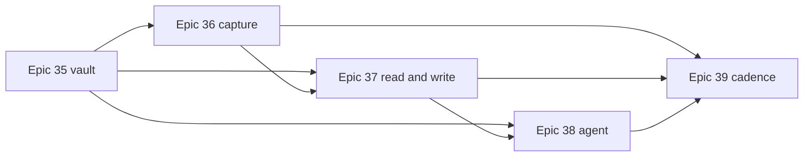

# Phase 5 — Notes (Epics 35–39)

status: draft
created: 2026-08-02
altitude: phase
source: `product-inputs-notes-2026-08-02.md` (the numbering spine — FR-94…FR-124,
NFR-27…NFR-30, AD-54…AD-63, UX-DR35…UX-DR44, Epics 35–39, allocated there and nowhere else),
derived from `_bmad-output/brainstorming/brainstorm-keeper-notes-2026-08-02/`
epics:
  - `epic-35-the-vault-is-a-folder-you-already-sync.md`
  - `epic-36-capture-in-two-seconds.md`
  - `epic-37-a-place-to-read-and-write.md`
  - `epic-38-your-agent-writes-here-too.md`
  - `epic-39-notes-that-sync-themselves.md`

Owner-requested phase: a markdown note system whose vaults are ordinary Obsidian-shaped
directories inside folders keeper already syncs. Capture is tray-first, files are the product,
the agent is a co-author rather than a background job, and organisation is virtual over a
physical tree that is always one click away.

The route is locked by the spine and must not be re-argued in a story:

- **A vault is a notes-flagged `SyncProfile` plus a subfolder.** No vault picker, no path
  validator, no second configuration store, no migration — profiles persist as one JSON blob
  per profile, so `#[serde(default)]` *is* the migration (AD-54).
- **The notes domain is pure and lands in `keeper-core`**, which stays tauri-free and
  sync-free; `check:core-tauri-free` and `check:core-sync-free` enforce it (AD-55). Vault IO
  and watching live in the `keeper` shell over `keeper-sync` (AD-56).
- **The index is a cache, not a database.** Deleting `.keeper/` is a supported recovery
  procedure, not an error (AD-57).
- **Nothing large crosses IPC.** Lists project view models; bodies stream over a `Channel`;
  assets go over `keeper-note://` (AD-58, AD-59).
- **The Linux tray defects are blocking, not cosmetic**, because the tray is the primary
  surface (AD-61, UX-DR43).
- **Never lock a note; watch it.** Provenance is read from the commit trailers the sync engine
  already writes — keeper adds no parallel history store (AD-63).

## Epics

| epic | title | stories | binds |
|---|---|---|---|
| 35 | The vault is a folder you already sync | 6 | FR-94–97, FR-121–122, NFR-28, AD-54–57 |
| 36 | Capture in two seconds | 7 | FR-98–102, FR-117, FR-120, NFR-27, AD-60–61 |
| 37 | A place to read and write | 9 | FR-103–111, FR-118–119, FR-123, AD-58–59 |
| 38 | Your agent writes here too | 6 | FR-112–114, FR-116, NFR-29–30, AD-63 |
| 39 | Notes that sync themselves | 5 | FR-115, FR-124, AD-62, docs, phase acceptance |

33 stories. Every story is scoped to one dev session and is independently shippable.

## Execution shape

Every story declares its side of the IPC boundary in its own body. Collected here because it
is what determines what can run in parallel:

**Rust-only — 9 stories.** 35.1, 35.3, 35.4, 35.5, 35.6, 36.1, 36.5, 36.7, 39.2. Of these,
35.3 and 35.4 are pure `keeper-core` and touch no shell code at all; the rest are shell work
over `keeper-sync`.

**Crosses the IPC boundary — 22 stories.** 35.2, 36.2, 36.3, 36.4, 36.6, all of 37.1–37.9, all
of 38.1–38.6, 39.1, 39.3.

**Frontend-only — none.** This is a finding, not an omission. The project rule that all logic
and persistence live in Rust and React is a pure renderer means every user-visible story in
this phase consumes a view model that does not exist yet, so its Rust half and its TypeScript
half are the same story. Planning around a frontend lane that can run ahead of the Rust would
produce components rendering invented shapes, and the shapes would then be wrong. The
parallelism in this phase is between *epics*, not between the two halves of a story.

**Non-code — 2 stories.** 39.4 (documentation) and 39.5 (field validation).

### Bindings regeneration

`bun run bindings:check` fails CI if `src/lib/ipc/gen/` changed, and ts-rs regenerates that
tree when `cargo nextest run` runs. **21 of 33 stories introduce or change an exported type
and must regenerate:** 35.2; 36.2, 36.3, 36.4, 36.6; 37.1, 37.2, 37.3, 37.4, 37.5, 37.6, 37.7,
37.9; 38.1, 38.2, 38.3, 38.4, 38.5, 38.6; 39.1, 39.3.

The 12 that do not: 35.1, 35.3, 35.4, 35.5, 35.6, 36.1, 36.5, 36.7, 37.8 (a new URI scheme is
not a new ts-rs type), 39.2, 39.4, 39.5.

## Dependency order

Every dependency edge in this phase points to a strictly smaller `(epic, story)` key, so the
graph is acyclic by construction and story order is a valid execution order.

Within the epics:

- **35:** 35.1 and 35.3 open two independent lanes (profile model; pure core). 35.2 ← 35.1.
  35.4 ← 35.3. 35.5 ← 35.1 + 35.4. 35.6 ← 35.5.
- **36:** 36.1 ← nothing. 36.2 ← 35.2. 36.3 ← 36.2. 36.4 ← 36.3. 36.5 ← 35.3 + 35.5 + 36.4.
  36.6 ← 36.5. 36.7 ← 36.1 + 36.5 + 36.6.
- **37:** 37.1 ← 35.6 + 36.2. 37.2 ← 37.1. Then 37.3, 37.5 and 37.6 are three independent
  lanes off 37.2. 37.4 ← 37.3. 37.7 ← 37.6. 37.8 ← 37.6. 37.9 ← 37.2 + 37.3.
- **38:** 38.1 ← 35.6 + 37.2. 38.2 ← 37.6 + 38.1. 38.3 ← 36.7 + 38.1. 38.4 ← 38.3. 38.5 ←
  38.3. 38.6 ← 38.2 + 38.4.
- **39:** 39.1 ← 35.1 + 36.6. 39.2 ← 39.1. 39.3 ← 37.6 + 39.2. 39.4 ← 39.3 and the measured
  output of 35.6, 37.2, 37.5, 38.1, 39.1. 39.5 ← everything.

**Epic 35 gates everything.** The one story with no technical predecessor anywhere in the
phase is **36.1** — the Linux tray remediation — which answers the brainstorm's open question
about whether that work is a blocking predecessor or a parallel track: it is a *hard*
predecessor of 36.7 and 38.3, and it may be executed in parallel with the whole of Epic 35.

## Coverage mapping

### Functional requirements — FR-94 … FR-124

| FR | stories |
|---|---|
| FR-94 | 35.1 (model), 35.2 (form) |
| FR-95 | 35.6 (registry, active vault in Rust), 37.1 (switcher) |
| FR-96 | 35.4 (model), 35.5 (scan + cache) |
| FR-97 | 35.3 |
| FR-98 | 36.5 (writer; naming rules in 35.3) |
| FR-99 | 36.6 |
| FR-100 | 36.6 |
| FR-101 | 36.3 (panel, hotkey, 300 ms), 36.4 (buffer durability) |
| FR-102 | 36.7 (menu items), 38.3 (unread indicator) |
| FR-103 | 37.2 |
| FR-104 | 37.3 |
| FR-105 | 37.4 |
| FR-106 | 37.9 |
| FR-107 | 37.6 |
| FR-108 | 37.7 |
| FR-109 | 37.7 |
| FR-110 | 37.8 |
| FR-111 | 37.8 |
| FR-112 | 38.1 (detection), 38.2 (clean apply, dirty merge) |
| FR-113 | 38.3 (unread marks), 38.4 (diff and Accept) |
| FR-114 | 38.5 |
| FR-115 | 39.1 (debounce and interval), 39.2 (flush on hide and quit) |
| FR-116 | 38.6 |
| FR-117 | 36.2 |
| FR-118 | 37.5 |
| FR-119 | 37.2 |
| FR-120 | 36.6 (journal path, default template, capture destination), 39.1 (cadence) |
| FR-121 | 35.5 (`.obsidian/` untouched, `.keeper/` excluded; the exclusion rule lands in 35.1) |
| FR-122 | 35.2 |
| FR-123 | 37.9 |
| FR-124 | 39.3 |

### Non-functional requirements — NFR-27 … NFR-30

| NFR | stories |
|---|---|
| NFR-27 | engineered and measured in 36.3; re-measured on both platforms in 39.5 |
| NFR-28 | 35.6 (cold index, watch cost), 37.2 (list paint); re-measured in 39.5 |
| NFR-29 | 38.1; re-measured in 39.5 |
| NFR-30 | 36.4 (buffer survives), 36.5 (atomic write, failed flush keeps the buffer), 38.2 (merge loses nothing), 38.6 (resolution commits before it deletes), 39.2 (bounded flush journals rather than drops) |

### Architecture decisions — AD-54 … AD-63

| AD | stories |
|---|---|
| AD-54 | 35.1 |
| AD-55 | 35.3, 35.4 (and asserted again in 38.2's merge, which cannot write) |
| AD-56 | 35.5, 35.6 |
| AD-57 | 35.4 (model), 35.5 (advisory cache, rescan on corruption) |
| AD-58 | 37.2 (rows only), 37.6 (body streams) |
| AD-59 | 37.8 |
| AD-60 | 36.3 |
| AD-61 | 36.1 (first-built menu, Linux glyphs), 36.7 (notes items inside it) |
| AD-62 | 39.1 |
| AD-63 | 38.3 (origin from trailers), 38.5 (history is a projection) |

### Experience decisions — UX-DR35 … UX-DR44

| UX-DR | stories |
|---|---|
| UX-DR35 | 36.3, 36.4, 36.5 |
| UX-DR36 | 37.1 |
| UX-DR37 | 37.3 (chips), 37.4 (a filter is one keystroke from a space) |
| UX-DR38 | 37.9 |
| UX-DR39 | 38.2 (never a modal), 38.3 (dot, mark, and the diff's entry point) |
| UX-DR40 | 37.6 |
| UX-DR41 | 37.1 (vault switch), 37.3 (chips), 37.9 (lens switch) |
| UX-DR42 | 36.2 |
| UX-DR43 | 36.1 |
| UX-DR44 | 37.8 |

## Phase 5 Validation Summary

- **FR coverage:** FR-94–FR-124 all mapped. Split FRs have every leg assigned — FR-94 (model
  35.1, form 35.2), FR-95 (Rust registry 35.6, switcher 37.1), FR-96 (model 35.4, scan and
  cache 35.5), FR-101 (panel 36.3, durable buffer 36.4), FR-102 (menu 36.7, indicator 38.3),
  FR-112 (detection 38.1, apply and merge 38.2), FR-113 (marks 38.3, diff and Accept 38.4),
  FR-115 (cadence 39.1, flush 39.2), FR-120 (three knobs 36.6, cadence 39.1). The two
  Should-tier FRs are scheduled last within their epics as the spine requires: FR-123 is 37.9,
  the final story of Epic 37, and FR-124 is 39.3.
- **NFR coverage:** NFR-27 is engineered in 36.3 and measured there over 20 samples on both
  platforms; NFR-28 is engineered in 35.4's delta model and 37.2's projection and measured by
  the 35.6 bench; NFR-29 is delivered by 38.1's change stream, which exists precisely because
  polling it would violate NFR-28; NFR-30 is not a single story but a rule five stories carry
  an acceptance criterion for (36.4, 36.5, 38.2, 38.6, 39.2), because it is the phase's one
  unacceptable failure. All three measurable NFRs are re-measured cross-platform in 39.5 and
  written back into `docs/notes.md`.
- **Architecture compliance:** AD-54 lands in 35.1; AD-55 in 35.3/35.4 and is enforced
  continuously by `check:core-tauri-free` and `check:core-sync-free` rather than by review;
  AD-56 in 35.5/35.6; AD-57 in 35.4/35.5; AD-58 in 37.2/37.6; AD-59 in 37.8; AD-60 in 36.3;
  AD-61 in 36.1/36.7; AD-62 in 39.1, with a convention test asserting no second scheduler;
  AD-63 in 38.3/38.5. No story introduces a dependency outside the pre-cleared set — CodeMirror
  6 and mermaid are MIT, the virtualiser is held to the same bar by `check:licenses`, and
  `ulid` is already a `keeper-core` dependency, so the cargo-deny and npm licence firewalls see
  no AGPL or GPL addition.
- **Dependencies:** Epic 35 gates everything; every dependency edge points to a strictly
  smaller `(epic, story)` key, so the graph is acyclic and the numbering is a valid execution
  order. Story 36.1 is the one story with no predecessor and may run in parallel with the whole
  of Epic 35 — it answers the brainstorm's open question by being a hard predecessor of 36.7
  and 38.3 rather than a parallel nicety. After 37.2, three lanes (37.3/37.4, 37.5, 37.6→37.7/
  37.8) run independently; Epic 38 needs 37.2 and 37.6; Epic 39 closes the phase. There is no
  frontend lane that can run ahead of Rust, by design.
- **Human-in-the-loop:** exactly one story (39.5) requires physical hosts — one macOS, one
  Linux, against one remote. Story 36.1's Linux tray acceptance and 39.3's always-on-top
  behaviour need a real XFCE or ayatana panel, which a Linux CI runner with a session bus
  provides; everything else is implementable with fixtures, a generated 10 000-note vault, a
  local bare repository and a scripted agent writing `.md` files.
- **Sizing:** 33 stories across Epics 35–39 (6 + 7 + 9 + 6 + 5), each scoped to a single dev
  session; 22 cross the IPC boundary, 9 are Rust-only, 2 are non-code, and 21 regenerate
  bindings. Total 238 stories across 39 epics.
