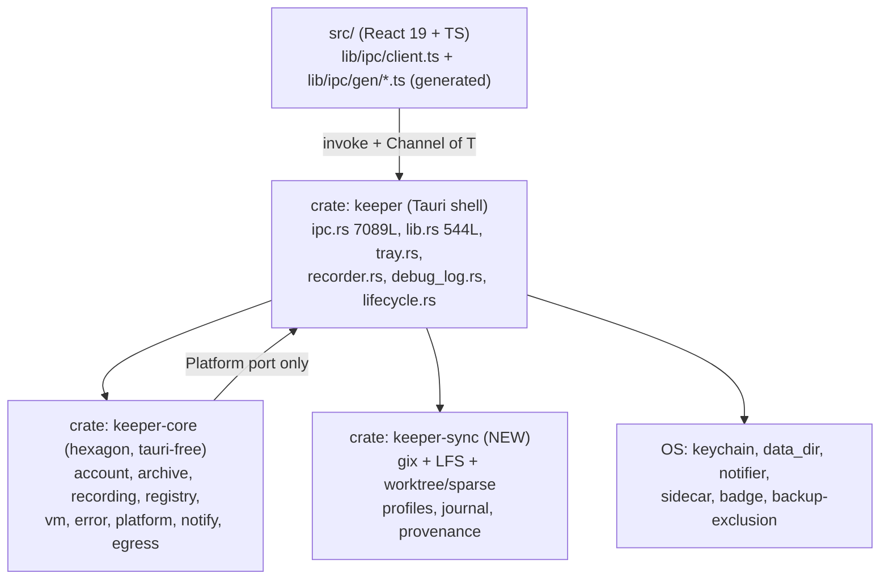

# Technical Research: keeper — Git-Based Folder Sync (gitoxide + git-LFS + file-stability)

- **Date:** 2026-07-25
- **Researcher:** BMAD technical-research pass (Claude), four parallel strands consolidated
- **Scope:** A new keeper subsystem that synchronizes a user-chosen local folder against a
  git remote (Forgejo primary), carrying large binary files through git-LFS, driven by a
  filesystem watcher, with removable-media/pendrive and offline operation as first-class
  cases. Covers: the `gix` (gitoxide) capability envelope, the residual `git` CLI
  dependency, the git-LFS wire protocol and its Forgejo/Gitea server quirks, Rust LFS crate
  options, how to know a file on disk is *finished being written*, and the exact seams in
  the keeper codebase this subsystem must plug into.
- **Repo grounding:** Tauri 2 workspace (`src-tauri/crates/keeper-core` platform-free
  hexagon + `keeper` shell), `unsafe_code = "deny"` workspace-wide, cargo-deny permissive-
  only license firewall (`src-tauri/deny.toml`), `Platform` port trait
  (`crates/keeper-core/src/platform.rs`), single `to_ipc_error` funnel
  (`crates/keeper/src/ipc.rs:1024`), opt-in tray (`crates/keeper/src/tray.rs`),
  `reqwest 0.13.4` resolved exactly once with a standing "no second TLS stack" rule
  (`src-tauri/Cargo.toml:73-75`), `bun run check:core-tauri-free` CI gate.
- **Method:** Source-of-truth reading at pinned commits plus **executed** experiments on
  this host. See §1 for the evidence grading that applies to every claim below.

---

## 1. Scope & method

### 1.1 What was researched

Four independent strands, run in parallel on 2026-07-25:

| Strand | Question | Sections |
|---|---|---|
| gitoxide capability envelope | What can `gix` actually do, and where must we shell out? | §3, §4 |
| git-LFS + Forgejo | What is the exact wire contract, and how does Forgejo deviate from it? | §5, §6, §7 |
| File stability | How do real sync products know a file is complete, and what can the OS prove? | §2, §8, §9 |
| keeper codebase seams | What already exists to reuse, and what does not exist at all? | §10 |

### 1.2 Evidence grading — read this before citing anything below

Claims carry one of three grades. **They are not interchangeable and MUST NOT be
softened when quoted into a story spec.**

- **`[EMPIRICAL]`** — a program was written and executed on this host and the stated
  output was observed. Compile failures count as proof of absence (a missing method is a
  compiler error, not an opinion).
- **`[SOURCE]`** — read directly from upstream source or normative documentation at a
  pinned commit.
- **`[INFERENCE]`** — reasoned, not observed. Marked inline every time it appears.

Anything unmarked in a table cell inherits the grade stated in its section preamble.

**Explicitly executed (not merely read):** shallow clone over `https://` with `git`
removed from `PATH` and `HOME` unset; `file://` clone failing without `git`; the absence of
`prepare_push`/`push` as compiler errors; a full object→tree→commit→index→status cycle;
`gix::status` against real git-authored sparse fixtures in both index modes; the
`Trust::Full` vs `Trust::Reduced` filter-drop; a 5 MiB clean/smudge round-trip through a
custom `filter-process` driver on `gix`'s process-protocol server; the recommended Cargo
manifest compiling; a gix-only commit pushed by `git push` and verified server-side; and
every per-syscall timing in §8 (`lstat`, `/proc/locks`, `/proc/*/fd` readlink, `fdinfo`
flags, `fcntl(F_GETLK)`, `flock`).

### 1.3 Pinned versions and commits

| Source | Pin |
|---|---|
| gitoxide | source at commit `9a9a166f` (2026-07-25); crate `gix 0.86.0`, published 2026-07-23 |
| git-lfs | `main @ d72db1e533a1d6ee5543e02e9f8ccac97e0fcd34` (2026-07-06), `config.Version = "3.7.0"` |
| forgejo | `main @ 10beaf54ece70c1bfcd98b0655a25ca343b0d3f3` (2026-07-24) |
| syncthing | `main @ 119d5e72efcf7d4c003664640ca0db6f472edfa4` (2026-07-25) |
| nextcloud/desktop | `master @ 89147bec8b005162608f7159bd2a251f705bf635` (2026-07-25) |
| rclone | `master @ c99b2d11edb0986cd2b1190e9fa25a58a3f12661` (2026-07-24) |
| chromium / gecko-dev / xnu / LibreOffice core | live fetches, 2026-07-25 |
| Measurement host | Linux 6.17.0-35-generic, AMD Ryzen AI 9 HX PRO 370, 3 visible CPUs, container with 22 processes / 278 open fds |
| Local tree | keeper 0.3.0, edition 2021, `git 2.53.0` present, **`git-lfs` NOT installed**, `reqwest 0.13.4` (single version), zero `gix` in `Cargo.lock` |

### 1.4 Provenance note on §2

§3–§11 are consolidated from the four research strands. **§2 is partly not.** The
Nextcloud, rclone and Dropbox findings in §2 come from the file-stability strand
(`[SOURCE]`, commits above). The Syncthing protocol / global-model / block-hash /
conflict-naming / ghost-counter facts and the gut-sync findings were **not** covered by any
strand's written report and were grounded during consolidation — first against upstream
documentation and repositories (Syncthing docs v2.1.0, Syncthing issue #10590 read live from
GitHub, `tillberg/gut` README), then **re-verified line-by-line against the syncthing tree at
`119d5e72` and the gut README** by the file-stability researcher on request. They therefore
carry the same `[SOURCE]` weight as the rest and are cited to exact files and line numbers in
§13. No fact in §2 is asserted without a named upstream origin.

One claim in §2.1 is deliberately *downgraded* from the way it was briefed: the version-vector
ghost-counter problem is presented as **two independently verified code facts plus a disputed,
closed user report**, not as a known defect. See §2.1 for why that framing is the defensible
one.

### 1.5 What this document is for

A reference. Later story specs cite it by section number. It records verdicts, not
options — where a verdict is genuinely open it lives in §12, not scattered as hedging.

---

## 2. Prior art — what we adopt and what we reject

Five systems were examined. Each subsection ends with an explicit **ADOPT** / **REJECT**
verdict. The cross-product conclusion is at §2.6.

### 2.1 Syncthing

Open-source (MPLv2) peer-to-peer folder sync. The nearest architectural neighbour to what
keeper is building, and the only one with a published protocol.

- **Block Exchange Protocol (BEP v1).** BEP runs between two or more *devices* forming a
  *cluster*, each holding one or more *folders*. It is the top layer of a stack whose
  encryption/authentication layer **SHALL use TLS 1.3 or higher**; the reference
  implementation authenticates with preshared SHA-256 certificate fingerprints called
  *Device IDs* (a 32-byte value, the SHA-256 of the device X.509 certificate). Framing:
  a pre-authentication `Hello` prefixed by int32 magic **`0x2EA7D90B`** + int16 length,
  then post-auth messages of `int16 header length | Header | int32 message length |
  Message`, big-endian. `MessageType` ∈ `{CLUSTER_CONFIG, INDEX, INDEX_UPDATE, REQUEST,
  RESPONSE, DOWNLOAD_PROGRESS, PING, CLOSE}`; `MessageCompression` ∈ `{NONE, LZ4}`.
  `CLUSTER_CONFIG` MUST be the first post-authentication message. In-tree:
  `lib/protocol/doc.go:7` — *"Package protocol implements the Block Exchange Protocol"* —
  with one file per message type (`bep_hello.go`, `bep_clusterconfig.go`,
  `bep_index_updates.go`, `bep_request_response.go`, `bep_download_progress.go`,
  `bep_fileinfo.go`). Licence **MPL-2.0**, which is on keeper's allow-list — so the code is
  legible to us for patterns, though §2.1's verdict is that we do not want the protocol.
- **Global vs local model.** Each device's *local model* is the metadata + block hashes of
  its own folders and is sent to the whole cluster. The union of all local models, with the
  highest-change-version file selected per path, is the *global model*; every device strives
  toward it. **In the implementation this is not two stores** — it is one row per
  `(file, device)` with the global elected by a flag:
  `lib/protocol/bep_fileinfo.go:31` defines
  `FlagLocalGlobal FlagLocal = 1 << 4 // 16: This is the global file version`, and election
  is recomputed by `internal/db/sqlite/folderdb_update.go:418 recalcGlobalForFolder` /
  `:451 recalcGlobalForFile`, which select names where no row carries `FlagLocalGlobal` and
  re-elect. The public API is `internal/db/interface.go:94-95` —
  `CountGlobal(folder) (Counts, error)` and `CountLocal(folder, device) (Counts, error)`.
  **As of 2.x the backend is SQLite (`internal/db/sqlite/`), not LevelDB** — older
  write-ups say LevelDB and are stale.
- **SHA-256 block verification.** Files are sliced into equal-size blocks (last block may be
  shorter), constant within a file. `lib/scanner/blocks.go` imports `crypto/sha256` (`:12`),
  sets `const hashLength = sha256.Size` (`:34`), hashes with `sha256.New()` (`:38`) and
  `sha256.Sum256(buf)` (`:125`), and even hardcodes `SHA256OfNothing` (`e3b0c442…`, `:20`).
  Block size is variable in powers of two: `lib/protocol/protocol.go:47
  MinBlockSize = 128 << KiB`, `:50 MaxBlockSize = 16 << MiB`, `:57 DesiredPerFileBlocks =
  2000`; `lib/protocol/bep_fileinfo.go:403 func BlockSize(fileSize int64) int` walks
  `BlockSizes` until `fileSize < DesiredPerFileBlocks*blockSize` — so 128 KiB blocks up to
  ~256 MB files, doubling thereafter, capped at 16 MiB. The result is a block list of
  `(offset, size, hash)`. Sync diffs block lists and sources each differing block either
  locally (another file already has that hash) or over the network. **On copy or receipt
  each block's SHA-256 is recomputed and compared; a mismatch discards the block and another
  source is tried.** The independent backstop during hashing is
  `lib/scanner/blockqueue.go:47-57`: stat before, hash, stat after, and
  `size != fi.Size() || !modTime.Equal(fi.ModTime())` → `"file changed during hashing"`.
- **Conflict naming and the absence of a merge UI.** When a file is modified on two devices
  concurrently and the content differs, the loser is renamed
  **`<filename>.sync-conflict-<date>-<time>-<modifiedBy>.<ext>`**. The generator is
  `lib/model/folder_sendrecv.go:2219-2222`:
  ```go
  func conflictName(name, lastModBy string) string {
      ext := filepath.Ext(name)
      return name[:len(name)-len(ext)] + time.Now().Format(".sync-conflict-20060102-150405-") + lastModBy + ext
  }
  ```
  So the concrete shape is **`.sync-conflict-YYYYMMDD-HHMMSS-<shortDeviceID>.<ext>`**, the
  timestamp is the **local clock at conflict-copy creation** (not the file mtime), and
  `<modifiedBy>` is the short device ID of the **losing** version. Detection is a substring
  test on `.sync-conflict-` (`:2224 isConflict`); the GC glob is
  `.sync-conflict-????????-??????*` (`:2230`). Per the docs, the older modification time
  loses; on a tie, the device whose ID has the larger first 63 bits loses; a
  modification-vs-deletion conflict where the deletion wins also produces a conflict copy.
  Crucially, **conflict copies are then treated as ordinary files and propagate to every
  device** — Syncthing's stated reason is that it cannot know which side the user considers
  best. **There is no merge UI, no resolution workflow, no three-way diff, and no resolve
  code path in `folder_sendrecv.go` at all.** The sole affordance is
  `lib/config/folderconfiguration.go:73 MaxConflicts int … default:"10"` — retain N conflict
  copies, then prune. The product's entire conflict story is "keep both files, let the human
  sort it out."
- **Ghost counters in version vectors, and the disputed report about them.** Two structural
  facts are independently true in the tree at the pinned commit and can be cited directly:
  1. **`lib/protocol/vector.go` has no per-counter removal API.** The full method set is
     `String`, `HumanString`, `ToWire`, `VectorFromWire`, `VectorFromString`, `Update`,
     `updateWithNow`, `Merge`, `Copy`, `Equal`, `LesserEqual`, `GreaterEqual`, `Concurrent`,
     `Counter`, `IsEmpty`, **`DropOthers`**, `Compare`. `DropOthers` is the *inverse*
     operation; **there is no `DropCounter(shortID)`.**
  2. **`internal/db/sqlite/folderdb_update.go:187-213 DropDevice`** performs
     `DELETE FROM devices WHERE device_id = ?` (cascading to that device's rows) and then
     `recalcGlobalForFolder` — **it does not rewrite the version vectors held in surviving
     rows.**

  Together: **version vectors retain counters for removed devices, and there is no API to
  strip one.** A user report attributing deleted-file resurrection and mass conflict storms
  to exactly this —
  [syncthing#10590](https://github.com/syncthing/syncthing/issues/10590), opened 2026-03-04
  against v2.0.15, a 9-node cluster, claiming ~8,591 `sync-conflict` files in a 3-hour window
  after a device rebuild, with filenames carrying the *removed* device's short ID (e.g.
  `Screenshots/Screenshot_20251002_210834.sync-conflict-20260303-134300-ALMIVFD.png`) —
  **was closed `NOT_PLANNED` and disputed by maintainer `calmh`**, who called it "an AI fever
  dream entirely disconnected from reality" (2026-03-04) and "complete nonsense" (2026-03-05)
  and asked for human-written reproduction steps.
  **Cite it that way. "Known defect #10590" is not defensible; the two code facts above are.**
  - **Why we record it at all:** the failure *mode* is structurally plausible regardless of
    whether that report is. A causality-tracking scheme whose per-peer counters outlive the
    peer, with no operation to remove one, degrades into permanent pseudo-concurrency. Any
    design that reaches for version vectors must answer "what happens when a participant
    leaves forever?" before shipping.
- **Syncthing ships NO default ignore for foreign partials.** Its own temporaries are
  `.syncthing.<name>.tmp` (unix) / `~syncthing~<name>.tmp` (Windows), recognized on **every**
  platform by `lib/fs/tempname.go:39 IsTemporary`, and `lib/ignore/ignore.go:218-228 Match`
  hard-ignores those plus `.stfolder`/`.stignore`/`.stversions` **before any user pattern**.
  `*.part`, `*.crdownload`, `~$*` and friends are left entirely to the user's `.stignore`.
  Defaults: `rescanIntervalS` **3600**, `fsWatcherDelayS` **10**
  (`lib/config/folderconfiguration.go:57-60`).

**ADOPT:** content-addressed block/object verification with the hash recomputed on
*receipt* and a mismatch discarding the data (git + LFS give us this natively — §5's OID
check is the same idea); the settling-window mechanic (§9); the rule that our own staging
files live in a reserved, self-recognized namespace (§9 tier 0); the mandatory periodic full
rescan because watchers drop events (§9 tier 1).

**REJECT:** the Block Exchange Protocol itself and the whole peer-to-peer/global-model
architecture — keeper syncs through a git remote, so the server *is* the global model and
we inherit git's own causality (commit DAG) instead of inventing a vector clock. **Rejecting
version vectors is what makes the ghost-counter class of failure structurally impossible for
us**, disputed report or not. **REJECT** propagating conflict copies as ordinary files: a
`.sync-conflict-…` twin that itself syncs turns one conflict into N, and capping the damage
with a `MaxConflicts`-style retention knob treats the symptom. Git gives us a real merge
base; §12 owns the conflict-presentation decision, but "rename the loser and sync the
rename" is not it. **REJECT** shipping no default exclusion list — §9 tier 0 curates one,
because leaving foreign partials to the user is exactly the gap §8.4 says is fatal.

### 2.2 Nextcloud desktop

The most explicit, best-documented quiescence gate in the field, and the source of the
industry's best exclusion list. All `[SOURCE]` at the pinned commit.

- **`SyncEngine::minimumFileAgeForUpload` = 2000 ms**
  (`src/libsync/syncengine.cpp:76`). The header comment is the whole design in one line:
  *"uploads of files where the distance between the mtime and the current time is less than
  this duration are skipped."*
- **`fileIsStillChanging()`** (`src/libsync/owncloudpropagator_p.h:19-36`):
  ```cpp
  const qint64 msSinceMod = modtime.msecsTo(QDateTime::currentDateTimeUtc());
  return std::chrono::milliseconds(msSinceMod) < OCC::SyncEngine::minimumFileAgeForUpload
      && msSinceMod > -10000;   // mtime far in the future -> DO upload
  ```
  Called from `propagateupload.cpp:444` and `bulkpropagatorjob.cpp:395`. A held file yields
  a `SoftError` + `_anotherSyncNeeded = true` — **retry, never a user-facing failure**. The
  `> -10000` arm is a clock-skew escape hatch: a file whose mtime is more than 10 s in the
  future is uploaded rather than held forever.
- Independently, `propagateupload.cpp:432-436` **re-stats mtime immediately before the PUT**
  and aborts with *"Local file changed during syncing. It will be resumed."*
- **Download staging: `.<basename>.~<8-hex-random>`** (`createDownloadTmpFileName`,
  `propagatedownload.cpp:41-60`) — dot-prefixed so it is hidden on macOS/Linux, clamped to
  254 chars.
- **Watch mask deliberately omits `IN_MODIFY`** (`src/gui/folderwatcher_linux.cpp:69-70`):
  `IN_CLOSE_WRITE | IN_ATTRIB | IN_MOVE | IN_CREATE | IN_DELETE | IN_DELETE_SELF |
  IN_MOVE_SELF | IN_UNMOUNT | IN_ONLYDIR`. They wait for close-write instead of reacting to
  every write. On macOS (`folderwatcher_mac.cpp:101-107`) it is
  `FSEventStreamCreate(..., latency 0, kFSEventStreamCreateFlagUseCFTypes |
  kFSEventStreamCreateFlagFileEvents | kFSEventStreamCreateFlagIgnoreSelf)` — **no close
  signal exists there**, which is exactly why the 2 s mtime gate carries the load.
- **`sync-exclude.lst`** — a shipped global exclusion list and the single best curated
  inventory of in-flight/junk filenames in the industry. See §8.1 for the extracted table.
  A leading `]` in that file means "safe to delete", not merely "ignore".
- Scheduling floor: `startScheduledSyncSoon()` uses
  `msDelay = max(100 ms, sqrt(lastSyncDurationMs)/20 × 1000)`, capped at 60 s.

**ADOPT:** all of it, in substance. The mtime-age gate (§9 tier 2), the future-mtime escape
hatch, the re-stat immediately before transfer (§9 tier 4), the `SoftError`-and-requeue
posture, the dot-prefixed randomized staging name, `IN_CLOSE_WRITE`-not-`IN_MODIFY`, and
`sync-exclude.lst` as the seed corpus for our tier-0 glob set.

**REJECT:** 2000 ms as *our* default window — it is the aggressive end of the industry
range and keeper must also work on removable media and HFS+/SMB mounts with 1-second mtime
granularity. §9 sets 5 s as the default with a per-profile override.

### 2.3 rclone

The strictest verify-on-read in the field.

- **`--partial-suffix` default `.partial`**; **`--inplace` default `false`**, documented as
  *"Download directly to destination file instead of atomic download to temp/rename"*
  (`fs/config.go:539-552`). The actual staged name is
  `<remote>.<crc32(remote+fingerprint):08x><suffix>` (`fs/operations/copy.go:102-114`),
  skipped when the destination lacks `Move`/`PartialUploads` or the name is a `.rclonelink`.
- **`--min-age`** ⇒ `f.ModTimeTo = time.Now().Add(-minAge)` (`fs/filter/filter.go:205-206`).
  Files younger than that are filtered out of the transfer set entirely. This is rclone's
  documented answer to "don't transfer files still being written".
- **Per-buffer size/mtime recheck** — the strictest recheck anywhere, executed inside
  `Read()`, i.e. **once per buffer** (`backend/local/local.go:1320-1338`):
  ```go
  if oldsize != fi.Size() { return NoLowLevelRetryError("can't copy - source file is being updated (size changed from %d to %d)") }
  if !oldtime.Equal(readTime(...)) { return NoLowLevelRetryError("...(mod time changed from %v to %v)") }
  ```
  The escape hatch `--local-no-check-updated` is documented as *"rclone will use its best
  efforts… Only transfer the size that stat gave, only checksum the size that stat gave,
  don't update the stat info."*

**ADOPT:** `--min-age` as the conceptual model for tier 2; the atomic
stage-then-rename default; and the per-buffer recheck as an opt-in strict mode in tier 4
(one `fstat` per 64 KiB — measurable but affordable). Also adopt the existence of an escape
hatch for filesystems with broken mtime.

**REJECT:** per-buffer recheck as the *default*. Our default is snapshot-`fstat` before,
stream-hash, `fstat` after (§9 tier 4), because for LFS objects the batch API already hands
us an independent expected OID and length, making the end-check a genuine proof.

### 2.4 gut-sync (`tillberg/gut`)

The closest thing to prior art for "git as a realtime folder syncer", and therefore the
most important cautionary tale. ISC-licensed, written in Go.

- Design: real-time bi-directional folder synchronization built on **a machine-renamed fork
  of git** called `gut`, per its README: *"gut-sync solves this problem for me by using a
  modified version of git to synchronize changes between multiple (1 to N) systems in
  real-time."* The fork exists for one reason — *"The reason it's necessary to use a
  modified version of git, and not git itself, is that stock git will refuse to traverse
  into `.git` folders, which is critical to using gut-sync to synchronize folders containing
  git repos."* Otherwise "gut is the same as git."
- It is explicitly an orchestrator, not a library user: *"it's sort of like a big shell
  script written in Go: all the heavy lifting is done by calling out to other utilities."*
  It uses `inotifywait` on Linux and `fswatch` on macOS to watch, then drives `gut-add` /
  `gut-fetch` on each host. Transport and self-deployment are over SSH, using
  `golang.org/x/crypto/ssh` — which notably *"does not, for example, read any settings in
  ~/.ssh/config"*. Exclusions are `.gutignore` files, mirroring `.gitignore`. It also cannot
  talk to ordinary git hosts: *"Github, for one, doesn't support gut-receive-pack."*
- **The stated history-cost limitation, verbatim:** *"If you want to sync a lot of large
  files, or large rapidly-changing files, the overhead of using git (which never deletes
  history) may be too expensive."* Its own README lists the mitigations — prune synced
  folders, run `git gc` in less-used repos, delete `node_modules`.
- **Watch-slot exhaustion is a named operational failure**, not a footnote: the README
  carries a whole section titled *"Please increase the amount of inotify watches allowed per
  user"*, and notes that *"inotifywait/fswatch don't exclude `.gutignore`d paths from being
  wired up for change notifications"* — so watch slots are consumed by directories that are
  never synced.
- Second stated caveat: *"If you are not familiar at all with git, you may prefer another
  tool that exposes history/versions in a more user-friendly way."*
- **Maturity:** ISC licence, last release **1.0.3**, effectively unmaintained. Treat it as
  an existence proof and a list of hazards, not as a dependency or a maintained reference.

**ADOPT:** the core validated premise — git *is* a workable realtime folder-sync substrate,
and someone shipped it. Adopt the `.gitignore`-shaped exclusion file idiom. Adopt, as a hard
requirement rather than a nice-to-have, the two costs it names: **history growth is the
dominant failure mode of this architecture**, and **watch-slot consumption must be scoped
to what we actually sync, not to the whole tree.**

**REJECT:** forking git (we are not syncing nested `.git` directories; a fork is
unmaintainable and unshippable inside a signed desktop bundle — and gut-sync's own fork is
what strands it from every real git host). **REJECT** its unbounded-history posture:
keeper's answer is that multi-GB content never becomes a git blob at all — it goes through
LFS (§5) and stays a ~130-byte pointer in the ODB — plus scheduled `git gc`/`repack` (§4),
because gitoxide exposes no maintenance equivalent (§3.7). **REJECT** exposing git history
as the user's version UI; gut-sync itself flags that as the wrong surface for non-git users.
**REJECT** its SSH-only transport: `x/crypto/ssh`-style clients that ignore `~/.ssh/config`
are a support burden, and §3.2/§4 show `ssh://` costs us an external binary anyway —
`https://` is pure Rust. **REJECT** registering watches for paths we exclude: tier 0 (§9.1)
must filter *before* the watcher is wired up, not after events arrive.

### 2.5 Dropbox

Closed source. Behaviour below is from official documentation and observable artifacts; the
one inferred claim is marked.

- Ignore rules live in a local, non-syncing **`rules.dropboxignore`**, and rules apply only
  to files created afterwards. Selective sync is a separate mechanism.
- Documented failure mode: when another application holds an exclusive lock, Dropbox
  surfaces *"file in use" / "Cannot sync: file locked"* and refuses to sync until that app
  closes. That leans on **Windows mandatory locking, which has no POSIX equivalent.**
  **[INFERENCE]** its Linux/macOS behaviour must therefore fall back to a quiescence
  heuristic like everyone else's.
- Staging directory `<Dropbox>/.dropbox.cache/` (including `old_files/`); local index at
  `~/.dropbox/instance1/filecache.dbx`.
- **On modern macOS Dropbox is a File Provider extension**
  (`NSFileProviderReplicatedExtension`), where the OS hands the provider explicit item
  lifecycle callbacks. That is a materially better completeness signal than FSEvents.

**ADOPT:** nothing structural. The one transferable idea is the local, non-syncing ignore
file — which we already take from Nextcloud and gut-sync in a better-specified form.

**REJECT — and this one is not a choice.** The File Provider route **requires being a
virtual filesystem provider, not a plain-folder syncer.** keeper syncs a real directory the
user picked; it is not an `NSFileProviderReplicatedExtension` and will not become one. The
best completeness signal on macOS is therefore structurally unavailable to us, and that is
precisely why macOS gets no tier-3 veto in §9. Recorded in §11 so no future story
relitigates it. Also **REJECT** any reliance on OS-enforced locking: there is none on POSIX.

### 2.6 Cross-product conclusion

Every open-source implementation converges on the same shape: **filename-based exclusion +
an mtime/size quiescence window, with a size+mtime recheck *during* transfer as the
correctness backstop.** None of them scans `/proc` or shells out to `lsof`. Nextcloud is the
only one that uses `IN_CLOSE_WRITE`, and only as an event *trigger* — never as proof of
completeness. §9 is that consensus, plus a Linux-only cheap veto the others skip.

---

## 3. gitoxide (`gix`) capability matrix

Section grade: `[EMPIRICAL]` where marked, otherwise `[SOURCE]` at commit `9a9a166f`.
Note that upstream's own `crate-status.md` is **partially stale** — it marks `gix-filter`'s
clean/smudge/process bases unchecked when the crate is complete and was driven end-to-end
here — so it was not trusted as a sole source.

### 3.1 Version, MSRV, license

| | |
|---|---|
| Version | **0.86.0**, published **2026-07-23** |
| MSRV | **1.85** (raised from 1.82 at 0.84.0, 2026-05-26) |
| License | **`MIT OR Apache-2.0`** — passes keeper's `deny.toml` allow-list |
| Edition | 2024 |
| Release cadence | ~monthly |

All ~54 `gix-*` sub-crates are `MIT OR Apache-2.0`. The perf stack pulls `zlib-rs`
(**Zlib** license — on the allow-list). **No GPL anywhere in the gix tree.**
**`gix 0.82.0` is YANKED — pin `>= 0.83`, ideally `= 0.86`.** Local toolchain is 1.97.1,
well above MSRV.

Also deprecated / moved since the last MSRV bump: `max-performance-safe` is now a no-op
(*"gix always uses zlib-rs, so this is equivalent to max-performance"*);
`Repository::work_dir()` is deprecated in favour of `workdir()` (a live deprecation warning
was hit during smoke testing); `tree-editor` and `merge` sit behind the
`need-more-recent-msrv` bundle and are **not** in default features.

### 3.2 The full capability matrix

| # | Feature | Verdict | Concrete `gix` API / fallback |
|---|---|---|---|
| 1 | Clone (`https://`) | ✅ **Supported** | `gix::prepare_clone` → `fetch_then_checkout` → `main_worktree` |
| 2 | Clone/fetch (`ssh://`) | ⚠️ **Partial** | Works, but **external `ssh` binary required** |
| 3 | Clone/fetch (`file://`, pendrive) | ⚠️ **Partial** | Works, but **`git-upload-pack` binary required** |
| 4 | Incremental fetch, refspecs | ✅ **Supported** | `Remote::with_refspecs(.., Direction::Fetch)` → `prepare_fetch` → `receive` |
| 5 | Shallow / partial history | ✅ **Supported** | `Shallow::{DepthAtRemote, Deepen, Since, Exclude}`, `Shallow::undo()` |
| 6 | Credential helpers / tokens | ✅ **Supported** | `set_credentials` callback; `http.extraHeader` for bearer |
| 7 | **Push** | ❌ **UNSUPPORTED** | **Shell out to `git push`** (interop proven) |
| 8 | Worktree list / inspect | ✅ **Supported** | `repo.worktrees()`, `Proxy::{base,id,is_locked,into_repo}` |
| 9 | Worktree add / remove / prune | ❌ **Unsupported** | **Shell out to `git worktree …`** |
| 10 | Sparse: honour git's flags | ✅ **Supported** | `SKIP_WORKTREE` respected by checkout + status |
| 11 | Sparse: manage patterns | ❌ **Unsupported** | **Shell out to `git sparse-checkout …`** |
| 12 | Sparse: true sparse index | ❌ **Breaks status** | Force `index.sparse=false` (mitigation validated) |
| 13 | Index read / write (V2, V3) | ✅ **Supported** | `repo.index()`, `gix_index::File::write` |
| 14 | Index mutation (`git add`) | ⚠️ **Partial / low-level** | `dangerously_push_entry` + `sort_entries`; or `git add` |
| 15 | Status | ✅ **Supported** | `repo.status(progress)`, `repo.is_dirty()` |
| 16 | Commits / trees / objects | ✅ **Supported** | `commit_as`, `write_object`, `edit_tree` |
| 17 | Diff / blame / revwalk / merge-base | ✅ **Supported** | `gix::diff`, `gix::blame`, `gix::revision` |
| 18 | merge / rebase / stash / reset / restore | ❌ **Unsupported** | Shell out to `git` |
| 19 | gc / repack / maintenance | ❌ **Unsupported** | **Shell out to `git gc`** |
| 20 | `.gitattributes` + clean/smudge/process | ✅ **Supported** | `gix::filter::Pipeline` |
| 21 | **LFS in gitoxide** | ❌ **UNSUPPORTED** (`gix-lfs` = empty 0.0.0) | `git-lfs-*` crates, own impl, or drive `git-lfs filter-process` |
| 22 | Streaming object **write** | ✅ **Supported** | ODB `Write::write_stream` (**not** `write_blob_stream`) |
| 23 | Streaming object **read** | ❌ **Unsupported** | None — full `Vec<u8>`. Keep big files in LFS |
| 24 | Progress reporting | ✅ **Supported** | `progress-tree`; `NestedProgress` into fetch/checkout |
| 25 | Interrupt / cancel | ✅ **Supported** | `&AtomicBool should_interrupt` on all long ops |
| 26 | Object integrity checks | ⚠️ **Weaker than `git2`** | No `strict_hash_verification`; verify at our own layer |

### 3.3 Clone and fetch — SUPPORTED

`[EMPIRICAL]` A shallow clone (`depth 1`) of `https://github.com/GitoxideLabs/gitoxide`
succeeded **with `git` removed from `PATH` and `HOME` unset**: 3382 remote refs,
`is_shallow=true`, correct HEAD.

```rust
let mut prep = gix::prepare_clone(url, &path)?          // or prepare_clone_bare
    .with_shallow(gix::remote::fetch::Shallow::DepthAtRemote(1.try_into()?))
    .with_ref_name(Some("main"))?
    .with_in_memory_config_overrides(["index.sparse=false"])
    .configure_connection(|c| { c.set_credentials(cb); Ok(()) });
let (checkout, outcome) = prep.fetch_then_checkout(progress, &interrupt)?;
let (repo, _) = checkout.main_worktree(progress, &interrupt)?;
```

Incremental fetch: `repo.find_remote("origin")?` → `.with_refspecs(specs,
Direction::Fetch)?` → `.connect(Direction::Fetch)?` → `.prepare_fetch(&repo, progress,
opts)?` → `.receive(progress, &interrupt)?`. `Prepare` also offers `with_dry_run`,
`with_reflog_message`, `with_write_packed_refs_only`, `with_shallow`.

**Transports:**

| Transport | Status | Needs external binary? |
|---|---|---|
| `https://` / `http://` | **Full** (V1 + V2, sideband, auth) | **No** — pure Rust `[EMPIRICAL]` |
| `git://` | Full | No |
| `ssh://` | Works | **YES — external `ssh`/`plink`/`putty`/`tortoiseplink`.** No `ssh2`/libssh2; `gix-ssh` is a *planned, non-existent* crate |
| `file://` + local paths | Works | **YES — spawns `git-upload-pack`.** `[EMPIRICAL]` fails with `Failed to invoke program "git upload-pack"` when `git` is off `PATH` |
| async | `async-network-client` exists, but **HTTP/S is blocking-only** | — |

The `file://` row is the pendrive finding: **syncing to a repo on removable media via
`file://` requires a `git` binary on the machine.** There is no in-process local transport
(`crate-status.md:483-487` — `file:// without launching git-upload-pack` is unchecked).
Either require `git`, or bypass the transport entirely and copy at the ODB level / use
`alternates`.

**HTTP backend:** use `blocking-http-transport-reqwest-rust-tls`. `[EMPIRICAL]` it resolves
`reqwest 0.13.4`, which **unifies with keeper's existing `reqwest = "0.13"`** — no duplicate
TLS stack, no OpenSSL, no C toolchain. HTTP/S transports are **blocking-only**, so fetches
must run on `tokio::task::spawn_blocking` inside Tauri.

**Auth:** full git credential-helper support (builtin `git credential`,
`git-credential-<name>`, absolute paths, shell scripts). For a Tauri app the right hook is
the programmatic callback `Connection::set_credentials(|action| …)`, which needs no external
process — `[EMPIRICAL]` exercised. HTTP Basic is built in; **bearer tokens go via
`http.extraHeader`** (`gix-transport/.../http/mod.rs:126`). SSH keys are entirely delegated
to the external `ssh` binary, so `~/.ssh/config`, agents and keys all work but are not
programmatically controllable.

### 3.4 Push — UNSUPPORTED. Definitive.

Verified four independent ways:

1. `[SOURCE]` `gix/src/push.rs` is **only** a config enum for `push.default`
   (`Nothing/Current/Upstream/Simple/Matching`). No transfer logic. That is the entire
   module.
2. `[SOURCE]` `gix::remote::Connection` exposes exactly two operations: `ref_map()` and
   `prepare_fetch()`.
3. `[EMPIRICAL — compile-proof]` `conn.prepare_push()` → *"no method named `prepare_push` …
   help: there is a method `prepare_fetch`"*; `repo.push()` → *"no method named `push` found
   for struct `gix::Repository`"*.
4. `[SOURCE]` `crate-status.md:557-560`: `* [ ] push` / `[ ] send-pack / receive-pack client
   plumbing` / `[ ] report-status, sideband, delete-refs, push-options and atomic pushes`.
   `gix-refspec` is `[x] for fetch`, **`[ ] for push`**.

**Project status, fresh as of this report:**

- Tracking issue [#306 "client push to remote"](https://github.com/GitoxideLabs/gitoxide/issues/306)
  was **closed as `NOT_PLANNED` on 2026-07-22** and moved to
  [Feature Proposal Discussion #2776](https://github.com/GitoxideLabs/gitoxide/discussions/2776),
  which has **0 comments** and is unreviewed.
- Maintainer Byron, 2026-04-25: *"I still have no immediate need for good push… My
  recommendation is to have it implemented yourself first and use that instead."*
- [PR #2538](https://github.com/GitoxideLabs/gitoxide/pull/2538) (+53,969 lines,
  AI-generated, claiming push parity) is **closed, unmerged, draft, merge-state DIRTY**.

**Push moved further away in July 2026, not closer. Do not plan around gix push landing.
Treat it as absent for the lifetime of this project.**

Three options, with a verdict:

| Option | Verdict |
|---|---|
| **Shell out to `git push`** | ✅ **RECOMMENDED.** `[EMPIRICAL]` a commit created with gix alone (`write_blob` → `write_object(tree)` → `commit_as`) was pushed to a bare repo with `git push`: succeeded, byte-identical, server shows `4c45750 made by gix`. Interop is perfect — gix writes standard loose objects. |
| **`git2`/libgit2 for push only** | ❌ **REJECT — license firewall violation.** `git2 0.21.0` and `libgit2-sys 0.18.7` *declare* `MIT OR Apache-2.0` in crate metadata, **so cargo-deny would silently pass them** — but the vendored C library's `COPYING` is **GPL v2 with a linking exception**. `deny.toml` has no GPL entry and states *"AGPL/GPL code must never be linked into the client."* This is a policy-bypass hazard: the check goes green while GPLv2 C code links into keeper. |
| **Implement send-pack ourselves** | ⚠️ Possible but expensive. Building blocks exist (`gix-transport` has `Service::ReceivePack` → `"git-receive-pack"`, pack generation, packetline codec), but we would own V1/V2 receive-pack, report-status, sideband, atomic/delete-refs and push negotiation. Justify only if the no-`git`-binary constraint becomes hard. |

### 3.5 Worktrees — READ-ONLY (partial)

`gix/src/worktree/` contains only `mod.rs` and `proxy.rs`.

| Operation | Status |
|---|---|
| List — `repo.worktrees() -> io::Result<Vec<Proxy>>` | ✅ `[EMPIRICAL]` returned 0 for a fresh clone |
| Inspect — `Proxy::base()`, `git_dir()`, `id()`, `is_locked()`, `lock_reason()` | ✅ |
| Open as repo — `into_repo()`, `into_repo_with_possibly_inaccessible_worktree()` | ✅ (the latter is explicitly designed for a worktree on **detached/removed storage** — directly useful for pendrive) |
| `main_repo()`, `is_bare()`, `workdir()` | ✅ (`work_dir()` is **deprecated** → use `workdir()`) |
| **Create / add** | ❌ |
| **Remove / prune** | ❌ |
| **Lock / unlock / move / repair** | ❌ (`is_locked` reads the flag; nothing writes it) |

**Shell out to `git worktree add|remove|prune|lock` for all mutation.**

### 3.6 Sparse checkout — PARTIAL, with a reproduced hard failure

`gix_index::access::sparse::{Options, Mode}` are **dead code** — `[SOURCE]` a repo-wide grep
for `sparse::Options` / `sparse::Mode` returns **zero** consumers. Nothing in gitoxide ever
reads `.git/info/sparse-checkout`. **gix cannot compute or refresh sparse state.** It is,
however, compatible with state git created:

| Scenario | Result |
|---|---|
| **Non-sparse index + `SKIP_WORKTREE` flags** (default `git sparse-checkout`, `index.sparse` unset) | ✅ **Fully works.** `[EMPIRICAL]` gix read `drop/d.txt skip_worktree=true`; `gix::status` reported **0 changes** (correctly did *not* call it deleted); an index round-trip through gix preserved the `S` flag and left `git status` clean. |
| **True sparse index** (`index.sparse=true`, `sdir` directory entries) | ⚠️ **`gix::status` HARD-FAILS.** `[EMPIRICAL]` `Error: TreeIndex(TreeIndexDiff(IsSparse))` — from `gix-diff/src/index/mod.rs:9`, *"Cannot diff indices that contain sparse entries"*. Index read/write itself is safe (`is_sparse=true` preserved, `sdir` extension re-written, `git` still sees `S drop/`). |
| Parsing patterns / cone mode / setting flags | ❌ Unsupported |
| Checkout skipping `SKIP_WORKTREE` | ✅ `[SOURCE]` `gix-worktree-state/src/checkout/chunk.rs:120` skips them — but the source carries a literal `// TODO: write test for that` immediately above, so treat as lightly-tested |

**Mitigation, validated `[EMPIRICAL]`:** force **`index.sparse=false`** in every managed
repo. Running `git config index.sparse false && git sparse-checkout reapply` on the failing
fixture expanded the index to full-with-flags and `gix::status` immediately worked again
(0 changes). Set this via `with_in_memory_config_overrides(["index.sparse=false"])` at clone
time **and** write it to `.git/config`. **Shell out to `git sparse-checkout init|set|reapply`**
for pattern management.

### 3.7 Index / status / diff / commit — SUPPORTED (low-level in places)

`[EMPIRICAL]` A full object→tree→commit→index→status cycle ran with gix alone; all ten steps
passed.

| Capability | API | Status |
|---|---|---|
| Write objects | `repo.write_object(impl WriteTo)`, `write_blob`, `write_blob_stream` | ✅ |
| Trees | `gix::objs::Tree`, `repo.edit_tree()`, `repo.empty_tree()` (`tree-editor` feature) | ✅ |
| Commits | `repo.commit(...)`, `repo.commit_as(committer, author, ref, msg, tree, parents)` | ✅ — **takes `impl Into<SignatureRef<'a>>`, not `Signature`** (`Signature: Into<SignatureRef>` is not implemented — a real compile papercut). `gix::commit::NO_PARENT_IDS` for a root commit |
| Read index | `repo.index()`, `open_index()`, `index_or_empty()`, `index_from_tree(&oid)` | ✅ |
| Write index | `gix_index::File::write(opts)` / `write_to(out, opts)` | ✅ V2/V3 (**V4 write unsupported**; V4 read is fine) |
| Mutate index | `dangerously_push_entry`, `remove_entries`, `sort_entries`, `entry_mut_by_path_and_stage` | ⚠️ Low-level only — **no `git add` equivalent**; the `dangerously_` prefix means you maintain invariants yourself. Use `filter::Pipeline::worktree_file_to_object()` to produce `(oid, kind, metadata)` |
| Status | `repo.status(progress)?` → `Platform` → `.into_iter(None)?`; also `repo.is_dirty()` | ✅ rename tracking, untracked files. ❌ no fs-monitor, ❌ fails on sparse index |
| Diff | `gix::diff`, blob/tree diff, `gix-imara-diff` | ✅ |
| Blame, merge-base, revwalk, revparse, fsck, archive | | ✅ |

**Gaps to plan around:** index extensions REUC/UNTR/FSMN are read but **never written back**,
and **`link` (split-index) is dissolved on write** — a user's split index is silently
collapsed. No `git gc`/`repack`/maintenance equivalent is exposed (no such module in
`gitoxide-core/src/repository/`), so schedule `git gc` externally or accept unbounded
loose-object growth from sync churn. Repo-level `merge`/`rebase`/`cherry-pick`/`stash`/
`reset`/`switch`/`restore` are **not** wired up (`crate-status.md:48`; `gix-rebase` is
all-unchecked).

Also: gix does **not** perform `git2`-style integrity checks (`strict_hash_verification`,
`strict_object_creation`) — stated in gix's own docs. **If keeper promises checksum
verification, it must be implemented at our layer** (§9 tier 4 does this).

### 3.8 Filters / `.gitattributes` — FULLY SUPPORTED, and the LFS seam

`crate-status.md:678-680` lists `gix-filter`'s clean/smudge/process bases as unchecked.
**That is stale.** The crate is complete: `driver/{apply,delayed,init,shutdown,
process/{client,server}}`, `eol/`, `ident`, `worktree/encoding`, `pipeline/convert`.

| Feature | Status |
|---|---|
| `.gitattributes` parsing + attribute stack | ✅ `repo.attributes()`, `attributes_only()`, `AttributeStack` |
| `filter.<name>.clean` / `.smudge` (single-invocation) | ✅ |
| `filter.<name>.process` (long-running protocol v2) | ✅ `[EMPIRICAL]` |
| `delay` capability | ✅ negotiated; `MaybeDelayed::Delayed` |
| `filter.<name>.required` | ✅ |
| `text`/`eol`, `ident` (`$Id$`), `working-tree-encoding` | ✅ |
| Applied automatically during checkout | ✅ `gix-worktree-state` carries `filters: gix_filter::Pipeline` + `filter_process_delay` |

`gix-filter/src/driver/init.rs:44` performs
`Client::handshake(child, "git-filter", &[2], &["clean", "smudge", "delay"])` — **the exact
protocol `git-lfs filter-process` speaks.**

`[EMPIRICAL]` A minimal LFS-shaped `filter-process` driver was written on
`gix::filter::plumbing::driver::process::Server`, wired via `filter.lfs.process` +
`.gitattributes` `*.bin filter=lfs -text`, and driven through `gix::filter::Pipeline`:

```
worktree content     : 5242880 bytes
clean (filter-process) -> 100 bytes:
    | version https://git-lfs.github.com/spec/v1
    | oid sha256:be3730e7ce6223250000000000500000
    | size 5242880
smudge (filter-process, streamed) -> 5242880 bytes
round-trip identical : true
--- driver log ---
handshake ok: version=2
clean path=big.bin in=5242880 out=100
smudge path=big.bin in=100 out=5242880
```

Streaming asymmetry: `convert_to_git` takes `impl Read` (streams in); `convert_to_worktree`
takes `&[u8]` (buffered in) but returns `MaybeDelayed::Immediate(Box<dyn Read>)` (streams
out). **For LFS this is exactly the right shape** — smudge input is the tiny pointer, output
is the big file.

### 3.9 The `Trust::Reduced` silent filter-drop — a data-corruption hazard

`gix/src/filter.rs:300` filters configured drivers through `repo.filter_config_section()`,
defaulting to `config::section::is_trusted` (`gix/src/config/mod.rs:51`), which requires
`Trust::Full` for repository-sourced config. `gix-sec/src/trust.rs:5` sets
**`Trust::Reduced` whenever the repo path is not owned by the current user** — the normal
case for a repo on removable media written by another machine or uid.

`[EMPIRICAL]` Both trust levels forced on the same repo:

```
Full:    clean -> filter-process ran
Reduced: clean -> UNCHANGED (no filter ran!)
```

**Silently. No error, no warning.** Under `Trust::Reduced` the LFS clean filter does not run
and **a multi-GB file is committed raw into git**. This is the worst failure in this report:
it is silent, it is the *default* on removable media, and it destroys the LFS invariant that
§3.10 says the architecture depends on.

**Mitigation:** open removable-media repos with
`gix::open_opts(dir, gix::open::Options::default().with(gix::sec::Trust::Full))` — only
after establishing the media is the user's — or supply a custom `filter_config_section`.

### 3.10 No streaming object reads — the hard architectural limit

**Object *reads* are always fully buffered. There is no streaming read anywhere in
gitoxide.** The sole read API (`gix-object/src/traits/find.rs:22-23`):

```rust
fn try_find<'a>(&self, id: &gix_hash::oid, buffer: &'a mut Vec<u8>)
    -> Result<Option<Data<'a>>, find::Error>;
```

A repo-wide search for a streaming read path found **nothing**. **A 3 GB blob is a 3 GB
`Vec<u8>` allocation.** `gix-worktree-stream` streams *entries* (`impl Read for Entry`) but
its backing storage is still `Memory(Vec<u8>)` per object.

**Writes can stream — but the convenient API does not:**

- ⚠️ `Repository::write_blob_stream(impl Read)` **reads the whole stream into memory first**
  to hash it. Its own doc says so: *"we hash the object in memory to avoid storing objects
  that are already present… If that is prohibitive, use the object database directly."*
- ✅ The real streaming path is the ODB trait:
  `Write::write_stream(kind, size, &mut dyn io::Read)` and `write_stream_with_known_id(...)`,
  which `io::copy` straight into a compressed tempfile.

Other characteristics: packs and pack indices are `memmap2`-mapped (virtual, not resident) —
good. Compression is `zlib-rs`. Tunable caches: `Repository::object_cache_size()`,
`pack-cache-lru-static`/`-dynamic`, plus `cache-efficiency-debug` to measure hit rate (the
docs warn a badly-tuned cache *lowers* performance below a 50 % hit rate).

**Consequence: this is the decisive argument for making LFS mandatory in keeper, not
optional.** Multi-GB files must never become git blobs; with LFS they stay ~130-byte
pointers in the ODB and the bytes move through a streaming transfer path that never
materialises a whole object.

### 3.11 Recommended Cargo dependency set

`[EMPIRICAL]` **This exact manifest compiles and runs** (`cargo check` clean; every smoke
test above executed against it).

```toml
[dependencies]
gix = { version = "0.86", default-features = false, features = [
  "sha1",                                     # MANDATORY — see the build trap below
  "blocking-http-transport-reqwest-rust-tls", # https:// pure Rust; unifies w/ keeper reqwest 0.13
  "credentials",                              # helpers + programmatic callback
  "attributes",                               # .gitattributes — REQUIRED for LFS filters
  "worktree-mutation",                        # checkout
  "status", "index", "dirwalk", "excludes",
  "revision", "blob-diff", "tree-editor",
  "parallel", "max-performance",
  "progress-tree",                            # tray progress
  "tracing",                                  # matches keeper's tracing
] }
```

Resolved stack: `gix-transport 0.58.0`, `gix-protocol 0.64.0`, `gix-filter 0.33.0`,
`gix-index 0.54.0`, `gix-status 0.33.0`, `gix-worktree-state 0.33.0`, `gix-odb 0.83.0`,
`gix-pack 0.73.0`, `reqwest 0.13.4`, `rustls 0.23.42`. Related: `gix-attributes 0.34.0`,
`gix-glob 0.27.0` (both `MIT OR Apache-2.0`, MSRV 1.85).

**⚠️ The `sha1` build trap.** With `default-features = false`, **omitting `"sha1"` fails the
build** — `gix-hash` errors with 16 non-exhaustive-match errors (`E0004`/`E0308`/`E0665`).
At least one hash algorithm is mandatory. `[EMPIRICAL]`. Add `"sha256"` as well if Forgejo
repos may use the SHA-256 object format.

**Do NOT add:** `git2` / `libgit2-sys` — GPLv2-with-linking-exception C code that cargo-deny
will *not* flag (§3.4).

---

## 4. The `git` binary dependency

gitoxide covers clone, fetch, checkout, status, diff, index, commits, filters, progress and
cancellation — the read/sync-down half of keeper — at excellent quality. Everything below
must shell out.

| Need | Command | Avoidable? |
|---|---|---|
| **Push** | `git push` | **No** — the only sane option (§3.4) |
| **Worktree add / remove / prune / lock** | `git worktree add\|remove\|prune\|lock` | **No** (§3.5) |
| **Sparse-checkout patterns** | `git sparse-checkout init\|set\|reapply` | **No** (§3.6) |
| **gc / repack** | `git gc`, `git repack` | **No** — no maintenance module exists in gitoxide (§3.7) |
| **`file://` clone/fetch** (pendrive) | implicit `git-upload-pack` spawn | Only by bypassing the transport (ODB-level copy / `alternates`) |
| **`ssh://` clone/fetch** | implicit `ssh` binary spawn | Only by using `https://` instead |
| **merge / rebase / reset / restore / stash** | `git …` | **No** (§3.7) |
| **LFS** | `git lfs …` *or* `filter.lfs.process` *or* Rust crates | **Yes** — Rust crates exist (§7) |
| Credential helper | `git credential` | **Yes** — use the `set_credentials` callback (§3.3) |

**Consequence, stated plainly: a `git` binary is a hard runtime prerequisite of keeper's
sync subsystem.** Not a nice-to-have, not a fast path — push alone makes it unavoidable, and
`file://` makes it unavoidable a second time for the removable-media case. The design
must therefore:

1. Detect `git` at startup and surface its absence honestly rather than failing mid-sync.
2. Route every shelled invocation through **one thin, well-tested `git` CLI shim** with
   bounded timeouts, rather than scattering `Command::new("git")` across the codebase.
3. Treat the shim as the platform-shaped half (shell crate), per keeper's existing
   core/shell split (§10).

This host has `git 2.53.0`. **`git-lfs` is NOT installed here** — so if the
`filter.lfs.process = git-lfs filter-process` route is chosen, `git-lfs` becomes a *second*
runtime prerequisite that must be detected and surfaced. §7 recommends against that route
precisely to avoid it.

---

## 5. git-LFS — the wire contract

Section grade: `[SOURCE]`, git-lfs `main @ d72db1e5` / `config.Version = "3.7.0"`.
`docs/spec.md` is normative.

### 5.1 Pointer file format

Hard rules:

- UTF-8 text only; each line is exactly `{key} {value}\n` — **single space**, trailing LF.
- Keys use only `[a-z] [0-9] . -`. **The first key is always `version`.** Remaining keys are
  sorted ASCII-ascending.
- Values contain no CR/LF.
- **Total size MUST be < 1024 bytes**, including extension lines.
- **Encoding is unique:** exactly one valid byte sequence per pointer. Round-tripping a
  non-canonical pointer changes its git blob hash — **so a filter must pass original bytes
  through verbatim when they are already canonical.**
- The executable bit of the pointer blob must match the file it replaced.
- **An empty file is its own pointer** — empty files pass through LFS unchanged.
- Unknown keys MUST be preserved by tools that parse-and-regenerate.

Required keys: `version` (an opaque URL compared by **simple string equality**, no URL
normalization), `oid` = `{hash-method}:{hash}` (only `sha256`, lowercase hex, 64 chars),
`size` in bytes.

Canonical v1:

```
version https://git-lfs.github.com/spec/v1
oid sha256:4d7a214614ab2935c943f9e0ff69d22eadbb8f32b1258daaa5e2ca24d17e2393
size 12345
```

Legacy version URLs accepted on read (re-encode to the current one):
`http://git-media.io/v/2` (alpha), `https://hawser.github.com/spec/v1` (pre-release).

**Local object layout:** `.git/lfs/objects/<oid[0:2]>/<oid[2:4]>/<oid>`.
⚠️ Forgejo's *server-side* store shards as `oid[0:2]/oid[2:4]/oid[4:]` (tail only) —
**different from the client layout; never reuse one for the other.**

Forgejo's parser is *laxer* than the spec and is a useful compatibility floor: it reads at
most 1024 bytes, requires the literal prefix `version https://git-lfs.github.com/spec/v1`,
splits on `\n`, requires ≥ 3 lines, strips `oid sha256:` from line 2 and `size ` from line 3.
It does **not** validate sorting, extensions, or trailing content.

### 5.2 Endpoint derivation

Append `.git/info/lfs` (or `/info/lfs` if the path already ends in `.git`) to the remote URL.
`ssh://`/scp-style remotes map to `https://` with userinfo stripped; `git://` → `https://`.

| Git remote | LFS server |
|---|---|
| `https://host/foo/bar` | `https://host/foo/bar.git/info/lfs` |
| `https://host/foo/bar.git` | `https://host/foo/bar.git/info/lfs` |
| `git@host:foo/bar.git` | `https://host/foo/bar.git/info/lfs` |
| `ssh://host/foo/bar.git` | `https://host/foo/bar.git/info/lfs` |

Override precedence (must be implemented — Forgejo repos in the wild use it):
**`remote.<name>.lfsurl` > `lfs.url` > guessed**; and `.lfsconfig` at the repo root is read
as an *additional git-config file* overlaying these keys.

Derived endpoints: batch = `<lfs-server>/objects/batch`; locks = `<lfs-server>/locks`,
`/locks/verify`, `/locks/<id>/unlock`.

### 5.3 Batch API request

`POST <lfs-server>/objects/batch`. Headers (all three mandatory in practice):

```
Accept: application/vnd.git-lfs+json
Content-Type: application/vnd.git-lfs+json
Authorization: Basic ...            (or Bearer ...)
```

A `charset=utf-8` parameter on `Content-Type` is allowed.

```json
{
  "operation": "download" | "upload",
  "transfers": ["basic"],
  "ref": { "name": "refs/heads/main" },
  "objects": [ { "oid": "<64-hex>", "size": 123 } ],
  "hash_algo": "sha256"
}
```

- `operation` and `objects` are **required**; `transfers`, `ref`, `hash_algo` optional.
- `size` MUST be ≥ 0 (`"minimum": 0` in the canonical schema).
- **Omitting `transfers` ⇒ the server MUST assume `basic`.**
- `ref` (LFS ≥ 2.4) exists **only** for ref-aware authorization; servers must tolerate its
  absence.
- The canonical request schema declares `additionalProperties: false` on each object
  (`oid`, `size`, `authenticated` only) — **do not add fields.**

### 5.4 Batch API response

Always HTTP **200** on the happy path.

```json
{
  "transfer": "basic",
  "objects": [
    {
      "oid": "…", "size": 123, "authenticated": true,
      "actions": {
        "download": { "href": "https://…", "header": {"Key":"value"},
                      "expires_in": 86400, "expires_at": "2016-11-10T15:29:07Z" },
        "upload":   { … },
        "verify":   { … }
      },
      "error": { "code": 404, "message": "Object does not exist" }
    }
  ],
  "hash_algo": "sha256"
}
```

Semantics that bite:

- **`transfer` omitted ⇒ assume `basic`.** When present it MUST be one of the client's
  advertised identifiers.
- Per object: exactly one of `actions` / `error` — **or neither**, which on an `upload`
  batch means *the server already has the object; skip it and count it as success.*
- `expires_in` (seconds, ±2147483647) **takes precedence over** `expires_at` (RFC 3339,
  second precision). Neither ⇒ never expires.
- **`authenticated: true` ⇒ `href` is pre-signed; do not re-attach credentials.**
- Per-object error codes mirror HTTP: **404** not found, **409** hash-algo disagreement,
  **410** removed, **422** validation.
- The action schema is `{href (required), header, expires_in, expires_at}` with
  `additionalProperties: false`.

### 5.5 Error status table

Error responses carry no `objects` key; body is `message` + optional `request_id`,
`documentation_url`.

| Status | Meaning / client action |
|---|---|
| **401** | Re-auth and retry **once immediately**. Read `LFS-Authenticate:` (mirrors `WWW-Authenticate`, custom key so browsers do not prompt); absent ⇒ assume Basic. |
| **403** | Read but not write access (upload only). |
| **404** | Repo does not exist *for this user* — i.e. also the "private repo, bad credentials" answer. |
| **406** | `Accept` must be `application/vnd.git-lfs+json`. |
| **409** | Hash algorithm disagreement (per-object). |
| **410** | Object removed by the owner (per-object). |
| **413** | Batch too large / too many objects → **halve `batch_size` and retry**. |
| **422** | Validation error. On a batch: *none* of the requested upload objects are valid. |
| **429** | Rate limited → honor `Retry-After`. |
| **501 / 507 / 509** | Not implemented / out of storage / bandwidth quota exceeded. |
| **500, 502, 503, 504** | Retryable. |

### 5.6 Authentication

HTTP **Basic** over the git remote's credentials is the baseline — the spec states *"The Git
LFS API uses HTTP Basic Authentication."* Credential sources, in git-lfs's own order:

1. **SSH remotes:** run `ssh [user@]server git-lfs-authenticate <path> <download|upload>`;
   stdout is JSON matching an *action* object —
   `{"href":…, "header":{"Authorization": "…"}, "expires_in":…}`. `href` may relocate the
   endpoint entirely. Non-zero exit ⇒ dump stderr.
2. **git-credential** helper (`credential.useHttpPath` to key per repo path).
3. Credentials embedded in the remote URL (discouraged).

NTLM was removed in git-lfs 3.0.

### 5.7 Transfer adapters — what actually exists

| Adapter | Direction | Status |
|---|---|---|
| `basic` | both | **The only universally supported one.** |
| `tus` | upload only | Experimental (`tq/tus_upload.go`) |
| `ssh` | both | git-lfs 3.x pure-SSH (`git-lfs-transfer`, pktline) |
| custom (`lfs.customtransfer.*`) | configurable | External process, stdin/stdout JSON |

**`multipart` does NOT exist as an implemented adapter.** There is only
`docs/proposals/multipart_transfer_mode.md` (derived from datopian/giftless's
`multipart-basic`). No `multipart*.go` in the tree; `tq/manifest.go` registers only `basic`,
`tus`, `ssh`, custom. **Do not plan for it.** For the record the proposal shape is
`actions.parts[]` (each with `pos`, `size`, `method`, `want_digest`) + `verify` (opaque
`params`) + `abort`, with clients still advertising `["multipart","basic"]`.

### 5.8 `basic` download — Range-resumable, hash-verified

Worth mirroring bit-for-bit, because server quirks were fitted to upstream's exact behaviour
(`tq/basic_download.go`).

1. Stage to `<lfs>/incomplete/<oid>.part`; hash the existing prefix into a running SHA-256 to
   obtain `fromByte`.
2. If `0 < fromByte < size-1`: send `Range: bytes=<fromByte>-<size-1>` — **explicit end, not
   open-ended.** If `fromByte >= size-1`, truncate and restart (an invalid range would
   otherwise be produced).
3. Accept resume **only** on **`206`** **and** a `Content-Range` whose *start* byte equals
   `fromByte` (upstream regex: `bytes (\d+)-.*`). Anything else ⇒ truncate, restart from 0.
   A **`200`** in reply to a Range request means the server ignored it — **consume that body
   from byte 0 rather than re-requesting.**
4. **`416`** ⇒ truncate and re-request without `Range`.
5. **`429`** ⇒ retriable-later using `Retry-After`.
6. Optional `Accept-Encoding: zstd` only when
   `lfs.transfer[.<url>].httpDownloadEncoding=zstd` (gzip is the default and handled
   transparently). **Never combine with `Range`.**
7. On completion compare the streamed SHA-256 to the requested `oid`; mismatch ⇒ hard error
   `expected OID %s, got %s after %d bytes written`.
8. Rename into the store preserving permissions; a pre-existing target (another process won
   the race) is success.

### 5.9 `basic` upload — NOT resumable

Upstream's own comment: *"Adapter for basic uploads (non resumable)"* (`tq/basic_upload.go`).

`PUT` the whole object. Explicit `Content-Length: size` unless the action header pins
`Transfer-Encoding: chunked`. `Content-Type` is sniffed unless `lfs.<url>.contenttype=false`
(default `application/octet-stream`). Status handling: **`403`** ⇒ token expired, safe to
retry; **`422`** ⇒ do **not** retry (the server rejects the non-standard Content-Type).
Then `POST` the `verify` action with `{"oid":…,"size":…}` and
`Accept: application/vnd.git-lfs+json`; **200** = present.

**Plan for: resumable *downloads* via HTTP Range, non-resumable *uploads* with
retry-from-zero.**

### 5.10 Defaults

| Key | Default |
|---|---|
| `lfs.concurrenttransfers` | **8** |
| `lfs.transfer.batchSize` | **100** |
| `lfs.transfer.maxretries` | **8** |
| `lfs.transfer.maxretrydelay` | **10 s** (exponential; `Retry-After` overrides and is not capped) |
| `lfs.transfer.maxverifies` | **3** |

For comparison, `git-lfs-transfer 0.7.0`'s `TransferConfig::default()` is
`concurrency: 8, max_attempts: 9, initial_backoff: 100 ms, backoff_max: 30 s,
batch_size: 100, detect_content_type: true`.

### 5.11 `.gitattributes`, sparse checkout, and fetch filtering

**`.gitattributes` is the only thing that marks a path as LFS** — `*.mp3 filter=lfs -text`
(plus `diff=lfs merge=lfs` in practice). clean (worktree → git) streams to temp while
hashing, atomically moves to `.git/lfs/objects/<oid-path>`, writes the pointer to stdout,
and **does not upload** (the pre-push hook does). smudge (git → worktree) reads 100 bytes;
if it looks like a pointer it resolves from the local store or downloads, otherwise it passes
through.

**git-lfs is essentially sparse-checkout-unaware.** Grepping the whole 3.7.0 tree for
`sparse` yields three hits, all `git ls-files --sparse` flags — no reading of
`core.sparseCheckout`, no cone-pattern logic. Consequences:

1. `--sparse` is passed on git ≥ 2.35 so sparse *directory entries* are listed rather than
   expanded — git-lfs deliberately sees the collapsed form.
2. `LsFilesLFS()` uses
   `git ls-files --cached --exclude-standard --full-name --sparse -z --format=… ':(top,attr:filter=lfs)'`
   (needs git ≥ 2.42 for `--format` with `objecttype`). **The `attr:filter=lfs` pathspec
   magic is how git itself does the attribute filtering — that is the pattern to copy.**
3. Since git 2.42, `git lfs checkout` only materializes objects for paths **in the index**
   *and* matching an LFS filter attribute found in the index or worktree. In a sparse or
   partial clone the `.gitattributes` files may be absent ⇒ nothing is recognized as LFS.
   Upstream's remedies: check out all `.gitattributes` from `HEAD` first, or set
   **`GIT_ATTR_SOURCE=HEAD`**. **For our engine: always resolve attributes from the tree we
   are syncing, never from the worktree** — same effect, no env var.
4. **`git lfs fetch` scans the whole ref tree, not the worktree.** Sparse checkout therefore
   does *not* reduce LFS download volume; only `fetchinclude`/`fetchexclude` (or our own
   path filter) does. This is the lever for a pendrive/partial-profile mode.

**`lfs.fetchinclude` / `lfs.fetchexclude`** — comma-separated path lists, in git config **or
`.lfsconfig`**. Matching is **gitignore(5) wildcard matching applied to the file's path in
the tree**, never to the OID. `fetchinclude` set ⇒ fetch **only** matching objects;
`fetchexclude` set ⇒ fetch **only** non-matching; both ⇒ include-then-exclude. CLI `-I`/`-X`
override the config keys; setting either to `""` clears it. Examples: `"textures,images/foo*"`,
`"*.jpg,*.png,*.tga"`, `"media/reallybigfiles"`. **The same pair also gates
`git-lfs-smudge`/`filter-process` (excluded paths stay as pointers), `git-lfs-prune` and
`git-lfs-fsck`** — not just fetch.

Companions worth exposing in a profile: `lfs.fetchrecentrefsdays` **7**,
`lfs.fetchrecentremoterefs` **true**, `lfs.fetchrecentcommitsdays` **0**,
`lfs.fetchrecentalways` **false**, `lfs.pruneoffsetdays` **3**.

**Recommended wiring (over gitoxide):** do **not** register an external `process` driver.
Call `gix-attributes` ourselves to test `filter == "lfs"` per entry and handle
pointer↔object substitution directly in the checkout/commit loop. Deterministic, no
subprocess, no `%f` quoting, and it lets us decide "pointer only" vs "materialize" per sync
profile — which is exactly the `fetchinclude`/`fetchexclude` behaviour. **Fallback:** ship a
`keeper-lfs-filter` binary registered as
`Driver { name: "lfs", process: Some("keeper-lfs-filter filter-process"), required: true, .. }`
— worth it only if we must interoperate with a user's own `git` CLI on the same worktree.

---

## 6. Forgejo / Gitea LFS specifics

Section grade: `[SOURCE]`, forgejo `main @ 10beaf54` (2026-07-24).

### 6.1 Routes

All under `/{username}/{reponame}/info/lfs`, gated by `LFS_START_SERVER` (**404** when off)
and CSRF-exempt (`routers/web/web.go:1855-1878`):

```
POST /objects/batch            CheckAcceptMediaType, BatchHandler
PUT  /objects/{oid}/{size}     UploadHandler
GET  /objects/{oid}/{filename} DownloadHandler     # filename = base64url, sets Content-Disposition
GET  /objects/{oid}            DownloadHandler
POST /verify                   CheckAcceptMediaType, VerifyHandler
GET  /locks                    GetListLockHandler
POST /locks                    PostLockHandler
POST /locks/verify             VerifyLockHandler
POST /locks/{lid}/unlock       UnLockHandler
```

`{reponame}` is `.git`-stripped server-side, so both `/owner/repo/info/lfs/...` and
`/owner/repo.git/info/lfs/...` resolve.

Endpoint derivation (`modules/lfs/endpoint.go`) is the **identical algorithm to upstream**:
`lfsurl` wins if set; otherwise trim trailing `/`, then
`path.Ext == ".git" ? += "/info/lfs" : += ".git/info/lfs"`; `git://` → `https://`;
`ssh://` → `https://` with `u.User = nil`.

Media-type constants (`modules/lfs/shared.go:16-69`): `MediaType =
"application/vnd.git-lfs+json"`, `AcceptHeader =
"application/vnd.git-lfs+json;q=0.9, */*;q=0.8"`, `UserAgentHeader = "git-lfs/3.6.0 (Forgejo)"`.

### 6.2 Auth shapes — three accepted

1. **HTTP Basic** — username + password *or* username + PAT. On failure:
   `WWW-Authenticate: Basic realm=gitea-lfs` + **401**.
2. **`Authorization: Bearer <JWT>`** obtained over SSH via `git-lfs-authenticate`.
   `cmd/serv.go:279-311` emits
   `{"header":{"Authorization":"Bearer <jwt>"},"href":"<AppURL><owner>/<repo>.git/info/lfs"}`.
   Claims = `{RepoID, Op: "upload"|"download", UserID}` + `exp`/`nbf`; TTL
   `LFS_HTTP_AUTH_EXPIRY` default **24h**; signed with `LFS_JWT_*` (HS256 default).
3. Actions task token (CI) — irrelevant to keeper.

Authorization also runs `CheckRepoScopedToken(ctx, repo, Read|Write)`, so **a fine-grained
PAT must carry repo scope.**

**Locking API: fully implemented** — create / list / verify (`ours`/`theirs`) / unlock. Page
size `LFS_LOCKS_PAGING_NUM` default **50**.

**Server limits worth honoring:** `LFS_MAX_BATCH_SIZE` (default 0 = unlimited; exceeded ⇒
**413**), `LFS_MAX_FILE_SIZE` (0 = unlimited; exceeded ⇒ per-object **422**), plus a
per-owner quota (`LimitSubjectSizeGitLFS`) returning **413 with body `"quota exceeded"`** on
the batch *and* on the PUT — distinguish it from "batch too large" **by the body, not the
status.**

### 6.3 The quirk list — these will break a naive client

1. **`Accept` must be FIRST or 415.** `services/lfs/server.go:59` checks
   `strings.Split(hdr, ";")[0] != "application/vnd.git-lfs+json"` → **415 Unsupported Media
   Type**. So `application/vnd.git-lfs+json;q=0.9, */*;q=0.8` passes; `*/*,
   application/vnd.git-lfs+json` does **not**. `reqwest` sends no default `Accept`, so always
   set it explicitly — **including on the `verify` POST.**
2. **`Content-Range` complete-length is wrong.** `services/lfs/server.go:104` emits
   `bytes {from}-{to}/{size-from}` instead of `…/{size}`. Upstream git-lfs only regexes the
   *start* byte, so it never noticed. **Our client must validate only the start byte** (and
   independently trust the batch `size`) — never the complete-length.
3. **32-bit `Range` parsing.** `strconv.ParseInt(..., 10, 32)` for both start and end
   (`rangeHeaderRegexp = bytes=(\d+)\-(\d*).*`). **Offsets ≥ 2 GiB parse as garbage/0, so
   resume beyond 2 GiB is unreliable against Forgejo.** Keep resume offsets below 2³¹ or
   accept a full restart. Download otherwise supports a single `Range` (`bytes=N-` or
   `bytes=N-M`), replies **206**, and rejects `fromByte >= size` with **416**.
4. **No `expires_in` / `expires_at`.** `Link` has no `expires_in` field at all — only
   `expires_at` (`*time.Time`, `omitempty`) — and `buildObjectResponse` sets neither.
   **Action URLs never advertise expiry.** Treat a mid-transfer 401/403 as "re-authenticate
   and retry once" rather than pre-emptively refreshing.
5. **Authorization echoed verbatim into action headers.** The batch request's `Authorization`
   is copied into every action's `header` map (`services/lfs/server.go:463-506`), and deleted
   only for pre-signed S3 URLs under `SERVE_DIRECT`. The same credential is reused for the
   data transfer — **do not assume pre-signing.**
6. **`verify` actions get `Accept: application/vnd.git-lfs+json` force-injected** as a
   workaround for [git-lfs#3662](https://github.com/git-lfs/git-lfs/issues/3662).
7. **`basic` is the ONLY adapter.** `BatchHandler` never reads `br.Transfers` and constructs
   `&BatchResponse{Objects: …}` with `Transfer` left empty (`omitempty`), so the wire response
   carries no `transfer` key and the client falls back to `basic` per spec.
   `modules/lfs/transferadapter.go` implements exactly `BasicTransferAdapter`. **No `tus`, no
   `ssh`, no `multipart`. Do not build adapter negotiation, and do not implement a
   multipart/chunked upload path against Forgejo — it will never be selected.**
8. **`SERVE_DIRECT` pre-signed URLs must not get credentials re-attached.** With MinIO/S3
   `SERVE_DIRECT` on, the `download` href becomes a pre-signed URL with **no** `Authorization`
   header — **if our client re-adds one, S3 returns 400.**
9. **Upload dedup is not a client-side no-op.** If the object already exists but the user
   cannot prove access, the PUT body is hashed and size-checked as proof-of-possession
   (`ErrHashMismatch`/`ErrSizeMismatch` → **422**). Uploading can never be skipped without a
   batch round-trip.

---

## 7. Rust LFS crate evaluation

### 7.1 The crate table

| Crate | Ver | License | Verdict |
|---|---|---|---|
| **`git-lfs-api`** | 0.7.0 | MIT | **Recommended as a design template.** Batch + full locking client. Typed models faithful to the spec (incl. `expires_in` precedence, `_links` alias, tolerant `size`, negative-size rejection with upstream's exact wording). 1816 LoC. `reqwest` rustls-only. Built-in 401→credential-helper→retry→approve/reject. |
| **`git-lfs-transfer`** | 0.7.0 | MIT | **Recommended as a design template.** `basic` adapter + concurrent queue: Range resume, 416/200-ignored-Range fallbacks, SHA-256 verify via store, exponential backoff, `SyncIoBridge` + `spawn_blocking` so multi-GB objects **never buffer in RAM**. All chatter gated behind `GIT_TRACE`/`GIT_CURL_VERBOSE` (silent under Tauri). |
| **`git-lfs-store`** | 0.7.0 | MIT | **Recommended — vendor.** Sharded CAS at `<lfs>/objects/aa/bb/…`, tempfile + atomic rename, `insert` (hash-as-you-write) and `insert_verified` (expected-OID), **`.part` staging + `commit_partial`**, alternates via hardlink/copy, `core.sharedRepository` modes. |
| **`git-lfs-pointer`** | 0.7.0 | MIT | **Recommended — vendor.** Permissive parse / canonical encode, `canonical` flag to avoid blob-hash churn, extension records, `MAX_POINTER_SIZE`, `Oid::EMPTY`, all three legacy version URLs. |
| `git-lfs-creds` | 0.7.0 | MIT | Optional. `git credential fill/approve/reject` bridge. keeper already owns `keyring`; adopt only for git-credential interop. |
| `git-lfs-git` | 0.7.0 | MIT | Optional but interesting: `.gitattributes` matching built on **`gix-attributes` + `gix-glob`**, endpoint derivation, `lfs.*` config allow-list incl. `fetchinclude`/`fetchexclude`, `pktline`. **Shells out to `git` for rev-list/cat-file — conflicts with a pure-gix design; cherry-pick, do not depend.** |
| `gix-lfs` | 0.0.0 | MIT/Apache | **Empty placeholder.** `Cargo.toml` has no `[dependencies]` at all; `src/lib.rs` is two attribute lines in its entirety. Published 2023-08-17, untouched. **gitoxide has no LFS support.** |
| `git-lfs-spec` | 0.1.0 | MIT/Apache | Dead (2021, types only). |
| `lfspull` | 0.4.3 | MIT | Pull-only, token-only. Most-downloaded (45k) but too narrow. |
| `lfs-dal`, `cavs-lfs-agent`, `git-remote-object-store-cli` | — | MIT | Custom *transfer agents* — wrong layer. |
| `rudolfs`, `blossom-lfs`, `gitrub` | — | MIT | **Servers**, not clients. |
| `betty` | 0.1.1 | MIT | Abandoned 2022. |

### 7.2 Maintenance risk of the `rustutils/git-lfs` family — stated plainly

Single author (Patrick Elsen), **283 commits, 2 stars**, repo created 2026-04-19, last commit
**2026-05-14**, last repo activity 2026-07-09, all sub-crates **published 2026-05-13** at
v0.7.0. Recent-download counts are **329–575 per crate**: essentially **no production users
but us**. Single-origin (`gitlab.com/rustutils/git-lfs`).

Code quality is high and clearly fitted against upstream's `t-*.sh` shell test fixtures
(comments reference `t-push.sh`, `t-batch-storage-retries.sh`). Mitigations: (a) we only need
`git-lfs-api` + `git-lfs-pointer` + `git-lfs-store` + `git-lfs-transfer` ≈ **3,400 LoC total**,
which is vendorable/forkable in a day; (b) confine them behind our own `LfsClient` trait so a
swap is one module.

### 7.3 The `reqwest 0.12` vs our `0.13` duplicate-stack problem

**This is the one real blocker.** All four crates pin **`reqwest = "0.12"`**; our workspace
resolves exactly one **`reqwest 0.13.4`**. Adopting them adds a **second reqwest + hyper +
rustls stack**.

`deny.toml` sets `multiple-versions = "allow"` and every license is MIT, so
`cargo deny check` **passes** — but it is real binary bloat, two TLS trust configurations, and
it directly contradicts the standing rule written into `src-tauri/Cargo.toml:74`:
*"rustls-only to match matrix-sdk's TLS backend — no second TLS stack (no native-tls/OpenSSL)."*

Options, in order of preference:

1. Upstream a `reqwest 0.13` bump to `rustutils/git-lfs` (single-author repo, likely
   mergeable) and pin a git rev meanwhile. `unknown-git = "warn"` in `deny.toml` permits this.
2. Fork/vendor the four crates into `src-tauri/crates/keeper-lfs` with `reqwest 0.13`.
3. Accept the duplicate (fastest, worst).

Also note `git-lfs-api`/`-transfer` are **async/tokio + reqwest**, which suits keeper (we
already have both) but **does not match gix's blocking model**, so there is a bridge at that
boundary regardless.

### 7.4 Recommendation

**Vendor `git-lfs-pointer` + `git-lfs-store` (no HTTP at all — a zero-cost lift). Take
`git-lfs-api` + `git-lfs-transfer` as the design template and re-implement over our existing
`reqwest 0.13` client.**

Justification: our transfer loop must emit progress into the tray, honor an offline/pendrive
mode, and respect the Forgejo 32-bit-Range quirk (§6.3 #3) anyway — none of which the
upstream crates do. Re-implementing the HTTP half buys all three and removes the second TLS
stack.

Target shape:

```
keeper-sync/src/lfs/
  pointer.rs   parse/encode (vendored git-lfs-pointer; pure, no I/O)
  store.rs     CAS at <repo>/.git/lfs/objects/aa/bb/<oid>, tmp/, incomplete/
  endpoint.rs  remote URL -> LFS endpoint; lfs.url / remote.<n>.lfsurl / .lfsconfig
  batch.rs     wire types + POST /objects/batch
  basic.rs     GET (Range-resumable) / PUT / POST verify
  queue.rs     chunk -> batch -> N concurrent transfers -> Event stream
  locks.rs     optional; Forgejo supports the full locking API
```

**Dependencies — all already resolved in `src-tauri/Cargo.lock`, zero new crates:**
`reqwest 0.13.4` (`json`, `rustls`, **+ `stream`**), `serde`/`serde_json`, `sha2 0.10.9`,
`hex 0.4.3`, `tempfile 3.27.0`, `thiserror 2`, `tokio`, `tracing`, `url 2`. **Only the
`stream` feature on `reqwest` is new.**

**SHA-256 cost is a non-issue:** `sha2 0.10.9` pulls `cpufeatures` on `aarch64`/`x86_64`/`x86`
and ships `sha256/x86.rs` + `sha256/aarch64.rs`, so SHA-NI / ARMv8-SHA2 is used at runtime
with no feature flags. **Do not enable the `asm` feature** (it adds a C build).

**One non-obvious API detail — exact `Content-Length` with a streaming body in reqwest 0.13.**
`Body::wrap_stream(ReaderStream::new(file))` — and `Body::from(File)`, which is just that —
yields an **unknown-size** body ⇒ `Transfer-Encoding: chunked`. Forgejo tolerates chunked,
but S3 pre-signed PUTs (`SERVE_DIRECT`) and many reverse proxies do not. Fix: implement
`http_body::Body` whose `size_hint()` returns `SizeHint::with_exact(size)` and pass it through
`Body::wrap`; `RequestBuilder` then sets `CONTENT_LENGTH` from `body.content_length()` (which
reads `size_hint().exact()`), and `Body::wrap`'s `IntoBytesBody` + `BoxBody` both delegate
`size_hint`, so the exact length survives. ~30 lines, no buffering.

**OID verification, both directions:** a single streaming `Sha256`; compare
`hex::encode(hash)` to the batch `oid`, **plus an independent byte-count == `size` check**
(Forgejo's 32-bit Range parsing makes the length check genuinely load-bearing). Mismatch ⇒
delete the staged `.part`, do **not** retry-resume from it (upstream drops the resume point
in exactly this case), and surface a distinct
`LfsError::OidMismatch { expected, actual, bytes }`.

**Progress:** emit `Started{oid,size} → Progress{oid,bytes_done}* → Completed{oid} |
Failed{oid,err}` on a `tokio::sync::mpsc::UnboundedSender`. **Coalesce `Progress` in the
shell before touching the tray — one event per ~100 ms per object, not per chunk.**

---

## 8. File-completeness detection

### 8.1 Partial-download and lock-file filename conventions

| Producer | Artifact | Verified from |
|---|---|---|
| Chrome / Chromium / Edge | `<name>.crdownload`; dangerous downloads → `Unconfirmed <0..999999>.crdownload`; transient & "never rename" downloads write the final name directly | `kCrdownloadSuffix[] = FILE_PATH_LITERAL(".crdownload")`, `kUnconfirmedFormatSuffix[] = " %d.crdownload"` in `download_target_determiner.cc` |
| Firefox | temp dir: `<name>.<ext>.part`; **in the destination directory: `<base>.<random><exts>.part`** | `tempLeafName.AppendLiteral(".part")`; `suffix = "." + randomChars + extensions + ".part"` in `nsExternalHelperAppService.cpp` |
| **Safari** | **`<name>.download` is a PACKAGE DIRECTORY** containing the partial data file + a plist; contents have arbitrary names | Apple Support / forensic write-up. **A filename-suffix rule is insufficient — the whole subtree must be excluded.** |
| Opera | `.opdownload` | convention **[INFERENCE]** — not source-verified |
| **curl** | **no temp name — writes straight to the `-o` target.** `--remove-on-error` (7.83.0+) exists solely to clean up the partial, and is incompatible with `--continue-at` | `docs/cmdline-opts/output.md`, `remove-on-error.md` |
| **wget** | **no temp name.** Without `-c`, a re-fetch goes to `<name>.1` **and leaves the truncated `<name>` in place**. `-c` resumes in place by appending | GNU wget manual, `-c/--continue` |
| aria2 | `<name>.aria2` control file beside the (in-place) target | convention **[INFERENCE]** — not source-verified |
| rsync | `.<name>.XXXXXX` (random), or `--partial-dir`; APFS/macOS variant `*.sb-*` | Nextcloud excludes `*.sb-*` |
| rclone | `<name>.<crc32>.partial` unless `--inplace` | `fs/operations/copy.go:108` |
| Syncthing | `.syncthing.<name>.tmp` / `~syncthing~<name>.tmp` (SHA-256-hashed base when the name is too long) | `lib/fs/tempname.go:18-59` |
| Nextcloud | `.<name>.~<8-hex>` | `propagatedownload.cpp:57` |
| **MS Office** | owner/lock file **`~$<name-minus-first-2-chars>.<ext>`** (`Document.doc` → `~$cument.doc`), same folder, hidden + "protected OS file", deleted on close. Also `~WRD####.tmp` / `~$*.tmp` scratch | Microsoft Support/Q&A |
| **LibreOffice** | **`.~lock.<name>#`** beside the document | `GenerateOwnLockFileURL(aOrigURL, u".~lock.")` + `aPrefix + GetLastName() + "%23" /*'#'*/` |
| Adobe / AutoCAD / Affinity | `*.idlk`, `*.prlock`, `*.dwl`, `*.dwl2`, `*~lock~` | Nextcloud `sync-exclude.lst` |
| Vim / Kate / GnuCash | `.*.sw?`, `.*.*sw?`, `*.kate-swp`, `*.gnucash.tmp-*` | idem |
| macOS noise | `.DS_Store`, `._*` (AppleDouble), `.Spotlight-V100`, `.fseventsd`, `.TemporaryItems`, `.Trashes`, `.DocumentRevisions-V100`, `.apdisk`, `Icon\r` | idem |
| Linux noise | `.fuse_hidden*` (FUSE unlinked-but-open), `.nfs*` (NFS silly-rename), `.Trash-*`, `.directory` | idem |

Nextcloud's shipped `sync-exclude.lst` is the best seed corpus. Verbatim highlights: `*~`,
`~$*`, `.~lock.*`, `~*.tmp`, `*.idlk`, `*.prlock`, `*.dwl`, `*.dwl2`, `*~lock~`, `]*.~*`,
`]Icon\r*`, `].DS_Store`, `._*`, `]Thumbs.db`, `.*.sw?`, `.*.*sw?`, `].TemporaryItems`,
`].Trashes`, `].DocumentRevisions-V100`, `].Trash-*`, `.fseventd`, `.apdisk`,
`.Spotlight-V100`, `.directory`, **`*.part`**, **`*.filepart`**, **`*.crdownload`**,
`*.kate-swp`, `.fuse_hidden*`, `.nfs*`, `*.unison`, `.stfolder`, `.stignore`, `.stversions`,
`*.sb-*`.

### 8.2 Linux — reliability and measured cost

All timings **[measured]** on the host described in §1.3.

| Technique | Signal quality | Cost | Failure modes |
|---|---|---|---|
| **`inotify` `IN_CLOSE_WRITE`** | **Strong positive.** "File opened for writing was closed" — exactly the event we want. `notify 8.2.0` watches `CLOSE_WRITE` and maps it to `EventKind::Access(AccessKind::Close(AccessMode::Write))` | one fd + one watch per directory; kernel-side. This host: `max_user_watches` **244550**, `max_user_instances` **128**, `max_queued_events` **16384** | **Not a completeness proof:** apps close and reopen (git, `dd conv=notrunc`, torrent clients, DB WAL). Never fires for a process holding the fd forever. `IN_Q_OVERFLOW` **silently drops events** ⇒ periodic rescan mandatory. Per-directory recursion maintained manually. Nothing on NFS/CIFS/FUSE-without-notify, `/proc`, `/sys`. Watches are inode-based so hardlinks/renames leak events. **Also fires for our own writes** ⇒ self-echo suppression required |
| **`/proc/locks`** | Definitive for **advisory** locks only. Single small read; parse `TYPE ADVISORY R/W PID MAJOR:MINOR:INODE start end` and match `st_dev`/`st_ino`. Covers `FLOCK`, `POSIX`, `OFDLCK` | **~0.01 ms** for the whole file (12 lines here) | **Almost nothing takes advisory locks.** Browsers, curl, wget, `cp`, editors: no. Yields false "complete". OFD locks report PID `-1`. **Zero cost, so keep it as a cheap veto — never as the gate** |
| **`/proc/*/fd` scan + `readlink`** | Strong negative signal ("someone has it open") | **~1.00 µs per fd**; a 22-proc container = **0.35 ms**. Extrapolated to a real desktop (~400 procs / ~30,000 fds) ≈ **30 ms per full sweep** | Only *your own uid's* processes are visible without `CAP_DAC_READ_SEARCH` — root daemons and other users are invisible. Inherently **racy**. `readlink` gives no access mode, so a reader looks like a writer |
| …**+ `/proc/*/fdinfo/*` `flags:`** to keep only `O_WRONLY`/`O_RDWR` (low 2 bits ∈ {1,2}) | Removes the reader false-positive | **~5.17 µs per fd** — 5× the readlink-only cost; ≈ **155 ms** per desktop-scale sweep | Same visibility and race limits. Too expensive per-file; only usable as a one-shot confirmation on a single candidate |
| **`fanotify` `FAN_CLOSE_WRITE`** with `FAN_MARK_MOUNT` | Would be ideal: whole-mount close-write, no per-directory watches | cheap once running | **Requires `CAP_SYS_ADMIN`.** Since Linux 5.13 an unprivileged group is possible but: no `FAN_UNLIMITED_QUEUE`/`MARKS`, no `FAN_CLASS_CONTENT`/`PRE_CONTENT`, **must** use `FAN_REPORT_FID`, **"limited to only mark inodes — `FAN_MARK_MOUNT`/`FAN_MARK_FILESYSTEM` is not permitted"**, and no `pid` unless self-generated. That destroys the only reason to prefer it. **NOT USABLE for a desktop app** |
| **`fcntl(F_GETLK)` / `F_OFD_GETLK`** | Advisory only | **~2.30 µs per file** (open + fcntl + close) | Same "nobody locks" problem as `/proc/locks` at 200× the cost per file. **Skip** |
| **`flock(LOCK_EX\|LOCK_NB)` probe** | Advisory only, and *acquiring* a lock is a side effect | **~2.14 µs per file** | Same futility; plus it may block a writer that *does* use flock. **Skip.** (`fs4 1.1.0`, already in our tree, `MIT OR Apache-2.0`, provides `try_lock_exclusive` for our *own* mutual exclusion) |
| **`lstat` (size + mtime + ctime)** | Weak per-sample, **strong across samples** | **~1.20 µs per file** | mtime granularity, clock skew, network-FS lazy mtime, filesystems with broken mtime (Glusterfs #2206). Cheap enough to run every second on thousands of files |

### 8.3 macOS — reliability and cost

| Technique | Signal quality | Cost | Failure modes |
|---|---|---|---|
| **FSEvents** (`notify` default backend) | Change notification only. `notify 8.2.0` uses `latency: 0.0`, `kFSEventStreamCreateFlagFileEvents \| kFSEventStreamCreateFlagNoDefer` | one stream per tree; daemon-mediated | **There is no close event.** Apple: granularity is *directory*-level without `FileEvents`; the daemon **coalesces** notifications in a short period; *"not a mechanism for registering for fine-grained notification"*, *"not designed for finding out when a particular file changes"*. Events can be dropped ⇒ `kFSEventStreamEventFlagMustScanSubDirs` forces a rescan. `notify` documents that files **not owned by you** may not be observable at all under the FSEvents security model (workaround: `PollWatcher`) |
| **kqueue `EVFILT_VNODE`** (`notify` `macos_kqueue` feature) | Per-file precision. XNU flags are exactly `NOTE_DELETE`, `NOTE_WRITE`, `NOTE_EXTEND`, `NOTE_ATTRIB`, `NOTE_LINK`, `NOTE_RENAME`, `NOTE_REVOKE`, `NOTE_NONE`, `NOTE_FUNLOCK`, `NOTE_LEASE_*` | **one fd per watched file** | **No `NOTE_CLOSE`/`NOTE_CLOSE_WRITE` on macOS** (that is FreeBSD 11+). `notify` registers only DELETE/WRITE/EXTEND/ATTRIB/LINK/RENAME/REVOKE. fd-per-file exhausts `RLIMIT_NOFILE` on a large tree; holding fds blocks unmount unless opened `O_EVTONLY` (0x8000). `NOTE_FUNLOCK` only helps if the writer used `flock` |
| **EndpointSecurity `ES_EVENT_TYPE_NOTIFY_CLOSE`** | The *only* true close-write signal on macOS | kernel-mediated, cheap | **Requires `com.apple.developer.endpoint-security.client`, which "you must request from Apple"**; without it `es_new_client` returns `ES_NEW_CLIENT_RESULT_ERR_NOT_ENTITLED`. Also needs a System Extension + Full Disk Access. **NOT SUPPORTED for us — this is the hard reason macOS gets no close-write tier** |
| **`lsof`** | Strong negative signal | fork+exec of a heavyweight binary; hundreds of ms to seconds on a busy Mac; scales with total open files | Needs root to see other users' processes. Shelling out from a sandboxed/notarized Tauri app is fragile. **Do not ship** |
| **`libproc`** (`proc_listpids` + `proc_pidinfo(PROC_PIDLISTFDS)` + `proc_pidfdinfo(PROC_PIDFDVNODEPATHINFO)`), crate `libproc 0.14.11`, MIT | Same information `lsof` uses, in-process | O(procs × fds), no `/proc` shortcut | The crate's own docs state several functions **need root** (an `am_root()` helper exists precisely for this). Other users' / root processes ⇒ EPERM. Racy like `/proc`. Best-effort same-uid probe only |
| **`fcntl(F_GETLK)` / `F_OFD_GETLK` / `F_GETLKPID`** | Advisory only. All three exist on macOS (`F_GETLK`=7, `F_OFD_GETLK`=92, `F_GETLKPID`=66 — the last can name the holder) | cheap per file | Nobody locks. Veto only |
| **`stat().st_flags & SF_DATALESS` (0x40000000)** | **Must-have, and critical.** Detects an iCloud / File-Provider **dataless placeholder** before touching it | one `stat` | **`open()`ing a dataless file triggers materialization — a silent multi-gigabyte download.** A sync engine that hashes a Desktop/Documents tree under iCloud Drive without this check will drag the user's entire cloud library down. `SF_DATALESS` is in the read-only `SF_SYNTHETIC` mask (`SF_SUPPORTED 0x009f0000`, `SF_SYNTHETIC 0xc0000000`); see also `UF_DATAVAULT` (0x80, entitlement required) and `SF_FIRMLINK` |
| **`lstat` (size + mtime)** | Same as Linux | ~1 µs class | **HFS+ has 1-second mtime granularity** (APFS is nanosecond); SMB/AFP shares lag |

### 8.4 Conclusion — name exclusion cannot be sufficient

**Exclusion by name is necessary but structurally cannot be sufficient.** Two independent
proofs, both from §8.1:

1. **curl and wget — the two most common large-file fetchers on Linux — write the *final*
   filename from byte 0.** There is no suffix to exclude. wget without `-c` goes further and
   *leaves a truncated file at the final name* while writing `<name>.1`.
2. **Safari's partial download is a package *directory*** whose contents have arbitrary
   names, so any suffix rule misses it; only a subtree rule (`**/*.download/**`) catches it.

Therefore **a quiescence gate is mandatory, not optional**, and because a quiescence gate is
itself only a heuristic (a writer that pauses longer than the window fools it), a
verify-during-read backstop is also mandatory. That is §9.

---

## 9. The four-tier stability gate — recommended design

**Decision: a four-tier gate, numbered 0–4. Tiers 0–2 are mandatory and portable; tier 3 is
an opt-in Linux-only accelerator; tier 4 is the non-negotiable correctness backstop. Never
let any tier alone decide "complete."**

### 9.1 Tier 0 — name/shape exclusion (always, free)

Runs before anything else; matched files are *invisible* to the engine, not "pending".

- Crate: **`globset 0.4.19`** (`Unlicense OR MIT` — the MIT arm satisfies our firewall) built
  into one `GlobSet`; single-digit µs for thousands of patterns. `ignore 0.4.31` if we also
  want `.gitignore`-style per-directory files.
- Seed from Nextcloud's `sync-exclude.lst` (§8.1), **plus** the directory-subtree rule
  `**/*.download/**` for Safari, **plus** our own staging prefix.
- Choose a staging convention for *our* writes and add it: recommend **`.keeper.<name>.tmp`**
  (Syncthing-style, dot-prefixed, recognizable, deletable after a TTL).
- **Failure mode:** curl/wget write final names ⇒ this tier can never be the gate (§8.4).

### 9.2 Tier 1 — event-driven trigger, never a completeness proof

- Crates: **`notify 8.2.0`** (license **CC0-1.0**, explicitly allowed by
  `src-tauri/deny.toml:20`) + **`notify-debouncer-full 0.7.0`** (`MIT OR Apache-2.0`), which
  dedups renames/creates and tracks file IDs on FSEvents.
- **Linux:** treat `EventKind::Access(AccessKind::Close(AccessMode::Write))` as a *fast path*
  — it lets us collapse the tier-2 window to ~1 s instead of the full quiescence period. **Do
  not treat it as sufficient** (close-reopen is common).
- **macOS:** no such event exists in either backend. Keep the FSEvents default
  (`macos_fsevent`), **not** kqueue — kqueue's fd-per-file cost is unacceptable on a large
  tree and buys no close event. macOS always pays the full tier-2 window.
- **Mandatory companions:** (a) a periodic full rescan (Syncthing uses **3600 s**) because
  `IN_Q_OVERFLOW` / `MustScanSubDirs` silently drop events; (b) self-echo suppression for our
  own writes (FSEvents has `IgnoreSelf`; **inotify does not** — filter by staging path + an
  in-flight set, as Syncthing does with `inProgress`); (c) a `PollWatcher` fallback for
  network mounts, FUSE, and unowned-file trees on macOS.
- **Failure modes:** no events at all on NFS/CIFS/some FUSE; Docker-on-Apple-Silicon returns
  `ENOSYS`; inotify watch/instance limits (`max_user_instances` = **128** on this host — one
  instance per profile, not per folder).

### 9.3 Tier 2 — quiescence window on `(size, mtime, ctime, inode)` — the actual gate

- Syscall: `lstat` (Rust `std::fs::symlink_metadata`; `filetime 0.2.29`, already in the lock,
  for portable high-resolution mtime writes). **[measured] ~1.20 µs/file** ⇒ a 10,000-file
  candidate set re-stats in **~12 ms**. Cheap enough to poll every second.
- **Rule:** a candidate is **stable** when `(size, mtime_ns, ctime_ns, ino)` is byte-identical
  across two samples ≥ `W` apart **and** `now - mtime ≥ W`. `ctime` catches metadata-only
  churn; `ino` catches atomic-rename replacement.

**Recommended `W`, grounded in what ships:**

| Situation | `W` | Basis |
|---|---|---|
| Linux, after `IN_CLOSE_WRITE` | **1 s** | close-write already proves the writer let go; 1 s absorbs mtime granularity |
| Linux, no close event (poll/rescan path) | **5 s** | Syncthing's effective floor (`notifyDelay/2` with `fsWatcherDelayS=10`) |
| macOS, always | **5 s** | no close event exists; matches Syncthing's floor and is 2.5× Nextcloud's 2 s |
| Removable media / network mounts | **10 s** | mtime lag + 1 s HFS+/SMB granularity |
| Hard ceiling before forcing a transfer attempt | **60 s** | Syncthing's `notifyTimeout` cap — a continuously-appended log must eventually sync |

Justification for the default: Nextcloud's **2 s** is the aggressive end of the industry
range; Syncthing's effective **~5–15 s** (scan once no modification has arrived for more than
`notifyDelay/2`, forced at `notifyTimeout`) is the conservative end. **Pick 5 s as the default
and expose it per-profile.** Also copy Nextcloud's future-mtime escape hatch: if
`mtime > now + 10 s`, do **not** hold the file — otherwise a broken clock wedges it forever.

**Failure modes:** (a) a writer that pauses > `W` mid-write (stalled download, torrent) is
falsely declared complete — this is precisely why tier 2 alone is insufficient and tier 4
exists; (b) 1-second mtime granularity on HFS+ ⇒ **never set `W < 2 s` there**;
(c) filesystems with broken mtime (Glusterfs #2206, some SMB) ⇒ needs a size-only or
content-hash fallback like rclone's `--local-no-check-updated` and notify's
`PollWatcher{compare_contents}`.

### 9.4 Tier 3 — open-writer veto (opt-in, Linux-only, best-effort)

Consulted **only** for candidates that just passed tier 2 and are large enough to matter (say
> 8 MiB), so cost is per-candidate, not per-file.

1. **`/proc/locks`** — **[measured] ~0.01 ms** for the whole file. Match `MAJOR:MINOR:INODE`
   against the candidate's `st_dev`/`st_ino`. A `WRITE` lock ⇒ **not stable**. Crate:
   `procfs 0.18.0` (`MIT OR Apache-2.0`) or ~20 lines of hand parsing. Effectively free —
   keep it permanently on.
2. **`/proc/*/fd` + `fdinfo` flags** — **[measured] ~5.17 µs/fd**, ≈ **155 ms** per
   desktop-scale sweep. Gate behind a config flag, run at most once per candidate, and skip
   entirely if the candidate set is large. If any *other* pid holds the inode with access mode
   `O_WRONLY`/`O_RDWR` ⇒ **not stable**. Cheaper boolean-only variant: readlink-only at
   **~1.00 µs/fd** (~30 ms/sweep), accepting reader false-positives.

**macOS has no tier 3.** `lsof` is too slow and shells out; `libproc` needs root for anything
outside our uid; EndpointSecurity is entitlement-gated. **Fallback: macOS relies on tiers
0/1/2/4 only, with `W = 5 s`. Say so in the product docs.**

**Failure modes:** invisible root/other-uid writers; inherently racy (a writer can open the
instant after the probe); no access mode from readlink alone.

### 9.5 Tier 4 — verify-during-read (the correctness backstop, non-negotiable)

Every tier above is a heuristic. **The only *proof* is checking that the bytes did not move
while we read them.**

- Snapshot `(size, mtime)` from the **open fd** (`File::metadata`, **not** a path stat —
  avoids TOCTOU on rename).
- Stream-hash with `sha2 0.10.9` (already in the lock, hardware-accelerated) while
  transferring.
- Re-`fstat` after the last byte; if `size` or `mtime` changed ⇒ abort as a **soft, retryable**
  error (Nextcloud: `SoftError` + `_anotherSyncNeeded`; Syncthing: *"file changed during
  hashing"*; rclone: `NoLowLevelRetryError`). **Requeue with the window reset — never surface
  it as a user-facing failure.**
- Optional stricter mode (rclone's default): re-`fstat` per buffer rather than only at the
  end. One `fstat` per 64 KiB — measurable but affordable; make it a per-profile toggle.
- **For LFS this is free:** the batch `oid`/`size` already give an independent expected hash
  and length, so tier 4 and §7.4's OID verification are **the same code path**.

### 9.6 Also mandatory on macOS, orthogonal to the tiers

Before opening any candidate, `lstat` and **reject if `st_flags & SF_DATALESS` (0x40000000)**.
Otherwise our hasher will silently materialize the user's entire iCloud Drive. There is no
`SF_DATALESS` equivalent to worry about on Linux.

### 9.7 Summary table

| Tier | Linux mechanism | macOS mechanism | Crate | Cost | **Is it a proof?** |
|---|---|---|---|---|---|
| **0** name/shape | `GlobSet` | same | `globset 0.4.19` | µs | **no** — curl/wget defeat it |
| **1** trigger | inotify incl. `IN_CLOSE_WRITE` | FSEvents (`FileEvents\|NoDefer`, latency 0) | `notify 8.2.0` + `notify-debouncer-full 0.7.0` | kernel | **no** — close ≠ done; macOS has no close at all |
| **2** quiescence | `lstat` ×2, `W`=1 s (post-close) / 5 s | `lstat` ×2, `W`=5 s | std | **1.20 µs/file** | **no** — a > `W` pause fools it |
| **3** open-writer veto | `/proc/locks` then `/proc/*/fd`+`fdinfo` | **none available** | `procfs 0.18.0` | **0.01 ms** / **5.17 µs·fd** | **no** — racy, uid-limited |
| **4** verify-on-read | `fstat` before+after + SHA-256 | same | `sha2 0.10.9` | ~free vs I/O | **YES** |

---

## 10. keeper integration seams

Condensed from the two codebase scout passes. All line numbers verified against the working
tree at `/home/dev/.paseo/worktrees/2va3pp5x/serious-lamprey`.

### 10.1 Crate topology and dependency direction



Facts that constrain placement:

- The workspace is `members = ["crates/keeper-core", "crates/keeper"]`, resolver 2,
  `[workspace.package] version 0.3.0 / edition 2021 / license Apache-2.0`. Lints:
  `unsafe_code = "deny"`, `clippy::all = warn (priority -1)`, `clippy::unwrap_used = "warn"`.
- **`[workspace.dependencies]` is the single dependency catalog** and every entry carries a
  prose justification + license note. New crates must be declared there in house style, and
  the new crate opts in with `[lints] workspace = true`.
- **Dependency direction is strictly one-way: `keeper` → `keeper-core`**, and
  `bun run check:core-tauri-free` is a hard CI gate asserting `cargo tree -p keeper-core`
  contains no `tauri*`. **Any crate keeper-core depends on inherits that constraint.**
- **`keeper-core` MUST NOT depend on `keeper-sync`.** keeper-core is compiled for iOS;
  dragging gitoxide + LFS + a filesystem watcher into it bloats the mobile build and couples
  the Matrix hexagon to an unrelated subsystem.
- **Recommendation: `keeper-sync` sits BESIDE `keeper-core`, not under it**, consumed by the
  shell (and later a CLI). It may depend on `keeper-core` **only** to reuse `Platform` and
  roll errors into `CoreError` — attractive (one port, one error root, one `to_ipc_error`)
  but it inherits matrix-sdk's whole tree. **Preferred:** keep `keeper-sync` free of
  `keeper-core`, define its own minimal `SyncPlatform` port (data_dir / keychain / notify)
  that the shell implements by delegating to `DesktopPlatform`, and a self-contained
  `SyncError` the shell maps via a `From<SyncError>` arm on the single `to_ipc_error` funnel.
- **May depend on:** `serde`, `serde_json`, `tokio`, `tracing`, `thiserror`, `rusqlite`,
  `url`, `reqwest` (**must stay `default-features=false, features=["json","rustls"]`** — a
  second TLS stack is a hard no; add only `stream`), `gix`, plus permissive additions
  (`sha2`, `notify`, `globset`, `walkdir`, `tempfile`, `procfs`).
- **MUST NOT depend on:** `tauri` or any `tauri-plugin-*`; `dirs` (paths are injected);
  `git2`/`libgit2-sys` (license, §3.4); any AGPL/GPL crate.
- License firewall (`src-tauri/deny.toml`): `allow = [Apache-2.0, Apache-2.0 WITH
  LLVM-exception, MIT, MIT-0, BSD-2-Clause, BSD-3-Clause, ISC, Zlib, BSL-1.0, CC0-1.0,
  MPL-2.0, Unicode-3.0, OpenSSL, CDLA-Permissive-2.0]`, `confidence-threshold = 0.8`.
  `[bans] multiple-versions = "allow"`, `deny = []` — **the GPL prohibition is enforced purely
  by the allow-list being exhaustive, not by any ban entry.** `[sources] unknown-registry =
  "deny"`, `unknown-git = "warn"`. Consequences: `gix` passes and `multiple-versions=allow`
  absorbs its wide tree; `notify`'s CC0-1.0 passes; `globset`/`ignore`/`walkdir`
  (`Unlicense OR MIT`) pass on the MIT arm; **`git2`/`libgit2-sys` would fail** — except that
  they misdeclare their license (§3.4), which is why the firewall needs a manual exception
  review here, not just a green check.

### 10.2 Reusable utilities — do NOT reimplement

| Concern | Reuse | Location |
|---|---|---|
| **OS paths** | `Platform::data_dir()` → `<OS data>/dev.tgorka.keeper` | `keeper-core/src/platform.rs`; `ipc.rs:553-559` |
| **The port trait itself** | `pub trait Platform: Send + Sync` — `data_dir`, `keychain_set/get/delete`, `open_url`, `notify(title, body, &NotifyTarget)`, `sidecar_path`, `exclude_from_backup`, `set_badge_count`. Unimplemented ports return `CoreError::Unsupported` — honest, never panicking | `platform.rs` (~110 lines, whole file worth reading); impls `DesktopPlatform` `ipc.rs:549`, `IosPlatform` `ipc.rs:688` |
| Secrets | `Platform::keychain_*`, service `dev.tgorka.keeper` | `ipc.rs:439` |
| Sidecar/exe resolution | `Platform::sidecar_path` (probes `<exe_dir>/<name>-<target_triple>` then `<exe_dir>/<name>`) | `ipc.rs:645` |
| **Registry settings (k/v)** | `registry::get_setting(data_dir, key)` / `set_setting(data_dir, key, value)` on `keeper.db`'s `settings` table. Convention: one typed `get_x`/`set_x` pair per setting with a private `const X_KEY: &str = "namespace.name"` and a documented absent-case default (e.g. `debug.mode`:652, `recording.destination_dir`:996, `system.menu_bar_presence`:577/582/588). Round-trip unit test pattern at registry.rs:2583 | `registry.rs:~143/~170` (also cited as 148/167) |
| Hand-editable config | `registry::CONFIG_FILE_NAME = "config.json"` + `import_config_file(data_dir)` — file-wins override of the settings table at boot (story 22.6). **New `sync.*` keys are automatically hand-editable** | `registry.rs:598, 612` |
| SQLite conventions | WAL pragma, `CREATE TABLE IF NOT EXISTS`, additive `ensure_*_column` migrations, **never hold a `Connection` across `.await`** (all registry fns are synchronous) | `registry.rs::open` |
| **Second DB + serialized writer** | `ArchiveWriter::spawn(data_dir) -> ArchiveHandle` opens `archive.db` and spawns **one** writer task over an `mpsc::unbounded_channel`. `spawn_writer` is runtime-agnostic: `tokio::runtime::Handle::try_current()` → spawn onto it, else a dedicated OS thread with a minimal current-thread runtime, so construction never requires being inside async. `ArchiveHandle` is `Clone`; `ingest`/`redact` are non-blocking and infallible from the caller's view (a closed channel is logged with ids only and dropped); the destructive `delete_account` carries a `oneshot` so it can distinguish "definitely not done" from "could not confirm". **The best template for a sync journal** | `archive/mod.rs:281, 291` |
| **Error taxonomy → IPC** | per-module `thiserror` enum → `CoreError` (`error.rs:536`, `#[error(transparent)] Variant(#[from] ModuleError)`) → **the ONE funnel `to_ipc_error(err) -> IpcError`**, an exhaustive match yielding `(IpcErrorCode, retriable)`. Adding `SyncError` + a `CoreError::Sync` arm is compiler-enforced everywhere. Every doc comment asserts the secret-free invariant: **no token, plaintext or path ever appears in a message** | `error.rs:536`; `ipc.rs:1024` |
| IPC error envelope | `IpcError { code: IpcErrorCode, message: String, account_id: Option<String>, retriable: bool }`; `IpcErrorCode` is a camelCase string taxonomy | `vm.rs:1737`, `vm.rs:124` |
| **`Channel<T>` sink type** | `pub type ConnectionSink = Box<dyn Fn(ConnectionStatusBatch) -> bool + Send + Sync>` — the shell wraps `Channel::send(..).is_ok()`, tests capture into a `Vec`, **returning `false` stops the producer**. This is the streaming contract keeper-core is written against | `account.rs:105` |
| Subscription ids | `static NEXT_SUBSCRIPTION_ID: AtomicU64` | `account.rs:598`, `ipc.rs:436` |
| Cancellable job registry | `ExportRegistry` (id + `Arc<AtomicBool>`) with `export_start` (`Channel<ExportProgressVm>` + `tokio::task::spawn_blocking`), `run_export_job`, `send_terminal_failed`, `export_cancel`; `BbctlRunRegistry::start` reserves+spawns+inserts **under one lock** (the anti-race idiom) | `ipc.rs:1938, 1953, 1978, 2073, ~2090; ~283` |
| Poisoned-lock recovery | `slot_lock`/`slot_set`/`slot_get`/`slot_take`, `plain_lock` | `ipc.rs:~200-235` |
| RAII reservation | `LiveFolderReservation` — `Drop` releases on every exit path | `ipc.rs:~240` |
| Subprocess adapter | `struct AbortOnDrop(JoinHandle<()>)` + `tokio::process::Command` with `.kill_on_drop(true)`; `async fn bounded(method, timeout, fut)` converting expiry into a typed error (**timeouts live in the SHELL**); byte-level `read_until(b'\n')` + `from_utf8_lossy` so a non-UTF-8 line is skipped rather than causing a false EOF | `recorder.rs:~57, ~130, ~160-260` |
| **Atomic tmp+rename manifest** | `SessionManifest::write()` = `serde_to_vec_pretty` → sibling `.manifest.json.tmp` → **atomic rename** (a failed rename leaves the prior manifest intact). With it: `pub const MANIFEST_VERSION: u32 = 1`, camelCase serde, `#[serde(default)]` on every added field so old manifests stay parseable, `#[serde(skip)] folder` so the absolute path is never serialized (portability), `reconcile_from_dir()` (disk is authoritative at every terminal), and a hard `if manifest.version > MANIFEST_VERSION { skip }` gate. **Copy wholesale for removable-media provenance** | `recording.rs:1406, 1072, 1231, 1661` |
| Orphan recovery | `recover_orphaned_sessions(base_dir, is_active: &dyn Fn(&Path)->bool)` + a `recovery_scan` mutex + a reserved-folder set | `recording.rs:1597`; `ipc.rs:4790` |
| Disk-space policy | `RECORDING_MIN_FREE_BYTES` (2 GiB), `RECORDING_WARN_FREE_BYTES` (10 GiB), pure `evaluate_destination(...)`, `DiskGuardLatch` + `plan_disk_guard_action` (at-most-once latching), `format_gb` | `recording.rs:437, 445, 458, 536, 576` |
| Free-space probe | `fs4::available_space(..).unwrap_or(u64::MAX)` — **fail-open, shell only** | `ipc.rs:~4520`; `DISK_GUARD_POLL = 1s` at `ipc.rs:3889` |
| **Tray `status_item` + `set_text` idiom** | `TrayState { icon: TrayIcon, status_item: Option<MenuItem<Wry>>, error_rendered: bool }`. On a **transition** it swaps the icon and rebuilds the menu, stashing the `MenuItem` handle; on **every later tick** it calls only `item.set_text(&line)` — **no menu rebuild, no flicker, an open menu stays open**. Pure composers `format_elapsed` (`12:34`/`1:02:03`), `format_size` (decimal 10⁶, **truncates, never overstates**), `format_status_line`, `format_warning_line` (`⚠ …`), `format_error_line`, `status_line`. Driven by a 1 Hz `tokio::time::interval` with `MissedTickBehavior::Skip` in `lib.rs:203-219`. `on_menu_event` is registered on the **TRAY, not the menu**, so it survives every `set_menu` swap. **Lock discipline is deadlock-critical**: never hold `tray_guard()` across a `TrayIcon`/`MenuItem` call — clone handles out under a short lock, mutate lock-free, store back under a fresh lock with a `tray.id()` identity check | `tray.rs:88-102, 515-553, 641-724, 622-631, 400-407`; `lib.rs:203-219` |
| Notification onset dedup | `fold_recording_event` — compare-then-set `None→Some` **under** the snapshot lock, then `platform.notify` **after the lock is released** so a slow notifier never stalls the 1 Hz tick; a second fallback path guarded on not-already-terminal so the pair fires exactly once between them | `ipc.rs:3821-3852, 3864-3883` |
| Loud-failure notify entries | `notify_recording_fault` / `_warning` / `_stopped` consult **no `NotifyConfig` at all** by construction (so no future gate can creep in silently), use `NotifyTarget::None`, and swallow notifier failures at `warn` | `keeper-core/src/notify.rs:460, 483, ~508` |
| **`debug_log`** | `init(data_dir)` seeds a gate from `registry::get_debug_mode` then installs `tracing_subscriber::fmt().with_ansi(false).with_writer(\|\| GatedWriter).with_env_filter(…"info").try_init()`; `GatedWriter` always mirrors to stderr and appends to the log file **per write** while the gate is on, so the toggle applies live with no subscriber reload. `session_event(session_dir, line)` appends one RFC3339-millis line to `<session_dir>/events.log`. All writes best-effort/swallowed | `keeper/src/debug_log.rs` |
| **`should_restart_sync`** | `pub const STALE_RESUME_THRESHOLD = 120s` + `pub fn should_restart_sync(paused: Option<SystemTime>, now, threshold) -> bool` — deliberately wall-clock `SystemTime`, **NOT `Instant`** (mach_absolute_time does not advance during sleep), saturating on a backward NTP jump. Foreground *takes* `paused_at`; Background records earliest-wins. **A sync scheduler that must survive suspend/resume reuses this exact gate** | `keeper/src/lifecycle.rs` |
| **`compute_egress`** | `pub const EGRESS_UPDATE_ENDPOINT` + `pub fn compute_egress(accounts, update_endpoint) -> Vec<EgressEndpointVm>` — pure, exhaustively unit-tested, rendered directly by Settings→About so the disclosed destination set can never drift from reality. **Adding a Forgejo/git remote introduces a NEW egress class: `EgressKind` needs a variant and `compute_egress` needs a branch, or the app's verifiable egress claim becomes false** | `keeper-core/src/egress.rs`; `EgressKind` in `vm.rs` |
| Offline supervisor | `run_reconnect_supervisor(client, sync, account_id)` subscribes `sync.state()`, seeds `was_running`, and on every transition **into** `Running` calls `set_enabled(true)` (idempotent). Durable-retry precedent: the Undo-Send outbox scheduler uses `tokio::time::interval` + `MissedTickBehavior::Delay`, re-reads the `outbox` table each tick, leaves unresolvable rows for a later tick ("never lost"), and dispatches rows already elapsed while the app was down | `account.rs:5274`, `~400-500` |
| Bounded quit | `RunEvent::ExitRequested` → confirm dialog → `finalize_recording_for_quit` → **3-second `tokio::time::timeout` around `shutdown_all()`**. Any in-flight push/fetch must honor this contract | `lib.rs:~470-530` |
| Static-dispatch port | `pub trait Recorder` with RPITIT `impl Future + Send` and `is_available() -> bool` (never an error) | `recording.rs:1848` |
| Source-scan invariants | `dependency_firewall_holds` and `zero_egress` scan source text for **concatenation-built** forbidden tokens, anchored on `env!("CARGO_MANIFEST_DIR")`, with explicit non-vacuity assertions. **keeper-sync is deliberately network-bearing, so it must be scoped OUTSIDE the `zero_egress` tree** — but this is the precedent for mechanically enforcing a new invariant | `recording.rs:~4790`; `keeper/src/zero_egress.rs` |
| VM/binding contract | `keeper-core/src/vm.rs` — every IPC type derives serde + `ts_rs::TS`, is `#[ts(export)]`, `#[serde(rename_all = "camelCase")]`; timestamps are `i64` ms (never strings); byte counts get `#[ts(type = "number")]`. Bindings emit to `src/lib/ipc/gen/` via `.cargo/config.toml`'s `TS_RS_EXPORT_DIR = { value = "src/lib/ipc/gen", relative = true }`, regenerated by `cargo nextest run`, verified by `bun run bindings:check`. **Adding a Rust VM field is the only way to add a field** | `vm.rs`; `.cargo/config.toml` |
| Frontend transports | one-shot `invoke<T>`; **streaming `subscribe<TBatch>(cmd, onBatch, args)`** which creates `new Channel<TBatch>()` and **arms `onmessage` BEFORE invoking** (load-bearing ordering); `listen(EVENT)` push events; and a 1 s poll (recording only). Stores are **vanilla zustand created at module load** with `null` = unhydrated ⇒ controls render `disabled`, one-shot hydration deduped by a module-level promise, and optimistic write → adopt the **Rust-returned effective VM** → revert to `lastConfirmed` under a monotonic `writeId` | `client.ts:750-762`; `src/lib/stores/recording-settings.ts` |
| Capability gating | `CapabilitiesVm` booleans; `DEFAULT_CAPABILITIES` is `Object.freeze`d with every flag `false` (safe default = surface absent). **A surface the platform lacks is ABSENT, never disabled** — "never a dead settings surface". A convention test forbids UA sniffing / build flags for platform decisions | `vm.rs:92`; `src/lib/stores/capabilities.ts`; `settings-dialog.tsx:163-181` |
| Folder picker | `open as openFolder` from `@tauri-apps/plugin-dialog`, `openFolder({directory:true})`, **re-read the live store AFTER the picker closes** (so a concurrent sibling edit is not clobbered), then persist a spread of the live VM. Cancellation = no write. Displays the Rust-resolved effective path truncated in mono with the full path in `title`. `dialog:allow-open` is already granted | `src/components/recording/recording-destination-controls.tsx` |

### 10.3 What does NOT exist yet

- **No hashing of any kind.** `sha2 0.10.9`, `blake3 1.8.5`, `hex 0.4.3` are in
  `src-tauri/Cargo.lock` **only transitively** (vodozemac/matrix-sdk/tauri-codegen). Adding any
  as a **direct** dep pulls no new crate version and passes the firewall, but **there is zero
  existing checksum code to model on** — the recording ledger tracks size + PTS bounds, never
  a digest.
- **No filesystem watcher.** `notify` is absent from the lock entirely. Watching a working
  tree needs a genuinely new dependency (CC0-1.0, passes) or a polling loop modeled on the
  1 Hz disk-guard tick.
- **No git anything.** No `gix`, no `git2`, no git-adjacent crate in the lock
  (`grep -c gix Cargo.lock == 0`). gitoxide is entirely new to the tree.
- **No retry/backoff/scheduler utility.** The only durable-retry precedent is the hand-rolled
  outbox ticker (`account.rs:~400-500`). **Exponential backoff and jitter must be written
  fresh.**
- **No standalone binary crate.** The workspace has exactly two members and one `[[bin]]` (the
  Tauri app). A CLI would be a **new third workspace member**; it must not depend on `keeper`
  (which links tauri), and **no CLI-arg crate (`clap`) exists**.
- **No `src-tauri/tests/` directory**, despite `docs/project-context.md` claiming integration
  tests live there. **Every Rust test in the repo is an in-module `#[cfg(test)]` test.**
  Adding the directory is a new (permitted) pattern, not an existing one.
- **`debug_log::app_log_path()` is macOS-only** — `$HOME/Library/Logs/keeper/keeper.log`, with
  **no XDG branch**. A Linux CLI/daemon needs a platform branch here or its own sink.
- **No `tempfile`, `walkdir`, `tar`, `zip`, `flate2` direct deps** (all transitive). Directory
  walking today is hand-rolled `std::fs::read_dir` recursion.
- **No i18n whatsoever.** No i18n dependency, no string catalog, no locale files;
  `index.html` is `<html lang="en">`. All UI strings are inline English literals or
  module-level `const` exports beside their component; Rust-side tray/notification copy is
  also hardcoded English. Only `Intl.DateTimeFormat`/`RelativeTimeFormat` are locale-aware.
  Policy: `docs/project-context.md:94` — *"English everywhere."* **The sync subsystem
  hardcodes English and exports label/sentence consts. Do not introduce an i18n layer.**
- **No tray glyph generator, and no runtime icon rendering.** The three templates
  (`tray-{idle,recording,error}-template.png`, 688 B / 925 B / 792 B) are committed binaries
  embedded with `include_bytes!`; the only generator script targets the iOS AppIcon catalog
  and is forbidden from touching `crates/keeper/icons/**`. **No badge, overlay, count or
  animation exists** — only whole-PNG swaps, and `set_icon_as_template(true)` must be
  re-asserted after **every** `set_icon`.
- **`decide_presence` is single-subsystem** — it takes `RecordingUiState` directly. Sync cannot
  be added without either widening its signature (and its exhaustive matrix test) or standing
  up a second tray icon. **There is no existing precedence/arbitration mechanism.**
- **Two competing progress shapes.** Streaming subscriptions use `Channel<T>`; the recording
  session uses a **polled** `Arc<Mutex<RecordingStatusVm>>` + a 1 Hz tray tick. **For
  byte-level sync progress, `subscribe<SyncProgressVm>()` is the right transport** — do not
  copy the recording poll unless the state is coarse.
- **`keeper-core` is time-, path- and probe-blind by construction** — no `chrono`, no `dirs`,
  no `fs4`. Anything placed in the hexagon takes injected `&Path`, injected timestamps and
  injected probe results.

---

## 11. Explicitly NOT SUPPORTED — with the required fallback

Numbered so no future story relitigates any of them.

1. **gitoxide cannot push.** `gix::push` is a config enum; `Connection` has only `ref_map()`
   and `prepare_fetch()`; issue #306 was closed `NOT_PLANNED` on 2026-07-22. → **Shell out to
   `git push`** (interop proven). Do not adopt `git2`.
2. **gitoxide cannot create, remove, prune, lock or move worktrees.** Read-only `Proxy` only.
   → `git worktree add|remove|prune|lock`.
3. **gitoxide cannot manage sparse-checkout patterns**, and `gix::status` **hard-fails** on a
   true sparse index with `TreeIndexDiff(IsSparse)`. → `git sparse-checkout init|set|reapply`,
   and force `index.sparse=false` on every managed repo.
4. **gitoxide has no gc / repack / maintenance.** → schedule `git gc` externally or accept
   unbounded loose-object growth from sync churn.
5. **gitoxide has no in-process local or SSH transport.** `file://` spawns `git-upload-pack`;
   `ssh://` spawns `ssh`. → **a `git` binary is a hard runtime prerequisite** (§4); prefer
   `https://`; for pendrives, either require `git` or bypass the transport with an ODB-level
   copy / `alternates`.
6. **gitoxide has no streaming object READ.** A 3 GB blob is a 3 GB allocation. → **LFS is
   mandatory, not optional**; large content never becomes a git blob.
7. **`Repository::write_blob_stream` is not streaming** despite its name. → use the ODB
   `Write::write_stream` for large content.
8. **gix silently drops repo-local `filter.*` config under `Trust::Reduced`** (repo not owned
   by the current user — the default on removable media), so the LFS clean filter does not run
   and a multi-GB file is committed raw. → open such repos with
   `open::Options::default().with(Trust::Full)` after establishing the media is the user's.
9. **gix performs no `strict_hash_verification` / `strict_object_creation`.** → verify at our
   own layer (§9 tier 4).
10. **Writing the index dissolves the split-index (`link`) extension; REUC/UNTR/FSMN are never
    written back; index V4 write is unsupported.** → do not manage repos that rely on a split
    index.
11. **gitoxide has zero LFS support.** `gix-lfs 0.0.0` is a two-line stub with no dependencies,
    untouched since 2023-08-17. → **we own the LFS client entirely** (§7.4).
12. **Resumable / chunked LFS *upload* does not exist.** `basic` PUT is non-resumable by
    upstream's own comment; `tus` is experimental + upload-only + unsupported by Forgejo;
    **`multipart` is a proposal with no implementation anywhere.** → uploads retry from zero.
    If that becomes unacceptable, the only permissive routes are a custom transfer agent on
    both ends or a `multipart`-capable server — **both are new server-side work, out of scope.**
13. **Forgejo/Gitea negotiate no adapter but `basic`** — it ignores the request's `transfers`
    array and never emits a `transfer` field. → do not build adapter negotiation.
14. **Forgejo parses `Range` offsets with `ParseInt(…,10,32)`** → **resume beyond 2 GiB is
    unreliable.** → cap resume offsets below 2³¹ or restart.
15. **Forgejo's `Content-Range` complete-length is wrong** (`size-from`). → validate only the
    start byte and trust the batch `size`.
16. **Forgejo emits no `expires_in`/`expires_at` on actions.** → treat mid-transfer 401/403 as
    "re-auth and retry once" rather than pre-emptively refreshing.
17. **`Accept: application/vnd.git-lfs+json` must be the FIRST media type** or Forgejo returns
    **415** — including on the `verify` POST. → always set it explicitly; `reqwest` sends no
    default `Accept`.
18. **Forgejo `SERVE_DIRECT` pre-signed hrefs carry no `Authorization`.** → never re-attach
    one, or S3 returns 400.
19. **`reqwest::Body::from(File)` / `wrap_stream` give chunked encoding with no
    `Content-Length`** — breaks S3 pre-signed PUTs. → `Body::wrap` over a custom
    `http_body::Body` with `SizeHint::with_exact(size)`.
20. **Adopting the `rustutils/git-lfs` crates as-is duplicates the reqwest/hyper/rustls stack**
    (they pin `reqwest 0.12`; we resolve `0.13.4`). Passes `cargo deny` but contradicts the
    tree's explicit no-second-TLS-stack rule. → vendor the two pure crates, re-implement HTTP
    on our `reqwest 0.13`.
21. **git-lfs is sparse-checkout-unaware.** Sparse checkout does **not** reduce LFS traffic. →
    implement path filtering ourselves in the `fetchinclude`/`fetchexclude` idiom.
22. **`fanotify` is unusable** for a desktop app: mount/filesystem marks require
    `CAP_SYS_ADMIN`, and the unprivileged 5.13+ group can only mark individual inodes. →
    inotify.
23. **macOS has no close-write notification.** FSEvents has no close concept; kqueue's
    `EVFILT_VNODE` has no `NOTE_CLOSE*`; EndpointSecurity's `ES_EVENT_TYPE_NOTIFY_CLOSE` needs
    an Apple-granted entitlement. → macOS runs a 5 s quiescence window with **no tier-3 veto**.
24. **No portable way to enumerate other users' / root's open fds** (Linux needs
    `CAP_DAC_READ_SEARCH`; macOS `libproc` needs root). → tier 3 is best-effort **by design**.
25. **Dropbox-style close detection requires being an `NSFileProviderReplicatedExtension`** —
    unavailable to a plain-folder syncer. → not pursued; see #23.
26. **Filename exclusion can never be the completeness gate** — curl and wget write final
    names from byte 0, and Safari's partial is a package directory. → tiers 2 and 4 are
    mandatory.
27. **Watchers silently drop events** (`IN_Q_OVERFLOW`, `MustScanSubDirs`). → a periodic full
    rescan is mandatory.
28. **`tauri-plugin-notification` 2.3.3 has no action buttons and no per-notification click
    callback.** A "Sync conflict — resolve" notification **cannot** offer Keep-mine/Keep-theirs
    and cannot deep-link to the conflict. → the notification is the *alert*; the decision UI is
    the in-app banner/dialog, and click-through lands only coarsely on a view via
    `notify://navigate`.
29. **No tray icon badge, overlay, count or animation, and no glyph generator.** → percentage
    in the menu bar can only be **text in a disabled menu item**; a new state means
    hand-authoring a monochrome-black+alpha template PNG whose state reads from **SHAPE, not
    colour** (macOS recolors template images), or writing the first runtime renderer.
30. **`Alert` has only `default` and `destructive` variants** — there is no amber/warning
    variant. → hand-roll it with the `held` token (`text-held`, `border-held`, `bg-held/10`),
    as existing warning surfaces do.
31. **Toasts are banned for connectivity and any persistent condition** (an explicit in-repo
    rule: *"No toasts for connectivity, ever."*). → sticky `warning`/`error` fields on the VM
    rendered as a `role="alert"` banner; Sonner is only for transient, already-completed,
    undoable actions.
32. **Tray, notifications and dock badge are `#[cfg(desktop)]`**, and the template-glyph
    strategy is macOS-shaped — `set_icon_as_template` is a no-op on Linux, so pure-monochrome
    glyphs may render flat black or invisible on many Linux panels. **[INFERENCE]** a Linux
    target likely needs a non-template coloured glyph variant, and `MenuItem::set_text` refresh
    behaviour must be verified under libayatana-appindicator (historically it rebuilds the whole
    menu on change) before relying on the 1 Hz `set_text` idiom.
33. **`keeper-core` must never depend on `keeper-sync`** (CI-asserted tauri-free, compiled for
    iOS). → keeper-sync sits beside it and reaches the OS through a port.
34. **No i18n.** → hardcode English, export label/sentence consts (§10.3).

---

## 12. Open questions for implementation

Short and honest. These are genuinely undecided; everything else in this document is a
verdict.

1. **Conflict presentation.** §2.1 rejects Syncthing's "rename the loser and sync the rename".
   Git gives us a real merge base, but §3.7 says gix implements no merge/rebase workflow, so
   any three-way resolution shells out to `git` or is hand-rolled. What does the user actually
   see, and does keeper ever auto-resolve? Constrained by #28: the notification cannot carry
   the decision.
2. **Tray arbitration.** `decide_presence` is single-subsystem (#29, §10.3). Widen it to a
   `TrayRendering` computed from both snapshots with an explicit priority
   (recording-error > recording-live > sync-error > sync-live > idle), or stand up a second
   tray icon? The first is more code and one exhaustive matrix test to extend; the second
   yields two menu-bar items and duplicates the forced-presence/error-hold logic. **This is a
   product decision, not a technical one.**
3. **VM placement.** Do `SyncProfileVm` / `SyncStatusVm` / `SyncProgressVm` live in
   `keeper-core/src/vm.rs` (the norm) or in `keeper-sync` with its own `#[ts(export)]`?
   `lifecycle.rs::LifecyclePhase` proves a non-core crate can export bindings, and
   `TS_RS_EXPORT_DIR` is workspace-wide — so both work.
4. **`keeper-sync` → `keeper-core` dependency.** §10.1 prefers keeping them independent (own
   `SyncPlatform` port, own `SyncError`). If the duplicate port impl proves to be pure
   boilerplate, the fallback (depend on keeper-core, reuse `Platform`, add `CoreError::Sync`)
   is small and mechanical — but it drags matrix-sdk into any future CLI. Decide once, early.
5. **Does a CLI ship at all?** It is a new third workspace member with no `clap` in the tree,
   and it inherits the macOS-only `app_log_path` problem (§10.3). Nothing in this research
   requires it; it should be justified on its own or dropped.
6. **History growth policy.** gut-sync's stated limitation (§2.4) is the dominant long-run
   risk. LFS keeps blobs out of the ODB, but pointer churn plus commit-per-change still grows
   the DAG. When does `git gc` run, on what trigger, and is there ever a history truncation /
   re-init path? Related: shallow clone (`Shallow::DepthAtRemote`) is supported (§3.2 row 5)
   but interacts with LFS's whole-ref-tree scan (§5.11 #4).
7. **Removable-media trust prompt.** §3.9's mitigation requires "only after you've established
   the media is yours". What establishes that, and is it a user prompt, a stored fingerprint in
   the provenance manifest, or an ownership check? Getting this wrong silently commits
   multi-GB files raw.
8. **`git`/`git-lfs` prerequisite UX.** §4 makes `git` a hard requirement. Detect-and-surface
   is settled; what is *not* settled is whether keeper bundles a `git` binary (bundle size,
   signing, notarization, `externalBin` — precedent exists via `keeper-rec`) or requires a
   system install and gates the whole feature behind `CapabilitiesVm.sync`.
9. **Windows.** Everything in §8/§9 is Linux + macOS. Windows has mandatory locking (which
   would make a *real* tier-3 veto possible, per §2.5) but nothing here was researched for it.
   Out of scope until someone asks.

---

## 13. Sources (key)

- **gitoxide:** source at commit `9a9a166f`; `gix/Cargo.toml`, `crate-status.md:48/483-487/
  557-561/678-680`, `gix/src/push.rs`, `gix/src/filter.rs:298-306`, `gix/src/worktree/proxy.rs`,
  `gix-sec/src/trust.rs:5-11`, `gix-diff/src/index/mod.rs:9-10`,
  `gix-index/src/access/sparse.rs`, `gix-worktree-state/src/checkout/chunk.rs:119-124`,
  `gix-object/src/traits/find.rs:22-23` and `traits/mod.rs:29-34`,
  `gix/src/repository/object.rs:305-313`, `gix-filter/src/driver/init.rs:44`,
  `gix-transport/src/client/blocking_io/{file.rs:139-158, ssh/mod.rs:26-37}`,
  `gix-lfs/{Cargo.toml, src/lib.rs}`. Issues:
  [#306](https://github.com/GitoxideLabs/gitoxide/issues/306) (closed NOT_PLANNED 2026-07-22),
  [discussion #2776](https://github.com/GitoxideLabs/gitoxide/discussions/2776),
  [PR #2538](https://github.com/GitoxideLabs/gitoxide/pull/2538).
- **git-LFS:** `main @ d72db1e5`, `config.Version = "3.7.0"` — `docs/spec.md:8-52`,
  `docs/api/batch.md`, `tq/schemas/http-batch-response-schema.json`,
  `tq/basic_download.go:86-315`, `tq/basic_upload.go:18-64`, `tq/tus_upload.go:16`,
  `docs/proposals/multipart_transfer_mode.md`, `docs/man/git-lfs-fetch.adoc:63-98`,
  `docs/man/git-lfs-checkout.adoc:40-54`, `git/git.go:327-339`. Also
  [git-lfs#3662](https://github.com/git-lfs/git-lfs/issues/3662).
- **Forgejo:** `main @ 10beaf54` — `routers/web/web.go:1855-1878`, `modules/lfs/endpoint.go:25-77`,
  `modules/lfs/shared.go:16-69`, `services/lfs/server.go:59-107/186-278/463-506/524-568`,
  `cmd/serv.go:279-311`, `custom/conf/app.example.ini:323-346`.
- **libgit2:** `COPYING` (GPL v2 with linking exception) vs `libgit2-sys 0.18.7` crate metadata.
- **Syncthing:** `main @ 119d5e72` (MPL-2.0) — `lib/protocol/doc.go:7`,
  `lib/protocol/protocol.go:47/50/57`, `lib/protocol/bep_fileinfo.go:31/403`,
  `lib/protocol/vector.go` (full method set; **no `DropCounter`**, only `DropOthers`),
  `internal/db/interface.go:94-95`,
  `internal/db/sqlite/folderdb_update.go:187-213/418/451`,
  `lib/model/folder_sendrecv.go:2219-2222/2224/2230`,
  `lib/config/folderconfiguration.go:57-60/73`, `lib/scanner/blocks.go:12/20/34/38/125`,
  `lib/scanner/blockqueue.go:47-57`, `lib/watchaggregator/aggregator.go:400-418/462-481`,
  `lib/fs/tempname.go:18-43/39`, `lib/ignore/ignore.go:218-228`. Docs:
  [Understanding Synchronization](https://docs.syncthing.net/users/syncing.html) and
  [Block Exchange Protocol v1](https://docs.syncthing.net/specs/bep-v1.html) (docs v2.1.0).
  [syncthing#10590](https://github.com/syncthing/syncthing/issues/10590) — opened 2026-03-04
  against v2.0.15, **closed `NOT_PLANNED` and disputed by maintainer `calmh` 2026-03-05**;
  cite the two `vector.go`/`DropDevice` code facts directly, not the issue's conclusion.
- **Nextcloud desktop:** `master @ 89147bec` — `src/libsync/syncengine.cpp:76`,
  `src/libsync/owncloudpropagator_p.h:19-36`, `src/libsync/propagatedownload.cpp:41-60`,
  `src/libsync/propagateupload.cpp:432-444`, `src/gui/folderwatcher_linux.cpp:69-70`,
  `src/gui/folderwatcher_mac.cpp:101-107`, `sync-exclude.lst`.
- **rclone:** `master @ c99b2d11` — `backend/local/local.go:1320-1338`, `fs/config.go:539-552`,
  `fs/operations/copy.go:102-114`, `fs/filter/filter.go:205-206`.
- **gut-sync:** [`tillberg/gut`](https://github.com/tillberg/gut) README — ISC License, Go,
  last release 1.0.3, effectively unmaintained.
- **Browsers / tools:** chromium `chrome/browser/download/download_target_determiner.cc:95-96,
  1065-1067`; gecko-dev `uriloader/exthandler/nsExternalHelperAppService.cpp:1477-1479,
  2570-2584`; curl `docs/cmdline-opts/{output.md, remove-on-error.md}`; GNU wget manual
  (`-c/--continue`); LibreOffice `svl/source/misc/lockfilecommon.cxx:78-84`.
- **OS APIs:** xnu `bsd/sys/event.h:242-252` (no `NOTE_CLOSE*`), `bsd/sys/stat.h:496-520`
  (`SF_DATALESS 0x40000000`, `SF_SYNTHETIC`), `bsd/sys/fcntl.h:141` (`O_EVTONLY`);
  man7 `fanotify_init(2)` (unprivileged-group limitations since Linux 5.13), `proc_locks(5)`;
  Apple FSEvents Programming Guide "Technology Overview"; Apple entitlement docs for
  `com.apple.developer.endpoint-security.client`.
- **Crates:** `notify 8.2.0` (`src/inotify.rs:325-329/425-432`, `src/fsevent.rs:300-301`,
  `src/kqueue.rs:321-327`, `src/lib.rs:30-85` Known Problems); `git-lfs-transfer 0.7.0`
  (`src/lib.rs:24-37`, `src/config.rs:58-70`); `git-lfs-api 0.7.0` (`src/batch.rs:200-229`);
  `gix-filter 0.33.0` (`src/lib.rs:51-74`); `reqwest 0.13.4`
  (`src/async_impl/body.rs:138-164, 224-231`).
- **keeper tree:** `src-tauri/{Cargo.toml:73-75, Cargo.lock, deny.toml:7-36}`,
  `crates/keeper-core/src/{platform.rs, error.rs:536, registry.rs, vm.rs, account.rs,
  recording.rs, archive/mod.rs, egress.rs, notify.rs, lib.rs}`,
  `crates/keeper/src/{ipc.rs, lib.rs, tray.rs, recorder.rs, debug_log.rs, lifecycle.rs,
  zero_egress.rs}`, `crates/keeper/tauri.conf.json`, `.cargo/config.toml`, `package.json`,
  `docs/project-context.md`,
  `_bmad-output/implementation-artifacts/{spec-18-4-loud-failure-triad-tray-error-notification-banner.md,
  epic-21-context.md}`.
