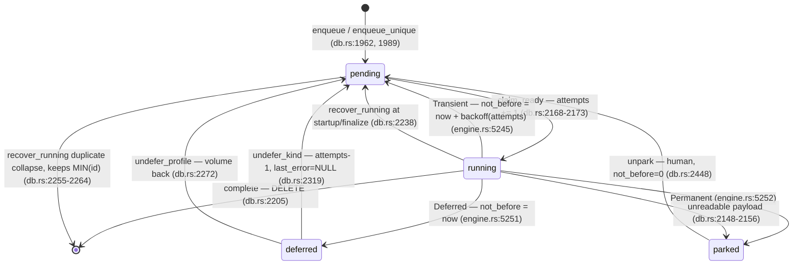

# Durable state & scheduling (`db.rs`, `backoff.rs`, `tasks.rs`, journal/tick, logging, `footprint.rs`)


## Scope read

| File | Ranges actually read |
|---|---|
| `src-tauri/crates/keeper-sync/src/db.rs` | 1–300, 299–538, 739–1023, 1159–1343, 1399–1503, 1679–1708, 1849–2273, 2273–2403, 2509–2623, 2759–2913, 3799–3963; greps over all 8466 lines for `prepare_cached` / `execute_batch` / `unchecked_transaction` / statement shapes / migration tests |
| `src-tauri/crates/keeper-sync/src/backoff.rs` | 1–181 (whole file) |
| `src-tauri/crates/keeper-sync/src/anomaly.rs` | 1–90 (whole file) |
| `src-tauri/crates/keeper-sync/src/footprint.rs` | 1–300 |
| `src-tauri/crates/keeper-sync/src/progress.rs` | 1–523 |
| `src-tauri/crates/keeper-sync/src/error.rs` | 1–143, 259–303 |
| `src-tauri/crates/keeper-sync/src/http.rs` | 1–300 |
| `src-tauri/crates/keeper-sync/src/tasks.rs` | structural map + 30–103, 1292–1295 |
| `src-tauri/crates/keeper-sync/src/engine.rs` | 1324–1463, 1539–1623, 1779–1835, 2059–2243, 3299–3423, 3454–3543, 3539–3623, 5086–5403, 7499–7563, 8559–8628, 12639–12693; greps for constants, `with_db`, in-memory maps, `enqueue_unique` sites, `materialized_rows` sites |
| `src-tauri/crates/keeper-sync/src/git/repo.rs` | 1879–1913 |
| `src-tauri/crates/keeper-sync/src/git/fetch.rs` | 239–333 |
| `src-tauri/crates/keeper-sync/src/git/cli.rs` | 1089–1138 |
| `src-tauri/crates/keeper/src/debug_log.rs` | whole file |
| `src-tauri/crates/keeper-syncd/src/main.rs` | 69–215 |
| `src-tauri/crates/keeper/src/sync_ipc.rs` | grep for `release_schedules` / `lfs_files` callers |
| `docs/sync.md` | 88–96, 1331–1393, 2999–3030, section index |
| `docs/performance.md`, `docs/constraints-and-limitations.md` | targeted greps |
| `../evidence-hesperia.md` | whole file, both revisions |

Not read (other lanes): git transport internals, LFS transfer, watcher, `browse.rs`, `stability.rs`.

---

## How it works

`sync.db` is one SQLite file shared by the app and `keeper-syncd`, opened at `db.rs:38` with `journal_mode=WAL`, `synchronous=NORMAL`, `foreign_keys=ON`, and no explicit `busy_timeout` (rusqlite arms 5 s; `db.rs:52-58` says so and names the test that pins it). `migrate` (`db.rs:70`) is one `execute_batch` of `CREATE TABLE IF NOT EXISTS` plus four additive `ensure_*_columns` helpers that read `PRAGMA table_info` and `ALTER TABLE ADD COLUMN` what is missing (`db.rs:312, 386, 433, 487`), plus one content rewrite guarded by a `meta` marker (`db.rs:264`). There are no numbered migrations and no `user_version`.

The engine holds one `Mutex<Connection>`; every access goes through `with_db` (`engine.rs:1553`), which takes the lock and runs a **synchronous** closure — including from `async fn drain` (`engine.rs:5121`, `5136`, `5152`, `5155`).

The supervisor ticks at `TICK_MS = 1_000` (`engine.rs:404`). `tick` (`engine.rs:2190`) runs host-wide tasks then each enabled profile's `tick_profile` (`engine.rs:3361`): volume gate → reservation → watcher → first-checkout gate → `remote_within_reach` → `drain_journal`. `drain` (`engine.rs:5121`) calls `release_satisfied_waits` (`engine.rs:5201`), backfills labels, claims up to `CLAIM_LIMIT = 16` rows (`engine.rs:358`) with `claim_ready` (`db.rs:2054`), executes each serially, and on failure calls `reschedule_after` (`engine.rs:5235`), which maps `Retriability` (`error.rs:260`) onto `Pending`+backoff / `Deferred` / `Parked` and then `record_failure` (`engine.rs:5271`).

`Backoff::default()` is base 2 s, cap 600 s, `jitter_pct = 100` (`backoff.rs:33-41`); `delay` clamps the exponent at 32 and randomises **downward** from the cap (`backoff.rs:60-77`).

Tasks are a pure cron dialect (`tasks.rs:545-1114`) with a pure `decide` (`tasks.rs:1292`); the lease is one conditional `UPDATE` whose affected-row count is the arbiter (`db.rs:3865-3872`).

---

## The journal state machine



Facts that follow from the shape:

- **`complete` is a `DELETE`** (`db.rs:2205-2207`) — the journal holds no history, which is why `activity` carries `unit_id` and reads "row gone ⇒ Success" (`db.rs:2872-2878`).
- **`enqueue_unique` dedups on `(profile_id, payload, state ∈ …)`**, and `running` counts as cover only for kinds where `covered_while_running()` is true (`db.rs:2008-2020`). Urgency and label are deliberately *not* in the payload so dedup is not broken by them (`db.rs:433-445`).
- **`recover_running` is the only thing that rescues `running`** (`db.rs:2238-2242`); it also collapses duplicate `pending` rows to `MIN(id)`.
- **`deferred` has no timer.** Only `release_satisfied_waits` (`engine.rs:5201`) and `undefer_profile` release it. It is *not* a network call for an HTTPS remote: `lfs::local::remote_store(&profile.remote_url)` returns `None` for `https://`, so the first arm is skipped and only an indexed `COUNT(*)` runs (`engine.rs:5209-5232`). For a `file://` remote it is a filesystem reachability probe **every drain, i.e. once per second**.
- **There is no attempt ceiling anywhere.** No `MAX_ATTEMPTS`, no `attempts > n` predicate in the crate. A `Transient` unit retries forever; `backoff.rs:62` documents this explicitly ("a profile pointed at a dead host retries forever").

---

## Computed retry cadence vs. the observed one

$$\text{delay}(a, r) = \text{capped} \cdot r, \qquad \text{capped} = \min(2000 \cdot 2^{a-1},\; 600000)\ \text{ms}$$

so the delay is **uniform on $[0, \text{capped}]$**, mean $\text{capped}/2$ (`backoff.rs:60-77`).

| attempt | capped | jitter range | mean gap |
|---|---|---|---|
| 1 | 2 s | [0, 2] | 1 s |
| 2 | 4 s | [0, 4] | 2 s |
| 3 | 8 s | [0, 8] | 4 s |
| 5 | 32 s | [0, 32] | 16 s |
| 9 | 512 s | [0, 512] | 256 s |
| ≥ 10 | **600 s** | [0, 600] | **300 s** |

Cumulative mean time to reach the ceiling ≈ 511 s (≈ 8.5 min, 9 attempts). **The cap is per unit row, not per profile** — three profiles each holding one `pull` row are three independent schedules; nothing coordinates them and nothing rate-limits per host.

**Steady-state prediction:** mean gap ≈ 300 s + attempt duration. `http::CONNECT_TIMEOUT` is 15 s (`http.rs:52`), so ≈ 315 s ⇒ ≈ 11.4 attempts/hour/row, ≈ 274/day/row, ≈ **1 645 per row over the 6-day outage**.

**Observed:** 615 / 549 / 559 attempts on the three `pull` rows; `sync retrying` 53 lines in ~3 days.

**Reconciliation** — the gap is real and has three named causes, all verified in code:

1. **Two of the three profiles were not draining at all for most of the window.** `neuradrive` and `tgdrive` are on `/Volumes/merope`, re-attached 09-07; `tick_profile`'s volume gate returns before `drain_journal` when the volume is absent (`engine.rs:3365-3371`). Only `tgdrive-light` retried for 09-02→09-07.
2. **`attempts` is cumulative over the row's whole life**, never reset except by `undefer_kind`'s `MAX(attempts−1,0)` (`db.rs:2319`). 615 is not "attempts since the outage".
3. **Most attempts log nothing.** `record_failure`'s `Network` arm logs at `tracing::debug!` (`engine.rs:5318`), and both subscribers install a bare `EnvFilter::new("info")` with no `RUST_LOG` in the macOS bundle (`debug_log.rs:125-129`). Every LFS-leg failure classified `Network` is **invisible in the field log**; the 53 `sync retrying` lines are only the *fetch* leg, misclassified as `Git` (F-db-1). 53 lines ÷ ~3 days on the one always-mounted profile ≈ one fetch attempt every 82 min — still ~16× slower than the 315 s the schedule promises, which is the residual I could not settle from code alone (Open questions §1).

---

## Every table: rows on hesperia, growth bound, indexes

| Table | Rows on hesperia | Growth bound | Indexes | Notes |
|---|---|---|---|---|
| `profiles` | 3 | user-created | PK `(id)` | one JSON blob per row; `json_set` migration at `db.rs:277` |
| `journal` | 7 live (3 `pull\|pending`, 2 `lfsUpload\|pending`, 2 `push\|deferred`) | **unbounded** — one row per queued unit; deleted only on success | PK `(id)` AUTOINCREMENT; `journal_ready(state, not_before_ms)`; `journal_by_profile(profile_id, state)` | **no index on `kind`**, **none on `payload`** — see F-db-4, F-db-11 |
| `file_state` | **0** | paths inside a settle window; full `DELETE`+re-insert per save (`db.rs:2582-2612`) | PK `(profile_id, path)` | 0 is **correct**: the sampled walks show `added=modified=deleted=0`, so the gate held nothing. `entries=26` in the walk line is `watchdog.beats()` (`git/repo.rs:1898`), an unrelated counter — the two numbers are not comparable |
| `activity` | **1 500 = 3 × 500** | capped at `ACTIVITY_CAP = 500` per profile, trimmed inside the insert's transaction (`db.rs:2611, 2818-2825`) | PK `(id)`; `activity_recent(profile_id, id DESC)` | exactly as designed |
| `materialized` | **89 289** | **paths-ever-hydrated per profile; never pruned** — `forget_materialized` stamps `released_at_ms` instead of deleting (`db.rs:1417-1430`); `db.rs:1383`: "there is no `DELETE FROM materialized` anywhere in this crate" | PK `(profile_id, path)` **only** | documented limitation, but see F-db-7 (`delete_profile` leaks it) and F-db-5 (whole-table read per browse) |
| `tasks` | not sampled | user/host-created, single digits | PK `(id)` | no index on `next_due_ms`; `list_tasks` reads all and `decide` is pure Rust — right call at this scale |
| `task_runs` | not sampled | capped at `TASK_RUNS_CAP = 50` per task, trimmed in the claim's transaction (`db.rs:2909, 3920-3931`) | PK `(id)`; `task_runs_recent(task_id, id DESC)` | `finished_ms IS NOT NULL` in the trim protects an in-flight row |
| `device` | 1 | singleton, `CHECK (singleton = 0)` | PK | |
| `meta` | ≥ 1 (`lfs_prune_local_default_on`) | one row per one-shot content migration | PK `(key)` | |

---

## Findings

### F-db-1 A dead remote never produces `Offline`, so the folder keeps paying for full walks — P1, effort S

**Evidence.** `git::fetch::classify` falls through to the `Git` variant when no needle matches:

```rust
// git/fetch.rs:268-269
cli::classify_message(&message, host, Some(host), &[])
    .unwrap_or_else(|| SyncError::Git(format!("{operation} from {host} failed: {message}")))
```

The needle list (`git/cli.rs:1109-1120`) is ten substrings: `could not resolve host`, `connection refused`, `connection timed out`, `connection reset`, `network is unreachable`, `failed to connect to`, `unable to access`, `the remote end hung up unexpectedly`, `early eof`, `operation timed out`. The observed hesperia text is `tcp connect error: deadline has elapsed` — **it matches none of them**, and the log line proves the fallthrough fired: `sync retrying … error=git object store failure: fetch from electra…`, where `git object store failure:` is `SyncError::Git`'s Display (`error.rs:168`).

`record_failure` sets `Offline` only for the `Network` variant (`engine.rs:5314-5317`); everything else transient takes the `sync retrying` arm (`engine.rs:5320-5321`). `remote_within_reach` — the gate that stops an offline folder walking — returns early unless the state is exactly `Offline` (`engine.rs:3504-3506`).

**Why.** Direct cause of the headline symptom: **1 371 full 155 626-entry status walks in one session on `tgdrive`, p90 5.3 s, max 61 s, with the remote unreachable for six days.** The gate documented at `engine.rs:3480-3484` as existing precisely to stop this never engages. It also breaks `docs/sync.md:1348`'s promise (`tgdrive — offline, 12 waiting`) and emits a WARN per attempt where AD-49 says offline is not a failure.

**Fix.** Classify at the source: `gix::remote::fetch::Error` carries a transport cause — match on it (or `reqwest::Error::is_connect()/is_timeout()` at the boundary) and return `Network`. Keep the substring list as a fallback for the `git` shim only; add `tcp connect error` / `deadline has elapsed` to it now as the one-line stopgap.

---

### F-db-2 The "failed N times in a row" counter is reset by the very tick that increments it — P1, effort S

**Evidence.** `record_failure` increments inside `drain`:

```rust
// engine.rs:5327-5333
let consecutive = { … *counter = counter.saturating_add(1); *counter };
if consecutive >= TRANSIENT_FAILURES_BEFORE_WARNING {
```

but `drain` returns `Ok(())` after handling a unit failure through `reschedule_after` (`engine.rs:5155-5157`), so `tick_profile` returns `Ok(())`, and:

```rust
// engine.rs:2197-2200
match self.tick_profile(&profile).await {
    Ok(()) => { Self::lock(&self.transient_failures).remove(&profile.id); }
```

**Why.** `TRANSIENT_FAILURES_BEFORE_WARNING = 3` (`engine.rs:711`) is unreachable for any failure raised *inside* a drain — which is every unit failure. The counter tops out at 1 and is wiped on the same tick. The consequence is exactly the one `engine.rs:5339-5345` says it was written to prevent: "a run of transient failures used to leave the card reading whatever it read before … while the queue retried in a loop nobody could see." On hesperia that is what the folder pane shows after six days offline.

**Verification gap.** The only test, `a_run_of_transient_failures_stops_calling_the_profile_healthy` (`engine.rs:13906`), calls `engine.record_failure(&p, &err)` **directly in a loop** — never through `tick`, so the reset at 2199 is invisible to it. Satisfied-by-assertion-only: the contract at `engine.rs:960` ("Reset by any success") is asserted, the path is not.

**Fix.** Have `drain` report whether any unit failed (or clear the counter at the `complete` site, `engine.rs:5152`, instead of in `tick`), and add a test that drives `tick()` three times against a failing unit and asserts the warning and `NeedsAttention`.

---

### F-db-3 The one line that says a profile went offline is `debug!`, which no shipped macOS build can emit — P2, effort S

**Evidence.** `engine.rs:5318`: `tracing::debug!(profile = profile.name, error = %err, "sync offline");`. Both subscribers install a bare level filter with no per-target directive:

```rust
// keeper/src/debug_log.rs:126-129
.with_env_filter(EnvFilter::try_from_default_env()
    .unwrap_or_else(|_| EnvFilter::new("info")))
```

`keeper-syncd/src/main.rs:178-181` does the same (`default_level(0, …) == "info"`). `keeper-core/src/notes/default_spaces.rs:333-336` already records the finding for its own module: "**`tracing::debug!` is dead code in production**, on stderr and in `keeper.log` alike."

**Why.** Every `Network`-classified failure writes nothing. The field log cannot answer "when did this folder go offline and how often has it retried" — the first question of a support case, and the reason the observed `sync retrying` count cannot be reconciled with `attempts`.

**Fix.** Promote the offline *transition* (not every attempt) to `info!` through the same sticky once-per-onset channel `warn` uses, so entering and leaving `Offline` each log once.

---

### F-db-4 `enqueue_unique` dedups on an unindexed TEXT payload — O(n²) to queue a backlog — P1 at the stated 100k-object target, effort M

**Evidence.**

```sql
-- db.rs:2009-2013
SELECT id FROM journal
 WHERE profile_id = ?1 AND payload = ?2 AND state IN ('pending','deferred','running')
 ORDER BY id LIMIT 1
```

The only usable index is `journal_by_profile(profile_id, state)` (`db.rs:104-105`); `payload` is unindexed. The caller is an unbounded per-object loop:

```rust
// engine.rs:8604-8619
for smudge in &pending { … let id = db::enqueue_unique(conn, &profile.id, &unit, now, now)?;
                              db::label_unit(conn, id, &label) … }
```

**Why.** On a first `materialize`-mode pull of ~100 000 LFS objects this performs ~100 000 prefix scans over a journal growing to 100 000 rows, each comparing a JSON payload string: $\approx 5\times10^{9}$ row comparisons, single-threaded, holding the connection mutex, on a tokio worker. The 53 GB folder already reached 106 units (`db.rs:1820-1821`); 100 k is three orders of magnitude further. The same table is then scanned with a `json_extract` per row once per second by `fill_queued` (F-db-11).

**Fix.** Add `CREATE INDEX IF NOT EXISTS journal_dedup ON journal (profile_id, payload)` in `migrate`, or store an indexed `dedup_key` (payload hash, or `oid` for transfer kinds) and match on that. Either is additive and idempotent.

---

### F-db-5 The whole `materialized` ledger is read on the tokio runtime on every Files-pane browse — P2, effort S

**Evidence.** `db::materialized_rows` selects every non-released row for a profile into a `Vec<MaterializedRow>` (`db.rs:1266-1310`). `Engine::release_schedules` calls it through `with_db` — no `spawn_blocking` — and its own doc argues that is fine:

```rust
// engine.rs:12639-12641 (doc), 12667-12674 (body)
/// … both are indexed `SELECT`s over a table with a row per materialized path,
/// and there is nothing here to move off the runtime.
let rows = db::materialized_rows(conn, profile_id)?;
```

`sync_ipc.rs:3236` calls it unwrapped inside the async `sync_browse` command, once per folder listing.

**Why.** 89 289 rows on hesperia — nine columns each with a `String` path, order 10–15 MB allocated and dropped per browse, with the mutex held throughout, blocking the tokio worker and every other profile's tick. The neighbouring call `lfs_files` *is* wrapped (`sync_ipc.rs:3096`) and cached for 60 s (`sync_ipc.rs:2996`); this one is neither. The doc's claim was true at the size it was written for and is now stale.

**Fix.** Wrap in `spawn_blocking` as `browse_marks_for` does, and narrow the query to the subpath prefix the listing is about instead of the whole ledger.

---

### F-db-6 Ledger writes are one auto-commit transaction and one SQL compile per path; `prepare_cached` is used nowhere — P2, effort M

**Evidence.** Two separate `with_db` calls per materialized file, each a bare `conn.execute` (auto-commit, freshly prepared):

```rust
// engine.rs:8583, 8589-8598
self.with_db(|conn| db::remember_materialized(conn, &profile.id, &landed, now))?;
self.with_db(|conn| db::note_arrival(conn, &profile.id, &landed, now, &smudge.pointer.oid, …))?;
```

Counted across `db.rs`: `prepare_cached` **0**, `conn.execute(` 49, `conn.prepare(` 17, `unchecked_transaction` 12, `execute_batch` 8. The commit leg has the same shape (`engine.rs:7538-7540`, one `note_local_authorship` per staged upload).

**Why.** Materializing $K$ objects costs $2K$ statement compilations, $2K$ mutex acquisitions and $2K$ WAL commits. The two batched paths — `save_file_state` (`db.rs:2582-2612`) and `record_activity` (`db.rs:2790-2826`) — get this right and document why ("N rows cost N+1 commits — each a WAL frame write"), so the pattern exists in the file and is simply not applied to the per-path ledger writes, which are the ones that run at 100k scale.

**Fix.** Fold `remember_materialized`+`note_arrival` into one upsert (same row, an instant apart), and give the smudge loop one `unchecked_transaction` with a `prepare_cached` statement, as `save_file_state` does.

---

### F-db-7 `delete_profile` leaves every `materialized` row behind, and is not a transaction — P2, effort S

**Evidence.**

```rust
// db.rs:1683 (doc) — "Delete a profile and every journal/file-state/activity row belonging to it."
// db.rs:1686-1702 — journal, file_state, activity, task_runs, tasks, profiles. No `materialized`.
```

Six statements, no `unchecked_transaction`, unlike `delete_task` (`db.rs:4146-4148`) which uses one.

**Why.** `materialized` is the largest table in the file (89 289 rows) and the one feeding a **deletion** sweep. Removing a folder leaves its whole ledger forever; re-adding a folder with the same id — which `keeper-syncd`'s `config.toml` lets an operator do by hand — inherits it, and the release sweep's candidate list (`engine.rs:9799-9800`) then spends its 32-attempt/1 GiB budget on paths whose content is not there. That is precisely the failure the `activity` `DELETE` two lines above is commented as preventing ("a re-created profile reusing the id would inherit the deleted one's history"). No data is destroyed — `release_resolved` re-proves the pointer and the remote before deleting — hence P2, not P0. The missing transaction means a crash mid-delete leaves the profile row gone with its journal intact and unreachable.

**Fix.** Add `DELETE FROM materialized WHERE profile_id = ?1` and wrap all seven statements in `conn.unchecked_transaction()`.

---

### F-db-8 There is no log rotation, and library WARN/ERROR is written to disk even with debug mode off — P2, effort M

**Evidence.** `debug_log::GatedWriter::write` opens the file per event and appends; nothing anywhere truncates, renames or size-caps it (`debug_log.rs:97-113`). The gate deliberately lets problems through with the toggle off:

```rust
// debug_log.rs:88-93
let is_problem = *meta.level() <= tracing::Level::WARN;
GatedWriter { to_file: enabled() || is_problem }
```

and the filter is level-only, with no per-target directive (`debug_log.rs:126-129`; daemon identically at `keeper-syncd/src/main.rs:178-181`). A workspace-wide grep for rotation logic finds none — the `.1786234-oversized` sibling was not produced by keeper.

**Why.** `gix_attributes::search::attributes` and `gix_worktree_state::checkout::chunk` are third-party targets that emit WARN/ERROR **per path per lookup**. On hesperia: **1 314 669 WARN lines from one mis-stored `.gitattributes` pointer and 588 408 ERROR lines from one checkout into a non-empty directory** — 1.33 GB in the oversized sibling plus 895 MB live, all written whether or not the owner opted in. There is also one `open(2)`/`close(2)` pair per line (`debug_log.rs:104-112`), ~4.35 M opens over the month. Keeper's *own* per-pass lines are fine: `status walk finished` is one INFO per walk (`git/repo.rs:1893-1903`) and the blob-threshold anomaly fires once per `SWEEP_EVERY_MS = 3_600_000` per profile (`engine.rs:471`, `3602-3609`), matching the 75 observed lines in 3 days. **I found no keeper `tracing::info!/warn!/error!` inside a per-path or per-walk loop.**

**Fix.** (a) Add `gix_attributes=error,gix_worktree_state=error` to the default `EnvFilter` in both subscribers — one line each, removing 1.9 M of the 4.35 M lines. (b) Replace the per-event `OpenOptions` with a held handle plus a size check that renames to `keeper.log.1` past e.g. 64 MiB, keeping two generations.

---

### F-db-9 Migration is a read-then-ALTER race between the app and the daemon — P2, effort S

**Evidence.** Every `ensure_*_columns` reads the column list, drops the statement, then alters, with nothing serialising the pair:

```rust
// db.rs:488-503 (same shape at 313, 387, 434)
let existing: Vec<String> = stmt.query_map([], |r| r.get::<_, String>(1))? … ;
drop(stmt);
if !existing.iter().any(|c| c == "on_missed") { conn.execute("ALTER TABLE tasks ADD COLUMN …") }
```

`db.rs:36-37` states the two processes open the same file with no migration coordinator, and `db.rs:460-461` confirms "the app and the daemon share one `sync.db` and are upgraded separately".

**Why.** Two processes starting together after an upgrade can both observe the column missing; the loser gets `duplicate column name`, which propagates out of `open` and **fails startup** — the exact failure mode `db.rs:4854` names ("because the failure mode is a daemon that cannot start").

**Fix.** Wrap each `ensure_*` in `BEGIN IMMEDIATE`/`COMMIT`, or tolerate the error: match `SQLITE_ERROR` whose message contains `duplicate column name` and treat it as success. Two lines.

---

### F-db-10 A `file://` remote can put a deferred push into a 1 Hz loop with no backoff growth — P2, effort S, `[INFERENCE]`

**Evidence.** `release_satisfied_waits` releases every deferred `push` whenever no uploads are outstanding, regardless of why it was deferred:

```rust
// engine.rs:5225-5228
if self.lfs_uploads_outstanding(profile)? == 0 {
    let released = self.with_db(|conn| db::undefer_kind(conn, &profile.id, WorkKind::PUSH, now_ms))?;
```

`undefer_kind` refunds the attempt (`db.rs:2319-2322`, `attempts = MAX(attempts - 1, 0)`), and `reschedule_after` parks a `Deferred` unit at `not_before = now` (`engine.rs:5251`).

**Why.** A push deferred as `MediaAbsent` because the **remote** folder is unmounted (the case `engine.rs:5216-5231` was written for) is released on the next drain, re-attempted, re-deferred, refunded — a `git push` every tick, forever, with the backoff never growing because the counter oscillates. Not reachable on hesperia (HTTPS remote, two uploads genuinely outstanding), so the loop itself is `[INFERENCE]`; every ingredient is verified.

**Fix.** Scope the PUSH release to pushes actually deferred by `LfsUploadPending` (match `last_error`, or record the deferral reason in a column), and do not refund the attempt for a `MediaAbsent` deferral.

---

### F-db-11 Three docstrings claim indexes that do not exist — P3, effort S

**Evidence.**
- `db.rs:2293` — "`kind` is the [`WorkKind::tag`] spelling, so this filters on **the indexed `kind` column**". There is no index on `journal.kind` (`db.rs:104-107` declares only `journal_ready` and `journal_by_profile`).
- `engine.rs:6696` — "the answer costs **one indexed `COUNT(*)`** on every push" for `outstanding_count`, which filters `profile_id AND kind` (`db.rs:2334-2337`) and can only use the `profile_id` prefix.
- `engine.rs:1800-1801` — "**One indexed aggregate** over a table holding a queue, on a path polled every couple of seconds" for `queued_transfers`, whose predicate is `json_extract(payload, '$.size') IS NOT NULL` (`db.rs:1474-1479`) — not indexable at all, and a JSON parse per row.

**Why.** Harmless at 7 rows; actively misleading at the 100k-unit scale the owner is asking about, because these three sentences are what a future reader would rely on to decide the calls are free. At 100 k queued rows `fill_queued` alone is $3 \times 10^{5}$ JSON parses per second on a tokio worker.

**Fix.** Either add `journal_kind(profile_id, kind, state)` and a real `size_bytes` column populated at enqueue, or correct the three sentences to say "profile-prefixed scan".

---

### F-db-12 `PRAGMA foreign_keys = ON` is a no-op — P3, effort S

**Evidence.** `db.rs:51` sets it; no `CREATE TABLE` in `migrate` (`db.rs:71-231`) declares a `FOREIGN KEY`, and `db.rs:207-210` / `db.rs:1685-1686` say the absence is deliberate ("Deliberately no foreign key, in either direction"; "the journal is intentionally decoupled").

**Why.** A declaration that renders nothing, sitting next to a comment explaining why it must render nothing. A reader adding a child table later will reasonably assume cascades are enforced — and F-db-7 is what that assumption already cost once.

**Fix.** Drop the pragma and keep the two comments, or keep it with a one-line note at `db.rs:51` that it is armed for future tables and enforces nothing today.

---

### F-db-13 The hourly blob-threshold anomaly costs a second full 155 626-path walk per profile, to re-report a condition it calls permanent — P2, effort S

**Evidence.** `footprint::blobs_over_threshold` walks every tracked path with one index pointer lookup and one `symlink_metadata` each:

```rust
// footprint.rs:262-276
for rela in tracked {
    if lfs::stage::indexed_pointer(repo, rela).is_some() { continue; }
    let Ok(meta) = std::fs::symlink_metadata(root.join(rela)) else { continue };
```

driven hourly from `sweep_scratch_if_due` → `report_blobs_over_threshold` (`engine.rs:3574, 3588-3611`), whose own anomaly text is `consequence=history keeps them as blobs for good; the cost is permanent and known, and nothing new is being added to it`.

**Why.** 155 626 `lstat`s plus 155 626 index lookups, per profile, per hour, on a USB APFS volume — on top of the status walks. The finding is by its own words unchanging (`measured=files=600 bytes=1958664573`, identical across all 75 observed lines). It runs in `spawn_blocking` so it does not stall the runtime, but it is real I/O contention against the walk that is already too slow.

**Fix.** Memoise on `(HEAD commit, threshold)`: if neither moved since the last report, re-emit the cached numbers without walking. Both are one cheap read.

---

### F-db-14 `footprint::measure` is documented as sub-second and is not, at this folder's size — P3, effort S

**Evidence.** `footprint.rs:100-104`: "On the folder that prompted it — 210 GB, a few thousand entries — that is a sub-second walk, which is why it can be asked for on demand rather than cached." `measure` (`footprint.rs:106-137`) does `tree_bytes(root)` over the *entire* worktree and `.git` (573 GiB used on `/Volumes/merope`), `tree_bytes` over `.git/lfs/objects` (4.8 GB / 23 487 objects), `lfs::prune::plan` over all tracked paths, and `tracked_tally` = one `metadata` + one index lookup per tracked path.

**Why.** On `tgdrive` that is ~155 626 tracked paths plus a full recursive `read_dir` of a 573 GiB tree. The "few thousand entries" premise no longer holds; a UI calling this on demand blocks for the same order as a status walk. What it *measures* is right — the decomposition (`on_disk` ⊃ `lfs_cache` + `scratch`; `content` from pointer sizes so a virtual folder still knows its weight; `virtual_paths`/`materialized_paths` classified arm-for-arm with `lfs::listing`) is correct, and its edge cases (missing file contributes 0, symlinks contribute 0, non-file counts as neither) are deliberate and tested.

**Fix.** Restate the cost honestly ($O(\text{tree entries})$ plus one `stat` per tracked path) and have the caller cache it with a TTL, as `browse_marks_for` already does for `lfs_files`.

---

## What is correct / well done

- **The lease is genuinely safe.** `claim_task` is one conditional `UPDATE` gated on `enabled`, `mode <> 'off'`, `running_host IS NULL OR lease_until_ms <= ?4`, **and** `next_due_ms <= due_at_most`, with the claim, the abandonment write and the run insert in one transaction (`db.rs:3865-3898`). Two hosts cannot both claim; the `due_at_most` term closes the same-window race a lease alone cannot. `is_row_contention` turns `SQLITE_BUSY` into `Ok(None)` rather than an error (`db.rs:4013`).
- **`backoff.rs` is exemplary.** Pure, clock-free, RNG-free; exponent clamped at 32 so `u32::MAX` attempts cannot wrap; jitter applied *downward* so `max` really is a maximum — with a test for each of those claims including the overflow one (`backoff.rs:118-158`).
- **Both bounded tables are bounded inside the insert's own transaction**, trimmed by `id` and not `ts_ms` with the reason written down (a batch shares a millisecond), and the index matches the trim (`db.rs:2611-2625`, `2818-2826`, `3920-3931`). hesperia's 1 500 = 3 × 500 confirms the cap holds in the field.
- **`save_file_state` is the right shape**: one transaction for `DELETE`+N inserts, one prepared statement reused, with both the correctness reason and the N+1-commits cost reason documented (`db.rs:2557-2612`).
- **Migrations are additive, idempotent, and actually tested against synthesized older schemas** — columns dropped, legacy rows hand-written, `migrate` re-run, and an older binary's column-naming `INSERT` replayed against the migrated schema (`db.rs:4167-4171`, `4648-4659`, `4774`, `4831-4858`, `6242-6286`, `6940-6967`, `7011-7040`). The NFR-43 rule (late columns must be nullable or defaulted) is stated in the schema itself (`db.rs:186-190`) and each column's choice justified individually.
- **Unreadable rows are skipped, never fatal**, for profiles, activity kinds, task kinds and task runs — and where the skip could lie, a second query exists to answer it (`unreadable_profile_ids`, `db.rs:1644`).
- **`recover_running` is the whole crash story in two statements** (`db.rs:2238-2266`), invoked both at open (`engine.rs:1350`) and at finalize (`engine.rs:2165-2167`).
- **`outstanding_count` vs `live_count`** is a genuinely subtle distinction — a parked upload is the strongest possible "no" for publishing *and* the strongest possible "no" for "is anything moving" — and both the split and its reason are written down (`db.rs:2326-2331`, `2371-2378`).
- **No unbounded in-memory growth found in `progress.rs`.** `RateMeter` holds two `Option`s; `TransferTally`'s `HashMap` lives for exactly one `do_lfs` call (`engine.rs:8001`); the sink `Vec` drops sinks that return `false` (`engine.rs:1836-1839`). Engine maps are keyed by profile id and removed on delete/pause (`engine.rs:1722-1724`, `10107-10112`). The one path-keyed map, `collapsed_reported: HashSet<(String, PathBuf)>` (`engine.rs:947`), grows only on collapsed-pointer discovery and is bounded by the tree — deliberately once-per-path to avoid "a 1.2 GB log".
- **`release_satisfied_waits` costs nothing on an HTTPS profile** — the filesystem-remote arm is skipped by `remote_store` returning `None`, so the per-drain cost is one profile-prefixed `COUNT(*)`.
- **`docs/sync.md:1341-1342` matches the code exactly**: "exponential backoff with full jitter (2 s base, 10 min ceiling)"; and "connectivity is observed from outcomes, never polled" is true — there is no reachability probe anywhere.

---

## Open questions I could not settle

1. **The residual cadence gap.** Even accounting for the two USB profiles being `MediaAbsent` until 09-07 and for `Network` failures logging nothing (F-db-3), 53 `sync retrying` lines over ~3 days on the one always-mounted profile implies ~82 min between fetch attempts against a schedule whose ceiling is 10 min. Candidates I could not discriminate from source alone: the profile reservation being held by a status walk (p90 5.3 s, max 61 s) when the unit becomes due; `scan_due`/`sync_poll_permits` pacing; or the pull unit failing in a leg that classifies `Network`. **The log's own timestamps for those 53 lines would settle it in one pass** — the inter-arrival distribution is the answer.
2. **Which connect deadline produced `tcp connect error: deadline has elapsed`.** `http::CONNECT_TIMEOUT` is 15 s (`http.rs:52`), but that client is keeper's `reqwest`, not gitoxide's fetch transport; the wording is hyper-util's. Whether gix reads `http.connectTimeout` from the repo config (not set on hesperia) or uses its own default changes the per-attempt duration in the cadence arithmetic. `[INFERENCE]`
3. **Whether `sync.db.bak-20260731` opens cleanly under today's `migrate`.** The synthesized-old-schema tests are the right shape and I credit them, but nothing has been run against a real pre-Story-56 file. A five-minute check on hesperia (`keeper-syncd --data-dir <copy> status`) I could not run from here.
4. **`materialized` = 89 289 vs 72 641 LFS-tracked index paths on `tgdrive`.** The total spans three profiles and includes rows stamped `released_at_ms`, so it is consistent with the documented "paths-ever-hydrated" bound — but `SELECT profile_id, COUNT(*), COUNT(released_at_ms) FROM materialized GROUP BY 1` would show how much of the table is retired rows, and therefore how much F-db-7 is actually costing.
5. **`sync.db` has no maintenance at all** — no `ANALYZE`, no `PRAGMA optimize`, no `VACUUM`, no `wal_checkpoint(TRUNCATE)` anywhere in the crate. WAL is bounded by SQLite's default 1000-page autocheckpoint so this is not a growth hazard, and the planner's choices are trivial at these row counts; it becomes a question only at F-db-4's 100k-unit journal. Noted rather than filed — and it is the same shape as the `GitCli::gc`-has-no-production-caller fact: keeper performs no scheduled maintenance on either of its two stores.
