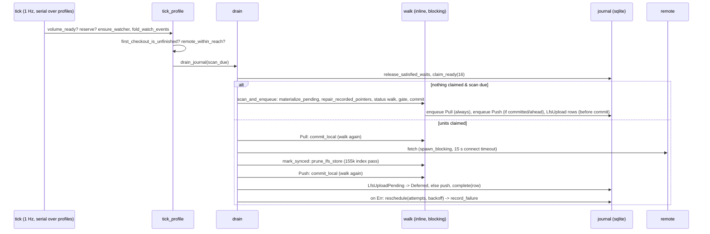

# Lane: Engine — supervisor loop, journal, backoff, cadences

## Scope read
- `src-tauri/crates/keeper-sync/src/engine.rs`: 1–300 (types), 357–862 (constants), 918–1249 (Engine fields), 1440–1560 (walk claim / walk policies / lock helper), 1975–2075 (warn/clear_warning), 2122–2295 (`run`, `finalize`, `tick`, `run_due_tasks`), 3361–3560 (`tick_profile`, first-checkout gate, `remote_within_reach`, `scan_is_due`), 3560–3845 (sweeps, `release_is_due`, `scan_due`, `settle_window_elapsed`, `ensure_watcher`), 3936–4060 (`fold_watch_events`), 4220–4262 (`ensure_gate`), 5087–5400 (`drain*`, `release_satisfied_waits`, `reschedule_after`, `record_failure`, `refresh_pending`, `volume_ready`), 5526–5620 (`reserve`, `execute`), 5714–5755 (`mark_synced`), 5834–5903 (`open_repo`), 6097–6360 (`do_pull`), 6576–6740 (`repair_recorded_pointers`, `commit_local`, outstanding counts), 6840–7010 (`reconcile_and_retry_push`, `do_push`), 7109–7340 (`collect_stable_changes`), 7352–7575 (`commit`), 8473–8560 (`materialize_pending`), 8968–9190 (`sync_once`, `prune_lfs_store`), 9380–9470 (`sync_poll_permits`), 10102–10114 (`wake_now`), 12399–12473 (`pending` walk), 12760–13008 (`has_unpushed_commits`, `scan_and_enqueue`).
- `src/backoff.rs` (whole), `src/error.rs:259–303`, `src/db.rs:1741–1760, 1851–1870, 1989–2260, 2316–2392`, `src/http.rs:52–107`, `src/profile/mod.rs:120–260, 1089–1105`, `src/stability.rs:560–635`, `src/watch.rs:91–119, 525–571`, `src/lfs/stage.rs:940–1000, 1240–1300`, `src/lfs/prune.rs:40–140`, `src/footprint.rs:160–215`, `src/git/fetch.rs:240–270`, `src/git/cli.rs:305, 397, 1105–1130`.
- Shell: `crates/keeper/src/lib.rs:585–650`, `crates/keeper/src/sync.rs:416–480`, `crates/keeper/src/notes_vault.rs:585–627, 2590–2930`.
- `docs/sync.md` §3, §4, §11, §18, §19 (§14 via `sync_poll_permits`), `../evidence-hesperia.md` (all, including the object-store addendum).

## How it works (≤ 300 words, with file:line anchors)

`Engine::run` (engine.rs:2122) is a 1 Hz `tokio::time::interval` (`TICK_MS`, :404) with `MissedTickBehavior::Delay` (:2126). Each `tick` (:2172) drains finished-path assertions, reads every profile from SQLite, retires stale watchers, runs due tasks (`run_due_tasks`, :2222 — one `list_tasks` query per tick), then **iterates profiles serially** (:2192–2202): `sweep_scratch_if_due` (hourly, `SWEEP_EVERY_MS` :471) and `tick_profile` (:3361).

`tick_profile`: volume gate (:3365) → per-profile reservation (`busy`, :3372/:5526) → `ensure_watcher` (:3754) → `fold_watch_events` (:3936; sets `watch_wake`, `untracked_appeared`) → first-checkout gate (:3399) → `remote_within_reach` (:3504: skips the tick only when state is `Offline` **and** no journal row is due) → `scan_due` (:3726 = paced poll ∧ tasks-governance ∨ watcher wake ∨ settle window elapsed) → `drain_journal` (:5087).

`drain` (:5119): `release_satisfied_waits` (:5201 — un-defers pushes when `outstanding_count`==0, uploads when a file remote is reachable) → `claim_ready` (db.rs:2054; up to `CLAIM_LIMIT`=16, FIFO by urgency, marks `running`, `attempts+1`) → if nothing claimed and the scan is due: `scan_and_enqueue` (:12837) = clear wake → `materialize_pending` → **enqueue `Pull` unconditionally** (:12855) → `commit_local` (walk, gate, commit; :12864) → enqueue `Push` if committed or ahead. Else execute each claimed unit serially (:5146): `Pull` → `do_pull` (:6097: `commit_local` first :6115, fetch in `spawn_blocking` :6132, ancestry → ff-merge → `converge_with_conflict_copies` :6267) then `mark_synced` (:5714: `prune_lfs_store` + hourly `release_expired`); `Push` → `do_push` (:6892: `commit_local` :6901, refuse with `LfsUploadPending` if any upload row exists :6906, `push_once`, reconcile on `Diverged`); LFS units → `do_lfs`. Uploads are journaled **before** the commit that references them (:7452–7480).

Journal states (db.rs:1851): `Pending` (claimable when `not_before_ms ≤ now`), `Running`, `Deferred` (condition, not clock), `Parked` (human). There is no `failed`/`done`: done = row deleted (`complete`, db.rs:2205); failed = `Parked`. `reschedule_after` (:5235) maps `Retriability` (error.rs:260): Transient → `Pending` + `Backoff::default()` (2 s·2^(n−1), cap 600 s, full jitter, backoff.rs:35–74, **no attempt ceiling**); Deferred → `Deferred`; Permanent → `Parked`.

## Findings

### F-engine-1 Transport timeout wording is not classified as `Network`, so the profile never goes `Offline` and the offline gate designed in Story 56.15 never engages — P1, effort S
Evidence: hesperia log: `sync retrying … error=git object store failure: fetch from electra… tcp connect error: deadline has elapsed` (53 lines) while the remote has been down 6 days. `git/fetch.rs:256-270` classifies by substring via `cli::classify_message`, falling back to `SyncError::Git(...)`; the needle list `git/cli.rs:1109-1120` has no `tcp connect error`, `deadline has elapsed`, or bare `timed out`. `error.rs:288` makes `Git(_)` Transient-but-not-Network; `engine.rs:5314-5321` sets `Offline` only for `SyncError::Network`, everything else logs "sync retrying". `remote_within_reach` (`engine.rs:3504-3509`) gates only on `ProfileState::Offline`.
Why: The whole "don't spend the folder's tree on a remote that is not answering" mechanism is dead for the most common macOS/reqwest failure text. Result on hesperia: 1 371 full walks of 155 626 entries in three days with nothing publishable, three profiles each burning a 15 s connect timeout per retry, and the folder pane never saying "offline".
Fix: Classify by error *type* in `git::fetch::classify` (reqwest `is_connect()`/`is_timeout()`, `std::io::ErrorKind::{TimedOut,ConnectionRefused,…}` walking the gix error chain) and keep the substring list as a fallback with `tcp connect`, `deadline has elapsed`, `timed out` added. Add a test with the exact hesperia string.

### F-engine-2 The "sync has failed N times in a row" escalation can never fire for journaled units — P1, effort S
Evidence: `engine.rs:5320-5340` increments `transient_failures` inside `record_failure`, reached from `reschedule_after` (:5255) inside `drain` (:5146-5158), which then returns `Ok(())`; `tick` (`engine.rs:2198-2200`) resets the counter on `Ok(())` from `tick_profile` on the very same tick. `sync_once_recording` (:8955) does the same. `TRANSIENT_FAILURES_BEFORE_WARNING = 3` (:711).
Why: A profile whose pull/push/upload fails every attempt for a week never reaches `NeedsAttention`, never sets `error`, never toasts once — it reports `Watching`/`Idle` with "N waiting". The evidence log has 53 "sync retrying" lines and no escalation line, consistent with this.
Fix: Reset the counter where a *unit* succeeds (next to `clear_warning` in `drain`, :5151) and increment where a unit fails; have `tick`'s `Ok` arm stop touching it (or make `drain` return "any unit failed").

### F-engine-3 The supervisor's own walk, repo opens, prune and first clone run inline on the async worker, and profiles are ticked serially — one folder stalls the others — P1, effort M
Evidence: module doc `engine.rs:17-21` claims "every filesystem walk runs inside spawn_blocking" and "profiles are otherwise fully concurrent". `tick` iterates `for profile in profiles { … tick_profile(&profile).await }` (:2192-2202). `drain` calls sync `scan_and_enqueue` (:5141) → sync `commit_local` (:6623) → sync `collect_stable_changes` (:7109) → `status_paths_reported` (:7150-7170) with no `spawn_blocking`; `do_pull` calls sync `commit_local` (:6115) before its fenced fetch; `do_checkout` → sync `finish_first_checkout` → `open_repo` which clones inline (:5619, :5646-5647, :5834 "Blocking; callers wrap it", :5880-5892); `mark_synced` → sync `prune_lfs_store` (:5721). The UI poll's own comment says why this matters: "running them on the async runtime would stall every other profile while a UI poll finished" (:12451-12454). hesperia: walk max 61 s, p90 5.3 s; a 2 GB upload pending; a first clone of tgdrive-light produced 588 k checkout errors.
Why: neuradrive and tgdrive-light get no tick — no watcher wake handling, no commit, no settle check — while tgdrive walks (up to 61 s), waits out a 15 s connect timeout, uploads 2 GB, or clones. `CLAIM_LIMIT=16` units are executed serially inside one profile's tick, so a batch of downloads holds every other folder for their whole duration.
Fix: (1) Fence `scan_and_enqueue`/`commit_local`/`finish_first_checkout`/`prune_lfs_store` in `spawn_blocking` (they already clone `SyncProfile`; the gate export/import can go through the existing `file_state` path). (2) Drive `tick_profile` per profile concurrently (`JoinSet`), which the per-profile `busy` reservation already makes safe; keep `run_due_tasks` serial.

### F-engine-4 Per-pass work is constant in the tree size, not in what changed: every scan also runs repair, materialize-pending, a `git` spawn and enqueues a fetch; every successful pull/push runs a 155 k-path prune plan — P2, effort M
Evidence: `commit_local` (:6653-6656) always runs `repair_recorded_pointers` first → `open_repo` + `tracked_paths` + a 5 000-entry `mismatched_filtered_paths` window (:6584-6596, `REPAIR_WINDOW` :382). `scan_and_enqueue` runs `materialize_pending` every pass (:12849 → :8473: `pointer_sized_tracked_paths` over the whole index + `pending_smudges`), enqueues `Pull` unconditionally (:12855), and when nothing was committed spawns `git merge-base --is-ancestor` via `has_unpushed_commits` (:12865 → :12813, `cli.rs:397`). Every completed `Pull`/`Push` → `mark_synced` → `prune_lfs_store` (:5721 → :9110-9114: `tracked_paths` for 155 626 entries, `indexed_pointer` per path = ODB header lookup + blob read for the 72 641 LFS entries (`lfs/stage.rs:963-968, 940-953`), `store.contains` stat + worktree `lstat` per LFS path (`lfs/prune.rs:82-97`)). The repository is opened afresh (26 MB index re-parsed) 3–5× per pass (:6584, :7110, :8497, :7360, :9111).
Why: On an idle healthy day the steady state per profile per `pollIntervalMs` (15 s) is: one full status walk (hesperia p50 1.1 s) + one fetch + one prune-plan pass over 155 k index entries and ~145 k stats [INFERENCE on the prune cost: no timing line exists for it]. Three profiles → a fetch every ~5 s against Forgejo and near-continuous USB I/O for "rare edits". §19's "0.76 s steady state" is per pass; the cadence multiplies it.
Fix: (a) Enqueue `Pull` on its own remote-poll cadence (e.g. 5 min, or when a push is queued) instead of per scan. (b) Run `prune_lfs_store` only when an LFS unit completed since the last prune, or on the hourly release look. (c) Run `repair_recorded_pointers` only while the `repair_memo` says a backlog exists. (d) Open the repository once per pass and pass it down.

### F-engine-5 A watcher wake walks the whole tree on every tick while a file is being written — no floor on event-driven walks — P2, effort S
Evidence: `scan_due` (:3726-3729) is true whenever `watch_wake_pending` or `settle_window_elapsed`; the only pacing is "none of this can walk faster than the 1 Hz tick" (:3717-3719); `POLL_WALK_MIN_INTERVAL` (60 s, :431) applies to UI polls only. The watcher debounce is 500 ms (`watch.rs:91`). hesperia: 666 walks in one hour while a screen recording wrote into `40-media/recordings/…`, `scanned=155626`, `added=modified=deleted=0` every time.
Why: The settle gate needs a *second observation* of the settling path, but the only way the engine observes is a full index walk (`collect_stable_changes`). A recorder writing continuously therefore buys a 155 k-entry walk per second for hours, on a USB disk, to learn that one file is still growing.
Fix: Answer a wake by re-sampling only the paths the watcher named (`StabilityGate::observe` already takes a per-path `FileSample`) and walk only when a held path's window has elapsed; or at minimum apply a floor of `max(settle_ms/2, 5 s)` between event-driven walks.

### F-engine-6 A permanently refused modified path re-enters the gate every walk and forces two extra walks per poll interval, forever — P2, effort S
Evidence: `collect_stable_changes` warns and does not stage a truncated LFS file (:7210-7225); `StabilityGate::is_stable` **forgets** a path on `Stable` (`stability.rs:568-606`); next walk re-observes it as a first observation → `Settling` → `settle_window_elapsed` (:3735-3741) fires → walk → `Stable` → refused → repeat. hesperia: `sync warning profile="tgdrive-light" … _a3pj.fdt.gz is empty but should hold 6372792995 bytes — not committing it` repeated each pass.
Why: One bad file turns a 155 k-entry folder into a walk every ~7 s (poll + settle) with a sticky warning re-raised per walk, until the human restores the file.
Fix: Keep a per-profile "refused" set keyed by path + stat (like `repair_quarantine`, :1205) and skip those paths in the gate loop until their stat changes.

### F-engine-7 Retry is unbounded and each retry re-pays a full walk plus a blocking timeout — a dead remote costs ~600 walks and hours of stalled supervisor per week per profile — P2, effort S
Evidence: `Backoff::default()` 2 s → 600 s cap, full jitter, "a profile pointed at a dead host retries forever" (`backoff.rs:35-40, 56-60`); no attempt ceiling anywhere (grep: none); `attempts` only grows (`db.rs:2160-2165`). Each `Pull` attempt runs `commit_local` (walk) before the fetch (:6115) and the fetch's `CONNECT_TIMEOUT` is 15 s (`http.rs:52`). hesperia: `pull|pending` ×3 at 615/549/559 attempts; `lfsUpload` 356 attempts on a 92-byte object.
Why: Not a livelock — the backoff cap makes it ≤ 1 attempt/10 min per unit — but three profiles on one host probe the same dead remote independently, each attempt walks the tree first, and the serial tick (F-3) means each 15 s timeout freezes the other two folders. 615 attempts × (walk + 15 s) ≈ 2.5–3 h of blocked supervisor and ~600 walks per profile for one week offline.
Fix: (a) Skip the pre-fetch `commit_local` when no wake/settle is pending (the gate and `watch_wake` already know); (b) share one "remote host unreachable until T" memo across profiles with the same remote host so one timeout covers three profiles; (c) keep retrying forever (correct for a personal sync), but cap the growth at `pollIntervalMs` once the profile is `Offline` so recovery is seen within a poll, not within 10 min.

### F-engine-8 The notes cadence's push re-runs `sync_once` every 30 s while offline, and `sync_once` walks the tree up to four times per pass — P2, effort S
Evidence: `sync_once` calls `commit_local` (:9001), `do_pull` → `commit_local` (:9021 → :6115), the drain loop (:9066), `do_push` → `commit_local` (:9068 → :6901), then `drain_journal(…, true, …)` → `scan_and_enqueue` → `commit_local` (:9083 → :5141 → :12864). Shell: `Action::Push` → `engine.sync_once` and returns `true` on error (`notes_vault.rs:2858-2864`); `finish(ahead=true)` re-arms `push_deadline = now + push_interval_ms` (:2654-2668); `decide` fires `Push` at the deadline (:2686-2700); `DEFAULT_PUSH_INTERVAL_MS = 30_000` (`profile/mod.rs:202`). The commit arm only calls `wake_now` (:2856) and *always* reports ahead (`true`), so every edit ends in the push arm.
Why: One note edit while the remote is down = a `sync_once` every ~45 s (30 s + 15 s connect timeout) for as long as the outage lasts, each costing two full walks before the fetch fails (the first two of the four; the pass aborts at `do_pull`). Online, a saved note costs four walks of 155 k entries.
Fix: `sync_once` should walk once and hand the `StagedChange` down (or pass `scan_when_idle=false` and rely on the first `commit_local`); the cadence's push arm should enqueue a journaled `Push` (it already exists; the journal's backoff is the retry) rather than re-running a full pass on a fixed 30 s clock, or back off when `sync_once` errs.

### F-engine-9 `wake_now` also resets the hourly scratch sweep and release look, so every notes commit wake pays the footprint pass — P2, effort S
Evidence: `wake_now` clears `next_scan_ms`, `next_sweep_ms`, `next_release_ms` (:10102-10114). `sweep_scratch_if_due` (:3563-3573) then runs `report_blobs_over_threshold` → `footprint::blobs_over_threshold` = `indexed_pointer` + `lstat` per tracked path (`footprint.rs:193-215`) — a second 155 k-path pass. hesperia: the "files git carries as plain blobs …" anomaly logged 75 times in ~3 days (≈ hourly + wakes).
Why: A reporting-only sweep costs as much as a status walk and is coupled to a note being saved.
Fix: `wake_now` clears `next_scan_ms` only; leave sweep/release on their own hourly clocks (the release cursor reset can stay).

### F-engine-10 Blocking I/O under the process-wide `gates` mutex serialises every profile's tick and the UI's pending poll behind one folder's classification — P2, effort M
Evidence: `gates: Mutex<HashMap<String, StabilityGate>>` is one lock for all profiles (:936). `fold_watch_events` holds it while calling `open_repo` (index load) (:3978-4004). `collect_stable_changes` holds it from :7183 to :7268 across the classification loop, which calls `is_false_modification` (builds an attribute stack + `id_mappings_from_index` per modified path — `lfs/stage.rs:1272-1296`, whose own doc says "anything asking in a loop must hold the stack itself"), `truncated_media`, and `self.warn` → `platform.notify()` (:7215-7225, :1986-2012). `settle_window_elapsed` (:3737) on every other profile's tick, `refresh_pending` (:5372), `ensure_gate` (:4226 — a DB read under the lock, order gates→db) all wait. `ensure_gate` is the only nested acquisition (gates → db, gates → status via `warn`); I found no inverse order, so no deadlock — a stall. No `MutexGuard` spans an `.await`: `Engine::run` and `sync_once` are spawned on `tauri::async_runtime::spawn` (`sync.rs:451`, `notes_vault.rs:2794`), whose `Send` bound makes that a compile error (`std::sync::MutexGuard` is `!Send`).
Why: With three profiles, tgdrive's 4-modified-file pass (4 attribute-stack builds over a 155 k index) blocks tgdrive-light's settle check and the tray's `settling` count.
Fix: Key the map by profile to an `Arc<Mutex<StabilityGate>>` so profiles do not share one lock; build `LfsRouting` once per walk and pass it into the loop; move `warn` calls after `drop(gates)` (collect them in a Vec).

### F-engine-11 Shutdown cannot interrupt a tick: `interrupt` is set only after the loop exits, and the loop only observes shutdown between ticks — P2, effort S
Evidence: `run` (:2130-2148): `self.tick().await` runs inside the `select!` branch; `self.interrupt.store(true)` is at :2148 after `break`. The shell documents the consequence (`sync.rs:474-479`: "a supervisor mid-tick cannot even observe the signal before the process exits").
Why: A tick can last a 2 GB upload, a 15 s connect timeout × several units, a 61 s walk, or a first clone (all serial, F-3). Quit kills the process mid-unit; `recover_running` (db.rs:2238) repairs the journal at next start, so this is a latency/robustness gap, not loss — except for the gate's in-memory episodes, which restart.
Fix: Have `stop_supervisor` set the shared `interrupt` flag *before* signalling (both hosts can reach the `Arc<AtomicBool>`), and check it between units in `drain`'s loop.

### F-engine-12 Two independent 15-minute backstops each force the expensive directory walk — P3, effort S
Evidence: the watcher's rescan thread sends `WatchEvent { path: root }` every `DEFAULT_RESCAN_INTERVAL_MS` = 15 min (`watch.rs:104, 531-539`); `fold_watch_events` treats the root path as "a path the index does not carry" (`entry_index_by_path("")` fails, :3989-4000) → `untracked_appeared` → `commit_walk_policy` returns `WalkPolicy::full()` (:1528-1533). Separately `UNTRACKED_SWEEP_INTERVAL` = 900 s (:452) forces `full()` in `poll_walk_policy` (:1502-1510). Also: "No production caller takes" the echo suppressor (`watch.rs:566-571`), so keeper's own checkouts/materialisations/conflict copies echo back as wakes.
Why: Up to two dirwalks (the "996 s" question on hesperia's volume, :1522-1526) per 15 min instead of one, plus a walk after every write keeper itself makes.
Fix: Fold the root rescan event into the untracked-sweep clock (set `untracked_sweep` due) rather than into `appeared`; register the suppressor for the engine's own writes.

### F-engine-13 No maintenance cadence in the loop: `gc` is never called, loose objects and history growth are bounded only by an external job — P3, effort S
Evidence: `GitCli::gc` exists (`git/cli.rs:305`) with no production caller (evidence file; only a test); nothing in `tick`/`mark_synced`/tasks runs `gc`/`maintenance`/reflog expiry. hesperia: 403 loose objects, 6 packs/1.02 GiB, 600 over-threshold blobs (1.96 GB) reported hourly but by design never rewritten (:3576-3583); weekly gc is a launchd job outside keeper.
Why: gix commits write loose objects; `.git/objects` and `.git/logs` grow unbounded on a client that never runs `git gc`. For 1–3 users this is slow growth, but it is not keeper's decision today.
Fix: Add a `Gc` task kind on the existing scheduler (§14) defaulting to weekly, calling `GitCli::gc`; or run `git maintenance run --auto` after every N commits.

### F-engine-14 Documentation drift on the loop's shape — P3, effort S
Evidence: `docs/sync.md:100-115` (§3) orders one sync as fetch → apply → scan → commit → push; the code commits first (`sync_once` :9001, `do_pull` :6115, `do_push` :6901). Module doc `engine.rs:17-21` claims every walk is fenced and profiles are concurrent (F-3). §19 (`docs/sync.md:2981-2998`) gives 0.76 s per idle pass but not that a pass runs every 15 s per profile plus one fetch and one prune pass. §11 (`:1332-1345`) says "Local git keeps working… changes are detected, staged and committed" — true, but while `Offline` (once F-1 is fixed) commits happen only at the backoff cadence (≤10 min) since the tick skips the walk (`:3504-3509`), not at the settle cadence.
Fix: Correct §3's order, the module doc, and add the cadence line to §19; note the offline commit cadence in §11.

## Cadence constants

| Name | Value | file:line | What it paces |
|---|---|---|---|
| `TICK_MS` | 1 000 ms | engine.rs:404 | Supervisor wake; `MissedTickBehavior::Delay` (:2126) |
| `DEFAULT_POLL_INTERVAL_MS` / `MIN_POLL_INTERVAL_MS` | 15 000 / 2 000 ms | profile/mod.rs:144, 150 | Paced backstop walk **and** the unconditional `Pull` enqueue (`scan_is_due` :3528, :12855) |
| `DEFAULT_SETTLE_MS` / `REMOVABLE_SETTLE_MS` / `CLOSE_WRITE_SETTLE_MS` / `SETTLE_CEILING_MS` | 5 000 / 10 000 / 1 000 / 60 000 ms | profile/mod.rs:131, 134, 137, 140 | Tier-2 quiescence window; `settle_window_elapsed` (:3735) triggers a walk when it lapses |
| `DEFAULT_DEBOUNCE_MS` | 500 ms | watch.rs:91 | Watcher event coalescing → `watch_wake` |
| `DEFAULT_RESCAN_INTERVAL_MS` | 15 min | watch.rs:104 | Watcher root-event backstop → full dirwalk policy (F-12) |
| `UNTRACKED_SWEEP_INTERVAL` | 900 s | engine.rs:452 | Directory-scan cadence in `poll_walk_policy`/`commit_walk_policy` (:1488, :1518) |
| `POLL_WALK_MIN_INTERVAL` | 60 s | engine.rs:431 | Floor between UI `pending()` walks (not the supervisor's) |
| `WALK_REPORT_INTERVAL` | 1 s | engine.rs:862 | Progress frames during a walk |
| `SWEEP_EVERY_MS` | 3 600 000 ms | engine.rs:471 | Scratch sweep + `blobs_over_threshold` footprint pass (:3563-3610); reset by `wake_now` (:10108) |
| `RELEASE_LOOK_EVERY_MS` | 3 600 000 ms | engine.rs:520 | Release sweep look on the success edge (`release_is_due` :3656) |
| `RELEASE_BUDGET_OBJECTS` / `_BYTES` | 32 / 1 GiB | engine.rs:486, 504 | Per release pass |
| `REPAIR_WINDOW` / `REPAIR_BATCH` / `REPAIR_MEMO_TTL` | 5 000 / 500 / 30 s | engine.rs:382, 372, 411 | Per-pass pointer repair window; poll memo |
| `CLAIM_LIMIT` | 16 | engine.rs:358 | Units claimed and executed serially per drain |
| `Backoff::default()` | base 2 s, max 600 s, jitter 100 % | backoff.rs:35-40 | `Pending` retry `not_before_ms`; exponent clamped at 32; no attempt cap |
| `TRANSIENT_FAILURES_BEFORE_WARNING` | 3 | engine.rs:711 | Escalation threshold (inert, F-2) |
| `WATCH_REARM_INTERVAL_MS` | 60 000 ms | engine.rs:735 | Retry arming a failed watcher |
| `TASK_LEASE_MS` / `TASK_RETRY_MS` / `TASK_QUIT_SETTLE_MS` | 1 h / 60 s / 2 s | engine.rs:535, 545, 563 | Task lease, deferred-task retry, quit grace |
| `CONNECT_TIMEOUT` / `READ_TIMEOUT` / `TRANSFER_READ_TIMEOUT` / `POOL_IDLE_TIMEOUT` | 15 s / 60 s / 30 min / 20 s | http.rs:52, 62, 83, 107 | Fetch/push/LFS clients |
| `UPLOAD_STALL_WINDOW` | 90 s | lfs/basic.rs:1030 | LFS upload silence bound |
| Notes `DEFAULT_COMMIT_IDLE_MS` / `DEFAULT_PUSH_INTERVAL_MS` (floors 500 / 5 000) | 2 000 / 30 000 ms | profile/mod.rs:196, 202, 200, 206 | Shell cadence on the tray's 1 Hz tick (`lib.rs:592-621`, `notes_vault.rs:2686-2700`) |
| `WATCH_TAP_CAPACITY` / `FINISHED_TAP_CAPACITY` | 1 024 / 64 | engine.rs:753, 764 | Fan-out buffers |

### Judgement of the defaults for one personal user, rare edits, ≤3 clients, 155 k files on USB
- `TICK_MS = 1 s`: fine as a clock; the cost is what a tick does, not the tick.
- `pollIntervalMs = 15 s`: too aggressive as a *backstop* once a watcher is live (the watcher has its own 15-min rescan). Because the scan also enqueues a fetch and a successful fetch runs the prune pass, 15 s means ~4 fetches/min and near-continuous USB I/O across three profiles for a folder that changes a few times a day. Recommend 300 s when `ProfileWatch::Live`, keep 15–30 s only when the watcher is degraded (`warn_watch_degraded` already names the cadence, :3843).
- `settleMs = 5 s` (10 s removable, 60 s ceiling): sane; recordings bypass it through `note_finished` (:795). No change.
- `UNTRACKED_SWEEP_INTERVAL = 900 s`: sane, but duplicated by the watcher rescan (F-12).
- Notes `commitIdleMs = 2 s`: fine (local). `pushIntervalMs = 30 s`: fine online; needs backoff offline (F-8).
- Backoff 2 s → 10 min full jitter: right shape; the cost per attempt (walk + timeout, serial) is the problem, not the schedule (F-7).
- The per-scan `Pull` enqueue is the single default most out of proportion for this usage: with ≤3 clients on one Forgejo, a 5-minute remote poll loses nothing a person would notice, while commits stay immediate.

## What is correct / well done
- **Journal as the plan**: `enqueue_unique` dedup incl. `running` cover for content-keyed units (db.rs:1989-2029); `recover_running` at open and at finalize (engine.rs:1351, :2168; db.rs:2238); `complete` is the only exit (db.rs:2205); `Deferred` vs `Pending` vs `Parked` are distinct and `release_satisfied_waits` re-reads the deferral condition on every drain (:5201-5232), which closes the lost-wake window the code documents.
- **Upload debt is journaled before the commit** (:7452-7480) and the push refuses behind any upload row including parked ones (:6906, db.rs:2333) — the crash-safe direction.
- **Backoff** is pure, jittered, capped, and the cap is a true maximum (backoff.rs:48-74 + tests).
- **One walk per folder** via `claim_walk` (:1461), index-only walk unless an untracked path appeared (:1518-1533), `watch_wake` cleared *before* the walk so a failing walk cannot storm (:12843-12847).
- **Volume gate before any filesystem read** (:3365); `remote_within_reach` is the right design (the row that made the profile offline is the row that clears it, :3504) — it just never receives `Offline` (F-1).
- **Tick is never fatal**; tasks never fail the tick (:2131-2136, :2222); `MissedTickBehavior::Delay` avoids catch-up bursts (:2126).
- **No `MutexGuard` across `.await`** — guaranteed by the `Send` bound on the spawned supervisor.
- `scan_is_due` first-sight-walks with a floor; `release_is_due` first-sight arms and declines (:3656-3680) — the asymmetry is correct for a sweep that deletes.
- `sync_once` drains uploads to quiescence with a strictly-decreasing loop before pushing (:9066-9072) — bounded and correct.

## Open questions I could not settle
- **615 attempts in 6 days ≈ one attempt per 14 min**, while the backoff mean at the cap is 5 min. The gap is consistent with the serial tick paying three profiles' 15 s timeouts plus walks per cycle, or with retries inside `lfs::basic` per journal attempt — needs per-line timestamps from the log to settle. [INFERENCE]
- **What bounds one attempt of the 2 GB upload against a half-dead tailnet peer** — the 15 s connect timeout, the 90 s stall window, or the 30-min `TRANSFER_READ_TIMEOUT`. 15 attempts vs 356 for the 92-byte object suggests each attempt lasts much longer than a connect timeout. LFS lane.
- **Measured cost of `prune_lfs_store` on hesperia**: no log line times it; the 72 641 ODB reads + ~145 k stats per successful pull is a code reading, not a measurement. [INFERENCE]
- Whether `status_paths_reported` under `WalkPolicy::tracked_only` still `lstat`s all 155 626 entries (evidence says `scanned=155626` every walk — ScanPerf lane) and whether `core.untrackedCache`/`fsmonitor` could shortcut it (Deps/ScanPerf lanes).
